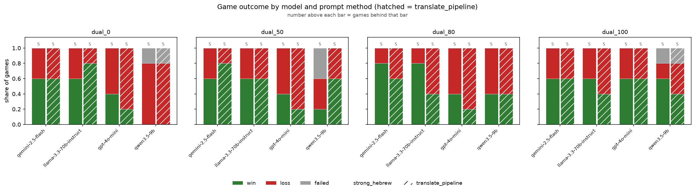
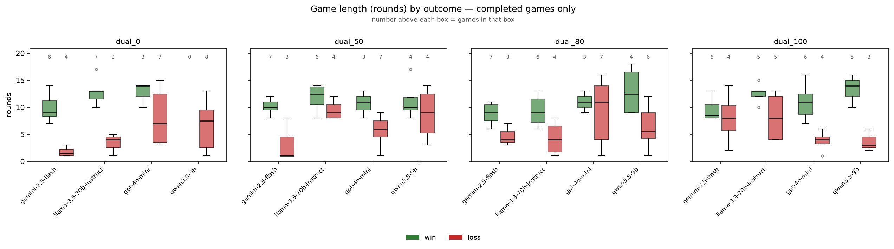
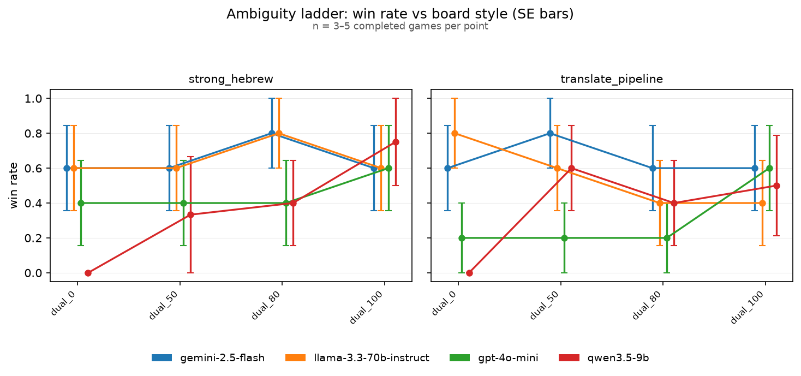
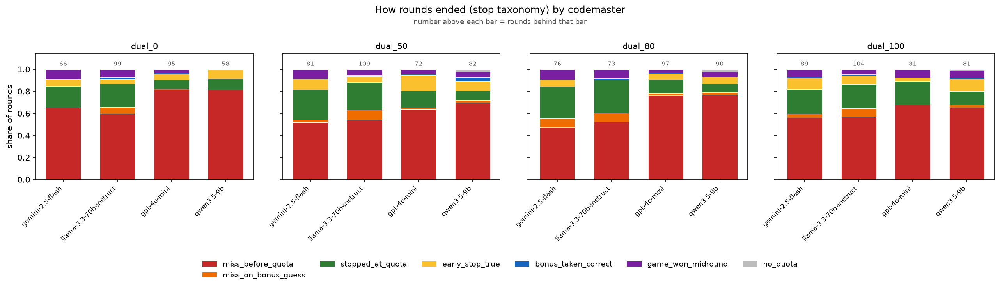
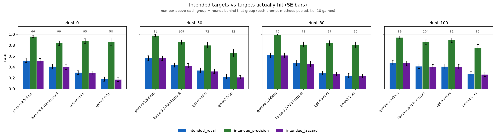
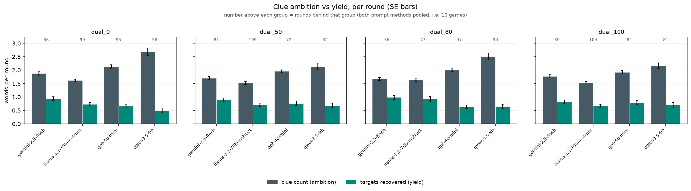
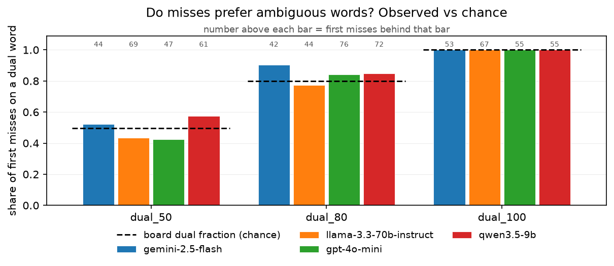
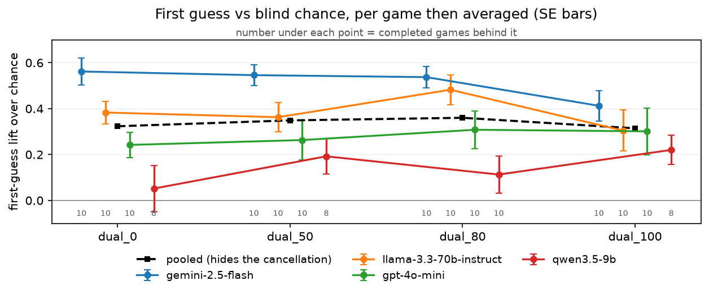
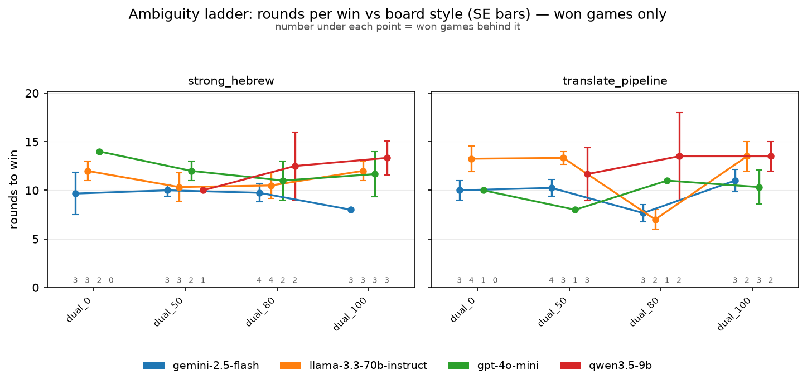

# Codenames-Hebrew results — 20260816T035609664719Z

- Games: **160** (154 completed, 6 not completed)
- Rounds: **1353**
- Models: google/gemini-2.5-flash, meta-llama/llama-3.3-70b-instruct, openai/gpt-4o-mini, qwen/qwen3.5-9b
- Prompt methods: strong_hebrew, translate_pipeline
- Guesser: anthropic/claude-haiku-4.5
- Board styles: dual_0, dual_50, dual_80, dual_100

### How to read these numbers

- Win/loss rates and game length cover **completed games only**. Games that ended because a model could not produce a legal clue are reported separately as a completion rate; scoring them as losses would confuse a formatting failure with a bad clue.
- Games end by finding all 9 targets (win), by hitting the assassin, or by revealing all 8 opponent words — the opposing team then has all of its own and wins. `assassin_share_of_losses` splits the two loss kinds; its denominator is the losses in that group, not the games.
- `%loss` is close to `1 - %win`, and **game length is confounded with outcome** — a short game is an efficient win or an early death. Length is therefore also reported separately for wins and for losses, and `targets_per_round` carries the same confound.
- Games from runs played before 2026-08-22 are re-scored against the opponent-words rule from their own logs, and the rounds that could not have been played under it are dropped. Those games are flagged `rescored`; the players were never told the rule, so their play is unaffected by it.
- SE is `sd / sqrt(n)` at the natural unit (games for game metrics, rounds for round metrics). Proportions also carry a Wilson 95% interval, because at small n a Wald SE of 0 at p=0 or p=1 reads as false certainty.
- Round-level SEs treat rounds within a game as independent. They are not, so those SEs are optimistic.

### Stop taxonomy

The logged `turn_outcome` cannot answer the early-stop question: it records both *stopping short of* the codemaster's count and *stopping at* it after declining the bonus guess as `stopped_early`. Only the first is an early stop. Rounds are therefore reclassified as:

| class | meaning |
|---|---|
| `early_stop_true` | stopped before reaching the count — **the early stop** |
| `stopped_at_quota` | reached the count and declined the bonus guess (correct play) |
| `miss_before_quota` | guessed wrong before reaching the count |
| `miss_on_bonus_guess` | reached the count, took the bonus guess, got it wrong |
| `bonus_taken_correct` | reached the count, took the bonus guess, got it right |
| `game_won_midround` | round ended because the 9th target fell — not a choice |
| `guesser_failure` / `no_quota` | guesser exhausted retries / clue had count 0 |

Rates are computed over eligible rounds only. A guesser may not stop before its first correct guess, so an early stop is impossible when `count = 1`; including those rounds in the denominator would deflate the rate for reasons unrelated to the guesser's judgement.

## Game outcomes — by codemaster

`loss_rate` and `length_*` cover completed games; `completion_rate` is the share of games that played out at all. `win_rate` is `1 - loss_rate` by construction, so only the loss rate carries an SE and a Wilson interval (`loss_lo` / `loss_hi`).

| model                             | n_games | n_completed | completion_rate | win_rate | loss_rate | loss_se | loss_lo | loss_hi | length_mean | length_se | length_win_mean | length_win_se | n_win | length_loss_mean | length_loss_se | n_loss | assassin_share_of_losses | targets_found_mean | targets_found_se | targets_per_round_mean | targets_per_round_se | first_guess_lift_mean | first_guess_lift_se |
|-----------------------------------|---------|-------------|-----------------|----------|-----------|---------|---------|---------|-------------|-----------|-----------------|---------------|-------|------------------|----------------|--------|--------------------------|--------------------|------------------|------------------------|----------------------|-----------------------|---------------------|
| google/gemini-2.5-flash           | 40      | 40          | 1.000           | 0.650    | 0.350     | 0.076   | 0.221   | 0.505   | 7.800       | 0.584     | 9.577           | 0.385         | 26    | 4.500            | 1.052          | 14     | 1.000                    | 7.050              | 0.482            | 0.972                  | 0.052                | 0.514                 | 0.028               |
| meta-llama/llama-3.3-70b-instruct | 40      | 40          | 1.000           | 0.600    | 0.400     | 0.078   | 0.263   | 0.554   | 9.625       | 0.631     | 11.625          | 0.531         | 24    | 6.625            | 0.970          | 16     | 1.000                    | 7.175              | 0.427            | 0.796                  | 0.042                | 0.383                 | 0.034               |
| openai/gpt-4o-mini                | 40      | 40          | 1.000           | 0.375    | 0.625     | 0.078   | 0.470   | 0.758   | 8.625       | 0.713     | 11.267          | 0.665         | 15    | 7.040            | 0.942          | 25     | 0.920                    | 6.075              | 0.481            | 0.720                  | 0.047                | 0.279                 | 0.040               |
| qwen/qwen3.5-9b                   | 40      | 34          | 0.850           | 0.382    | 0.618     | 0.085   | 0.450   | 0.761   | 8.853       | 0.846     | 12.615          | 0.971         | 13    | 6.524            | 0.922          | 21     | 1.000                    | 5.676              | 0.577            | 0.624                  | 0.047                | 0.142                 | 0.041               |

## Game outcomes — by codemaster x prompt method

`loss_rate` and `length_*` cover completed games; `completion_rate` is the share of games that played out at all. `win_rate` is `1 - loss_rate` by construction, so only the loss rate carries an SE and a Wilson interval (`loss_lo` / `loss_hi`).

| model                             | method             | n_games | n_completed | completion_rate | win_rate | loss_rate | loss_se | loss_lo | loss_hi | length_mean | length_se | length_win_mean | length_win_se | n_win | length_loss_mean | length_loss_se | n_loss | assassin_share_of_losses | targets_found_mean | targets_found_se | targets_per_round_mean | targets_per_round_se | first_guess_lift_mean | first_guess_lift_se |
|-----------------------------------|--------------------|---------|-------------|-----------------|----------|-----------|---------|---------|---------|-------------|-----------|-----------------|---------------|-------|------------------|----------------|--------|--------------------------|--------------------|------------------|------------------------|----------------------|-----------------------|---------------------|
| google/gemini-2.5-flash           | strong_hebrew      | 20      | 20          | 1.000           | 0.650    | 0.350     | 0.109   | 0.181   | 0.567   | 7.900       | 0.843     | 9.385           | 0.561         | 13    | 5.143            | 1.818          | 7      | 1.000                    | 7.150              | 0.685            | 0.965                  | 0.074                | 0.512                 | 0.044               |
| google/gemini-2.5-flash           | translate_pipeline | 20      | 20          | 1.000           | 0.650    | 0.350     | 0.109   | 0.181   | 0.567   | 7.700       | 0.831     | 9.769           | 0.545         | 13    | 3.857            | 1.164          | 7      | 1.000                    | 6.950              | 0.694            | 0.980                  | 0.075                | 0.517                 | 0.037               |
| meta-llama/llama-3.3-70b-instruct | strong_hebrew      | 20      | 20          | 1.000           | 0.650    | 0.350     | 0.109   | 0.181   | 0.567   | 9.900       | 0.778     | 11.154          | 0.587         | 13    | 7.571            | 1.674          | 7      | 1.000                    | 7.700              | 0.519            | 0.816                  | 0.040                | 0.450                 | 0.033               |
| meta-llama/llama-3.3-70b-instruct | translate_pipeline | 20      | 20          | 1.000           | 0.550    | 0.450     | 0.114   | 0.258   | 0.658   | 9.350       | 1.011     | 12.182          | 0.932         | 11    | 5.889            | 1.160          | 9      | 1.000                    | 6.650              | 0.670            | 0.775                  | 0.076                | 0.317                 | 0.058               |
| openai/gpt-4o-mini                | strong_hebrew      | 20      | 20          | 1.000           | 0.450    | 0.550     | 0.114   | 0.342   | 0.742   | 8.750       | 1.056     | 12.111          | 0.857         | 9     | 6.000            | 1.300          | 11     | 1.000                    | 6.300              | 0.700            | 0.728                  | 0.064                | 0.288                 | 0.056               |
| openai/gpt-4o-mini                | translate_pipeline | 20      | 20          | 1.000           | 0.300    | 0.700     | 0.105   | 0.481   | 0.855   | 8.500       | 0.985     | 10.000          | 0.894         | 6     | 7.857            | 1.338          | 14     | 0.857                    | 5.850              | 0.674            | 0.712                  | 0.071                | 0.269                 | 0.059               |
| qwen/qwen3.5-9b                   | strong_hebrew      | 20      | 16          | 0.800           | 0.375    | 0.625     | 0.125   | 0.386   | 0.815   | 8.000       | 1.218     | 12.500          | 1.310         | 6     | 5.300            | 1.106          | 10     | 1.000                    | 5.000              | 0.913            | 0.553                  | 0.077                | 0.073                 | 0.064               |
| qwen/qwen3.5-9b                   | translate_pipeline | 20      | 18          | 0.900           | 0.389    | 0.611     | 0.118   | 0.386   | 0.797   | 9.611       | 1.178     | 12.714          | 1.507         | 7     | 7.636            | 1.410          | 11     | 1.000                    | 6.278              | 0.722            | 0.687                  | 0.056                | 0.204                 | 0.049               |

## Game outcomes — by board style

`loss_rate` and `length_*` cover completed games; `completion_rate` is the share of games that played out at all. `win_rate` is `1 - loss_rate` by construction, so only the loss rate carries an SE and a Wilson interval (`loss_lo` / `loss_hi`).

| board_style | n_games | n_completed | completion_rate | win_rate | loss_rate | loss_se | loss_lo | loss_hi | length_mean | length_se | length_win_mean | length_win_se | n_win | length_loss_mean | length_loss_se | n_loss | assassin_share_of_losses | targets_found_mean | targets_found_se | targets_per_round_mean | targets_per_round_se | first_guess_lift_mean | first_guess_lift_se |
|-------------|---------|-------------|-----------------|----------|-----------|---------|---------|---------|-------------|-----------|-----------------|---------------|-------|------------------|----------------|--------|--------------------------|--------------------|------------------|------------------------|----------------------|-----------------------|---------------------|
| dual_0      | 40      | 38          | 0.950           | 0.421    | 0.579     | 0.081   | 0.422   | 0.721   | 8.237       | 0.785     | 11.625          | 0.664         | 16    | 5.773            | 0.980          | 22     | 0.955                    | 5.868              | 0.523            | 0.811                  | 0.063                | 0.323                 | 0.043               |
| dual_50     | 40      | 38          | 0.950           | 0.526    | 0.474     | 0.082   | 0.325   | 0.627   | 9.000       | 0.610     | 10.950          | 0.535         | 20    | 6.833            | 0.912          | 18     | 1.000                    | 6.816              | 0.477            | 0.755                  | 0.040                | 0.349                 | 0.040               |
| dual_80     | 40      | 40          | 1.000           | 0.500    | 0.500     | 0.080   | 0.352   | 0.648   | 8.400       | 0.685     | 10.150          | 0.701         | 20    | 6.650            | 1.055          | 20     | 0.950                    | 6.550              | 0.474            | 0.836                  | 0.053                | 0.360                 | 0.043               |
| dual_100    | 40      | 38          | 0.950           | 0.579    | 0.421     | 0.081   | 0.279   | 0.578   | 9.263       | 0.689     | 11.500          | 0.591         | 22    | 6.188            | 1.009          | 16     | 1.000                    | 6.868              | 0.508            | 0.731                  | 0.046                | 0.314                 | 0.042               |

## Game outcomes — by codemaster x board style

`loss_rate` and `length_*` cover completed games; `completion_rate` is the share of games that played out at all. `win_rate` is `1 - loss_rate` by construction, so only the loss rate carries an SE and a Wilson interval (`loss_lo` / `loss_hi`).

| model                             | board_style | n_games | n_completed | completion_rate | win_rate | loss_rate | loss_se | loss_lo | loss_hi | length_mean | length_se | length_win_mean | length_win_se | n_win | length_loss_mean | length_loss_se | n_loss | assassin_share_of_losses | targets_found_mean | targets_found_se | targets_per_round_mean | targets_per_round_se | first_guess_lift_mean | first_guess_lift_se |
|-----------------------------------|-------------|---------|-------------|-----------------|----------|-----------|---------|---------|---------|-------------|-----------|-----------------|---------------|-------|------------------|----------------|--------|--------------------------|--------------------|------------------|------------------------|----------------------|-----------------------|---------------------|
| google/gemini-2.5-flash           | dual_0      | 10      | 10          | 1.000           | 0.600    | 0.400     | 0.163   | 0.168   | 0.687   | 6.600       | 1.470     | 9.833           | 1.078         | 6.000 | 1.750            | 0.479          | 4      | 1.000                    | 6.200              | 1.143            | 1.147                  | 0.156                | 0.562                 | 0.059               |
| google/gemini-2.5-flash           | dual_50     | 10      | 10          | 1.000           | 0.700    | 0.300     | 0.153   | 0.108   | 0.603   | 8.100       | 1.251     | 10.143          | 0.508         | 7.000 | 3.333            | 2.333          | 3      | 1.000                    | 7.200              | 1.052            | 0.919                  | 0.036                | 0.546                 | 0.045               |
| google/gemini-2.5-flash           | dual_80     | 10      | 10          | 1.000           | 0.700    | 0.300     | 0.153   | 0.108   | 0.603   | 7.600       | 0.872     | 8.857           | 0.738         | 7.000 | 4.667            | 1.202          | 3      | 1.000                    | 7.500              | 0.806            | 1.008                  | 0.087                | 0.537                 | 0.047               |
| google/gemini-2.5-flash           | dual_100    | 10      | 10          | 1.000           | 0.600    | 0.400     | 0.163   | 0.168   | 0.687   | 8.900       | 1.059     | 9.500           | 0.847         | 6.000 | 8.000            | 2.483          | 4      | 1.000                    | 7.300              | 0.920            | 0.816                  | 0.085                | 0.413                 | 0.067               |
| meta-llama/llama-3.3-70b-instruct | dual_0      | 10      | 10          | 1.000           | 0.700    | 0.300     | 0.153   | 0.108   | 0.603   | 9.900       | 1.574     | 12.714          | 0.837         | 7.000 | 3.333            | 1.202          | 3      | 1.000                    | 7.200              | 0.952            | 0.787                  | 0.047                | 0.383                 | 0.050               |
| meta-llama/llama-3.3-70b-instruct | dual_50     | 10      | 10          | 1.000           | 0.600    | 0.400     | 0.163   | 0.168   | 0.687   | 10.900      | 0.767     | 11.833          | 0.980         | 6.000 | 9.500            | 0.957          | 4      | 1.000                    | 7.700              | 0.559            | 0.724                  | 0.059                | 0.363                 | 0.064               |
| meta-llama/llama-3.3-70b-instruct | dual_80     | 10      | 10          | 1.000           | 0.600    | 0.400     | 0.163   | 0.168   | 0.687   | 7.300       | 1.221     | 9.333           | 1.145         | 6.000 | 4.250            | 1.652          | 4      | 1.000                    | 6.800              | 0.975            | 1.017                  | 0.102                | 0.482                 | 0.064               |
| meta-llama/llama-3.3-70b-instruct | dual_100    | 10      | 10          | 1.000           | 0.500    | 0.500     | 0.167   | 0.237   | 0.763   | 10.400      | 1.222     | 12.600          | 0.812         | 5.000 | 8.200            | 1.908          | 5      | 1.000                    | 7.000              | 0.966            | 0.654                  | 0.083                | 0.304                 | 0.089               |
| openai/gpt-4o-mini                | dual_0      | 10      | 10          | 1.000           | 0.300    | 0.700     | 0.153   | 0.397   | 0.892   | 9.500       | 1.544     | 12.667          | 1.333         | 3.000 | 8.143            | 1.957          | 7      | 0.857                    | 6.300              | 0.883            | 0.749                  | 0.091                | 0.242                 | 0.056               |
| openai/gpt-4o-mini                | dual_50     | 10      | 10          | 1.000           | 0.300    | 0.700     | 0.153   | 0.397   | 0.892   | 7.200       | 1.093     | 10.667          | 1.453         | 3.000 | 5.714            | 1.017          | 7      | 1.000                    | 5.500              | 0.980            | 0.688                  | 0.097                | 0.263                 | 0.086               |
| openai/gpt-4o-mini                | dual_80     | 10      | 10          | 1.000           | 0.300    | 0.700     | 0.153   | 0.397   | 0.892   | 9.700       | 1.620     | 11.000          | 1.155         | 3.000 | 9.143            | 2.293          | 7      | 0.857                    | 6.100              | 0.924            | 0.712                  | 0.074                | 0.308                 | 0.083               |
| openai/gpt-4o-mini                | dual_100    | 10      | 10          | 1.000           | 0.600    | 0.400     | 0.163   | 0.168   | 0.687   | 8.100       | 1.464     | 11.000          | 1.342         | 6.000 | 3.750            | 1.031          | 4      | 1.000                    | 6.400              | 1.166            | 0.730                  | 0.122                | 0.301                 | 0.102               |
| qwen/qwen3.5-9b                   | dual_0      | 10      | 8           | 0.800           | 0.000    | 1.000     | 0.000   | 0.676   | 1.000   | 6.625       | 1.603     | —               | —             | —     | 6.625            | 1.603          | 8      | 1.000                    | 3.250              | 0.840            | 0.500                  | 0.100                | 0.052                 | 0.100               |
| qwen/qwen3.5-9b                   | dual_50     | 10      | 8           | 0.800           | 0.500    | 0.500     | 0.189   | 0.215   | 0.785   | 10.000      | 1.570     | 11.250          | 1.974         | 4.000 | 8.750            | 2.562          | 4      | 1.000                    | 6.875              | 1.187            | 0.670                  | 0.101                | 0.192                 | 0.077               |
| qwen/qwen3.5-9b                   | dual_80     | 10      | 10          | 1.000           | 0.400    | 0.600     | 0.163   | 0.313   | 0.832   | 9.000       | 1.680     | 13.000          | 2.345         | 4.000 | 6.333            | 1.647          | 6      | 1.000                    | 5.800              | 1.114            | 0.606                  | 0.104                | 0.113                 | 0.080               |
| qwen/qwen3.5-9b                   | dual_100    | 10      | 8           | 0.800           | 0.625    | 0.375     | 0.183   | 0.137   | 0.694   | 9.750       | 1.934     | 13.400          | 1.077         | 5.000 | 3.667            | 1.202          | 3      | 1.000                    | 6.750              | 1.161            | 0.724                  | 0.062                | 0.220                 | 0.063               |

## Game outcomes — by codemaster x prompt method x board style

`loss_rate` and `length_*` cover completed games; `completion_rate` is the share of games that played out at all. `win_rate` is `1 - loss_rate` by construction, so only the loss rate carries an SE and a Wilson interval (`loss_lo` / `loss_hi`).

| model                             | method             | board_style | n_games | n_completed | completion_rate | win_rate | loss_rate | loss_se | loss_lo | loss_hi | length_mean | length_se | length_win_mean | length_win_se | n_win | length_loss_mean | length_loss_se | n_loss | assassin_share_of_losses | targets_found_mean | targets_found_se | targets_per_round_mean | targets_per_round_se | first_guess_lift_mean | first_guess_lift_se |
|-----------------------------------|--------------------|-------------|---------|-------------|-----------------|----------|-----------|---------|---------|---------|-------------|-----------|-----------------|---------------|-------|------------------|----------------|--------|--------------------------|--------------------|------------------|------------------------|----------------------|-----------------------|---------------------|
| google/gemini-2.5-flash           | strong_hebrew      | dual_0      | 5       | 5           | 1.000           | 0.600    | 0.400     | 0.245   | 0.118   | 0.769   | 6.600       | 2.249     | 9.667           | 2.186         | 3.000 | 2.000            | 1.000          | 2      | 1.000                    | 6.200              | 1.715            | 1.144                  | 0.248                | 0.546                 | 0.112               |
| google/gemini-2.5-flash           | strong_hebrew      | dual_50     | 5       | 5           | 1.000           | 0.600    | 0.400     | 0.245   | 0.118   | 0.769   | 7.800       | 1.772     | 10.000          | 0.577         | 3.000 | 4.500            | 3.500          | 2      | 1.000                    | 7.000              | 1.549            | 0.919                  | 0.036                | 0.561                 | 0.062               |
| google/gemini-2.5-flash           | strong_hebrew      | dual_80     | 5       | 5           | 1.000           | 0.800    | 0.200     | 0.200   | 0.036   | 0.624   | 9.200       | 0.917     | 9.750           | 0.946         | 4.000 | 7.000            | —              | 1      | 1.000                    | 8.200              | 0.800            | 0.907                  | 0.099                | 0.512                 | 0.071               |
| google/gemini-2.5-flash           | strong_hebrew      | dual_100    | 5       | 5           | 1.000           | 0.600    | 0.400     | 0.245   | 0.118   | 0.769   | 8.000       | 1.897     | 8.000           | 0.000         | 3.000 | 8.000            | 6.000          | 2      | 1.000                    | 7.200              | 1.562            | 0.889                  | 0.145                | 0.430                 | 0.109               |
| google/gemini-2.5-flash           | translate_pipeline | dual_0      | 5       | 5           | 1.000           | 0.600    | 0.400     | 0.245   | 0.118   | 0.769   | 6.600       | 2.159     | 10.000          | 1.000         | 3.000 | 1.500            | 0.500          | 2      | 1.000                    | 6.200              | 1.715            | 1.150                  | 0.218                | 0.578                 | 0.055               |
| google/gemini-2.5-flash           | translate_pipeline | dual_50     | 5       | 5           | 1.000           | 0.800    | 0.200     | 0.200   | 0.036   | 0.624   | 8.400       | 1.965     | 10.250          | 0.854         | 4.000 | 1.000            | —              | 1      | 1.000                    | 7.400              | 1.600            | 0.919                  | 0.066                | 0.530                 | 0.072               |
| google/gemini-2.5-flash           | translate_pipeline | dual_80     | 5       | 5           | 1.000           | 0.600    | 0.400     | 0.245   | 0.118   | 0.769   | 6.000       | 1.140     | 7.667           | 0.882         | 3.000 | 3.500            | 0.500          | 2      | 1.000                    | 6.800              | 1.428            | 1.108                  | 0.138                | 0.562                 | 0.067               |
| google/gemini-2.5-flash           | translate_pipeline | dual_100    | 5       | 5           | 1.000           | 0.600    | 0.400     | 0.245   | 0.118   | 0.769   | 9.800       | 1.020     | 11.000          | 1.155         | 3.000 | 8.000            | 1.000          | 2      | 1.000                    | 7.400              | 1.166            | 0.743                  | 0.093                | 0.395                 | 0.089               |
| meta-llama/llama-3.3-70b-instruct | strong_hebrew      | dual_0      | 5       | 5           | 1.000           | 0.600    | 0.400     | 0.245   | 0.118   | 0.769   | 9.000       | 1.924     | 12.000          | 1.000         | 3.000 | 4.500            | 0.500          | 2      | 1.000                    | 7.000              | 1.225            | 0.817                  | 0.060                | 0.421                 | 0.019               |
| meta-llama/llama-3.3-70b-instruct | strong_hebrew      | dual_50     | 5       | 5           | 1.000           | 0.600    | 0.400     | 0.245   | 0.118   | 0.769   | 9.800       | 0.917     | 10.333          | 1.453         | 3.000 | 9.000            | 1.000          | 2      | 1.000                    | 7.800              | 0.800            | 0.808                  | 0.092                | 0.464                 | 0.100               |
| meta-llama/llama-3.3-70b-instruct | strong_hebrew      | dual_80     | 5       | 5           | 1.000           | 0.800    | 0.200     | 0.200   | 0.036   | 0.624   | 8.600       | 2.159     | 10.500          | 1.323         | 4.000 | 1.000            | —              | 1      | 1.000                    | 7.400              | 1.600            | 0.926                  | 0.105                | 0.462                 | 0.080               |
| meta-llama/llama-3.3-70b-instruct | strong_hebrew      | dual_100    | 5       | 5           | 1.000           | 0.600    | 0.400     | 0.245   | 0.118   | 0.769   | 12.200      | 0.583     | 12.000          | 1.000         | 3.000 | 12.500           | 0.500          | 2      | 1.000                    | 8.600              | 0.245            | 0.713                  | 0.049                | 0.451                 | 0.062               |
| meta-llama/llama-3.3-70b-instruct | translate_pipeline | dual_0      | 5       | 5           | 1.000           | 0.800    | 0.200     | 0.200   | 0.036   | 0.624   | 10.800      | 2.653     | 13.250          | 1.315         | 4.000 | 1.000            | —              | 1      | 1.000                    | 7.400              | 1.600            | 0.758                  | 0.077                | 0.345                 | 0.101               |
| meta-llama/llama-3.3-70b-instruct | translate_pipeline | dual_50     | 5       | 5           | 1.000           | 0.600    | 0.400     | 0.245   | 0.118   | 0.769   | 12.000      | 1.095     | 13.333          | 0.667         | 3.000 | 10.000           | 2.000          | 2      | 1.000                    | 7.600              | 0.872            | 0.640                  | 0.061                | 0.261                 | 0.060               |
| meta-llama/llama-3.3-70b-instruct | translate_pipeline | dual_80     | 5       | 5           | 1.000           | 0.400    | 0.600     | 0.245   | 0.231   | 0.882   | 6.000       | 1.095     | 7.000           | 1.000         | 2.000 | 5.333            | 1.764          | 3      | 1.000                    | 6.200              | 1.241            | 1.108                  | 0.178                | 0.503                 | 0.110               |
| meta-llama/llama-3.3-70b-instruct | translate_pipeline | dual_100    | 5       | 5           | 1.000           | 0.400    | 0.600     | 0.245   | 0.231   | 0.882   | 8.600       | 2.182     | 13.500          | 1.500         | 2.000 | 5.333            | 1.333          | 3      | 1.000                    | 5.400              | 1.691            | 0.595                  | 0.165                | 0.158                 | 0.146               |
| openai/gpt-4o-mini                | strong_hebrew      | dual_0      | 5       | 5           | 1.000           | 0.400    | 0.600     | 0.245   | 0.231   | 0.882   | 9.200       | 2.396     | 14.000          | 0.000         | 2.000 | 6.000            | 2.517          | 3      | 1.000                    | 6.800              | 1.200            | 0.853                  | 0.119                | 0.308                 | 0.048               |
| openai/gpt-4o-mini                | strong_hebrew      | dual_50     | 5       | 5           | 1.000           | 0.400    | 0.600     | 0.245   | 0.231   | 0.882   | 8.000       | 2.049     | 12.000          | 1.000         | 2.000 | 5.333            | 2.186          | 3      | 1.000                    | 5.800              | 1.655            | 0.599                  | 0.155                | 0.215                 | 0.154               |
| openai/gpt-4o-mini                | strong_hebrew      | dual_80     | 5       | 5           | 1.000           | 0.400    | 0.600     | 0.245   | 0.231   | 0.882   | 9.200       | 2.417     | 11.000          | 2.000         | 2.000 | 8.000            | 4.041          | 3      | 1.000                    | 6.400              | 1.400            | 0.758                  | 0.103                | 0.323                 | 0.121               |
| openai/gpt-4o-mini                | strong_hebrew      | dual_100    | 5       | 5           | 1.000           | 0.600    | 0.400     | 0.245   | 0.118   | 0.769   | 8.600       | 2.272     | 11.667          | 2.333         | 3.000 | 4.000            | 0.000          | 2      | 1.000                    | 6.200              | 1.744            | 0.701                  | 0.145                | 0.304                 | 0.129               |
| openai/gpt-4o-mini                | translate_pipeline | dual_0      | 5       | 5           | 1.000           | 0.200    | 0.800     | 0.200   | 0.376   | 0.964   | 9.800       | 2.223     | 10.000          | —             | 1.000 | 9.750            | 2.869          | 4      | 0.750                    | 5.800              | 1.393            | 0.645                  | 0.134                | 0.175                 | 0.097               |
| openai/gpt-4o-mini                | translate_pipeline | dual_50     | 5       | 5           | 1.000           | 0.200    | 0.800     | 0.200   | 0.376   | 0.964   | 6.400       | 0.927     | 8.000           | —             | 1.000 | 6.000            | 1.080          | 4      | 1.000                    | 5.200              | 1.241            | 0.778                  | 0.121                | 0.311                 | 0.093               |
| openai/gpt-4o-mini                | translate_pipeline | dual_80     | 5       | 5           | 1.000           | 0.200    | 0.800     | 0.200   | 0.376   | 0.964   | 10.200      | 2.417     | 11.000          | —             | 1.000 | 10.000           | 3.109          | 4      | 0.750                    | 5.800              | 1.356            | 0.665                  | 0.115                | 0.293                 | 0.126               |
| openai/gpt-4o-mini                | translate_pipeline | dual_100    | 5       | 5           | 1.000           | 0.600    | 0.400     | 0.245   | 0.118   | 0.769   | 7.600       | 2.088     | 10.333          | 1.764         | 3.000 | 3.500            | 2.500          | 2      | 1.000                    | 6.600              | 1.749            | 0.759                  | 0.214                | 0.299                 | 0.173               |
| qwen/qwen3.5-9b                   | strong_hebrew      | dual_0      | 5       | 4           | 0.800           | 0.000    | 1.000     | 0.000   | 0.510   | 1.000   | 5.000       | 1.826     | —               | —             | —     | 5.000            | 1.826          | 4      | 1.000                    | 2.250              | 0.854            | 0.385                  | 0.139                | -0.082                | 0.096               |
| qwen/qwen3.5-9b                   | strong_hebrew      | dual_50     | 5       | 3           | 0.600           | 0.333    | 0.667     | 0.333   | 0.208   | 0.939   | 9.333       | 1.764     | 10.000          | —             | 1.000 | 9.000            | 3.000          | 2      | 1.000                    | 6.333              | 2.186            | 0.633                  | 0.164                | 0.196                 | 0.111               |
| qwen/qwen3.5-9b                   | strong_hebrew      | dual_80     | 5       | 5           | 1.000           | 0.400    | 0.600     | 0.245   | 0.231   | 0.882   | 7.400       | 2.502     | 12.500          | 3.500         | 2.000 | 4.000            | 1.528          | 3      | 1.000                    | 4.400              | 1.913            | 0.459                  | 0.163                | 0.032                 | 0.146               |
| qwen/qwen3.5-9b                   | strong_hebrew      | dual_100    | 5       | 4           | 0.800           | 0.750    | 0.250     | 0.250   | 0.046   | 0.699   | 10.750      | 2.869     | 13.333          | 1.764         | 3.000 | 3.000            | —              | 1      | 1.000                    | 7.500              | 1.500            | 0.776                  | 0.104                | 0.186                 | 0.115               |
| qwen/qwen3.5-9b                   | translate_pipeline | dual_0      | 5       | 4           | 0.800           | 0.000    | 1.000     | 0.000   | 0.510   | 1.000   | 8.250       | 2.626     | —               | —             | —     | 8.250            | 2.626          | 4      | 1.000                    | 4.250              | 1.377            | 0.615                  | 0.134                | 0.185                 | 0.161               |
| qwen/qwen3.5-9b                   | translate_pipeline | dual_50     | 5       | 5           | 1.000           | 0.600    | 0.400     | 0.245   | 0.118   | 0.769   | 10.400      | 2.421     | 11.667          | 2.728         | 3.000 | 8.500            | 5.500          | 2      | 1.000                    | 7.200              | 1.562            | 0.692                  | 0.141                | 0.190                 | 0.114               |
| qwen/qwen3.5-9b                   | translate_pipeline | dual_80     | 5       | 5           | 1.000           | 0.400    | 0.600     | 0.245   | 0.231   | 0.882   | 10.600      | 2.272     | 13.500          | 4.500         | 2.000 | 8.667            | 2.404          | 3      | 1.000                    | 7.200              | 0.970            | 0.753                  | 0.104                | 0.194                 | 0.067               |
| qwen/qwen3.5-9b                   | translate_pipeline | dual_100    | 5       | 4           | 0.800           | 0.500    | 0.500     | 0.289   | 0.150   | 0.850   | 8.750       | 2.926     | 13.500          | 1.500         | 2.000 | 4.000            | 2.000          | 2      | 1.000                    | 6.000              | 1.915            | 0.671                  | 0.075                | 0.254                 | 0.069               |

## Round metrics — by codemaster

`ambition` = words the codemaster commits one clue to (`count`); `yield` = targets that clue actually bought; `yield_ratio` = yield / ambition. `intended_*` compare the words aimed at with the words hit; `n_lucky_mean` counts targets found that were *not* aimed at. `early_stop_rate` and `bonus_take_rate` are over their eligible rounds only — `n_*_eligible` gives those denominators.

| model                             | n_rounds | first_guess_hit_mean | first_guess_baseline_mean | first_guess_lift_mean | first_guess_lift_se | ambition_mean | ambition_se | yield_mean | yield_se | yield_ratio_mean | yield_ratio_se | intended_recall_mean | intended_recall_se | intended_precision_mean | intended_precision_se | intended_jaccard_mean | intended_jaccard_se | n_lucky_mean | early_stop_rate | early_stop_se | n_early_stop_eligible | bonus_take_rate | bonus_take_se | n_bonus_eligible |
|-----------------------------------|----------|----------------------|---------------------------|-----------------------|---------------------|---------------|-------------|------------|----------|------------------|----------------|----------------------|--------------------|-------------------------|-----------------------|-----------------------|---------------------|--------------|-----------------|---------------|-----------------------|-----------------|---------------|------------------|
| google/gemini-2.5-flash           | 312      | 0.756                | 0.264                     | 0.492                 | 0.025               | 1.753         | 0.031       | 0.904      | 0.035    | 0.565            | 0.022          | 0.544                | 0.022              | 0.969                   | 0.009                 | 0.537                 | 0.022               | 0.042        | 0.165           | 0.030         | 158                   | 0.135           | 0.036         | 89               |
| meta-llama/llama-3.3-70b-instruct | 385      | 0.623                | 0.270                     | 0.354                 | 0.025               | 1.571         | 0.026       | 0.745      | 0.034    | 0.521            | 0.024          | 0.431                | 0.022              | 0.842                   | 0.022                 | 0.419                 | 0.022               | 0.135        | 0.142           | 0.031         | 127                   | 0.273           | 0.040         | 128              |
| openai/gpt-4o-mini                | 345      | 0.568                | 0.290                     | 0.278                 | 0.027               | 2.012         | 0.031       | 0.704      | 0.038    | 0.387            | 0.022          | 0.329                | 0.020              | 0.853                   | 0.023                 | 0.318                 | 0.019               | 0.110        | 0.144           | 0.028         | 160                   | 0.127           | 0.045         | 55               |
| qwen/qwen3.5-9b                   | 311      | 0.482                | 0.311                     | 0.171                 | 0.028               | 2.354         | 0.065       | 0.643      | 0.044    | 0.327            | 0.024          | 0.234                | 0.019              | 0.757                   | 0.032                 | 0.225                 | 0.019               | 0.170        | 0.243           | 0.041         | 111                   | 0.250           | 0.069         | 40               |

## Round metrics — by codemaster x prompt method

`ambition` = words the codemaster commits one clue to (`count`); `yield` = targets that clue actually bought; `yield_ratio` = yield / ambition. `intended_*` compare the words aimed at with the words hit; `n_lucky_mean` counts targets found that were *not* aimed at. `early_stop_rate` and `bonus_take_rate` are over their eligible rounds only — `n_*_eligible` gives those denominators.

| model                             | method             | n_rounds | first_guess_hit_mean | first_guess_baseline_mean | first_guess_lift_mean | first_guess_lift_se | ambition_mean | ambition_se | yield_mean | yield_se | yield_ratio_mean | yield_ratio_se | intended_recall_mean | intended_recall_se | intended_precision_mean | intended_precision_se | intended_jaccard_mean | intended_jaccard_se | n_lucky_mean | early_stop_rate | early_stop_se | n_early_stop_eligible | bonus_take_rate | bonus_take_se | n_bonus_eligible |
|-----------------------------------|--------------------|----------|----------------------|---------------------------|-----------------------|---------------------|---------------|-------------|------------|----------|------------------|----------------|----------------------|--------------------|-------------------------|-----------------------|-----------------------|---------------------|--------------|-----------------|---------------|-----------------------|-----------------|---------------|------------------|
| google/gemini-2.5-flash           | strong_hebrew      | 158      | 0.753                | 0.258                     | 0.495                 | 0.035               | 1.677         | 0.043       | 0.905      | 0.051    | 0.592            | 0.033          | 0.564                | 0.031              | 0.968                   | 0.011                 | 0.554                 | 0.031               | 0.051        | 0.167           | 0.044         | 72                    | 0.170           | 0.052         | 53               |
| google/gemini-2.5-flash           | translate_pipeline | 154      | 0.760                | 0.271                     | 0.489                 | 0.036               | 1.831         | 0.043       | 0.903      | 0.049    | 0.538            | 0.030          | 0.523                | 0.030              | 0.970                   | 0.014                 | 0.520                 | 0.030               | 0.032        | 0.163           | 0.040         | 86                    | 0.083           | 0.047         | 36               |
| meta-llama/llama-3.3-70b-instruct | strong_hebrew      | 198      | 0.687                | 0.260                     | 0.427                 | 0.033               | 1.424         | 0.035       | 0.778      | 0.043    | 0.598            | 0.033          | 0.508                | 0.032              | 0.863                   | 0.028                 | 0.500                 | 0.032               | 0.121        | 0.226           | 0.058         | 53                    | 0.241           | 0.047         | 83               |
| meta-llama/llama-3.3-70b-instruct | translate_pipeline | 187      | 0.556                | 0.280                     | 0.276                 | 0.036               | 1.727         | 0.034       | 0.711      | 0.053    | 0.439            | 0.033          | 0.349                | 0.029              | 0.816                   | 0.034                 | 0.334                 | 0.028               | 0.150        | 0.081           | 0.032         | 74                    | 0.333           | 0.071         | 45               |
| openai/gpt-4o-mini                | strong_hebrew      | 175      | 0.577                | 0.280                     | 0.298                 | 0.037               | 1.840         | 0.043       | 0.720      | 0.054    | 0.436            | 0.034          | 0.375                | 0.030              | 0.878                   | 0.028                 | 0.359                 | 0.029               | 0.103        | 0.194           | 0.047         | 72                    | 0.167           | 0.063         | 36               |
| openai/gpt-4o-mini                | translate_pipeline | 170      | 0.559                | 0.302                     | 0.257                 | 0.039               | 2.188         | 0.040       | 0.688      | 0.053    | 0.336            | 0.027          | 0.282                | 0.026              | 0.826                   | 0.036                 | 0.275                 | 0.025               | 0.118        | 0.102           | 0.032         | 88                    | 0.053           | 0.053         | 19               |
| qwen/qwen3.5-9b                   | strong_hebrew      | 135      | 0.474                | 0.297                     | 0.177                 | 0.043               | 2.178         | 0.100       | 0.637      | 0.066    | 0.346            | 0.039          | 0.230                | 0.031              | 0.677                   | 0.055                 | 0.221                 | 0.030               | 0.207        | 0.262           | 0.069         | 42                    | 0.333           | 0.105         | 21               |
| qwen/qwen3.5-9b                   | translate_pipeline | 176      | 0.489                | 0.322                     | 0.166                 | 0.038               | 2.489         | 0.083       | 0.648      | 0.058    | 0.312            | 0.030          | 0.237                | 0.025              | 0.816                   | 0.038                 | 0.228                 | 0.024               | 0.142        | 0.232           | 0.051         | 69                    | 0.158           | 0.086         | 19               |

## Round metrics — by board style

`ambition` = words the codemaster commits one clue to (`count`); `yield` = targets that clue actually bought; `yield_ratio` = yield / ambition. `intended_*` compare the words aimed at with the words hit; `n_lucky_mean` counts targets found that were *not* aimed at. `early_stop_rate` and `bonus_take_rate` are over their eligible rounds only — `n_*_eligible` gives those denominators.

| board_style | n_rounds | first_guess_hit_mean | first_guess_baseline_mean | first_guess_lift_mean | first_guess_lift_se | ambition_mean | ambition_se | yield_mean | yield_se | yield_ratio_mean | yield_ratio_se | intended_recall_mean | intended_recall_se | intended_precision_mean | intended_precision_se | intended_jaccard_mean | intended_jaccard_se | n_lucky_mean | early_stop_rate | early_stop_se | n_early_stop_eligible | bonus_take_rate | bonus_take_se | n_bonus_eligible |
|-------------|----------|----------------------|---------------------------|-----------------------|---------------------|---------------|-------------|------------|----------|------------------|----------------|----------------------|--------------------|-------------------------|-----------------------|-----------------------|---------------------|--------------|-----------------|---------------|-----------------------|-----------------|---------------|------------------|
| dual_0      | 318      | 0.591                | 0.312                     | 0.279                 | 0.028               | 2.022         | 0.042       | 0.711      | 0.037    | 0.414            | 0.024          | 0.357                | 0.021              | 0.886                   | 0.021                 | 0.348                 | 0.021               | 0.091        | 0.130           | 0.029         | 138                   | 0.172           | 0.050         | 58               |
| dual_50     | 344      | 0.622                | 0.275                     | 0.348                 | 0.026               | 1.802         | 0.040       | 0.756      | 0.037    | 0.481            | 0.024          | 0.396                | 0.022              | 0.840                   | 0.023                 | 0.386                 | 0.022               | 0.137        | 0.228           | 0.036         | 136                   | 0.230           | 0.045         | 87               |
| dual_80     | 336      | 0.601                | 0.278                     | 0.323                 | 0.027               | 1.985         | 0.047       | 0.780      | 0.041    | 0.449            | 0.023          | 0.391                | 0.022              | 0.870                   | 0.021                 | 0.381                 | 0.022               | 0.113        | 0.113           | 0.027         | 142                   | 0.222           | 0.046         | 81               |
| dual_100    | 355      | 0.614                | 0.271                     | 0.343                 | 0.026               | 1.825         | 0.038       | 0.744      | 0.036    | 0.463            | 0.023          | 0.399                | 0.022              | 0.869                   | 0.021                 | 0.389                 | 0.021               | 0.118        | 0.207           | 0.034         | 140                   | 0.186           | 0.042         | 86               |

## Round metrics — by codemaster x board style

`ambition` = words the codemaster commits one clue to (`count`); `yield` = targets that clue actually bought; `yield_ratio` = yield / ambition. `intended_*` compare the words aimed at with the words hit; `n_lucky_mean` counts targets found that were *not* aimed at. `early_stop_rate` and `bonus_take_rate` are over their eligible rounds only — `n_*_eligible` gives those denominators.

| model                             | board_style | n_rounds | first_guess_hit_mean | first_guess_baseline_mean | first_guess_lift_mean | first_guess_lift_se | ambition_mean | ambition_se | yield_mean | yield_se | yield_ratio_mean | yield_ratio_se | intended_recall_mean | intended_recall_se | intended_precision_mean | intended_precision_se | intended_jaccard_mean | intended_jaccard_se | n_lucky_mean | early_stop_rate | early_stop_se | n_early_stop_eligible | bonus_take_rate | bonus_take_se | n_bonus_eligible |
|-----------------------------------|-------------|----------|----------------------|---------------------------|-----------------------|---------------------|---------------|-------------|------------|----------|------------------|----------------|----------------------|--------------------|-------------------------|-----------------------|-----------------------|---------------------|--------------|-----------------|---------------|-----------------------|-----------------|---------------|------------------|
| google/gemini-2.5-flash           | dual_0      | 66       | 0.803                | 0.288                     | 0.515                 | 0.053               | 1.879         | 0.063       | 0.939      | 0.071    | 0.548            | 0.043          | 0.520                | 0.041              | 0.962                   | 0.018                 | 0.511                 | 0.042               | 0.061        | 0.100           | 0.048         | 40                    | 0.000           | 0.000         | 13               |
| google/gemini-2.5-flash           | dual_50     | 81       | 0.765                | 0.253                     | 0.512                 | 0.048               | 1.704         | 0.062       | 0.889      | 0.068    | 0.574            | 0.043          | 0.564                | 0.043              | 0.978                   | 0.017                 | 0.562                 | 0.043               | 0.025        | 0.205           | 0.066         | 39                    | 0.083           | 0.058         | 24               |
| google/gemini-2.5-flash           | dual_80     | 76       | 0.789                | 0.255                     | 0.535                 | 0.047               | 1.671         | 0.060       | 0.987      | 0.074    | 0.623            | 0.045          | 0.616                | 0.045              | 0.992                   | 0.008                 | 0.614                 | 0.045               | 0.013        | 0.128           | 0.054         | 39                    | 0.214           | 0.079         | 28               |
| google/gemini-2.5-flash           | dual_100    | 89       | 0.685                | 0.265                     | 0.421                 | 0.050               | 1.775         | 0.059       | 0.820      | 0.069    | 0.521            | 0.046          | 0.481                | 0.042              | 0.943                   | 0.024                 | 0.468                 | 0.042               | 0.067        | 0.225           | 0.067         | 40                    | 0.167           | 0.078         | 24               |
| meta-llama/llama-3.3-70b-instruct | dual_0      | 99       | 0.616                | 0.292                     | 0.324                 | 0.050               | 1.616         | 0.049       | 0.727      | 0.066    | 0.510            | 0.048          | 0.409                | 0.043              | 0.836                   | 0.045                 | 0.399                 | 0.042               | 0.131        | 0.118           | 0.056         | 34                    | 0.276           | 0.084         | 29               |
| meta-llama/llama-3.3-70b-instruct | dual_50     | 109      | 0.606                | 0.262                     | 0.344                 | 0.047               | 1.523         | 0.050       | 0.706      | 0.062    | 0.514            | 0.045          | 0.436                | 0.042              | 0.856                   | 0.040                 | 0.425                 | 0.042               | 0.110        | 0.188           | 0.070         | 32                    | 0.289           | 0.075         | 38               |
| meta-llama/llama-3.3-70b-instruct | dual_80     | 73       | 0.685                | 0.260                     | 0.425                 | 0.054               | 1.644         | 0.060       | 0.932      | 0.092    | 0.589            | 0.053          | 0.477                | 0.050              | 0.813                   | 0.048                 | 0.458                 | 0.051               | 0.205        | 0.000           | 0.000         | 29                    | 0.241           | 0.081         | 29               |
| meta-llama/llama-3.3-70b-instruct | dual_100    | 104      | 0.606                | 0.264                     | 0.342                 | 0.048               | 1.529         | 0.049       | 0.673      | 0.059    | 0.490            | 0.045          | 0.413                | 0.042              | 0.857                   | 0.041                 | 0.404                 | 0.041               | 0.115        | 0.250           | 0.078         | 32                    | 0.281           | 0.081         | 32               |
| openai/gpt-4o-mini                | dual_0      | 95       | 0.547                | 0.334                     | 0.213                 | 0.052               | 2.137         | 0.063       | 0.663      | 0.070    | 0.349            | 0.040          | 0.298                | 0.035              | 0.875                   | 0.043                 | 0.289                 | 0.034               | 0.084        | 0.114           | 0.048         | 44                    | 0.200           | 0.133         | 10               |
| openai/gpt-4o-mini                | dual_50     | 72       | 0.611                | 0.270                     | 0.341                 | 0.057               | 1.958         | 0.057       | 0.764      | 0.085    | 0.426            | 0.050          | 0.340                | 0.043              | 0.799                   | 0.054                 | 0.322                 | 0.042               | 0.167        | 0.270           | 0.074         | 37                    | 0.154           | 0.104         | 13               |
| openai/gpt-4o-mini                | dual_80     | 97       | 0.505                | 0.280                     | 0.225                 | 0.051               | 2.000         | 0.057       | 0.629      | 0.071    | 0.344            | 0.042          | 0.285                | 0.036              | 0.837                   | 0.047                 | 0.271                 | 0.035               | 0.113        | 0.122           | 0.052         | 41                    | 0.200           | 0.107         | 15               |
| openai/gpt-4o-mini                | dual_100    | 81       | 0.630                | 0.270                     | 0.360                 | 0.054               | 1.926         | 0.065       | 0.790      | 0.078    | 0.449            | 0.045          | 0.409                | 0.045              | 0.892                   | 0.040                 | 0.403                 | 0.045               | 0.086        | 0.079           | 0.044         | 38                    | 0.000           | 0.000         | 17               |
| qwen/qwen3.5-9b                   | dual_0      | 58       | 0.379                | 0.336                     | 0.043                 | 0.063               | 2.690         | 0.133       | 0.500      | 0.093    | 0.206            | 0.043          | 0.177                | 0.040              | 0.864                   | 0.067                 | 0.173                 | 0.039               | 0.069        | 0.250           | 0.099         | 20                    | 0.000           | 0.000         | 6                |
| qwen/qwen3.5-9b                   | dual_50     | 82       | 0.512                | 0.317                     | 0.196                 | 0.056               | 2.134         | 0.124       | 0.683      | 0.085    | 0.394            | 0.055          | 0.223                | 0.037              | 0.655                   | 0.069                 | 0.211                 | 0.036               | 0.256        | 0.250           | 0.083         | 28                    | 0.417           | 0.149         | 12               |
| qwen/qwen3.5-9b                   | dual_80     | 90       | 0.478                | 0.310                     | 0.168                 | 0.053               | 2.511         | 0.133       | 0.644      | 0.086    | 0.300            | 0.039          | 0.241                | 0.036              | 0.806                   | 0.055                 | 0.235                 | 0.035               | 0.122        | 0.182           | 0.068         | 33                    | 0.222           | 0.147         | 9                |
| qwen/qwen3.5-9b                   | dual_100    | 81       | 0.531                | 0.289                     | 0.241                 | 0.056               | 2.160         | 0.113       | 0.704      | 0.085    | 0.376            | 0.049          | 0.278                | 0.042              | 0.752                   | 0.061                 | 0.265                 | 0.041               | 0.210        | 0.300           | 0.085         | 30                    | 0.231           | 0.122         | 13               |

## Round metrics — by codemaster x prompt method x board style

`ambition` = words the codemaster commits one clue to (`count`); `yield` = targets that clue actually bought; `yield_ratio` = yield / ambition. `intended_*` compare the words aimed at with the words hit; `n_lucky_mean` counts targets found that were *not* aimed at. `early_stop_rate` and `bonus_take_rate` are over their eligible rounds only — `n_*_eligible` gives those denominators.

| model                             | method             | board_style | n_rounds | first_guess_hit_mean | first_guess_baseline_mean | first_guess_lift_mean | first_guess_lift_se | ambition_mean | ambition_se | yield_mean | yield_se | yield_ratio_mean | yield_ratio_se | intended_recall_mean | intended_recall_se | intended_precision_mean | intended_precision_se | intended_jaccard_mean | intended_jaccard_se | n_lucky_mean | early_stop_rate | early_stop_se | n_early_stop_eligible | bonus_take_rate | bonus_take_se | n_bonus_eligible |
|-----------------------------------|--------------------|-------------|----------|----------------------|---------------------------|-----------------------|---------------------|---------------|-------------|------------|----------|------------------|----------------|----------------------|--------------------|-------------------------|-----------------------|-----------------------|---------------------|--------------|-----------------|---------------|-----------------------|-----------------|---------------|------------------|
| google/gemini-2.5-flash           | strong_hebrew      | dual_0      | 33       | 0.788                | 0.287                     | 0.501                 | 0.079               | 1.848         | 0.088       | 0.939      | 0.106    | 0.561            | 0.065          | 0.515                | 0.060              | 0.942                   | 0.032                 | 0.500                 | 0.061               | 0.091        | 0.105           | 0.072         | 19                    | 0.000           | 0.000         | 8                |
| google/gemini-2.5-flash           | strong_hebrew      | dual_50     | 39       | 0.795                | 0.254                     | 0.541                 | 0.067               | 1.641         | 0.094       | 0.897      | 0.096    | 0.615            | 0.062          | 0.607                | 0.061              | 0.989                   | 0.011                 | 0.603                 | 0.061               | 0.026        | 0.235           | 0.106         | 17                    | 0.143           | 0.097         | 14               |
| google/gemini-2.5-flash           | strong_hebrew      | dual_80     | 46       | 0.761                | 0.260                     | 0.501                 | 0.065               | 1.609         | 0.073       | 0.891      | 0.089    | 0.598            | 0.059          | 0.587                | 0.059              | 0.986                   | 0.014                 | 0.583                 | 0.059               | 0.022        | 0.190           | 0.088         | 21                    | 0.250           | 0.112         | 16               |
| google/gemini-2.5-flash           | strong_hebrew      | dual_100    | 40       | 0.675                | 0.234                     | 0.441                 | 0.073               | 1.650         | 0.092       | 0.900      | 0.118    | 0.588            | 0.078          | 0.537                | 0.068              | 0.944                   | 0.031                 | 0.517                 | 0.067               | 0.075        | 0.133           | 0.091         | 15                    | 0.200           | 0.107         | 15               |
| google/gemini-2.5-flash           | translate_pipeline | dual_0      | 33       | 0.818                | 0.290                     | 0.529                 | 0.072               | 1.909         | 0.091       | 0.939      | 0.097    | 0.535            | 0.058          | 0.525                | 0.058              | 0.981                   | 0.019                 | 0.523                 | 0.058               | 0.030        | 0.095           | 0.066         | 21                    | 0.000           | 0.000         | 5                |
| google/gemini-2.5-flash           | translate_pipeline | dual_50     | 42       | 0.738                | 0.252                     | 0.486                 | 0.069               | 1.762         | 0.082       | 0.881      | 0.098    | 0.536            | 0.060          | 0.524                | 0.062              | 0.968                   | 0.032                 | 0.524                 | 0.062               | 0.024        | 0.182           | 0.084         | 22                    | 0.000           | 0.000         | 10               |
| google/gemini-2.5-flash           | translate_pipeline | dual_80     | 30       | 0.833                | 0.247                     | 0.587                 | 0.068               | 1.767         | 0.104       | 1.133      | 0.124    | 0.661            | 0.070          | 0.661                | 0.070              | 1.000                   | 0.000                 | 0.661                 | 0.070               | 0.000        | 0.056           | 0.056         | 18                    | 0.167           | 0.112         | 12               |
| google/gemini-2.5-flash           | translate_pipeline | dual_100    | 49       | 0.694                | 0.290                     | 0.404                 | 0.069               | 1.878         | 0.075       | 0.755      | 0.080    | 0.466            | 0.053          | 0.435                | 0.052              | 0.941                   | 0.035                 | 0.429                 | 0.052               | 0.061        | 0.280           | 0.092         | 25                    | 0.111           | 0.111         | 9                |
| meta-llama/llama-3.3-70b-instruct | strong_hebrew      | dual_0      | 45       | 0.689                | 0.281                     | 0.408                 | 0.070               | 1.489         | 0.075       | 0.778      | 0.089    | 0.600            | 0.077          | 0.478                | 0.065              | 0.855                   | 0.062                 | 0.467                 | 0.064               | 0.133        | 0.143           | 0.097         | 14                    | 0.250           | 0.112         | 16               |
| meta-llama/llama-3.3-70b-instruct | strong_hebrew      | dual_50     | 49       | 0.714                | 0.260                     | 0.454                 | 0.066               | 1.388         | 0.070       | 0.796      | 0.082    | 0.633            | 0.063          | 0.571                | 0.064              | 0.914                   | 0.043                 | 0.565                 | 0.064               | 0.082        | 0.250           | 0.131         | 12                    | 0.250           | 0.090         | 24               |
| meta-llama/llama-3.3-70b-instruct | strong_hebrew      | dual_80     | 43       | 0.651                | 0.254                     | 0.398                 | 0.072               | 1.512         | 0.077       | 0.860      | 0.118    | 0.593            | 0.073          | 0.477                | 0.071              | 0.798                   | 0.071                 | 0.463                 | 0.071               | 0.186        | 0.000           | 0.000         | 12                    | 0.222           | 0.101         | 18               |
| meta-llama/llama-3.3-70b-instruct | strong_hebrew      | dual_100    | 61       | 0.689                | 0.248                     | 0.441                 | 0.058               | 1.344         | 0.061       | 0.705      | 0.063    | 0.574            | 0.056          | 0.500                | 0.057              | 0.869                   | 0.051                 | 0.497                 | 0.057               | 0.098        | 0.467           | 0.133         | 15                    | 0.240           | 0.087         | 25               |
| meta-llama/llama-3.3-70b-instruct | translate_pipeline | dual_0      | 54       | 0.556                | 0.301                     | 0.255                 | 0.069               | 1.722         | 0.062       | 0.685      | 0.095    | 0.435            | 0.059          | 0.352                | 0.055              | 0.817                   | 0.066                 | 0.343                 | 0.055               | 0.130        | 0.100           | 0.069         | 20                    | 0.308           | 0.133         | 13               |
| meta-llama/llama-3.3-70b-instruct | translate_pipeline | dual_50     | 60       | 0.517                | 0.263                     | 0.254                 | 0.063               | 1.633         | 0.067       | 0.633      | 0.089    | 0.417            | 0.061          | 0.325                | 0.053              | 0.790                   | 0.069                 | 0.311                 | 0.052               | 0.133        | 0.150           | 0.082         | 20                    | 0.357           | 0.133         | 14               |
| meta-llama/llama-3.3-70b-instruct | translate_pipeline | dual_80     | 30       | 0.733                | 0.270                     | 0.463                 | 0.084               | 1.833         | 0.084       | 1.033      | 0.148    | 0.583            | 0.076          | 0.478                | 0.070              | 0.833                   | 0.063                 | 0.451                 | 0.071               | 0.233        | 0.000           | 0.000         | 17                    | 0.273           | 0.141         | 11               |
| meta-llama/llama-3.3-70b-instruct | translate_pipeline | dual_100    | 43       | 0.488                | 0.286                     | 0.202                 | 0.077               | 1.791         | 0.063       | 0.628      | 0.110    | 0.372            | 0.071          | 0.291                | 0.056              | 0.833                   | 0.072                 | 0.271                 | 0.053               | 0.140        | 0.059           | 0.059         | 17                    | 0.429           | 0.202         | 7                |
| openai/gpt-4o-mini                | strong_hebrew      | dual_0      | 46       | 0.587                | 0.312                     | 0.275                 | 0.073               | 1.870         | 0.080       | 0.739      | 0.105    | 0.442            | 0.067          | 0.388                | 0.057              | 0.926                   | 0.044                 | 0.373                 | 0.055               | 0.065        | 0.200           | 0.092         | 20                    | 0.222           | 0.147         | 9                |
| openai/gpt-4o-mini                | strong_hebrew      | dual_50     | 40       | 0.600                | 0.258                     | 0.342                 | 0.077               | 1.850         | 0.084       | 0.725      | 0.113    | 0.433            | 0.072          | 0.350                | 0.057              | 0.840                   | 0.064                 | 0.325                 | 0.054               | 0.150        | 0.333           | 0.114         | 18                    | 0.286           | 0.184         | 7                |
| openai/gpt-4o-mini                | strong_hebrew      | dual_80     | 46       | 0.543                | 0.280                     | 0.264                 | 0.074               | 1.870         | 0.086       | 0.696      | 0.107    | 0.409            | 0.068          | 0.337                | 0.058              | 0.820                   | 0.070                 | 0.319                 | 0.056               | 0.130        | 0.158           | 0.086         | 19                    | 0.222           | 0.147         | 9                |
| openai/gpt-4o-mini                | strong_hebrew      | dual_100    | 43       | 0.581                | 0.264                     | 0.317                 | 0.076               | 1.767         | 0.093       | 0.721      | 0.107    | 0.461            | 0.067          | 0.426                | 0.065              | 0.920                   | 0.047                 | 0.419                 | 0.065               | 0.070        | 0.067           | 0.067         | 15                    | 0.000           | 0.000         | 11               |
| openai/gpt-4o-mini                | translate_pipeline | dual_0      | 49       | 0.510                | 0.355                     | 0.155                 | 0.073               | 2.388         | 0.082       | 0.592      | 0.092    | 0.262            | 0.041          | 0.214                | 0.039              | 0.820                   | 0.076                 | 0.211                 | 0.038               | 0.102        | 0.042           | 0.042         | 24                    | 0.000           | —             | 1                |
| openai/gpt-4o-mini                | translate_pipeline | dual_50     | 32       | 0.625                | 0.286                     | 0.339                 | 0.086               | 2.094         | 0.069       | 0.812      | 0.130    | 0.417            | 0.068          | 0.328                | 0.066              | 0.750                   | 0.092                 | 0.318                 | 0.065               | 0.188        | 0.211           | 0.096         | 19                    | 0.000           | 0.000         | 6                |
| openai/gpt-4o-mini                | translate_pipeline | dual_80     | 51       | 0.471                | 0.280                     | 0.191                 | 0.070               | 2.118         | 0.072       | 0.569      | 0.094    | 0.284            | 0.050          | 0.239                | 0.044              | 0.854                   | 0.064                 | 0.229                 | 0.043               | 0.098        | 0.091           | 0.063         | 22                    | 0.167           | 0.167         | 6                |
| openai/gpt-4o-mini                | translate_pipeline | dual_100    | 38       | 0.684                | 0.276                     | 0.408                 | 0.077               | 2.105         | 0.083       | 0.868      | 0.114    | 0.434            | 0.061          | 0.390                | 0.062              | 0.865                   | 0.065                 | 0.386                 | 0.062               | 0.105        | 0.087           | 0.060         | 23                    | 0.000           | 0.000         | 6                |
| qwen/qwen3.5-9b                   | strong_hebrew      | dual_0      | 22       | 0.364                | 0.354                     | 0.010                 | 0.103               | 2.591         | 0.194       | 0.500      | 0.158    | 0.229            | 0.077          | 0.191                | 0.077              | 0.750                   | 0.164                 | 0.191                 | 0.077               | 0.091        | 0.286           | 0.184         | 7                     | 0.000           | 0.000         | 3                |
| qwen/qwen3.5-9b                   | strong_hebrew      | dual_50     | 30       | 0.533                | 0.303                     | 0.230                 | 0.093               | 1.900         | 0.222       | 0.667      | 0.130    | 0.425            | 0.093          | 0.186                | 0.063              | 0.469                   | 0.125                 | 0.181                 | 0.062               | 0.333        | 0.222           | 0.147         | 9                     | 0.429           | 0.202         | 7                |
| qwen/qwen3.5-9b                   | strong_hebrew      | dual_80     | 37       | 0.432                | 0.268                     | 0.164                 | 0.083               | 2.162         | 0.207       | 0.595      | 0.131    | 0.293            | 0.064          | 0.245                | 0.059              | 0.812                   | 0.090                 | 0.240                 | 0.059               | 0.108        | 0.273           | 0.141         | 11                    | 0.333           | 0.333         | 3                |
| qwen/qwen3.5-9b                   | strong_hebrew      | dual_100    | 46       | 0.522                | 0.288                     | 0.234                 | 0.074               | 2.174         | 0.168       | 0.717      | 0.119    | 0.393            | 0.071          | 0.267                | 0.055              | 0.701                   | 0.086                 | 0.247                 | 0.053               | 0.261        | 0.267           | 0.118         | 15                    | 0.375           | 0.183         | 8                |
| qwen/qwen3.5-9b                   | translate_pipeline | dual_0      | 36       | 0.389                | 0.326                     | 0.063                 | 0.080               | 2.750         | 0.180       | 0.500      | 0.116    | 0.192            | 0.051          | 0.169                | 0.044              | 0.929                   | 0.049                 | 0.162                 | 0.043               | 0.056        | 0.231           | 0.122         | 13                    | 0.000           | 0.000         | 3                |
| qwen/qwen3.5-9b                   | translate_pipeline | dual_50     | 52       | 0.500                | 0.324                     | 0.176                 | 0.071               | 2.269         | 0.146       | 0.692      | 0.112    | 0.375            | 0.069          | 0.245                | 0.047              | 0.769                   | 0.075                 | 0.230                 | 0.044               | 0.212        | 0.263           | 0.104         | 19                    | 0.400           | 0.245         | 5                |
| qwen/qwen3.5-9b                   | translate_pipeline | dual_80     | 53       | 0.509                | 0.339                     | 0.170                 | 0.070               | 2.755         | 0.168       | 0.679      | 0.114    | 0.305            | 0.050          | 0.239                | 0.045              | 0.802                   | 0.071                 | 0.231                 | 0.044               | 0.132        | 0.136           | 0.075         | 22                    | 0.167           | 0.167         | 6                |
| qwen/qwen3.5-9b                   | translate_pipeline | dual_100    | 35       | 0.543                | 0.291                     | 0.252                 | 0.086               | 2.143         | 0.143       | 0.686      | 0.121    | 0.355            | 0.066          | 0.293                | 0.064              | 0.816                   | 0.087                 | 0.288                 | 0.064               | 0.143        | 0.333           | 0.126         | 15                    | 0.000           | 0.000         | 5                |

## Ambition vs recovery — by clue count

Grouped by the codemaster's own `count`, this is the answer to "should the codemaster be asking for more words?" Read `intended_recall` (share of the aimed-at words the guesser actually found) against `yield_mean` (targets that clue bought). If recall falls faster than yield rises, larger clues buy misses rather than speed and the small counts are correct play, not timidity. **Observational**: `count` is chosen by the model, not assigned, so harder boards and weaker links select into the higher counts. Only a forced-count run (M4) separates the two.

| count | n_rounds | first_guess_hit_mean | first_guess_baseline_mean | first_guess_lift_mean | first_guess_lift_se | yield_mean | yield_se | yield_ratio_mean | yield_ratio_se | intended_recall_mean | intended_recall_se | intended_precision_mean | intended_precision_se | intended_jaccard_mean | intended_jaccard_se | n_lucky_mean | early_stop_rate | early_stop_se | n_early_stop_eligible | bonus_take_rate | bonus_take_se | n_bonus_eligible |
|-------|----------|----------------------|---------------------------|-----------------------|---------------------|------------|----------|------------------|----------------|----------------------|--------------------|-------------------------|-----------------------|-----------------------|---------------------|--------------|-----------------|---------------|-----------------------|-----------------|---------------|------------------|
| 0     | 5        | 0.400                | 0.304                     | 0.096                 | 0.277               | 0.400      | 0.245    | —                | —              | —                    | —                  | 0.000                   | 0.000                 | —                     | —                   | 0.400        | —               | —             | 0                     | —               | —             | 0                |
| 1     | 383      | 0.671                | 0.213                     | 0.458                 | 0.024               | 0.702      | 0.027    | 0.702            | 0.027          | 0.608                | 0.025              | 0.889                   | 0.019                 | 0.597                 | 0.025               | 0.094        | —               | —             | 0                     | 0.285           | 0.033         | 186              |
| 2     | 758      | 0.600                | 0.306                     | 0.294                 | 0.018               | 0.768      | 0.026    | 0.384            | 0.013          | 0.328                | 0.012              | 0.868                   | 0.014                 | 0.318                 | 0.012               | 0.112        | 0.165           | 0.018         | 448                   | 0.092           | 0.027         | 119              |
| 3     | 168      | 0.536                | 0.324                     | 0.211                 | 0.038               | 0.804      | 0.068    | 0.268            | 0.023          | 0.202                | 0.019              | 0.780                   | 0.039                 | 0.193                 | 0.019               | 0.196        | 0.189           | 0.041         | 90                    | 0.000           | 0.000         | 7                |
| 4     | 24       | 0.417                | 0.358                     | 0.059                 | 0.102               | 0.500      | 0.135    | 0.125            | 0.034          | 0.125                | 0.034              | 1.000                   | 0.000                 | 0.125                 | 0.034               | 0.000        | 0.300           | 0.153         | 10                    | —               | —             | 0                |
| 5     | 12       | 0.500                | 0.346                     | 0.154                 | 0.154               | 0.667      | 0.256    | 0.133            | 0.051          | 0.133                | 0.051              | 1.000                   | 0.000                 | 0.133                 | 0.051               | 0.000        | 0.000           | 0.000         | 6                     | —               | —             | 0                |
| 6     | 2        | 1.000                | 0.358                     | 0.642                 | 0.042               | 2.000      | 1.000    | 0.333            | 0.167          | 0.333                | 0.167              | 1.000                   | 0.000                 | 0.333                 | 0.167               | 0.000        | 0.000           | 0.000         | 2                     | —               | —             | 0                |
| 7     | 1        | 0.000                | 0.360                     | -0.360                | —                   | 0.000      | —        | 0.000            | —              | 0.000                | —                  | —                       | —                     | 0.000                 | —                   | 0.000        | —               | —             | 0                     | —               | —             | 0                |

## Stop behaviour — counts and shares

Grouped by codemaster: this run held the guesser fixed, so the codemaster's clue counts are the only thing shaping these rounds.

| model                             | board_style | n_rounds | miss_before_quota | miss_on_bonus_guess | stopped_at_quota | early_stop_true | bonus_taken_correct | game_won_midround | no_quota | miss_before_quota_share | miss_on_bonus_guess_share | stopped_at_quota_share | early_stop_true_share | bonus_taken_correct_share | game_won_midround_share | no_quota_share |
|-----------------------------------|-------------|----------|-------------------|---------------------|------------------|-----------------|---------------------|-------------------|----------|-------------------------|---------------------------|------------------------|-----------------------|---------------------------|-------------------------|----------------|
| google/gemini-2.5-flash           | dual_0      | 66       | 43                | 0                   | 13               | 4               | 0                   | 6                 | 0        | 0.652                   | 0.000                     | 0.197                  | 0.061                 | 0.000                     | 0.091                   | 0.000          |
| google/gemini-2.5-flash           | dual_50     | 81       | 42                | 2                   | 22               | 8               | 0                   | 7                 | 0        | 0.519                   | 0.025                     | 0.272                  | 0.099                 | 0.000                     | 0.086                   | 0.000          |
| google/gemini-2.5-flash           | dual_80     | 76       | 36                | 6                   | 22               | 5               | 0                   | 7                 | 0        | 0.474                   | 0.079                     | 0.289                  | 0.066                 | 0.000                     | 0.092                   | 0.000          |
| google/gemini-2.5-flash           | dual_100    | 89       | 50                | 3                   | 20               | 9               | 1                   | 6                 | 0        | 0.562                   | 0.034                     | 0.225                  | 0.101                 | 0.011                     | 0.067                   | 0.000          |
| meta-llama/llama-3.3-70b-instruct | dual_0      | 99       | 59                | 6                   | 21               | 4               | 2                   | 7                 | 0        | 0.596                   | 0.061                     | 0.212                  | 0.040                 | 0.020                     | 0.071                   | 0.000          |
| meta-llama/llama-3.3-70b-instruct | dual_50     | 109      | 59                | 10                  | 27               | 6               | 1                   | 6                 | 0        | 0.541                   | 0.092                     | 0.248                  | 0.055                 | 0.009                     | 0.055                   | 0.000          |
| meta-llama/llama-3.3-70b-instruct | dual_80     | 73       | 38                | 6                   | 22               | 0               | 1                   | 6                 | 0        | 0.521                   | 0.082                     | 0.301                  | 0.000                 | 0.014                     | 0.082                   | 0.000          |
| meta-llama/llama-3.3-70b-instruct | dual_100    | 104      | 59                | 8                   | 23               | 8               | 1                   | 5                 | 0        | 0.567                   | 0.077                     | 0.221                  | 0.077                 | 0.010                     | 0.048                   | 0.000          |
| openai/gpt-4o-mini                | dual_0      | 95       | 77                | 1                   | 8                | 5               | 1                   | 3                 | 0        | 0.811                   | 0.011                     | 0.084                  | 0.053                 | 0.011                     | 0.032                   | 0.000          |
| openai/gpt-4o-mini                | dual_50     | 72       | 46                | 1                   | 11               | 10              | 1                   | 3                 | 0        | 0.639                   | 0.014                     | 0.153                  | 0.139                 | 0.014                     | 0.042                   | 0.000          |
| openai/gpt-4o-mini                | dual_80     | 97       | 74                | 2                   | 12               | 5               | 1                   | 3                 | 0        | 0.763                   | 0.021                     | 0.124                  | 0.052                 | 0.010                     | 0.031                   | 0.000          |
| openai/gpt-4o-mini                | dual_100    | 81       | 55                | 0                   | 17               | 3               | 0                   | 6                 | 0        | 0.679                   | 0.000                     | 0.210                  | 0.037                 | 0.000                     | 0.074                   | 0.000          |
| qwen/qwen3.5-9b                   | dual_0      | 58       | 47                | 0                   | 6                | 5               | 0                   | 0                 | 0        | 0.810                   | 0.000                     | 0.103                  | 0.086                 | 0.000                     | 0.000                   | 0.000          |
| qwen/qwen3.5-9b                   | dual_50     | 82       | 57                | 2                   | 7                | 7               | 3                   | 4                 | 2        | 0.695                   | 0.024                     | 0.085                  | 0.085                 | 0.037                     | 0.049                   | 0.024          |
| qwen/qwen3.5-9b                   | dual_80     | 90       | 69                | 2                   | 7                | 6               | 0                   | 4                 | 2        | 0.767                   | 0.022                     | 0.078                  | 0.067                 | 0.000                     | 0.044                   | 0.022          |
| qwen/qwen3.5-9b                   | dual_100    | 81       | 53                | 2                   | 10               | 9               | 1                   | 5                 | 1        | 0.654                   | 0.025                     | 0.123                  | 0.111                 | 0.012                     | 0.062                   | 0.012          |

## Codemaster compliance and retries

Per-*call* compliance. A model that only produces a legal clue after several corrective retries is less reliable than one that gets it right first time, even at an equal win rate.

| model                             | n_games | codemaster_compliance_rate_mean | codemaster_compliance_rate_se | codemaster_call_failures_mean | total_api_calls_mean | duration_s_mean | duration_s_se | rejection_reasons                                                                                                                             |
|-----------------------------------|---------|---------------------------------|-------------------------------|-------------------------------|----------------------|-----------------|---------------|-----------------------------------------------------------------------------------------------------------------------------------------------|
| google/gemini-2.5-flash           | 40      | 0.896                           | 0.020                         | 0.000                         | 23.100               | —               | —             | clue_on_board: 20, targets_not_on_board: 18, json_parse: 6, guess_not_available: 1                                                            |
| meta-llama/llama-3.3-70b-instruct | 40      | 0.837                           | 0.026                         | 0.000                         | 28.075               | —               | —             | targets_not_on_board: 47, json_parse: 37, clue_on_board: 7, missing_keys: 1, clue_not_single_word: 1, count_mismatch: 1, duplicate_targets: 1 |
| openai/gpt-4o-mini                | 40      | 0.813                           | 0.021                         | 0.000                         | 25.600               | —               | —             | clue_on_board: 64, targets_not_on_board: 28, count_mismatch: 3, clue_not_single_word: 1                                                       |
| qwen/qwen3.5-9b                   | 40      | 0.541                           | 0.038                         | 0.150                         | 26.975               | —               | —             | json_parse: 151, clue_on_board: 52, targets_not_on_board: 46, clue_not_single_word: 15, count_mismatch: 9, missing_keys: 1                    |

## Guesser compliance and retries

Grouped by guesser, which is one row when the guesser is fixed. Compliance is a property of the model doing the calling, so grouping the guesser's by *codemaster* would average over whichever guessers that codemaster happened to be paired with.

| guesser_model              | n_games | guesser_compliance_rate_mean | guesser_compliance_rate_se | total_api_calls_mean | duration_s_mean | duration_s_se | rejection_reasons                                                                                                                                                           |
|----------------------------|---------|------------------------------|----------------------------|----------------------|-----------------|---------------|-----------------------------------------------------------------------------------------------------------------------------------------------------------------------------|
| anthropic/claude-haiku-4.5 | 160     | 1.000                        | 0.000                      | 25.938               | —               | —             | json_parse: 194, clue_on_board: 143, targets_not_on_board: 139, clue_not_single_word: 17, count_mismatch: 13, missing_keys: 2, guess_not_available: 1, duplicate_targets: 1 |

## Does ambiguity actually bite?

`observed` = share of first misses landing on a dual-list word; `expected` = that board's own dual fraction. `lift` near 1 means ambiguous words are missed at exactly their base rate, i.e. lexical ambiguity is not the mechanism driving errors.

| board_style | model                             | n_misses | observed | observed_lo | observed_hi | expected | lift  |
|-------------|-----------------------------------|----------|----------|-------------|-------------|----------|-------|
| dual_0      | google/gemini-2.5-flash           | 43       | 0.000    | 0.000       | 0.082       | 0.000    | —     |
| dual_50     | google/gemini-2.5-flash           | 44       | 0.523    | 0.379       | 0.662       | 0.496    | 1.054 |
| dual_80     | google/gemini-2.5-flash           | 42       | 0.905    | 0.779       | 0.962       | 0.800    | 1.131 |
| dual_100    | google/gemini-2.5-flash           | 53       | 1.000    | 0.932       | 1.000       | 1.000    | 1.000 |
| dual_0      | meta-llama/llama-3.3-70b-instruct | 65       | 0.000    | 0.000       | 0.056       | 0.000    | —     |
| dual_50     | meta-llama/llama-3.3-70b-instruct | 69       | 0.435    | 0.324       | 0.552       | 0.496    | 0.877 |
| dual_80     | meta-llama/llama-3.3-70b-instruct | 44       | 0.773    | 0.630       | 0.872       | 0.800    | 0.966 |
| dual_100    | meta-llama/llama-3.3-70b-instruct | 67       | 1.000    | 0.946       | 1.000       | 1.000    | 1.000 |
| dual_0      | openai/gpt-4o-mini                | 78       | 0.000    | 0.000       | 0.047       | 0.000    | —     |
| dual_50     | openai/gpt-4o-mini                | 47       | 0.426    | 0.295       | 0.567       | 0.496    | 0.858 |
| dual_80     | openai/gpt-4o-mini                | 76       | 0.842    | 0.744       | 0.907       | 0.800    | 1.053 |
| dual_100    | openai/gpt-4o-mini                | 55       | 1.000    | 0.935       | 1.000       | 1.000    | 1.000 |
| dual_0      | qwen/qwen3.5-9b                   | 47       | 0.000    | 0.000       | 0.076       | 0.000    | —     |
| dual_50     | qwen/qwen3.5-9b                   | 61       | 0.574    | 0.449       | 0.690       | 0.496    | 1.157 |
| dual_80     | qwen/qwen3.5-9b                   | 72       | 0.847    | 0.747       | 0.912       | 0.800    | 1.059 |
| dual_100    | qwen/qwen3.5-9b                   | 55       | 1.000    | 0.935       | 1.000       | 1.000    | 1.000 |

## How large should the next run be? — per design cell

Projected from this run's own within-cell variance. `games_per_cell` = `n_boards x n_trials` for each (model, method, board_style) cell. `*_ci_halfwidth` is the 95% interval half-width; `mdd_*` is the smallest cell-to-cell difference detectable at alpha=0.05 with 80% power; `api_calls_total` prices the whole run. This is the **most pessimistic** view — a cell holds model, method and board style all fixed, so it is answering 'can I compare two single cells?', which is rarely the question.

| games_per_cell | n_cells | games_total | win_rate_ci_halfwidth | mdd_win_rate | first_guess_lift_ci_halfwidth | mdd_first_guess_lift | game_length_ci_halfwidth | mdd_game_length | api_calls_total |
|----------------|---------|-------------|-----------------------|--------------|-------------------------------|----------------------|--------------------------|-----------------|-----------------|
| 5              | 32      | 160         | 0.449                 | 0.908        | 0.200                         | 0.404                | 3.865                    | 7.813           | 4235.844        |
| 10             | 32      | 320         | 0.318                 | 0.642        | 0.141                         | 0.286                | 2.733                    | 5.525           | 8471.688        |
| 20             | 32      | 640         | 0.225                 | 0.454        | 0.100                         | 0.202                | 1.933                    | 3.907           | 16943.377       |
| 40             | 32      | 1280        | 0.159                 | 0.321        | 0.071                         | 0.143                | 1.366                    | 2.762           | 33886.753       |

## How large should the next run be? — per comparison

The same projection for the comparisons actually of interest, each of which collapses over the other two factors and so pools far more games per arm. Size the run from this table: pick the comparison that has to come out conclusive, find the smallest `games_per_cell` whose `mdd_*` is below the effect you care about, then read the cost off the per-cell table above.

**Which outcome variable you size against changes the answer by a large factor.** `mdd_win_rate` and `mdd_first_guess_lift` are both reported because first-guess lift separates the models far more sharply than win rate does, so a run sized to resolve win rate is several times larger than one sized to resolve lift. Compare each `mdd_*` against the observed spread in that same metric from the tables above, not across metrics.

| comparison                                 | levels | games_per_cell | games_per_arm | mdd_win_rate | mdd_first_guess_lift | mdd_game_length |
|--------------------------------------------|--------|----------------|---------------|--------------|----------------------|-----------------|
| model (collapsing the other factors)       | 4      | 5              | 40.000        | 0.321        | 0.143                | 2.762           |
| model (collapsing the other factors)       | 4      | 10             | 80.000        | 0.227        | 0.101                | 1.953           |
| model (collapsing the other factors)       | 4      | 20             | 160.000       | 0.160        | 0.071                | 1.381           |
| model (collapsing the other factors)       | 4      | 40             | 320.000       | 0.113        | 0.050                | 0.977           |
| method (collapsing the other factors)      | 2      | 5              | 80.000        | 0.227        | 0.101                | 1.953           |
| method (collapsing the other factors)      | 2      | 10             | 160.000       | 0.160        | 0.071                | 1.381           |
| method (collapsing the other factors)      | 2      | 20             | 320.000       | 0.113        | 0.050                | 0.977           |
| method (collapsing the other factors)      | 2      | 40             | 640.000       | 0.080        | 0.036                | 0.691           |
| board_style (collapsing the other factors) | 4      | 5              | 40.000        | 0.321        | 0.143                | 2.762           |
| board_style (collapsing the other factors) | 4      | 10             | 80.000        | 0.227        | 0.101                | 1.953           |
| board_style (collapsing the other factors) | 4      | 20             | 160.000       | 0.160        | 0.071                | 1.381           |
| board_style (collapsing the other factors) | 4      | 40             | 320.000       | 0.113        | 0.050                | 0.977           |

## Figures

### outcome composition

### game length

### ambiguity ladder

### stop behaviour

### intended overlap

### ambition vs yield

### dual miss lift

### first guess lift

### win length ladder

