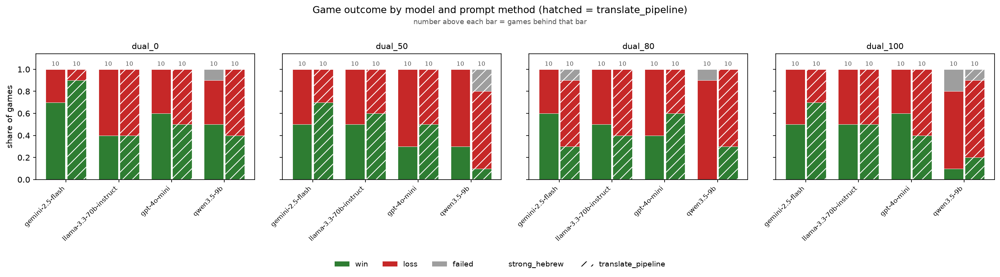
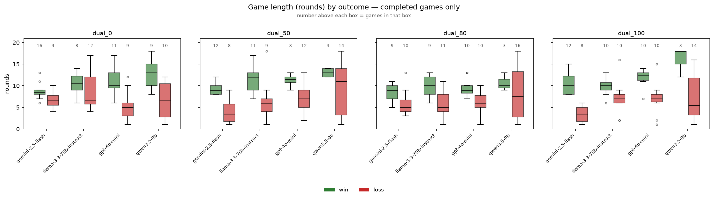
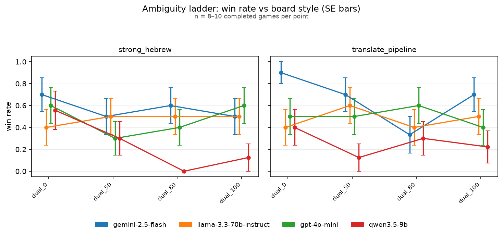
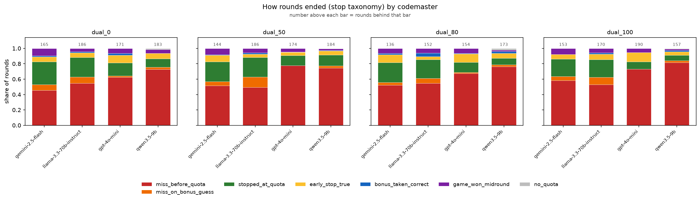
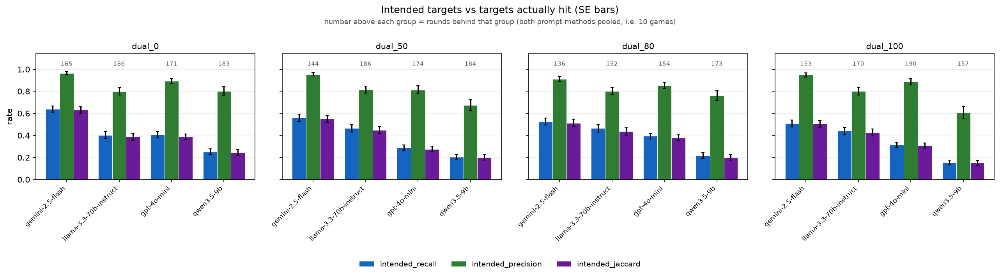
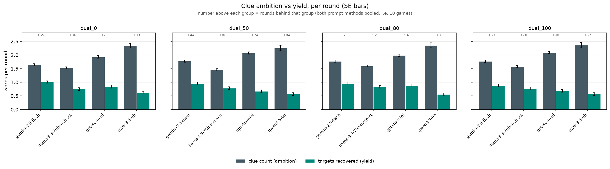
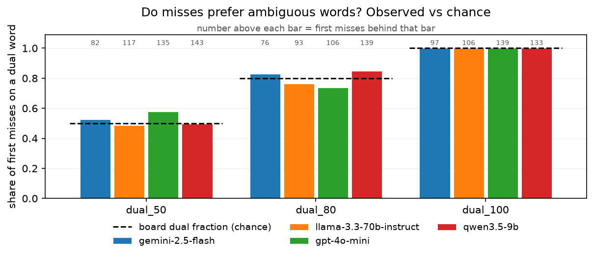
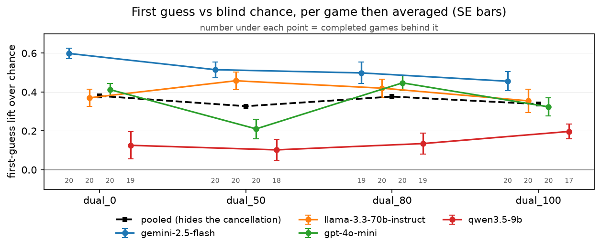
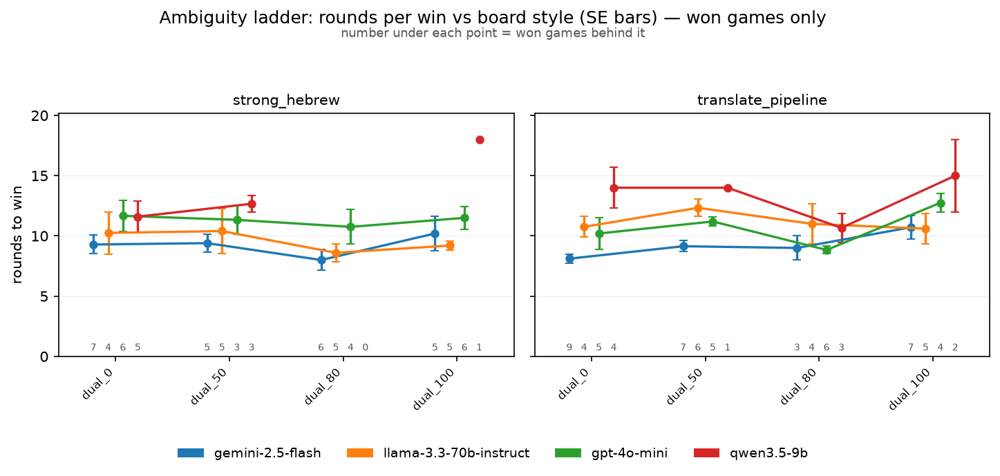

# Codenames-Hebrew results — 20260817T012356031381Z

- Games: **320** (312 completed, 8 not completed)
- Rounds: **2678**
- Models: google/gemini-2.5-flash, meta-llama/llama-3.3-70b-instruct, openai/gpt-4o-mini, qwen/qwen3.5-9b
- Prompt methods: strong_hebrew, translate_pipeline
- Guesser: anthropic/claude-haiku-4.5
- Board styles: dual_0, dual_50, dual_80, dual_100

### How to read these numbers

- Win/loss rates and game length cover **completed games only**. Games that ended because a model could not produce a legal clue are reported separately as a completion rate; scoring them as losses would confuse a formatting failure with a bad clue.
- Games end by finding all 9 targets (win), by hitting the assassin, or by revealing all 8 opponent words — the opposing team then has all of its own and wins. `assassin_share_of_losses` splits the two loss kinds; its denominator is the losses in that group, not the games.
- `%loss` is close to `1 - %win`, and **game length is confounded with outcome** — a short game is an efficient win or an early death. Length is therefore also reported separately for wins and for losses, and `targets_per_round` carries the same confound.
- Games from runs played before 2026-08-22 are re-scored against the opponent-words rule from their own logs, and the rounds that could not have been played under it are dropped. Those games are flagged `rescored`; the players were never told the rule, so their play is unaffected by it.
- SE is `sd / sqrt(n)` at the natural unit (games for game metrics, rounds for round metrics). Proportions also carry a Wilson 95% interval, because at small n a Wald SE of 0 at p=0 or p=1 reads as false certainty.
- Round-level SEs treat rounds within a game as independent. They are not, so those SEs are optimistic.

### Stop taxonomy

The logged `turn_outcome` cannot answer the early-stop question: it records both *stopping short of* the codemaster's count and *stopping at* it after declining the bonus guess as `stopped_early`. Only the first is an early stop. Rounds are therefore reclassified as:

| class | meaning |
|---|---|
| `early_stop_true` | stopped before reaching the count — **the early stop** |
| `stopped_at_quota` | reached the count and declined the bonus guess (correct play) |
| `miss_before_quota` | guessed wrong before reaching the count |
| `miss_on_bonus_guess` | reached the count, took the bonus guess, got it wrong |
| `bonus_taken_correct` | reached the count, took the bonus guess, got it right |
| `game_won_midround` | round ended because the 9th target fell — not a choice |
| `guesser_failure` / `no_quota` | guesser exhausted retries / clue had count 0 |

Rates are computed over eligible rounds only. A guesser may not stop before its first correct guess, so an early stop is impossible when `count = 1`; including those rounds in the denominator would deflate the rate for reasons unrelated to the guesser's judgement.

## Game outcomes — by codemaster

`loss_rate` and `length_*` cover completed games; `completion_rate` is the share of games that played out at all. `win_rate` is `1 - loss_rate` by construction, so only the loss rate carries an SE and a Wilson interval (`loss_lo` / `loss_hi`).

| model                             | n_games | n_completed | completion_rate | win_rate | loss_rate | loss_se | loss_lo | loss_hi | length_mean | length_se | length_win_mean | length_win_se | n_win | length_loss_mean | length_loss_se | n_loss | assassin_share_of_losses | targets_found_mean | targets_found_se | targets_per_round_mean | targets_per_round_se | first_guess_lift_mean | first_guess_lift_se |
|-----------------------------------|---------|-------------|-----------------|----------|-----------|---------|---------|---------|-------------|-----------|-----------------|---------------|-------|------------------|----------------|--------|--------------------------|--------------------|------------------|------------------------|----------------------|-----------------------|---------------------|
| google/gemini-2.5-flash           | 80      | 79          | 0.988           | 0.620    | 0.380     | 0.055   | 0.281   | 0.490   | 7.544       | 0.359     | 9.184           | 0.294         | 49    | 4.867            | 0.531          | 30     | 1.000                    | 7.190              | 0.319            | 0.973                  | 0.031                | 0.517                 | 0.022               |
| meta-llama/llama-3.3-70b-instruct | 80      | 80          | 1.000           | 0.475    | 0.525     | 0.056   | 0.417   | 0.631   | 8.675       | 0.424     | 10.421          | 0.429         | 38    | 7.095            | 0.617          | 42     | 0.952                    | 6.800              | 0.300            | 0.819                  | 0.031                | 0.401                 | 0.025               |
| openai/gpt-4o-mini                | 80      | 80          | 1.000           | 0.487    | 0.512     | 0.056   | 0.405   | 0.619   | 8.613       | 0.409     | 10.949          | 0.373         | 39    | 6.390            | 0.515          | 41     | 1.000                    | 6.588              | 0.314            | 0.807                  | 0.033                | 0.348                 | 0.023               |
| qwen/qwen3.5-9b                   | 80      | 73          | 0.912           | 0.260    | 0.740     | 0.052   | 0.629   | 0.827   | 9.274       | 0.624     | 12.947          | 0.686         | 19    | 7.981            | 0.734          | 54     | 0.963                    | 5.370              | 0.380            | 0.573                  | 0.030                | 0.139                 | 0.028               |

## Game outcomes — by codemaster x prompt method

`loss_rate` and `length_*` cover completed games; `completion_rate` is the share of games that played out at all. `win_rate` is `1 - loss_rate` by construction, so only the loss rate carries an SE and a Wilson interval (`loss_lo` / `loss_hi`).

| model                             | method             | n_games | n_completed | completion_rate | win_rate | loss_rate | loss_se | loss_lo | loss_hi | length_mean | length_se | length_win_mean | length_win_se | n_win | length_loss_mean | length_loss_se | n_loss | assassin_share_of_losses | targets_found_mean | targets_found_se | targets_per_round_mean | targets_per_round_se | first_guess_lift_mean | first_guess_lift_se |
|-----------------------------------|--------------------|---------|-------------|-----------------|----------|-----------|---------|---------|---------|-------------|-----------|-----------------|---------------|-------|------------------|----------------|--------|--------------------------|--------------------|------------------|------------------------|----------------------|-----------------------|---------------------|
| google/gemini-2.5-flash           | strong_hebrew      | 40      | 40          | 1.000           | 0.575    | 0.425     | 0.079   | 0.285   | 0.578   | 7.250       | 0.514     | 9.174           | 0.473         | 23    | 4.647            | 0.600          | 17     | 1.000                    | 6.850              | 0.476            | 0.960                  | 0.048                | 0.501                 | 0.033               |
| google/gemini-2.5-flash           | translate_pipeline | 40      | 39          | 0.975           | 0.667    | 0.333     | 0.076   | 0.206   | 0.490   | 7.846       | 0.504     | 9.192           | 0.372         | 26    | 5.154            | 0.966          | 13     | 1.000                    | 7.538              | 0.422            | 0.986                  | 0.041                | 0.533                 | 0.030               |
| meta-llama/llama-3.3-70b-instruct | strong_hebrew      | 40      | 40          | 1.000           | 0.475    | 0.525     | 0.080   | 0.375   | 0.671   | 8.525       | 0.609     | 9.579           | 0.618         | 19    | 7.571            | 0.985          | 21     | 0.905                    | 7.050              | 0.402            | 0.880                  | 0.045                | 0.472                 | 0.034               |
| meta-llama/llama-3.3-70b-instruct | translate_pipeline | 40      | 40          | 1.000           | 0.475    | 0.525     | 0.080   | 0.375   | 0.671   | 8.825       | 0.597     | 11.263          | 0.545         | 19    | 6.619            | 0.754          | 21     | 1.000                    | 6.550              | 0.447            | 0.757                  | 0.042                | 0.330                 | 0.032               |
| openai/gpt-4o-mini                | strong_hebrew      | 40      | 40          | 1.000           | 0.475    | 0.525     | 0.080   | 0.375   | 0.671   | 9.200       | 0.579     | 11.368          | 0.573         | 19    | 7.238            | 0.756          | 21     | 1.000                    | 6.850              | 0.428            | 0.761                  | 0.041                | 0.322                 | 0.035               |
| openai/gpt-4o-mini                | translate_pipeline | 40      | 40          | 1.000           | 0.500    | 0.500     | 0.080   | 0.352   | 0.648   | 8.025       | 0.570     | 10.550          | 0.478         | 20    | 5.500            | 0.659          | 20     | 1.000                    | 6.325              | 0.460            | 0.854                  | 0.050                | 0.375                 | 0.031               |
| qwen/qwen3.5-9b                   | strong_hebrew      | 40      | 36          | 0.900           | 0.250    | 0.750     | 0.073   | 0.589   | 0.862   | 9.000       | 0.952     | 12.667          | 0.986         | 9     | 7.778            | 1.139          | 27     | 0.963                    | 5.194              | 0.569            | 0.580                  | 0.048                | 0.158                 | 0.046               |
| qwen/qwen3.5-9b                   | translate_pipeline | 40      | 37          | 0.925           | 0.270    | 0.730     | 0.074   | 0.570   | 0.846   | 9.541       | 0.823     | 13.200          | 0.998         | 10    | 8.185            | 0.946          | 27     | 0.963                    | 5.541              | 0.511            | 0.566                  | 0.038                | 0.121                 | 0.032               |

## Game outcomes — by board style

`loss_rate` and `length_*` cover completed games; `completion_rate` is the share of games that played out at all. `win_rate` is `1 - loss_rate` by construction, so only the loss rate carries an SE and a Wilson interval (`loss_lo` / `loss_hi`).

| board_style | n_games | n_completed | completion_rate | win_rate | loss_rate | loss_se | loss_lo | loss_hi | length_mean | length_se | length_win_mean | length_win_se | n_win | length_loss_mean | length_loss_se | n_loss | assassin_share_of_losses | targets_found_mean | targets_found_se | targets_per_round_mean | targets_per_round_se | first_guess_lift_mean | first_guess_lift_se |
|-------------|---------|-------------|-----------------|----------|-----------|---------|---------|---------|-------------|-----------|-----------------|---------------|-------|------------------|----------------|--------|--------------------------|--------------------|------------------|------------------------|----------------------|-----------------------|---------------------|
| dual_0      | 80      | 79          | 0.988           | 0.557    | 0.443     | 0.056   | 0.339   | 0.553   | 8.886       | 0.422     | 10.386          | 0.434         | 44    | 7.000            | 0.660          | 35     | 1.000                    | 7.089              | 0.300            | 0.842                  | 0.038                | 0.380                 | 0.029               |
| dual_50     | 80      | 78          | 0.975           | 0.449    | 0.551     | 0.057   | 0.441   | 0.657   | 8.795       | 0.489     | 10.829          | 0.394         | 35    | 7.140            | 0.740          | 43     | 0.930                    | 6.474              | 0.343            | 0.758                  | 0.033                | 0.327                 | 0.030               |
| dual_80     | 80      | 78          | 0.975           | 0.397    | 0.603     | 0.056   | 0.492   | 0.704   | 7.769       | 0.431     | 9.355           | 0.400         | 31    | 6.723            | 0.622          | 47     | 1.000                    | 6.205              | 0.336            | 0.833                  | 0.036                | 0.377                 | 0.029               |
| dual_100    | 80      | 77          | 0.963           | 0.455    | 0.545     | 0.057   | 0.435   | 0.652   | 8.597       | 0.497     | 11.229          | 0.487         | 35    | 6.405            | 0.646          | 42     | 0.976                    | 6.260              | 0.354            | 0.755                  | 0.031                | 0.338                 | 0.027               |

## Game outcomes — by codemaster x board style

`loss_rate` and `length_*` cover completed games; `completion_rate` is the share of games that played out at all. `win_rate` is `1 - loss_rate` by construction, so only the loss rate carries an SE and a Wilson interval (`loss_lo` / `loss_hi`).

| model                             | board_style | n_games | n_completed | completion_rate | win_rate | loss_rate | loss_se | loss_lo | loss_hi | length_mean | length_se | length_win_mean | length_win_se | n_win | length_loss_mean | length_loss_se | n_loss | assassin_share_of_losses | targets_found_mean | targets_found_se | targets_per_round_mean | targets_per_round_se | first_guess_lift_mean | first_guess_lift_se |
|-----------------------------------|-------------|---------|-------------|-----------------|----------|-----------|---------|---------|---------|-------------|-----------|-----------------|---------------|-------|------------------|----------------|--------|--------------------------|--------------------|------------------|------------------------|----------------------|-----------------------|---------------------|
| google/gemini-2.5-flash           | dual_0      | 20      | 20          | 1.000           | 0.800    | 0.200     | 0.092   | 0.081   | 0.416   | 8.250       | 0.428     | 8.625           | 0.407         | 16    | 6.750            | 1.250          | 4      | 1.000                    | 8.350              | 0.357            | 1.030                  | 0.044                | 0.598                 | 0.026               |
| google/gemini-2.5-flash           | dual_50     | 20      | 20          | 1.000           | 0.600    | 0.400     | 0.112   | 0.219   | 0.613   | 7.200       | 0.746     | 9.250           | 0.392         | 12    | 4.125            | 1.076          | 8      | 1.000                    | 6.900              | 0.710            | 0.960                  | 0.047                | 0.515                 | 0.041               |
| google/gemini-2.5-flash           | dual_80     | 20      | 19          | 0.950           | 0.474    | 0.526     | 0.118   | 0.317   | 0.727   | 7.053       | 0.655     | 8.333           | 0.645         | 9     | 5.900            | 0.994          | 10     | 1.000                    | 6.737              | 0.634            | 0.983                  | 0.089                | 0.498                 | 0.055               |
| google/gemini-2.5-flash           | dual_100    | 20      | 20          | 1.000           | 0.600    | 0.400     | 0.112   | 0.219   | 0.613   | 7.650       | 0.960     | 10.500          | 0.783         | 12    | 3.375            | 0.680          | 8      | 1.000                    | 6.750              | 0.746            | 0.918                  | 0.064                | 0.456                 | 0.050               |
| meta-llama/llama-3.3-70b-instruct | dual_0      | 20      | 20          | 1.000           | 0.400    | 0.600     | 0.112   | 0.387   | 0.781   | 9.300       | 0.808     | 10.500          | 0.906         | 8     | 8.500            | 1.177          | 12     | 1.000                    | 6.950              | 0.500            | 0.792                  | 0.056                | 0.370                 | 0.044               |
| meta-llama/llama-3.3-70b-instruct | dual_50     | 20      | 20          | 1.000           | 0.550    | 0.450     | 0.114   | 0.258   | 0.658   | 9.300       | 1.024     | 11.455          | 0.928         | 11    | 6.667            | 1.624          | 9      | 0.889                    | 7.300              | 0.558            | 0.876                  | 0.060                | 0.458                 | 0.046               |
| meta-llama/llama-3.3-70b-instruct | dual_80     | 20      | 20          | 1.000           | 0.450    | 0.550     | 0.114   | 0.342   | 0.742   | 7.600       | 0.779     | 9.667           | 0.898         | 9     | 5.909            | 0.967          | 11     | 1.000                    | 6.350              | 0.658            | 0.856                  | 0.062                | 0.420                 | 0.047               |
| meta-llama/llama-3.3-70b-instruct | dual_100    | 20      | 20          | 1.000           | 0.500    | 0.500     | 0.115   | 0.299   | 0.701   | 8.500       | 0.759     | 9.900           | 0.674         | 10    | 7.100            | 1.242          | 10     | 0.900                    | 6.600              | 0.690            | 0.750                  | 0.072                | 0.355                 | 0.060               |
| openai/gpt-4o-mini                | dual_0      | 20      | 20          | 1.000           | 0.550    | 0.450     | 0.114   | 0.258   | 0.658   | 8.550       | 0.939     | 11.000          | 0.905         | 11    | 5.556            | 1.168          | 9      | 1.000                    | 7.200              | 0.541            | 0.973                  | 0.079                | 0.412                 | 0.032               |
| openai/gpt-4o-mini                | dual_50     | 20      | 20          | 1.000           | 0.400    | 0.600     | 0.112   | 0.387   | 0.781   | 8.700       | 0.733     | 11.250          | 0.453         | 8     | 7.000            | 0.896          | 12     | 1.000                    | 5.850              | 0.685            | 0.639                  | 0.054                | 0.210                 | 0.050               |
| openai/gpt-4o-mini                | dual_80     | 20      | 20          | 1.000           | 0.500    | 0.500     | 0.115   | 0.299   | 0.701   | 7.700       | 0.707     | 9.600           | 0.636         | 10    | 5.800            | 0.952          | 10     | 1.000                    | 6.800              | 0.635            | 0.903                  | 0.049                | 0.447                 | 0.039               |
| openai/gpt-4o-mini                | dual_100    | 20      | 20          | 1.000           | 0.500    | 0.500     | 0.115   | 0.299   | 0.701   | 9.500       | 0.881     | 12.000          | 0.650         | 10    | 7.000            | 1.211          | 10     | 1.000                    | 6.500              | 0.647            | 0.713                  | 0.048                | 0.324                 | 0.047               |
| qwen/qwen3.5-9b                   | dual_0      | 20      | 19          | 0.950           | 0.474    | 0.526     | 0.118   | 0.317   | 0.727   | 9.474       | 1.114     | 12.667          | 1.054         | 9     | 6.600            | 1.376          | 10     | 1.000                    | 5.789              | 0.829            | 0.560                  | 0.075                | 0.126                 | 0.070               |
| qwen/qwen3.5-9b                   | dual_50     | 20      | 18          | 0.900           | 0.222    | 0.778     | 0.101   | 0.548   | 0.910   | 10.111      | 1.323     | 13.000          | 0.577         | 4     | 9.286            | 1.639          | 14     | 0.857                    | 5.778              | 0.774            | 0.533                  | 0.060                | 0.102                 | 0.054               |
| qwen/qwen3.5-9b                   | dual_80     | 20      | 19          | 0.950           | 0.158    | 0.842     | 0.086   | 0.624   | 0.945   | 8.737       | 1.233     | 10.667          | 1.202         | 3     | 8.375            | 1.440          | 16     | 1.000                    | 4.895              | 0.721            | 0.585                  | 0.059                | 0.135                 | 0.053               |
| qwen/qwen3.5-9b                   | dual_100    | 20      | 17          | 0.850           | 0.176    | 0.824     | 0.095   | 0.590   | 0.938   | 8.765       | 1.416     | 16.000          | 2.000         | 3     | 7.214            | 1.347          | 14     | 1.000                    | 5.000              | 0.738            | 0.616                  | 0.042                | 0.197                 | 0.037               |

## Game outcomes — by codemaster x prompt method x board style

`loss_rate` and `length_*` cover completed games; `completion_rate` is the share of games that played out at all. `win_rate` is `1 - loss_rate` by construction, so only the loss rate carries an SE and a Wilson interval (`loss_lo` / `loss_hi`).

| model                             | method             | board_style | n_games | n_completed | completion_rate | win_rate | loss_rate | loss_se | loss_lo | loss_hi | length_mean | length_se | length_win_mean | length_win_se | n_win | length_loss_mean | length_loss_se | n_loss | assassin_share_of_losses | targets_found_mean | targets_found_se | targets_per_round_mean | targets_per_round_se | first_guess_lift_mean | first_guess_lift_se |
|-----------------------------------|--------------------|-------------|---------|-------------|-----------------|----------|-----------|---------|---------|---------|-------------|-----------|-----------------|---------------|-------|------------------|----------------|--------|--------------------------|--------------------|------------------|------------------------|----------------------|-----------------------|---------------------|
| google/gemini-2.5-flash           | strong_hebrew      | dual_0      | 10      | 10          | 1.000           | 0.700    | 0.300     | 0.153   | 0.108   | 0.603   | 8.500       | 0.806     | 9.286           | 0.778         | 7.000 | 6.667            | 1.764          | 3      | 1.000                    | 7.900              | 0.674            | 0.943                  | 0.061                | 0.542                 | 0.039               |
| google/gemini-2.5-flash           | strong_hebrew      | dual_50     | 10      | 10          | 1.000           | 0.500    | 0.500     | 0.167   | 0.237   | 0.763   | 6.100       | 1.215     | 9.400           | 0.748         | 5.000 | 2.800            | 0.800          | 5      | 1.000                    | 5.900              | 1.130            | 0.993                  | 0.075                | 0.531                 | 0.061               |
| google/gemini-2.5-flash           | strong_hebrew      | dual_80     | 10      | 10          | 1.000           | 0.600    | 0.400     | 0.163   | 0.168   | 0.687   | 7.100       | 0.795     | 8.000           | 0.856         | 6.000 | 5.750            | 1.377          | 4      | 1.000                    | 6.900              | 0.948            | 0.981                  | 0.124                | 0.512                 | 0.074               |
| google/gemini-2.5-flash           | strong_hebrew      | dual_100    | 10      | 10          | 1.000           | 0.500    | 0.500     | 0.167   | 0.237   | 0.763   | 7.300       | 1.221     | 10.200          | 1.428         | 5.000 | 4.400            | 0.678          | 5      | 1.000                    | 6.700              | 1.033            | 0.921                  | 0.120                | 0.421                 | 0.086               |
| google/gemini-2.5-flash           | translate_pipeline | dual_0      | 10      | 10          | 1.000           | 0.900    | 0.100     | 0.100   | 0.018   | 0.404   | 8.000       | 0.333     | 8.111           | 0.351         | 9.000 | 7.000            | —              | 1      | 1.000                    | 8.800              | 0.200            | 1.116                  | 0.052                | 0.654                 | 0.025               |
| google/gemini-2.5-flash           | translate_pipeline | dual_50     | 10      | 10          | 1.000           | 0.700    | 0.300     | 0.153   | 0.108   | 0.603   | 8.300       | 0.775     | 9.143           | 0.459         | 7.000 | 6.333            | 2.186          | 3      | 1.000                    | 7.900              | 0.795            | 0.926                  | 0.060                | 0.499                 | 0.056               |
| google/gemini-2.5-flash           | translate_pipeline | dual_80     | 10      | 9           | 0.900           | 0.333    | 0.667     | 0.167   | 0.354   | 0.879   | 7.000       | 1.118     | 9.000           | 1.000         | 3.000 | 6.000            | 1.483          | 6      | 1.000                    | 6.556              | 0.884            | 0.985                  | 0.137                | 0.483                 | 0.087               |
| google/gemini-2.5-flash           | translate_pipeline | dual_100    | 10      | 10          | 1.000           | 0.700    | 0.300     | 0.153   | 0.108   | 0.603   | 8.000       | 1.542     | 10.714          | 0.969         | 7.000 | 1.667            | 0.667          | 3      | 1.000                    | 6.800              | 1.133            | 0.916                  | 0.055                | 0.490                 | 0.053               |
| meta-llama/llama-3.3-70b-instruct | strong_hebrew      | dual_0      | 10      | 10          | 1.000           | 0.400    | 0.600     | 0.163   | 0.313   | 0.832   | 8.900       | 1.320     | 10.250          | 1.750         | 4.000 | 8.000            | 1.897          | 6      | 1.000                    | 7.000              | 0.683            | 0.857                  | 0.092                | 0.435                 | 0.064               |
| meta-llama/llama-3.3-70b-instruct | strong_hebrew      | dual_50     | 10      | 10          | 1.000           | 0.500    | 0.500     | 0.167   | 0.237   | 0.763   | 9.600       | 1.492     | 10.400          | 1.860         | 5.000 | 8.800            | 2.498          | 5      | 0.800                    | 7.900              | 0.504            | 0.951                  | 0.098                | 0.556                 | 0.069               |
| meta-llama/llama-3.3-70b-instruct | strong_hebrew      | dual_80     | 10      | 10          | 1.000           | 0.500    | 0.500     | 0.167   | 0.237   | 0.763   | 6.600       | 1.035     | 8.600           | 0.748         | 5.000 | 4.600            | 1.503          | 5      | 1.000                    | 6.300              | 1.096            | 0.928                  | 0.084                | 0.516                 | 0.061               |
| meta-llama/llama-3.3-70b-instruct | strong_hebrew      | dual_100    | 10      | 10          | 1.000           | 0.500    | 0.500     | 0.167   | 0.237   | 0.763   | 9.000       | 0.894     | 9.200           | 0.374         | 5.000 | 8.800            | 1.855          | 5      | 0.800                    | 7.000              | 0.856            | 0.784                  | 0.088                | 0.379                 | 0.076               |
| meta-llama/llama-3.3-70b-instruct | translate_pipeline | dual_0      | 10      | 10          | 1.000           | 0.400    | 0.600     | 0.163   | 0.313   | 0.832   | 9.700       | 0.989     | 10.750          | 0.854         | 4.000 | 9.000            | 1.549          | 6      | 1.000                    | 6.900              | 0.767            | 0.726                  | 0.061                | 0.306                 | 0.056               |
| meta-llama/llama-3.3-70b-instruct | translate_pipeline | dual_50     | 10      | 10          | 1.000           | 0.600    | 0.400     | 0.163   | 0.168   | 0.687   | 9.000       | 1.476     | 12.333          | 0.715         | 6.000 | 4.000            | 1.080          | 4      | 1.000                    | 6.700              | 0.989            | 0.800                  | 0.067                | 0.359                 | 0.045               |
| meta-llama/llama-3.3-70b-instruct | translate_pipeline | dual_80     | 10      | 10          | 1.000           | 0.400    | 0.600     | 0.163   | 0.313   | 0.832   | 8.600       | 1.127     | 11.000          | 1.683         | 4.000 | 7.000            | 1.183          | 6      | 1.000                    | 6.400              | 0.792            | 0.784                  | 0.089                | 0.324                 | 0.060               |
| meta-llama/llama-3.3-70b-instruct | translate_pipeline | dual_100    | 10      | 10          | 1.000           | 0.500    | 0.500     | 0.167   | 0.237   | 0.763   | 8.000       | 1.256     | 10.600          | 1.288         | 5.000 | 5.400            | 1.435          | 5      | 1.000                    | 6.200              | 1.114            | 0.717                  | 0.118                | 0.330                 | 0.096               |
| openai/gpt-4o-mini                | strong_hebrew      | dual_0      | 10      | 10          | 1.000           | 0.600    | 0.400     | 0.163   | 0.168   | 0.687   | 10.400      | 1.056     | 11.667          | 1.282         | 6.000 | 8.500            | 1.500          | 4      | 1.000                    | 8.100              | 0.433            | 0.826                  | 0.064                | 0.379                 | 0.039               |
| openai/gpt-4o-mini                | strong_hebrew      | dual_50     | 10      | 10          | 1.000           | 0.300    | 0.700     | 0.153   | 0.397   | 0.892   | 8.000       | 1.256     | 11.333          | 1.202         | 3.000 | 6.571            | 1.429          | 7      | 1.000                    | 5.400              | 1.024            | 0.634                  | 0.092                | 0.210                 | 0.091               |
| openai/gpt-4o-mini                | strong_hebrew      | dual_80     | 10      | 10          | 1.000           | 0.400    | 0.600     | 0.163   | 0.313   | 0.832   | 7.600       | 1.185     | 10.750          | 1.436         | 4.000 | 5.500            | 1.088          | 6      | 1.000                    | 6.400              | 0.968            | 0.868                  | 0.079                | 0.392                 | 0.055               |
| openai/gpt-4o-mini                | strong_hebrew      | dual_100    | 10      | 10          | 1.000           | 0.600    | 0.400     | 0.163   | 0.168   | 0.687   | 10.800      | 0.904     | 11.500          | 0.957         | 6.000 | 9.750            | 1.797          | 4      | 1.000                    | 7.500              | 0.719            | 0.715                  | 0.080                | 0.305                 | 0.075               |
| openai/gpt-4o-mini                | translate_pipeline | dual_0      | 10      | 10          | 1.000           | 0.500    | 0.500     | 0.167   | 0.237   | 0.763   | 6.700       | 1.359     | 10.200          | 1.319         | 5.000 | 3.200            | 0.663          | 5      | 1.000                    | 6.300              | 0.932            | 1.120                  | 0.133                | 0.446                 | 0.049               |
| openai/gpt-4o-mini                | translate_pipeline | dual_50     | 10      | 10          | 1.000           | 0.500    | 0.500     | 0.167   | 0.237   | 0.763   | 9.400       | 0.763     | 11.200          | 0.374         | 5.000 | 7.600            | 0.927          | 5      | 1.000                    | 6.300              | 0.943            | 0.644                  | 0.062                | 0.211                 | 0.049               |
| openai/gpt-4o-mini                | translate_pipeline | dual_80     | 10      | 10          | 1.000           | 0.600    | 0.400     | 0.163   | 0.168   | 0.687   | 7.800       | 0.841     | 8.833           | 0.307         | 6.000 | 6.250            | 1.931          | 4      | 1.000                    | 7.200              | 0.854            | 0.938                  | 0.058                | 0.502                 | 0.051               |
| openai/gpt-4o-mini                | translate_pipeline | dual_100    | 10      | 10          | 1.000           | 0.400    | 0.600     | 0.163   | 0.313   | 0.832   | 8.200       | 1.444     | 12.750          | 0.750         | 4.000 | 5.167            | 1.195          | 6      | 1.000                    | 5.500              | 1.014            | 0.712                  | 0.056                | 0.342                 | 0.059               |
| qwen/qwen3.5-9b                   | strong_hebrew      | dual_0      | 10      | 9           | 0.900           | 0.556    | 0.444     | 0.176   | 0.189   | 0.733   | 8.000       | 1.650     | 11.600          | 1.288         | 5.000 | 3.500            | 1.190          | 4      | 1.000                    | 5.667              | 1.374            | 0.639                  | 0.134                | 0.209                 | 0.123               |
| qwen/qwen3.5-9b                   | strong_hebrew      | dual_50     | 10      | 10          | 1.000           | 0.300    | 0.700     | 0.153   | 0.397   | 0.892   | 10.200      | 1.825     | 12.667          | 0.667         | 3.000 | 9.143            | 2.539          | 7      | 0.857                    | 6.200              | 1.041            | 0.600                  | 0.085                | 0.155                 | 0.080               |
| qwen/qwen3.5-9b                   | strong_hebrew      | dual_80     | 10      | 9           | 0.900           | 0.000    | 1.000     | 0.000   | 0.701   | 1.000   | 8.889       | 2.182     | —               | —             | —     | 8.889            | 2.182          | 9      | 1.000                    | 4.000              | 1.041            | 0.477                  | 0.089                | 0.071                 | 0.092               |
| qwen/qwen3.5-9b                   | strong_hebrew      | dual_100    | 10      | 8           | 0.800           | 0.125    | 0.875     | 0.125   | 0.529   | 0.978   | 8.750       | 2.234     | 18.000          | —             | 1.000 | 7.429            | 2.080          | 7      | 1.000                    | 4.750              | 1.114            | 0.606                  | 0.063                | 0.201                 | 0.068               |
| qwen/qwen3.5-9b                   | translate_pipeline | dual_0      | 10      | 10          | 1.000           | 0.400    | 0.600     | 0.163   | 0.313   | 0.832   | 10.800      | 1.459     | 14.000          | 1.683         | 4.000 | 8.667            | 1.726          | 6      | 1.000                    | 5.900              | 1.048            | 0.488                  | 0.078                | 0.051                 | 0.073               |
| qwen/qwen3.5-9b                   | translate_pipeline | dual_50     | 10      | 8           | 0.800           | 0.125    | 0.875     | 0.125   | 0.529   | 0.978   | 10.000      | 2.053     | 14.000          | —             | 1.000 | 9.429            | 2.277          | 7      | 0.857                    | 5.250              | 1.206            | 0.449                  | 0.078                | 0.036                 | 0.068               |
| qwen/qwen3.5-9b                   | translate_pipeline | dual_80     | 10      | 10          | 1.000           | 0.300    | 0.700     | 0.153   | 0.397   | 0.892   | 8.600       | 1.400     | 10.667          | 1.202         | 3.000 | 7.714            | 1.886          | 7      | 1.000                    | 5.700              | 0.978            | 0.683                  | 0.067                | 0.192                 | 0.056               |
| qwen/qwen3.5-9b                   | translate_pipeline | dual_100    | 10      | 9           | 0.900           | 0.222    | 0.778     | 0.147   | 0.453   | 0.937   | 8.778       | 1.920     | 15.000          | 3.000         | 2.000 | 7.000            | 1.877          | 7      | 1.000                    | 5.222              | 1.038            | 0.625                  | 0.061                | 0.194                 | 0.041               |

## Round metrics — by codemaster

`ambition` = words the codemaster commits one clue to (`count`); `yield` = targets that clue actually bought; `yield_ratio` = yield / ambition. `intended_*` compare the words aimed at with the words hit; `n_lucky_mean` counts targets found that were *not* aimed at. `early_stop_rate` and `bonus_take_rate` are over their eligible rounds only — `n_*_eligible` gives those denominators.

| model                             | n_rounds | first_guess_hit_mean | first_guess_baseline_mean | first_guess_lift_mean | first_guess_lift_se | ambition_mean | ambition_se | yield_mean | yield_se | yield_ratio_mean | yield_ratio_se | intended_recall_mean | intended_recall_se | intended_precision_mean | intended_precision_se | intended_jaccard_mean | intended_jaccard_se | n_lucky_mean | early_stop_rate | early_stop_se | n_early_stop_eligible | bonus_take_rate | bonus_take_se | n_bonus_eligible |
|-----------------------------------|----------|----------------------|---------------------------|-----------------------|---------------------|---------------|-------------|------------|----------|------------------|----------------|----------------------|--------------------|-------------------------|-----------------------|-----------------------|---------------------|--------------|-----------------|---------------|-----------------------|-----------------|---------------|------------------|
| google/gemini-2.5-flash           | 598      | 0.778                | 0.265                     | 0.512                 | 0.017               | 1.737         | 0.021       | 0.953      | 0.026    | 0.599            | 0.017          | 0.560                | 0.016              | 0.947                   | 0.009                 | 0.552                 | 0.016               | 0.067        | 0.150           | 0.020         | 307                   | 0.196           | 0.029         | 194              |
| meta-llama/llama-3.3-70b-instruct | 694      | 0.654                | 0.270                     | 0.384                 | 0.018               | 1.537         | 0.020       | 0.784      | 0.025    | 0.556            | 0.018          | 0.442                | 0.016              | 0.805                   | 0.017                 | 0.424                 | 0.016               | 0.177        | 0.162           | 0.024         | 229                   | 0.325           | 0.030         | 252              |
| openai/gpt-4o-mini                | 689      | 0.620                | 0.283                     | 0.337                 | 0.019               | 2.025         | 0.021       | 0.765      | 0.027    | 0.412            | 0.015          | 0.348                | 0.013              | 0.864                   | 0.015                 | 0.335                 | 0.013               | 0.125        | 0.178           | 0.020         | 359                   | 0.109           | 0.031         | 101              |
| qwen/qwen3.5-9b                   | 697      | 0.463                | 0.319                     | 0.145                 | 0.019               | 2.329         | 0.045       | 0.577      | 0.027    | 0.305            | 0.015          | 0.208                | 0.013              | 0.714                   | 0.024                 | 0.201                 | 0.012               | 0.174        | 0.172           | 0.025         | 238                   | 0.265           | 0.045         | 98               |

## Round metrics — by codemaster x prompt method

`ambition` = words the codemaster commits one clue to (`count`); `yield` = targets that clue actually bought; `yield_ratio` = yield / ambition. `intended_*` compare the words aimed at with the words hit; `n_lucky_mean` counts targets found that were *not* aimed at. `early_stop_rate` and `bonus_take_rate` are over their eligible rounds only — `n_*_eligible` gives those denominators.

| model                             | method             | n_rounds | first_guess_hit_mean | first_guess_baseline_mean | first_guess_lift_mean | first_guess_lift_se | ambition_mean | ambition_se | yield_mean | yield_se | yield_ratio_mean | yield_ratio_se | intended_recall_mean | intended_recall_se | intended_precision_mean | intended_precision_se | intended_jaccard_mean | intended_jaccard_se | n_lucky_mean | early_stop_rate | early_stop_se | n_early_stop_eligible | bonus_take_rate | bonus_take_se | n_bonus_eligible |
|-----------------------------------|--------------------|----------|----------------------|---------------------------|-----------------------|---------------------|---------------|-------------|------------|----------|------------------|----------------|----------------------|--------------------|-------------------------|-----------------------|-----------------------|---------------------|--------------|-----------------|---------------|-----------------------|-----------------|---------------|------------------|
| google/gemini-2.5-flash           | strong_hebrew      | 290      | 0.772                | 0.273                     | 0.500                 | 0.025               | 1.690         | 0.030       | 0.945      | 0.038    | 0.621            | 0.025          | 0.576                | 0.023              | 0.943                   | 0.014                 | 0.567                 | 0.024               | 0.069        | 0.104           | 0.027         | 134                   | 0.252           | 0.042         | 107              |
| google/gemini-2.5-flash           | translate_pipeline | 308      | 0.782                | 0.259                     | 0.524                 | 0.024               | 1.782         | 0.030       | 0.961      | 0.036    | 0.578            | 0.022          | 0.545                | 0.021              | 0.951                   | 0.012                 | 0.538                 | 0.021               | 0.065        | 0.185           | 0.030         | 173                   | 0.126           | 0.036         | 87               |
| meta-llama/llama-3.3-70b-instruct | strong_hebrew      | 341      | 0.701                | 0.265                     | 0.436                 | 0.025               | 1.399         | 0.027       | 0.827      | 0.035    | 0.631            | 0.027          | 0.529                | 0.024              | 0.860                   | 0.020                 | 0.510                 | 0.024               | 0.135        | 0.125           | 0.034         | 96                    | 0.336           | 0.038         | 152              |
| meta-llama/llama-3.3-70b-instruct | translate_pipeline | 353      | 0.609                | 0.275                     | 0.334                 | 0.026               | 1.671         | 0.028       | 0.742      | 0.037    | 0.484            | 0.024          | 0.358                | 0.022              | 0.745                   | 0.027                 | 0.342                 | 0.021               | 0.218        | 0.188           | 0.034         | 133                   | 0.310           | 0.046         | 100              |
| openai/gpt-4o-mini                | strong_hebrew      | 368      | 0.609                | 0.281                     | 0.327                 | 0.025               | 1.910         | 0.026       | 0.745      | 0.036    | 0.423            | 0.021          | 0.363                | 0.019              | 0.884                   | 0.019                 | 0.350                 | 0.019               | 0.106        | 0.166           | 0.028         | 181                   | 0.127           | 0.042         | 63               |
| openai/gpt-4o-mini                | translate_pipeline | 321      | 0.632                | 0.284                     | 0.348                 | 0.027               | 2.156         | 0.034       | 0.788      | 0.039    | 0.399            | 0.021          | 0.331                | 0.019              | 0.842                   | 0.023                 | 0.319                 | 0.019               | 0.146        | 0.191           | 0.030         | 178                   | 0.079           | 0.044         | 38               |
| qwen/qwen3.5-9b                   | strong_hebrew      | 342      | 0.459                | 0.306                     | 0.153                 | 0.027               | 2.211         | 0.063       | 0.576      | 0.039    | 0.306            | 0.022          | 0.209                | 0.018              | 0.723                   | 0.034                 | 0.203                 | 0.018               | 0.164        | 0.225           | 0.040         | 111                   | 0.275           | 0.063         | 51               |
| qwen/qwen3.5-9b                   | translate_pipeline | 355      | 0.468                | 0.332                     | 0.136                 | 0.026               | 2.442         | 0.063       | 0.577      | 0.037    | 0.303            | 0.022          | 0.208                | 0.017              | 0.706                   | 0.034                 | 0.199                 | 0.017               | 0.183        | 0.126           | 0.030         | 127                   | 0.255           | 0.064         | 47               |

## Round metrics — by board style

`ambition` = words the codemaster commits one clue to (`count`); `yield` = targets that clue actually bought; `yield_ratio` = yield / ambition. `intended_*` compare the words aimed at with the words hit; `n_lucky_mean` counts targets found that were *not* aimed at. `early_stop_rate` and `bonus_take_rate` are over their eligible rounds only — `n_*_eligible` gives those denominators.

| board_style | n_rounds | first_guess_hit_mean | first_guess_baseline_mean | first_guess_lift_mean | first_guess_lift_se | ambition_mean | ambition_se | yield_mean | yield_se | yield_ratio_mean | yield_ratio_se | intended_recall_mean | intended_recall_se | intended_precision_mean | intended_precision_se | intended_jaccard_mean | intended_jaccard_se | n_lucky_mean | early_stop_rate | early_stop_se | n_early_stop_eligible | bonus_take_rate | bonus_take_se | n_bonus_eligible |
|-------------|----------|----------------------|---------------------------|-----------------------|---------------------|---------------|-------------|------------|----------|------------------|----------------|----------------------|--------------------|-------------------------|-----------------------|-----------------------|---------------------|--------------|-----------------|---------------|-----------------------|-----------------|---------------|------------------|
| dual_0      | 705      | 0.641                | 0.274                     | 0.367                 | 0.018               | 1.864         | 0.031       | 0.799      | 0.027    | 0.491            | 0.017          | 0.420                | 0.015              | 0.874                   | 0.014                 | 0.408                 | 0.015               | 0.122        | 0.177           | 0.022         | 294                   | 0.233           | 0.031         | 189              |
| dual_50     | 688      | 0.603                | 0.288                     | 0.316                 | 0.019               | 1.895         | 0.032       | 0.734      | 0.026    | 0.456            | 0.017          | 0.371                | 0.015              | 0.824                   | 0.017                 | 0.360                 | 0.015               | 0.147        | 0.138           | 0.021         | 268                   | 0.249           | 0.033         | 177              |
| dual_80     | 615      | 0.639                | 0.290                     | 0.349                 | 0.020               | 1.948         | 0.034       | 0.795      | 0.028    | 0.476            | 0.018          | 0.392                | 0.016              | 0.839                   | 0.016                 | 0.373                 | 0.015               | 0.154        | 0.171           | 0.022         | 281                   | 0.246           | 0.036         | 142              |
| dual_100    | 670      | 0.610                | 0.289                     | 0.321                 | 0.019               | 1.952         | 0.030       | 0.725      | 0.026    | 0.432            | 0.016          | 0.353                | 0.015              | 0.829                   | 0.018                 | 0.347                 | 0.015               | 0.131        | 0.176           | 0.022         | 290                   | 0.248           | 0.037         | 137              |

## Round metrics — by codemaster x board style

`ambition` = words the codemaster commits one clue to (`count`); `yield` = targets that clue actually bought; `yield_ratio` = yield / ambition. `intended_*` compare the words aimed at with the words hit; `n_lucky_mean` counts targets found that were *not* aimed at. `early_stop_rate` and `bonus_take_rate` are over their eligible rounds only — `n_*_eligible` gives those denominators.

| model                             | board_style | n_rounds | first_guess_hit_mean | first_guess_baseline_mean | first_guess_lift_mean | first_guess_lift_se | ambition_mean | ambition_se | yield_mean | yield_se | yield_ratio_mean | yield_ratio_se | intended_recall_mean | intended_recall_se | intended_precision_mean | intended_precision_se | intended_jaccard_mean | intended_jaccard_se | n_lucky_mean | early_stop_rate | early_stop_se | n_early_stop_eligible | bonus_take_rate | bonus_take_se | n_bonus_eligible |
|-----------------------------------|-------------|----------|----------------------|---------------------------|-----------------------|---------------------|---------------|-------------|------------|----------|------------------|----------------|----------------------|--------------------|-------------------------|-----------------------|-----------------------|---------------------|--------------|-----------------|---------------|-----------------------|-----------------|---------------|------------------|
| google/gemini-2.5-flash           | dual_0      | 165      | 0.842                | 0.253                     | 0.590                 | 0.029               | 1.642         | 0.043       | 1.012      | 0.045    | 0.674            | 0.031          | 0.638                | 0.029              | 0.965                   | 0.013                 | 0.630                 | 0.029               | 0.055        | 0.138           | 0.039         | 80                    | 0.222           | 0.053         | 63               |
| google/gemini-2.5-flash           | dual_50     | 144      | 0.778                | 0.269                     | 0.509                 | 0.036               | 1.778         | 0.043       | 0.958      | 0.053    | 0.594            | 0.034          | 0.560                | 0.032              | 0.955                   | 0.016                 | 0.550                 | 0.032               | 0.062        | 0.156           | 0.042         | 77                    | 0.196           | 0.059         | 46               |
| google/gemini-2.5-flash           | dual_80     | 136      | 0.772                | 0.269                     | 0.503                 | 0.037               | 1.772         | 0.040       | 0.956      | 0.056    | 0.583            | 0.035          | 0.526                | 0.033              | 0.913                   | 0.024                 | 0.513                 | 0.033               | 0.110        | 0.189           | 0.046         | 74                    | 0.167           | 0.058         | 42               |
| google/gemini-2.5-flash           | dual_100    | 153      | 0.712                | 0.273                     | 0.439                 | 0.037               | 1.771         | 0.041       | 0.882      | 0.055    | 0.537            | 0.033          | 0.508                | 0.033              | 0.950                   | 0.019                 | 0.504                 | 0.033               | 0.046        | 0.118           | 0.037         | 76                    | 0.186           | 0.060         | 43               |
| meta-llama/llama-3.3-70b-instruct | dual_0      | 186      | 0.613                | 0.272                     | 0.341                 | 0.035               | 1.527         | 0.040       | 0.747      | 0.050    | 0.518            | 0.035          | 0.403                | 0.031              | 0.800                   | 0.034                 | 0.389                 | 0.031               | 0.172        | 0.180           | 0.050         | 61                    | 0.277           | 0.056         | 65               |
| meta-llama/llama-3.3-70b-instruct | dual_50     | 186      | 0.667                | 0.264                     | 0.403                 | 0.034               | 1.462         | 0.040       | 0.785      | 0.047    | 0.578            | 0.034          | 0.464                | 0.032              | 0.816                   | 0.032                 | 0.449                 | 0.032               | 0.172        | 0.148           | 0.049         | 54                    | 0.373           | 0.056         | 75               |
| meta-llama/llama-3.3-70b-instruct | dual_80     | 152      | 0.684                | 0.276                     | 0.408                 | 0.038               | 1.599         | 0.041       | 0.836      | 0.056    | 0.590            | 0.041          | 0.465                | 0.035              | 0.803                   | 0.035                 | 0.436                 | 0.034               | 0.204        | 0.107           | 0.042         | 56                    | 0.315           | 0.064         | 54               |
| meta-llama/llama-3.3-70b-instruct | dual_100    | 170      | 0.659                | 0.270                     | 0.389                 | 0.037               | 1.576         | 0.040       | 0.776      | 0.050    | 0.545            | 0.035          | 0.440                | 0.033              | 0.802                   | 0.035                 | 0.426                 | 0.033               | 0.165        | 0.207           | 0.054         | 58                    | 0.328           | 0.062         | 58               |
| openai/gpt-4o-mini                | dual_0      | 171      | 0.649                | 0.259                     | 0.390                 | 0.036               | 1.930         | 0.045       | 0.842      | 0.058    | 0.473            | 0.033          | 0.406                | 0.029              | 0.893                   | 0.024                 | 0.386                 | 0.028               | 0.123        | 0.195           | 0.043         | 87                    | 0.194           | 0.067         | 36               |
| openai/gpt-4o-mini                | dual_50     | 174      | 0.534                | 0.293                     | 0.241                 | 0.038               | 2.075         | 0.045       | 0.672      | 0.054    | 0.360            | 0.030          | 0.288                | 0.026              | 0.814                   | 0.036                 | 0.276                 | 0.026               | 0.144        | 0.089           | 0.032         | 79                    | 0.042           | 0.042         | 24               |
| openai/gpt-4o-mini                | dual_80     | 154      | 0.708                | 0.278                     | 0.430                 | 0.037               | 1.987         | 0.044       | 0.883      | 0.055    | 0.465            | 0.030          | 0.394                | 0.028              | 0.855                   | 0.029                 | 0.378                 | 0.027               | 0.149        | 0.181           | 0.040         | 94                    | 0.130           | 0.072         | 23               |
| openai/gpt-4o-mini                | dual_100    | 190      | 0.600                | 0.298                     | 0.302                 | 0.036               | 2.095         | 0.037       | 0.684      | 0.045    | 0.361            | 0.025          | 0.314                | 0.024              | 0.886                   | 0.028                 | 0.309                 | 0.024               | 0.089        | 0.232           | 0.043         | 99                    | 0.000           | 0.000         | 18               |
| qwen/qwen3.5-9b                   | dual_0      | 183      | 0.481                | 0.310                     | 0.171                 | 0.037               | 2.344         | 0.083       | 0.617      | 0.055    | 0.314            | 0.029          | 0.251                | 0.026              | 0.803                   | 0.040                 | 0.245                 | 0.026               | 0.131        | 0.197           | 0.049         | 66                    | 0.200           | 0.082         | 25               |
| qwen/qwen3.5-9b                   | dual_50     | 184      | 0.467                | 0.321                     | 0.146                 | 0.037               | 2.255         | 0.088       | 0.565      | 0.051    | 0.315            | 0.029          | 0.205                | 0.025              | 0.674                   | 0.049                 | 0.200                 | 0.024               | 0.190        | 0.172           | 0.050         | 58                    | 0.188           | 0.070         | 32               |
| qwen/qwen3.5-9b                   | dual_80     | 173      | 0.434                | 0.329                     | 0.105                 | 0.038               | 2.358         | 0.093       | 0.555      | 0.054    | 0.295            | 0.033          | 0.216                | 0.026              | 0.762                   | 0.045                 | 0.200                 | 0.024               | 0.150        | 0.193           | 0.053         | 57                    | 0.348           | 0.102         | 23               |
| qwen/qwen3.5-9b                   | dual_100    | 157      | 0.471                | 0.315                     | 0.156                 | 0.039               | 2.363         | 0.095       | 0.567      | 0.054    | 0.292            | 0.032          | 0.154                | 0.022              | 0.606                   | 0.056                 | 0.152                 | 0.022               | 0.229        | 0.123           | 0.044         | 57                    | 0.389           | 0.118         | 18               |

## Round metrics — by codemaster x prompt method x board style

`ambition` = words the codemaster commits one clue to (`count`); `yield` = targets that clue actually bought; `yield_ratio` = yield / ambition. `intended_*` compare the words aimed at with the words hit; `n_lucky_mean` counts targets found that were *not* aimed at. `early_stop_rate` and `bonus_take_rate` are over their eligible rounds only — `n_*_eligible` gives those denominators.

| model                             | method             | board_style | n_rounds | first_guess_hit_mean | first_guess_baseline_mean | first_guess_lift_mean | first_guess_lift_se | ambition_mean | ambition_se | yield_mean | yield_se | yield_ratio_mean | yield_ratio_se | intended_recall_mean | intended_recall_se | intended_precision_mean | intended_precision_se | intended_jaccard_mean | intended_jaccard_se | n_lucky_mean | early_stop_rate | early_stop_se | n_early_stop_eligible | bonus_take_rate | bonus_take_se | n_bonus_eligible |
|-----------------------------------|--------------------|-------------|----------|----------------------|---------------------------|-----------------------|---------------------|---------------|-------------|------------|----------|------------------|----------------|----------------------|--------------------|-------------------------|-----------------------|-----------------------|---------------------|--------------|-----------------|---------------|-----------------------|-----------------|---------------|------------------|
| google/gemini-2.5-flash           | strong_hebrew      | dual_0      | 85       | 0.800                | 0.265                     | 0.535                 | 0.044               | 1.624         | 0.053       | 0.929      | 0.062    | 0.635            | 0.045          | 0.606                | 0.042              | 0.978                   | 0.016                 | 0.604                 | 0.042               | 0.035        | 0.128           | 0.054         | 39                    | 0.226           | 0.076         | 31               |
| google/gemini-2.5-flash           | strong_hebrew      | dual_50     | 61       | 0.787                | 0.292                     | 0.495                 | 0.057               | 1.787         | 0.071       | 0.967      | 0.081    | 0.619            | 0.055          | 0.594                | 0.050              | 0.979                   | 0.015                 | 0.583                 | 0.049               | 0.033        | 0.161           | 0.067         | 31                    | 0.333           | 0.105         | 21               |
| google/gemini-2.5-flash           | strong_hebrew      | dual_80     | 71       | 0.789                | 0.268                     | 0.520                 | 0.051               | 1.690         | 0.059       | 0.972      | 0.078    | 0.638            | 0.051          | 0.561                | 0.047              | 0.890                   | 0.036                 | 0.541                 | 0.047               | 0.141        | 0.091           | 0.051         | 33                    | 0.231           | 0.084         | 26               |
| google/gemini-2.5-flash           | strong_hebrew      | dual_100    | 73       | 0.712                | 0.269                     | 0.443                 | 0.054               | 1.685         | 0.061       | 0.918      | 0.084    | 0.589            | 0.050          | 0.541                | 0.050              | 0.923                   | 0.035                 | 0.537                 | 0.051               | 0.068        | 0.032           | 0.032         | 31                    | 0.241           | 0.081         | 29               |
| google/gemini-2.5-flash           | translate_pipeline | dual_0      | 80       | 0.887                | 0.239                     | 0.649                 | 0.036               | 1.663         | 0.069       | 1.100      | 0.066    | 0.715            | 0.042          | 0.673                | 0.039              | 0.953                   | 0.020                 | 0.658                 | 0.039               | 0.075        | 0.146           | 0.056         | 41                    | 0.219           | 0.074         | 32               |
| google/gemini-2.5-flash           | translate_pipeline | dual_50     | 83       | 0.771                | 0.251                     | 0.520                 | 0.048               | 1.771         | 0.055       | 0.952      | 0.070    | 0.576            | 0.043          | 0.534                | 0.042              | 0.938                   | 0.026                 | 0.526                 | 0.042               | 0.084        | 0.152           | 0.054         | 46                    | 0.080           | 0.055         | 25               |
| google/gemini-2.5-flash           | translate_pipeline | dual_80     | 65       | 0.754                | 0.269                     | 0.485                 | 0.053               | 1.862         | 0.053       | 0.938      | 0.082    | 0.523            | 0.046          | 0.487                | 0.046              | 0.939                   | 0.031                 | 0.483                 | 0.046               | 0.077        | 0.268           | 0.070         | 41                    | 0.062           | 0.062         | 16               |
| google/gemini-2.5-flash           | translate_pipeline | dual_100    | 80       | 0.713                | 0.277                     | 0.435                 | 0.052               | 1.850         | 0.054       | 0.850      | 0.071    | 0.490            | 0.042          | 0.477                | 0.042              | 0.974                   | 0.019                 | 0.475                 | 0.042               | 0.025        | 0.178           | 0.058         | 45                    | 0.071           | 0.071         | 14               |
| meta-llama/llama-3.3-70b-instruct | strong_hebrew      | dual_0      | 89       | 0.652                | 0.273                     | 0.379                 | 0.050               | 1.360         | 0.054       | 0.787      | 0.071    | 0.592            | 0.053          | 0.491                | 0.048              | 0.853                   | 0.043                 | 0.478                 | 0.048               | 0.135        | 0.042           | 0.042         | 24                    | 0.282           | 0.073         | 39               |
| meta-llama/llama-3.3-70b-instruct | strong_hebrew      | dual_50     | 96       | 0.740                | 0.268                     | 0.472                 | 0.045               | 1.333         | 0.048       | 0.823      | 0.057    | 0.651            | 0.046          | 0.557                | 0.045              | 0.873                   | 0.037                 | 0.547                 | 0.045               | 0.115        | 0.160           | 0.075         | 25                    | 0.362           | 0.071         | 47               |
| meta-llama/llama-3.3-70b-instruct | strong_hebrew      | dual_80     | 66       | 0.788                | 0.253                     | 0.535                 | 0.050               | 1.424         | 0.065       | 0.955      | 0.079    | 0.737            | 0.064          | 0.631                | 0.051              | 0.897                   | 0.034                 | 0.591                 | 0.050               | 0.136        | 0.095           | 0.066         | 21                    | 0.387           | 0.089         | 31               |
| meta-llama/llama-3.3-70b-instruct | strong_hebrew      | dual_100    | 90       | 0.644                | 0.264                     | 0.381                 | 0.051               | 1.489         | 0.053       | 0.778      | 0.072    | 0.572            | 0.053          | 0.461                | 0.048              | 0.816                   | 0.048                 | 0.444                 | 0.047               | 0.156        | 0.192           | 0.079         | 26                    | 0.314           | 0.080         | 35               |
| meta-llama/llama-3.3-70b-instruct | translate_pipeline | dual_0      | 97       | 0.577                | 0.271                     | 0.306                 | 0.050               | 1.680         | 0.056       | 0.711      | 0.072    | 0.450            | 0.046          | 0.323                | 0.040              | 0.744                   | 0.054                 | 0.308                 | 0.039               | 0.206        | 0.270           | 0.074         | 37                    | 0.269           | 0.089         | 26               |
| meta-llama/llama-3.3-70b-instruct | translate_pipeline | dual_50     | 90       | 0.589                | 0.259                     | 0.330                 | 0.051               | 1.600         | 0.061       | 0.744      | 0.077    | 0.500            | 0.051          | 0.365                | 0.045              | 0.739                   | 0.055                 | 0.344                 | 0.043               | 0.233        | 0.138           | 0.065         | 29                    | 0.393           | 0.094         | 28               |
| meta-llama/llama-3.3-70b-instruct | translate_pipeline | dual_80     | 86       | 0.605                | 0.294                     | 0.310                 | 0.053               | 1.733         | 0.048       | 0.744      | 0.076    | 0.477            | 0.050          | 0.337                | 0.043              | 0.708                   | 0.058                 | 0.317                 | 0.042               | 0.256        | 0.114           | 0.055         | 35                    | 0.217           | 0.088         | 23               |
| meta-llama/llama-3.3-70b-instruct | translate_pipeline | dual_100    | 80       | 0.675                | 0.277                     | 0.398                 | 0.054               | 1.675         | 0.058       | 0.775      | 0.069    | 0.515            | 0.046          | 0.417                | 0.047              | 0.787                   | 0.052                 | 0.407                 | 0.047               | 0.175        | 0.219           | 0.074         | 32                    | 0.348           | 0.102         | 23               |
| openai/gpt-4o-mini                | strong_hebrew      | dual_0      | 104      | 0.625                | 0.254                     | 0.371                 | 0.047               | 1.808         | 0.051       | 0.779      | 0.071    | 0.468            | 0.043          | 0.420                | 0.038              | 0.933                   | 0.024                 | 0.404                 | 0.037               | 0.077        | 0.208           | 0.059         | 48                    | 0.167           | 0.078         | 24               |
| openai/gpt-4o-mini                | strong_hebrew      | dual_50     | 80       | 0.550                | 0.292                     | 0.258                 | 0.056               | 2.025         | 0.064       | 0.675      | 0.079    | 0.369            | 0.046          | 0.298                | 0.037              | 0.845                   | 0.048                 | 0.281                 | 0.036               | 0.125        | 0.081           | 0.045         | 37                    | 0.091           | 0.091         | 11               |
| openai/gpt-4o-mini                | strong_hebrew      | dual_80     | 76       | 0.671                | 0.295                     | 0.376                 | 0.055               | 1.882         | 0.053       | 0.842      | 0.082    | 0.463            | 0.047          | 0.395                | 0.041              | 0.866                   | 0.042                 | 0.378                 | 0.040               | 0.132        | 0.140           | 0.053         | 43                    | 0.231           | 0.122         | 13               |
| openai/gpt-4o-mini                | strong_hebrew      | dual_100    | 108      | 0.593                | 0.291                     | 0.302                 | 0.048               | 1.944         | 0.041       | 0.694      | 0.062    | 0.390            | 0.036          | 0.335                | 0.034              | 0.875                   | 0.039                 | 0.329                 | 0.034               | 0.102        | 0.208           | 0.056         | 53                    | 0.000           | 0.000         | 15               |
| openai/gpt-4o-mini                | translate_pipeline | dual_0      | 67       | 0.687                | 0.267                     | 0.419                 | 0.057               | 2.119         | 0.078       | 0.940      | 0.099    | 0.480            | 0.052          | 0.386                | 0.044              | 0.837                   | 0.046                 | 0.359                 | 0.042               | 0.194        | 0.179           | 0.062         | 39                    | 0.250           | 0.131         | 12               |
| openai/gpt-4o-mini                | translate_pipeline | dual_50     | 94       | 0.521                | 0.294                     | 0.227                 | 0.052               | 2.117         | 0.062       | 0.670      | 0.075    | 0.353            | 0.040          | 0.280                | 0.037              | 0.786                   | 0.055                 | 0.272                 | 0.037               | 0.160        | 0.095           | 0.046         | 42                    | 0.000           | 0.000         | 13               |
| openai/gpt-4o-mini                | translate_pipeline | dual_80     | 78       | 0.744                | 0.262                     | 0.482                 | 0.050               | 2.090         | 0.069       | 0.923      | 0.075    | 0.468            | 0.039          | 0.393                | 0.037              | 0.845                   | 0.041                 | 0.378                 | 0.037               | 0.167        | 0.216           | 0.058         | 51                    | 0.000           | 0.000         | 10               |
| openai/gpt-4o-mini                | translate_pipeline | dual_100    | 82       | 0.610                | 0.308                     | 0.302                 | 0.055               | 2.293         | 0.061       | 0.671      | 0.065    | 0.321            | 0.034          | 0.287                | 0.032              | 0.900                   | 0.040                 | 0.283                 | 0.032               | 0.073        | 0.261           | 0.065         | 46                    | 0.000           | 0.000         | 3                |
| qwen/qwen3.5-9b                   | strong_hebrew      | dual_0      | 75       | 0.533                | 0.278                     | 0.256                 | 0.058               | 2.133         | 0.128       | 0.720      | 0.092    | 0.369            | 0.048          | 0.298                | 0.044              | 0.792                   | 0.059                 | 0.289                 | 0.044               | 0.160        | 0.179           | 0.074         | 28                    | 0.333           | 0.142         | 12               |
| qwen/qwen3.5-9b                   | strong_hebrew      | dual_50     | 102      | 0.490                | 0.296                     | 0.195                 | 0.050               | 1.990         | 0.106       | 0.608      | 0.073    | 0.362            | 0.043          | 0.242                | 0.037              | 0.707                   | 0.062                 | 0.236                 | 0.036               | 0.196        | 0.207           | 0.077         | 29                    | 0.208           | 0.085         | 24               |
| qwen/qwen3.5-9b                   | strong_hebrew      | dual_80     | 87       | 0.368                | 0.345                     | 0.022                 | 0.051               | 2.402         | 0.124       | 0.448      | 0.069    | 0.211            | 0.038          | 0.162                | 0.031              | 0.812                   | 0.066                 | 0.154                 | 0.029               | 0.080        | 0.357           | 0.092         | 28                    | 0.286           | 0.184         | 7                |
| qwen/qwen3.5-9b                   | strong_hebrew      | dual_100    | 78       | 0.449                | 0.301                     | 0.148                 | 0.055               | 2.359         | 0.147       | 0.538      | 0.077    | 0.277            | 0.044          | 0.133                | 0.029              | 0.586                   | 0.083                 | 0.133                 | 0.029               | 0.218        | 0.154           | 0.072         | 26                    | 0.375           | 0.183         | 8                |
| qwen/qwen3.5-9b                   | translate_pipeline | dual_0      | 108      | 0.444                | 0.333                     | 0.112                 | 0.048               | 2.491         | 0.106       | 0.546      | 0.066    | 0.276            | 0.036          | 0.219                | 0.032              | 0.812                   | 0.055                 | 0.216                 | 0.032               | 0.111        | 0.211           | 0.067         | 38                    | 0.077           | 0.077         | 13               |
| qwen/qwen3.5-9b                   | translate_pipeline | dual_50     | 82       | 0.439                | 0.353                     | 0.086                 | 0.054               | 2.585         | 0.141       | 0.512      | 0.072    | 0.256            | 0.037          | 0.158                | 0.031              | 0.630                   | 0.078                 | 0.154                 | 0.030               | 0.183        | 0.138           | 0.065         | 29                    | 0.125           | 0.125         | 8                |
| qwen/qwen3.5-9b                   | translate_pipeline | dual_80     | 86       | 0.500                | 0.312                     | 0.188                 | 0.054               | 2.314         | 0.141       | 0.663      | 0.082    | 0.380            | 0.053          | 0.271                | 0.041              | 0.725                   | 0.060                 | 0.246                 | 0.038               | 0.221        | 0.034           | 0.034         | 29                    | 0.375           | 0.125         | 16               |
| qwen/qwen3.5-9b                   | translate_pipeline | dual_100    | 79       | 0.494                | 0.329                     | 0.164                 | 0.056               | 2.367         | 0.122       | 0.595      | 0.078    | 0.307            | 0.047          | 0.175                | 0.033              | 0.624                   | 0.078                 | 0.172                 | 0.033               | 0.241        | 0.097           | 0.054         | 31                    | 0.400           | 0.163         | 10               |

## Ambition vs recovery — by clue count

Grouped by the codemaster's own `count`, this is the answer to "should the codemaster be asking for more words?" Read `intended_recall` (share of the aimed-at words the guesser actually found) against `yield_mean` (targets that clue bought). If recall falls faster than yield rises, larger clues buy misses rather than speed and the small counts are correct play, not timidity. **Observational**: `count` is chosen by the model, not assigned, so harder boards and weaker links select into the higher counts. Only a forced-count run (M4) separates the two.

| count | n_rounds | first_guess_hit_mean | first_guess_baseline_mean | first_guess_lift_mean | first_guess_lift_se | yield_mean | yield_se | yield_ratio_mean | yield_ratio_se | intended_recall_mean | intended_recall_se | intended_precision_mean | intended_precision_se | intended_jaccard_mean | intended_jaccard_se | n_lucky_mean | early_stop_rate | early_stop_se | n_early_stop_eligible | bonus_take_rate | bonus_take_se | n_bonus_eligible |
|-------|----------|----------------------|---------------------------|-----------------------|---------------------|------------|----------|------------------|----------------|----------------------|--------------------|-------------------------|-----------------------|-----------------------|---------------------|--------------|-----------------|---------------|-----------------------|-----------------|---------------|------------------|
| 0     | 10       | 0.300                | 0.273                     | 0.027                 | 0.154               | 0.500      | 0.269    | —                | —              | —                    | —                  | 0.000                   | 0.000                 | —                     | —                   | 0.500        | —               | —             | 0                     | —               | —             | 0                |
| 1     | 785      | 0.665                | 0.223                     | 0.442                 | 0.017               | 0.696      | 0.019    | 0.696            | 0.019          | 0.595                | 0.018              | 0.875                   | 0.014                 | 0.582                 | 0.017               | 0.101        | —               | —             | 0                     | 0.329           | 0.024         | 389              |
| 2     | 1448     | 0.642                | 0.305                     | 0.337                 | 0.013               | 0.828      | 0.019    | 0.414            | 0.010          | 0.334                | 0.008              | 0.831                   | 0.011                 | 0.321                 | 0.008               | 0.160        | 0.164           | 0.012         | 919                   | 0.118           | 0.021         | 246              |
| 3     | 339      | 0.510                | 0.327                     | 0.184                 | 0.027               | 0.693      | 0.043    | 0.231            | 0.014          | 0.184                | 0.013              | 0.801                   | 0.028                 | 0.179                 | 0.013               | 0.142        | 0.162           | 0.028         | 173                   | 0.000           | 0.000         | 10               |
| 4     | 71       | 0.451                | 0.348                     | 0.103                 | 0.059               | 0.620      | 0.095    | 0.155            | 0.024          | 0.141                | 0.022              | 0.927                   | 0.038                 | 0.138                 | 0.021               | 0.056        | 0.250           | 0.078         | 32                    | —               | —             | 0                |
| 5     | 15       | 0.467                | 0.359                     | 0.108                 | 0.134               | 0.733      | 0.248    | 0.147            | 0.050          | 0.120                | 0.043              | 0.810                   | 0.143                 | 0.116                 | 0.041               | 0.133        | 0.143           | 0.143         | 7                     | —               | —             | 0                |
| 6     | 6        | 0.000                | 0.337                     | -0.337                | 0.013               | 0.000      | 0.000    | 0.000            | 0.000          | 0.000                | 0.000              | —                       | —                     | 0.000                 | 0.000               | 0.000        | —               | —             | 0                     | —               | —             | 0                |
| 7     | 2        | 0.500                | 0.370                     | 0.130                 | 0.510               | 0.500      | 0.500    | 0.071            | 0.071          | 0.071                | 0.071              | 1.000                   | —                     | 0.071                 | 0.071               | 0.000        | 0.000           | —             | 1                     | —               | —             | 0                |
| 8     | 1        | 0.000                | 0.364                     | -0.364                | —                   | 0.000      | —        | 0.000            | —              | 0.000                | —                  | —                       | —                     | 0.000                 | —                   | 0.000        | —               | —             | 0                     | —               | —             | 0                |
| 9     | 1        | 1.000                | 0.360                     | 0.640                 | —                   | 2.000      | —        | 0.222            | —              | 0.222                | —                  | 1.000                   | —                     | 0.222                 | —                   | 0.000        | 0.000           | —             | 1                     | —               | —             | 0                |

## Stop behaviour — counts and shares

Grouped by codemaster: this run held the guesser fixed, so the codemaster's clue counts are the only thing shaping these rounds.

| model                             | board_style | n_rounds | miss_before_quota | miss_on_bonus_guess | stopped_at_quota | early_stop_true | bonus_taken_correct | game_won_midround | no_quota | miss_before_quota_share | miss_on_bonus_guess_share | stopped_at_quota_share | early_stop_true_share | bonus_taken_correct_share | game_won_midround_share | no_quota_share |
|-----------------------------------|-------------|----------|-------------------|---------------------|------------------|-----------------|---------------------|-------------------|----------|-------------------------|---------------------------|------------------------|-----------------------|---------------------------|-------------------------|----------------|
| google/gemini-2.5-flash           | dual_0      | 165      | 75                | 12                  | 49               | 11              | 2                   | 16                | 0        | 0.455                   | 0.073                     | 0.297                  | 0.067                 | 0.012                     | 0.097                   | 0.000          |
| google/gemini-2.5-flash           | dual_50     | 144      | 74                | 8                   | 37               | 12              | 1                   | 12                | 0        | 0.514                   | 0.056                     | 0.257                  | 0.083                 | 0.007                     | 0.083                   | 0.000          |
| google/gemini-2.5-flash           | dual_80     | 136      | 71                | 5                   | 35               | 14              | 2                   | 9                 | 0        | 0.522                   | 0.037                     | 0.257                  | 0.103                 | 0.015                     | 0.066                   | 0.000          |
| google/gemini-2.5-flash           | dual_100    | 153      | 89                | 8                   | 35               | 9               | 0                   | 12                | 0        | 0.582                   | 0.052                     | 0.229                  | 0.059                 | 0.000                     | 0.078                   | 0.000          |
| meta-llama/llama-3.3-70b-instruct | dual_0      | 186      | 102               | 15                  | 47               | 11              | 3                   | 8                 | 0        | 0.548                   | 0.081                     | 0.253                  | 0.059                 | 0.016                     | 0.043                   | 0.000          |
| meta-llama/llama-3.3-70b-instruct | dual_50     | 186      | 92                | 25                  | 47               | 8               | 3                   | 11                | 0        | 0.495                   | 0.134                     | 0.253                  | 0.043                 | 0.016                     | 0.059                   | 0.000          |
| meta-llama/llama-3.3-70b-instruct | dual_80     | 152      | 83                | 10                  | 37               | 6               | 7                   | 9                 | 0        | 0.546                   | 0.066                     | 0.243                  | 0.039                 | 0.046                     | 0.059                   | 0.000          |
| meta-llama/llama-3.3-70b-instruct | dual_100    | 170      | 90                | 16                  | 39               | 12              | 3                   | 10                | 0        | 0.529                   | 0.094                     | 0.229                  | 0.071                 | 0.018                     | 0.059                   | 0.000          |
| openai/gpt-4o-mini                | dual_0      | 171      | 107               | 3                   | 29               | 17              | 4                   | 11                | 0        | 0.626                   | 0.018                     | 0.170                  | 0.099                 | 0.023                     | 0.064                   | 0.000          |
| openai/gpt-4o-mini                | dual_50     | 174      | 135               | 0                   | 23               | 7               | 1                   | 8                 | 0        | 0.776                   | 0.000                     | 0.132                  | 0.040                 | 0.006                     | 0.046                   | 0.000          |
| openai/gpt-4o-mini                | dual_80     | 154      | 104               | 2                   | 20               | 17              | 1                   | 10                | 0        | 0.675                   | 0.013                     | 0.130                  | 0.110                 | 0.006                     | 0.065                   | 0.000          |
| openai/gpt-4o-mini                | dual_100    | 190      | 139               | 0                   | 18               | 23              | 0                   | 10                | 0        | 0.732                   | 0.000                     | 0.095                  | 0.121                 | 0.000                     | 0.053                   | 0.000          |
| qwen/qwen3.5-9b                   | dual_0      | 183      | 133               | 5                   | 20               | 13              | 0                   | 9                 | 3        | 0.727                   | 0.027                     | 0.109                  | 0.071                 | 0.000                     | 0.049                   | 0.016          |
| qwen/qwen3.5-9b                   | dual_50     | 184      | 137               | 5                   | 26               | 10              | 1                   | 4                 | 1        | 0.745                   | 0.027                     | 0.141                  | 0.054                 | 0.005                     | 0.022                   | 0.005          |
| qwen/qwen3.5-9b                   | dual_80     | 173      | 132               | 4                   | 15               | 11              | 4                   | 3                 | 4        | 0.763                   | 0.023                     | 0.087                  | 0.064                 | 0.023                     | 0.017                   | 0.023          |
| qwen/qwen3.5-9b                   | dual_100    | 157      | 128               | 4                   | 11               | 7               | 3                   | 3                 | 1        | 0.815                   | 0.025                     | 0.070                  | 0.045                 | 0.019                     | 0.019                   | 0.006          |

## Codemaster compliance and retries

Per-*call* compliance. A model that only produces a legal clue after several corrective retries is less reliable than one that gets it right first time, even at an equal win rate.

| model                             | n_games | codemaster_compliance_rate_mean | codemaster_compliance_rate_se | codemaster_call_failures_mean | total_api_calls_mean | duration_s_mean | duration_s_se | rejection_reasons                                                                                                             |
|-----------------------------------|---------|---------------------------------|-------------------------------|-------------------------------|----------------------|-----------------|---------------|-------------------------------------------------------------------------------------------------------------------------------|
| google/gemini-2.5-flash           | 80      | 0.889                           | 0.017                         | 0.013                         | 22.475               | 128.642         | 5.783         | clue_on_board: 40, targets_not_on_board: 34, json_parse: 9, count_mismatch: 2, duplicate_targets: 1                           |
| meta-llama/llama-3.3-70b-instruct | 80      | 0.842                           | 0.018                         | 0.000                         | 25.788               | 275.461         | 20.820        | targets_not_on_board: 91, json_parse: 62, clue_on_board: 22, guess_not_available: 2                                           |
| openai/gpt-4o-mini                | 80      | 0.788                           | 0.015                         | 0.000                         | 25.775               | 145.604         | 6.551         | clue_on_board: 139, targets_not_on_board: 59, count_mismatch: 3, clue_not_single_word: 1                                      |
| qwen/qwen3.5-9b                   | 80      | 0.540                           | 0.022                         | 0.087                         | 30.087               | 271.630         | 18.203        | json_parse: 359, targets_not_on_board: 137, clue_on_board: 104, count_mismatch: 16, clue_not_single_word: 14, missing_keys: 1 |

## Guesser compliance and retries

Grouped by guesser, which is one row when the guesser is fixed. Compliance is a property of the model doing the calling, so grouping the guesser's by *codemaster* would average over whichever guessers that codemaster happened to be paired with.

| guesser_model              | n_games | guesser_compliance_rate_mean | guesser_compliance_rate_se | total_api_calls_mean | duration_s_mean | duration_s_se | rejection_reasons                                                                                                                                                           |
|----------------------------|---------|------------------------------|----------------------------|----------------------|-----------------|---------------|-----------------------------------------------------------------------------------------------------------------------------------------------------------------------------|
| anthropic/claude-haiku-4.5 | 320     | 1.000                        | 0.000                      | 26.031               | 205.334         | 8.172         | json_parse: 430, targets_not_on_board: 321, clue_on_board: 305, count_mismatch: 21, clue_not_single_word: 15, guess_not_available: 2, duplicate_targets: 1, missing_keys: 1 |

## Does ambiguity actually bite?

`observed` = share of first misses landing on a dual-list word; `expected` = that board's own dual fraction. `lift` near 1 means ambiguous words are missed at exactly their base rate, i.e. lexical ambiguity is not the mechanism driving errors.

| board_style | model                             | n_misses | observed | observed_lo | observed_hi | expected | lift  |
|-------------|-----------------------------------|----------|----------|-------------|-------------|----------|-------|
| dual_0      | google/gemini-2.5-flash           | 87       | 0.000    | 0.000       | 0.042       | 0.000    | —     |
| dual_50     | google/gemini-2.5-flash           | 82       | 0.524    | 0.418       | 0.629       | 0.500    | 1.049 |
| dual_80     | google/gemini-2.5-flash           | 76       | 0.829    | 0.729       | 0.897       | 0.800    | 1.036 |
| dual_100    | google/gemini-2.5-flash           | 97       | 1.000    | 0.962       | 1.000       | 1.000    | 1.000 |
| dual_0      | meta-llama/llama-3.3-70b-instruct | 117      | 0.000    | 0.000       | 0.032       | 0.000    | —     |
| dual_50     | meta-llama/llama-3.3-70b-instruct | 117      | 0.487    | 0.398       | 0.577       | 0.500    | 0.974 |
| dual_80     | meta-llama/llama-3.3-70b-instruct | 93       | 0.763    | 0.668       | 0.838       | 0.800    | 0.954 |
| dual_100    | meta-llama/llama-3.3-70b-instruct | 106      | 1.000    | 0.965       | 1.000       | 1.000    | 1.000 |
| dual_0      | openai/gpt-4o-mini                | 110      | 0.000    | 0.000       | 0.034       | 0.000    | —     |
| dual_50     | openai/gpt-4o-mini                | 135      | 0.578    | 0.493       | 0.658       | 0.500    | 1.156 |
| dual_80     | openai/gpt-4o-mini                | 106      | 0.736    | 0.645       | 0.810       | 0.800    | 0.920 |
| dual_100    | openai/gpt-4o-mini                | 139      | 1.000    | 0.973       | 1.000       | 1.000    | 1.000 |
| dual_0      | qwen/qwen3.5-9b                   | 140      | 0.000    | 0.000       | 0.027       | 0.000    | —     |
| dual_50     | qwen/qwen3.5-9b                   | 143      | 0.497    | 0.416       | 0.577       | 0.500    | 0.993 |
| dual_80     | qwen/qwen3.5-9b                   | 139      | 0.849    | 0.780       | 0.899       | 0.800    | 1.061 |
| dual_100    | qwen/qwen3.5-9b                   | 133      | 1.000    | 0.972       | 1.000       | 1.000    | 1.000 |

## How large should the next run be? — per design cell

Projected from this run's own within-cell variance. `games_per_cell` = `n_boards x n_trials` for each (model, method, board_style) cell. `*_ci_halfwidth` is the 95% interval half-width; `mdd_*` is the smallest cell-to-cell difference detectable at alpha=0.05 with 80% power; `api_calls_total` prices the whole run. This is the **most pessimistic** view — a cell holds model, method and board style all fixed, so it is answering 'can I compare two single cells?', which is rarely the question.

| games_per_cell | n_cells | games_total | win_rate_ci_halfwidth | mdd_win_rate | first_guess_lift_ci_halfwidth | mdd_first_guess_lift | game_length_ci_halfwidth | mdd_game_length | api_calls_total |
|----------------|---------|-------------|-----------------------|--------------|-------------------------------|----------------------|--------------------------|-----------------|-----------------|
| 5              | 32      | 160         | 0.430                 | 0.870        | 0.184                         | 0.372                | 3.597                    | 7.272           | 4203.590        |
| 10             | 32      | 320         | 0.304                 | 0.615        | 0.130                         | 0.263                | 2.544                    | 5.142           | 8407.179        |
| 20             | 32      | 640         | 0.215                 | 0.435        | 0.092                         | 0.186                | 1.799                    | 3.636           | 16814.359       |
| 40             | 32      | 1280        | 0.152                 | 0.307        | 0.065                         | 0.132                | 1.272                    | 2.571           | 33628.718       |

## How large should the next run be? — per comparison

The same projection for the comparisons actually of interest, each of which collapses over the other two factors and so pools far more games per arm. Size the run from this table: pick the comparison that has to come out conclusive, find the smallest `games_per_cell` whose `mdd_*` is below the effect you care about, then read the cost off the per-cell table above.

**Which outcome variable you size against changes the answer by a large factor.** `mdd_win_rate` and `mdd_first_guess_lift` are both reported because first-guess lift separates the models far more sharply than win rate does, so a run sized to resolve win rate is several times larger than one sized to resolve lift. Compare each `mdd_*` against the observed spread in that same metric from the tables above, not across metrics.

| comparison                                 | levels | games_per_cell | games_per_arm | mdd_win_rate | mdd_first_guess_lift | mdd_game_length |
|--------------------------------------------|--------|----------------|---------------|--------------|----------------------|-----------------|
| model (collapsing the other factors)       | 4      | 5              | 40.000        | 0.307        | 0.132                | 2.571           |
| model (collapsing the other factors)       | 4      | 10             | 80.000        | 0.217        | 0.093                | 1.818           |
| model (collapsing the other factors)       | 4      | 20             | 160.000       | 0.154        | 0.066                | 1.286           |
| model (collapsing the other factors)       | 4      | 40             | 320.000       | 0.109        | 0.047                | 0.909           |
| method (collapsing the other factors)      | 2      | 5              | 80.000        | 0.217        | 0.093                | 1.818           |
| method (collapsing the other factors)      | 2      | 10             | 160.000       | 0.154        | 0.066                | 1.286           |
| method (collapsing the other factors)      | 2      | 20             | 320.000       | 0.109        | 0.047                | 0.909           |
| method (collapsing the other factors)      | 2      | 40             | 640.000       | 0.077        | 0.033                | 0.643           |
| board_style (collapsing the other factors) | 4      | 5              | 40.000        | 0.307        | 0.132                | 2.571           |
| board_style (collapsing the other factors) | 4      | 10             | 80.000        | 0.217        | 0.093                | 1.818           |
| board_style (collapsing the other factors) | 4      | 20             | 160.000       | 0.154        | 0.066                | 1.286           |
| board_style (collapsing the other factors) | 4      | 40             | 320.000       | 0.109        | 0.047                | 0.909           |

## Figures

### outcome composition

### game length

### ambiguity ladder

### stop behaviour

### intended overlap

### ambition vs yield

### dual miss lift

### first guess lift

### win length ladder

