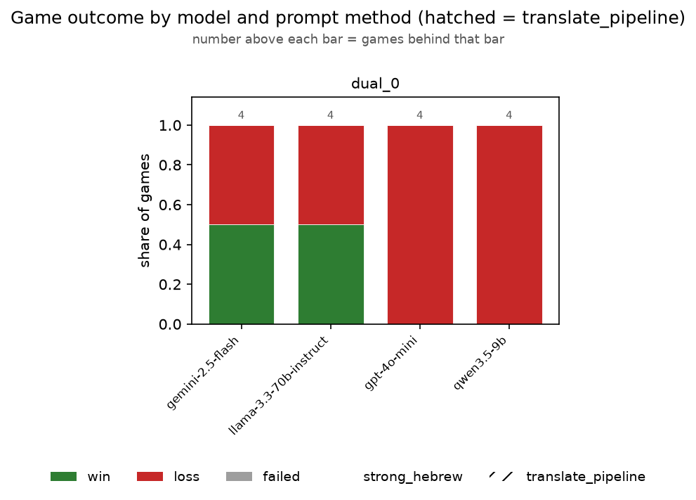
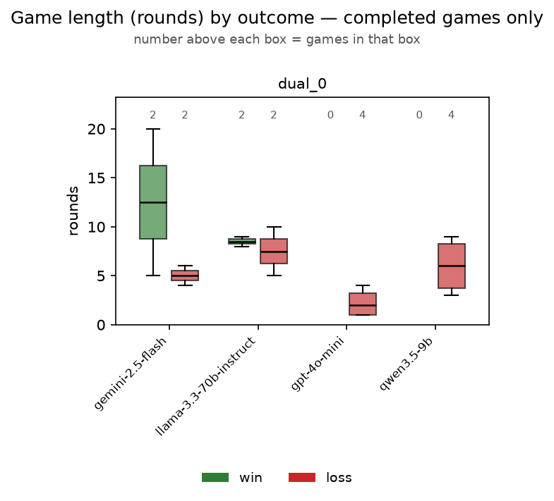
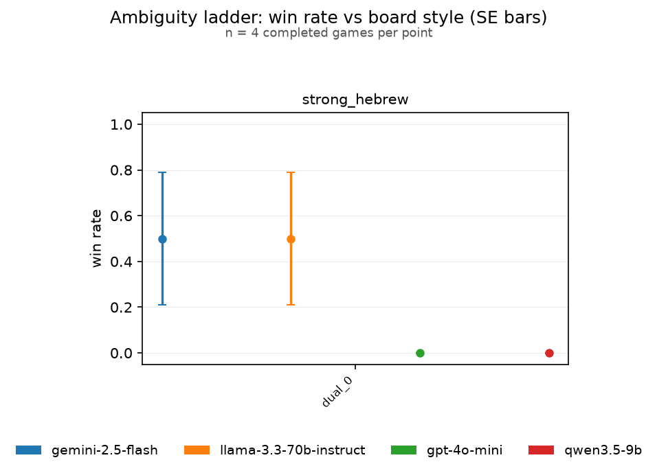
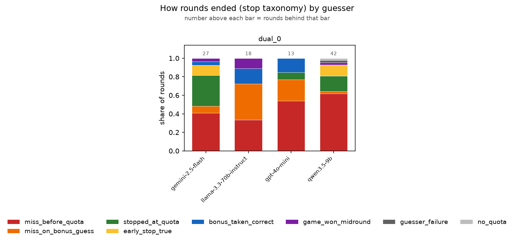
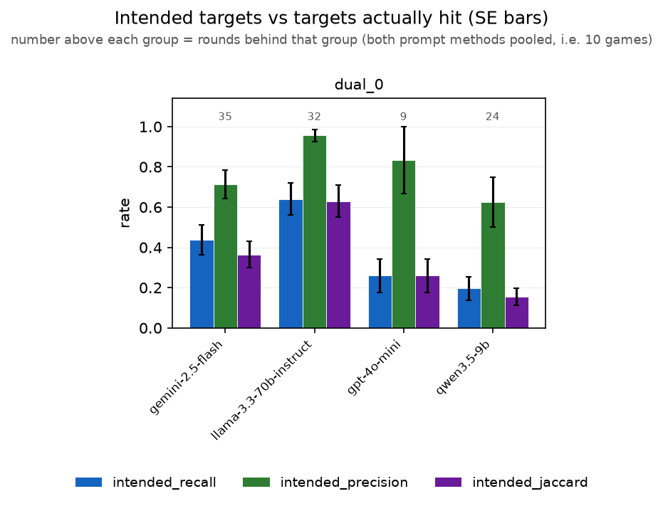
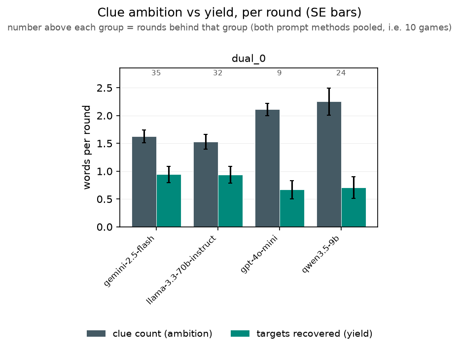
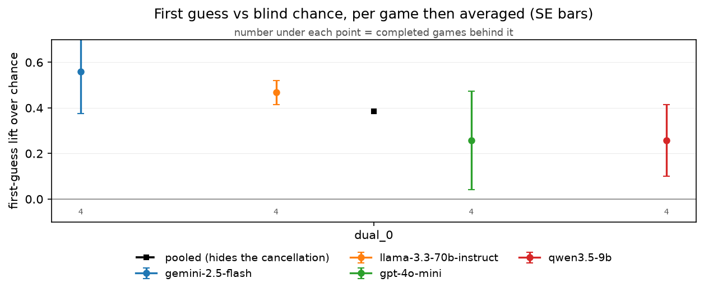
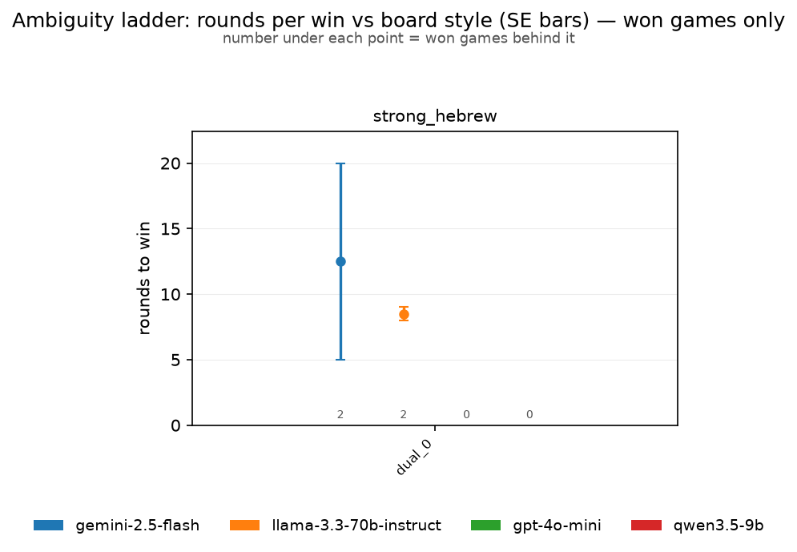
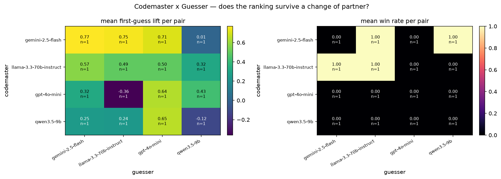

# Codenames-Hebrew results — 20260819T205157112122Z

- Games: **16** (16 completed, 0 not completed)
- Rounds: **100**
- Models: google/gemini-2.5-flash, meta-llama/llama-3.3-70b-instruct, openai/gpt-4o-mini, qwen/qwen3.5-9b
- Prompt methods: strong_hebrew
- Guesser: google/gemini-2.5-flash, meta-llama/llama-3.3-70b-instruct, openai/gpt-4o-mini, qwen/qwen3.5-9b
- Board styles: dual_0

### How to read these numbers

- Win/loss rates and game length cover **completed games only**. Games that ended because a model could not produce a legal clue are reported separately as a completion rate; scoring them as losses would confuse a formatting failure with a bad clue.
- Games end only by finding all 9 targets or by hitting the assassin, so `%loss` is close to `1 - %win`, and **game length is confounded with outcome** — a short game is an efficient win or an early death. Length is therefore also reported separately for wins and for losses.
- SE is `sd / sqrt(n)` at the natural unit (games for game metrics, rounds for round metrics). Proportions also carry a Wilson 95% interval, because at small n a Wald SE of 0 at p=0 or p=1 reads as false certainty.
- Round-level SEs treat rounds within a game as independent. They are not, so those SEs are optimistic.

### Stop taxonomy

The logged `turn_outcome` cannot answer the early-stop question: it records both *stopping short of* the codemaster's count and *stopping at* it after declining the bonus guess as `stopped_early`. Only the first is an early stop. Rounds are therefore reclassified as:

| class | meaning |
|---|---|
| `early_stop_true` | stopped before reaching the count — **the early stop** |
| `stopped_at_quota` | reached the count and declined the bonus guess (correct play) |
| `miss_before_quota` | guessed wrong before reaching the count |
| `miss_on_bonus_guess` | reached the count, took the bonus guess, got it wrong |
| `bonus_taken_correct` | reached the count, took the bonus guess, got it right |
| `game_won_midround` | round ended because the 9th target fell — not a choice |
| `guesser_failure` / `no_quota` | guesser exhausted retries / clue had count 0 |

Rates are computed over eligible rounds only. A guesser may not stop before its first correct guess, so an early stop is impossible when `count = 1`; including those rounds in the denominator would deflate the rate for reasons unrelated to the guesser's judgement.

## Game outcomes — by codemaster

`loss_rate` and `length_*` cover completed games; `completion_rate` is the share of games that played out at all. `win_rate` is `1 - loss_rate` by construction, so only the loss rate carries an SE and a Wilson interval (`loss_lo` / `loss_hi`).

| model                             | n_games | n_completed | completion_rate | win_rate | loss_rate | loss_se | loss_lo | loss_hi | length_mean | length_se | length_win_mean | length_win_se | n_win | length_loss_mean | length_loss_se | n_loss | targets_found_mean | targets_found_se | first_guess_lift_mean | first_guess_lift_se |
|-----------------------------------|---------|-------------|-----------------|----------|-----------|---------|---------|---------|-------------|-----------|-----------------|---------------|-------|------------------|----------------|--------|--------------------|------------------|-----------------------|---------------------|
| google/gemini-2.5-flash           | 4       | 4           | 1.000           | 0.500    | 0.500     | 0.289   | 0.150   | 0.850   | 8.750       | 3.772     | 12.500          | 7.500         | 2.000 | 5.000            | 1.000          | 2      | 8.250              | 0.479            | 0.560                 | 0.185               |
| meta-llama/llama-3.3-70b-instruct | 4       | 4           | 1.000           | 0.500    | 0.500     | 0.289   | 0.150   | 0.850   | 8.000       | 1.080     | 8.500           | 0.500         | 2.000 | 7.500            | 2.500          | 2      | 7.500              | 0.957            | 0.468                 | 0.053               |
| openai/gpt-4o-mini                | 4       | 4           | 1.000           | 0.000    | 1.000     | 0.000   | 0.510   | 1.000   | 2.250       | 0.750     | —               | —             | —     | 2.250            | 0.750          | 4      | 1.500              | 0.645            | 0.258                 | 0.216               |
| qwen/qwen3.5-9b                   | 4       | 4           | 1.000           | 0.000    | 1.000     | 0.000   | 0.510   | 1.000   | 6.000       | 1.472     | —               | —             | —     | 6.000            | 1.472          | 4      | 4.250              | 1.109            | 0.258                 | 0.157               |

## Game outcomes — by guesser

`loss_rate` and `length_*` cover completed games; `completion_rate` is the share of games that played out at all. `win_rate` is `1 - loss_rate` by construction, so only the loss rate carries an SE and a Wilson interval (`loss_lo` / `loss_hi`).

| guesser_model                     | n_games | n_completed | completion_rate | win_rate | loss_rate | loss_se | loss_lo | loss_hi | length_mean | length_se | length_win_mean | length_win_se | n_win | length_loss_mean | length_loss_se | n_loss | targets_found_mean | targets_found_se | first_guess_lift_mean | first_guess_lift_se |
|-----------------------------------|---------|-------------|-----------------|----------|-----------|---------|---------|---------|-------------|-----------|-----------------|---------------|-------|------------------|----------------|--------|--------------------|------------------|-----------------------|---------------------|
| google/gemini-2.5-flash           | 4       | 4           | 1.000           | 0.250    | 0.750     | 0.250   | 0.301   | 0.954   | 6.750       | 1.436     | 9.000           | —             | 1.000 | 6.000            | 1.732          | 3      | 6.500              | 1.555            | 0.479                 | 0.118               |
| meta-llama/llama-3.3-70b-instruct | 4       | 4           | 1.000           | 0.500    | 0.500     | 0.289   | 0.150   | 0.850   | 4.500       | 1.443     | 6.500           | 1.500         | 2.000 | 2.500            | 1.500          | 2      | 5.750              | 2.136            | 0.282                 | 0.238               |
| openai/gpt-4o-mini                | 4       | 4           | 1.000           | 0.000    | 1.000     | 0.000   | 0.510   | 1.000   | 3.250       | 0.854     | —               | —             | —     | 3.250            | 0.854          | 4      | 4.000              | 1.291            | 0.625                 | 0.046               |
| qwen/qwen3.5-9b                   | 4       | 4           | 1.000           | 0.250    | 0.750     | 0.250   | 0.301   | 0.954   | 10.500      | 3.403     | 20.000          | —             | 1.000 | 7.333            | 1.764          | 3      | 5.250              | 1.652            | 0.159                 | 0.128               |

## Game outcomes — by codemaster x guesser

`loss_rate` and `length_*` cover completed games; `completion_rate` is the share of games that played out at all. `win_rate` is `1 - loss_rate` by construction, so only the loss rate carries an SE and a Wilson interval (`loss_lo` / `loss_hi`).

| model                             | guesser_model                     | n_games | n_completed | completion_rate | win_rate | loss_rate | loss_se | loss_lo | loss_hi | length_mean | length_se | length_win_mean | length_win_se | n_win | length_loss_mean | length_loss_se | n_loss | targets_found_mean | targets_found_se | first_guess_lift_mean | first_guess_lift_se |
|-----------------------------------|-----------------------------------|---------|-------------|-----------------|----------|-----------|---------|---------|---------|-------------|-----------|-----------------|---------------|-------|------------------|----------------|--------|--------------------|------------------|-----------------------|---------------------|
| google/gemini-2.5-flash           | google/gemini-2.5-flash           | 1       | 1           | 1.000           | 0.000    | 1.000     | —       | 0.207   | 1.000   | 6.000       | —         | —               | —             | —     | 6.000            | —              | 1.000  | 8.000              | —                | 0.769                 | —                   |
| google/gemini-2.5-flash           | meta-llama/llama-3.3-70b-instruct | 1       | 1           | 1.000           | 1.000    | 0.000     | —       | 0.000   | 0.793   | 5.000       | —         | 5.000           | —             | 1.000 | —                | —              | —      | 9.000              | —                | 0.752                 | —                   |
| google/gemini-2.5-flash           | openai/gpt-4o-mini                | 1       | 1           | 1.000           | 0.000    | 1.000     | —       | 0.207   | 1.000   | 4.000       | —         | —               | —             | —     | 4.000            | —              | 1.000  | 7.000              | —                | 0.710                 | —                   |
| google/gemini-2.5-flash           | qwen/qwen3.5-9b                   | 1       | 1           | 1.000           | 1.000    | 0.000     | —       | 0.000   | 0.793   | 20.000      | —         | 20.000          | —             | 1.000 | —                | —              | —      | 9.000              | —                | 0.007                 | —                   |
| meta-llama/llama-3.3-70b-instruct | google/gemini-2.5-flash           | 1       | 1           | 1.000           | 1.000    | 0.000     | —       | 0.000   | 0.793   | 9.000       | —         | 9.000           | —             | 1.000 | —                | —              | —      | 9.000              | —                | 0.568                 | —                   |
| meta-llama/llama-3.3-70b-instruct | meta-llama/llama-3.3-70b-instruct | 1       | 1           | 1.000           | 1.000    | 0.000     | —       | 0.000   | 0.793   | 8.000       | —         | 8.000           | —             | 1.000 | —                | —              | —      | 9.000              | —                | 0.491                 | —                   |
| meta-llama/llama-3.3-70b-instruct | openai/gpt-4o-mini                | 1       | 1           | 1.000           | 0.000    | 1.000     | —       | 0.207   | 1.000   | 5.000       | —         | —               | —             | —     | 5.000            | —              | 1.000  | 5.000              | —                | 0.495                 | —                   |
| meta-llama/llama-3.3-70b-instruct | qwen/qwen3.5-9b                   | 1       | 1           | 1.000           | 0.000    | 1.000     | —       | 0.207   | 1.000   | 10.000      | —         | —               | —             | —     | 10.000           | —              | 1.000  | 7.000              | —                | 0.318                 | —                   |
| openai/gpt-4o-mini                | google/gemini-2.5-flash           | 1       | 1           | 1.000           | 0.000    | 1.000     | —       | 0.207   | 1.000   | 3.000       | —         | —               | —             | —     | 3.000            | —              | 1.000  | 2.000              | —                | 0.325                 | —                   |
| openai/gpt-4o-mini                | meta-llama/llama-3.3-70b-instruct | 1       | 1           | 1.000           | 0.000    | 1.000     | —       | 0.207   | 1.000   | 1.000       | —         | —               | —             | —     | 1.000            | —              | 1.000  | 0.000              | —                | -0.360                | —                   |
| openai/gpt-4o-mini                | openai/gpt-4o-mini                | 1       | 1           | 1.000           | 0.000    | 1.000     | —       | 0.207   | 1.000   | 1.000       | —         | —               | —             | —     | 1.000            | —              | 1.000  | 1.000              | —                | 0.640                 | —                   |
| openai/gpt-4o-mini                | qwen/qwen3.5-9b                   | 1       | 1           | 1.000           | 0.000    | 1.000     | —       | 0.207   | 1.000   | 4.000       | —         | —               | —             | —     | 4.000            | —              | 1.000  | 3.000              | —                | 0.426                 | —                   |
| qwen/qwen3.5-9b                   | google/gemini-2.5-flash           | 1       | 1           | 1.000           | 0.000    | 1.000     | —       | 0.207   | 1.000   | 9.000       | —         | —               | —             | —     | 9.000            | —              | 1.000  | 7.000              | —                | 0.254                 | —                   |
| qwen/qwen3.5-9b                   | meta-llama/llama-3.3-70b-instruct | 1       | 1           | 1.000           | 0.000    | 1.000     | —       | 0.207   | 1.000   | 4.000       | —         | —               | —             | —     | 4.000            | —              | 1.000  | 5.000              | —                | 0.242                 | —                   |
| qwen/qwen3.5-9b                   | openai/gpt-4o-mini                | 1       | 1           | 1.000           | 0.000    | 1.000     | —       | 0.207   | 1.000   | 3.000       | —         | —               | —             | —     | 3.000            | —              | 1.000  | 3.000              | —                | 0.653                 | —                   |
| qwen/qwen3.5-9b                   | qwen/qwen3.5-9b                   | 1       | 1           | 1.000           | 0.000    | 1.000     | —       | 0.207   | 1.000   | 8.000       | —         | —               | —             | —     | 8.000            | —              | 1.000  | 2.000              | —                | -0.117                | —                   |

## Round metrics — by codemaster

`ambition` = words the codemaster commits one clue to (`count`); `yield` = targets that clue actually bought; `yield_ratio` = yield / ambition. `intended_*` compare the words aimed at with the words hit; `n_lucky_mean` counts targets found that were *not* aimed at. `early_stop_rate` and `bonus_take_rate` are over their eligible rounds only — `n_*_eligible` gives those denominators.

| model                             | n_rounds | first_guess_hit_mean | first_guess_baseline_mean | first_guess_lift_mean | first_guess_lift_se | ambition_mean | ambition_se | yield_mean | yield_se | yield_ratio_mean | yield_ratio_se | intended_recall_mean | intended_recall_se | intended_precision_mean | intended_precision_se | intended_jaccard_mean | intended_jaccard_se | n_lucky_mean | early_stop_rate | early_stop_se | n_early_stop_eligible | bonus_take_rate | bonus_take_se | n_bonus_eligible |
|-----------------------------------|----------|----------------------|---------------------------|-----------------------|---------------------|---------------|-------------|------------|----------|------------------|----------------|----------------------|--------------------|-------------------------|-----------------------|-----------------------|---------------------|--------------|-----------------|---------------|-----------------------|-----------------|---------------|------------------|
| google/gemini-2.5-flash           | 35       | 0.647                | 0.314                     | 0.334                 | 0.089               | 1.629         | 0.117       | 0.943      | 0.147    | 0.662            | 0.106          | 0.438                | 0.074              | 0.712                   | 0.070                 | 0.364                 | 0.066               | 0.314        | 0.200           | 0.133         | 10                    | 0.533           | 0.133         | 15               |
| meta-llama/llama-3.3-70b-instruct | 32       | 0.719                | 0.259                     | 0.459                 | 0.083               | 1.531         | 0.135       | 0.938      | 0.148    | 0.672            | 0.081          | 0.641                | 0.079              | 0.957                   | 0.030                 | 0.630                 | 0.080               | 0.094        | 0.286           | 0.184         | 7                     | 0.471           | 0.125         | 17               |
| openai/gpt-4o-mini                | 9        | 0.667                | 0.338                     | 0.329                 | 0.163               | 2.111         | 0.111       | 0.667      | 0.167    | 0.315            | 0.081          | 0.259                | 0.084              | 0.833                   | 0.167                 | 0.259                 | 0.084               | 0.111        | 0.500           | 0.224         | 6                     | —               | —             | 0                |
| qwen/qwen3.5-9b                   | 24       | 0.500                | 0.322                     | 0.178                 | 0.104               | 2.250         | 0.243       | 0.708      | 0.195    | 0.344            | 0.109          | 0.196                | 0.059              | 0.625                   | 0.125                 | 0.155                 | 0.042               | 0.292        | 0.111           | 0.111         | 9                     | 0.750           | 0.250         | 4                |

## Round metrics — by guesser

`ambition` = words the codemaster commits one clue to (`count`); `yield` = targets that clue actually bought; `yield_ratio` = yield / ambition. `intended_*` compare the words aimed at with the words hit; `n_lucky_mean` counts targets found that were *not* aimed at. `early_stop_rate` and `bonus_take_rate` are over their eligible rounds only — `n_*_eligible` gives those denominators.

| guesser_model                     | n_rounds | first_guess_hit_mean | first_guess_baseline_mean | first_guess_lift_mean | first_guess_lift_se | ambition_mean | ambition_se | yield_mean | yield_se | yield_ratio_mean | yield_ratio_se | intended_recall_mean | intended_recall_se | intended_precision_mean | intended_precision_se | intended_jaccard_mean | intended_jaccard_se | n_lucky_mean | early_stop_rate | early_stop_se | n_early_stop_eligible | bonus_take_rate | bonus_take_se | n_bonus_eligible |
|-----------------------------------|----------|----------------------|---------------------------|-----------------------|---------------------|---------------|-------------|------------|----------|------------------|----------------|----------------------|--------------------|-------------------------|-----------------------|-----------------------|---------------------|--------------|-----------------|---------------|-----------------------|-----------------|---------------|------------------|
| google/gemini-2.5-flash           | 27       | 0.741                | 0.260                     | 0.481                 | 0.089               | 1.741         | 0.156       | 0.963      | 0.136    | 0.642            | 0.097          | 0.537                | 0.083              | 0.850                   | 0.064                 | 0.503                 | 0.082               | 0.185        | 0.300           | 0.153         | 10                    | 0.250           | 0.131         | 12               |
| meta-llama/llama-3.3-70b-instruct | 18       | 0.722                | 0.261                     | 0.461                 | 0.117               | 1.778         | 0.222       | 1.278      | 0.289    | 0.843            | 0.152          | 0.602                | 0.101              | 0.769                   | 0.072                 | 0.498                 | 0.096               | 0.444        | 0.000           | 0.000         | 5                     | 1.000           | 0.000         | 10               |
| openai/gpt-4o-mini                | 13       | 0.923                | 0.314                     | 0.609                 | 0.072               | 2.000         | 0.277       | 1.231      | 0.201    | 0.750            | 0.157          | 0.538                | 0.115              | 0.764                   | 0.113                 | 0.474                 | 0.101               | 0.308        | 0.000           | 0.000         | 8                     | 0.833           | 0.167         | 6                |
| qwen/qwen3.5-9b                   | 42       | 0.439                | 0.339                     | 0.100                 | 0.079               | 1.762         | 0.136       | 0.500      | 0.098    | 0.321            | 0.065          | 0.252                | 0.058              | 0.778                   | 0.092                 | 0.246                 | 0.058               | 0.119        | 0.556           | 0.176         | 9                     | 0.125           | 0.125         | 8                |

## Round metrics — by codemaster x guesser

`ambition` = words the codemaster commits one clue to (`count`); `yield` = targets that clue actually bought; `yield_ratio` = yield / ambition. `intended_*` compare the words aimed at with the words hit; `n_lucky_mean` counts targets found that were *not* aimed at. `early_stop_rate` and `bonus_take_rate` are over their eligible rounds only — `n_*_eligible` gives those denominators.

| model                             | guesser_model                     | n_rounds | first_guess_hit_mean | first_guess_baseline_mean | first_guess_lift_mean | first_guess_lift_se | ambition_mean | ambition_se | yield_mean | yield_se | yield_ratio_mean | yield_ratio_se | intended_recall_mean | intended_recall_se | intended_precision_mean | intended_precision_se | intended_jaccard_mean | intended_jaccard_se | n_lucky_mean | early_stop_rate | early_stop_se | n_early_stop_eligible | bonus_take_rate | bonus_take_se | n_bonus_eligible |
|-----------------------------------|-----------------------------------|----------|----------------------|---------------------------|-----------------------|---------------------|---------------|-------------|------------|----------|------------------|----------------|----------------------|--------------------|-------------------------|-----------------------|-----------------------|---------------------|--------------|-----------------|---------------|-----------------------|-----------------|---------------|------------------|
| google/gemini-2.5-flash           | google/gemini-2.5-flash           | 6        | 1.000                | 0.231                     | 0.769                 | 0.037               | 1.500         | 0.342       | 1.333      | 0.211    | 0.944            | 0.056          | 0.806                | 0.125              | 0.833                   | 0.105                 | 0.764                 | 0.150               | 0.333        | 0.500           | 0.500         | 2                     | 0.400           | 0.245         | 5                |
| google/gemini-2.5-flash           | meta-llama/llama-3.3-70b-instruct | 5        | 1.000                | 0.248                     | 0.752                 | 0.042               | 1.400         | 0.245       | 1.800      | 0.200    | 1.400            | 0.245          | 0.800                | 0.122              | 0.600                   | 0.100                 | 0.533                 | 0.122               | 0.800        | 0.000           | 0.000         | 2                     | 1.000           | 0.000         | 4                |
| google/gemini-2.5-flash           | openai/gpt-4o-mini                | 4        | 1.000                | 0.290                     | 0.710                 | 0.044               | 2.000         | 0.408       | 1.750      | 0.479    | 1.083            | 0.400          | 0.708                | 0.172              | 0.792                   | 0.125                 | 0.500                 | 0.068               | 0.500        | 0.000           | 0.000         | 3                     | 1.000           | 0.000         | 2                |
| google/gemini-2.5-flash           | qwen/qwen3.5-9b                   | 20       | 0.368                | 0.360                     | 0.007                 | 0.111               | 1.650         | 0.150       | 0.450      | 0.153    | 0.308            | 0.100          | 0.183                | 0.077              | 0.643                   | 0.180                 | 0.175                 | 0.076               | 0.150        | 0.333           | 0.333         | 3                     | 0.000           | 0.000         | 4                |
| meta-llama/llama-3.3-70b-instruct | google/gemini-2.5-flash           | 9        | 0.778                | 0.210                     | 0.568                 | 0.147               | 1.444         | 0.242       | 1.000      | 0.236    | 0.741            | 0.145          | 0.741                | 0.145              | 1.000                   | 0.000                 | 0.741                 | 0.145               | 0.000        | 0.500           | 0.500         | 2                     | 0.000           | 0.000         | 5                |
| meta-llama/llama-3.3-70b-instruct | meta-llama/llama-3.3-70b-instruct | 8        | 0.750                | 0.259                     | 0.491                 | 0.190               | 1.625         | 0.324       | 1.125      | 0.441    | 0.792            | 0.177          | 0.708                | 0.160              | 0.917                   | 0.083                 | 0.675                 | 0.164               | 0.250        | 0.000           | —             | 1                     | 1.000           | 0.000         | 5                |
| meta-llama/llama-3.3-70b-instruct | openai/gpt-4o-mini                | 5        | 0.800                | 0.305                     | 0.495                 | 0.183               | 1.600         | 0.400       | 1.000      | 0.316    | 0.667            | 0.211          | 0.667                | 0.211              | 1.000                   | 0.000                 | 0.667                 | 0.211               | 0.000        | 0.000           | 0.000         | 2                     | 0.667           | 0.333         | 3                |
| meta-llama/llama-3.3-70b-instruct | qwen/qwen3.5-9b                   | 10       | 0.600                | 0.282                     | 0.318                 | 0.161               | 1.500         | 0.224       | 0.700      | 0.213    | 0.517            | 0.150          | 0.483                | 0.150              | 0.917                   | 0.083                 | 0.475                 | 0.151               | 0.100        | 0.500           | 0.500         | 2                     | 0.250           | 0.250         | 4                |
| openai/gpt-4o-mini                | google/gemini-2.5-flash           | 3        | 0.667                | 0.342                     | 0.325                 | 0.321               | 2.000         | 0.000       | 0.667      | 0.333    | 0.333            | 0.167          | 0.167                | 0.167              | 0.500                   | 0.500                 | 0.167                 | 0.167               | 0.333        | 0.500           | 0.500         | 2                     | —               | —             | 0                |
| openai/gpt-4o-mini                | meta-llama/llama-3.3-70b-instruct | 1        | 0.000                | 0.360                     | -0.360                | —                   | 2.000         | —           | 0.000      | —        | 0.000            | —              | 0.000                | —                  | —                       | —                     | 0.000                 | —                   | 0.000        | —               | —             | 0                     | —               | —             | 0                |
| openai/gpt-4o-mini                | openai/gpt-4o-mini                | 1        | 1.000                | 0.360                     | 0.640                 | —                   | 2.000         | —           | 1.000      | —        | 0.500            | —              | 0.500                | —                  | 1.000                   | —                     | 0.500                 | —                   | 0.000        | 0.000           | —             | 1                     | —               | —             | 0                |
| openai/gpt-4o-mini                | qwen/qwen3.5-9b                   | 4        | 0.750                | 0.324                     | 0.426                 | 0.237               | 2.250         | 0.250       | 0.750      | 0.250    | 0.333            | 0.118          | 0.333                | 0.118              | 1.000                   | 0.000                 | 0.333                 | 0.118               | 0.000        | 0.667           | 0.333         | 3                     | —               | —             | 0                |
| qwen/qwen3.5-9b                   | google/gemini-2.5-flash           | 9        | 0.556                | 0.302                     | 0.254                 | 0.174               | 2.111         | 0.309       | 0.778      | 0.278    | 0.444            | 0.222          | 0.278                | 0.111              | 0.800                   | 0.122                 | 0.204                 | 0.067               | 0.222        | 0.000           | 0.000         | 4                     | 0.500           | 0.500         | 2                |
| qwen/qwen3.5-9b                   | meta-llama/llama-3.3-70b-instruct | 4        | 0.500                | 0.258                     | 0.242                 | 0.266               | 2.500         | 0.645       | 1.250      | 0.946    | 0.458            | 0.315          | 0.292                | 0.172              | 0.750                   | 0.250                 | 0.225                 | 0.131               | 0.500        | 0.000           | 0.000         | 2                     | 1.000           | —             | 1                |
| qwen/qwen3.5-9b                   | openai/gpt-4o-mini                | 3        | 1.000                | 0.347                     | 0.653                 | 0.008               | 2.667         | 0.882       | 1.000      | 0.000    | 0.528            | 0.237          | 0.111                | 0.111              | 0.333                   | 0.333                 | 0.111                 | 0.111               | 0.667        | 0.000           | 0.000         | 2                     | 1.000           | —             | 1                |
| qwen/qwen3.5-9b                   | qwen/qwen3.5-9b                   | 8        | 0.250                | 0.367                     | -0.117                | 0.161               | 2.125         | 0.515       | 0.250      | 0.164    | 0.071            | 0.071          | 0.071                | 0.071              | 0.500                   | 0.500                 | 0.071                 | 0.071               | 0.125        | 1.000           | —             | 1                     | —               | —             | 0                |

## Stop behaviour — counts and shares

Grouped by *guesser*: stopping early, taking the bonus guess and missing before quota are all decisions the guesser makes, so grouping them by codemaster attributes them to the wrong player.

| guesser_model                     | board_style | n_rounds | miss_before_quota | miss_on_bonus_guess | stopped_at_quota | early_stop_true | bonus_taken_correct | game_won_midround | guesser_failure | no_quota | miss_before_quota_share | miss_on_bonus_guess_share | stopped_at_quota_share | early_stop_true_share | bonus_taken_correct_share | game_won_midround_share | guesser_failure_share | no_quota_share |
|-----------------------------------|-------------|----------|-------------------|---------------------|------------------|-----------------|---------------------|-------------------|-----------------|----------|-------------------------|---------------------------|------------------------|-----------------------|---------------------------|-------------------------|-----------------------|----------------|
| google/gemini-2.5-flash           | dual_0      | 27       | 11                | 2                   | 9                | 3               | 1                   | 1                 | 0               | 0        | 0.407                   | 0.074                     | 0.333                  | 0.111                 | 0.037                     | 0.037                   | 0.000                 | 0.000          |
| meta-llama/llama-3.3-70b-instruct | dual_0      | 18       | 6                 | 7                   | 0                | 0               | 3                   | 2                 | 0               | 0        | 0.333                   | 0.389                     | 0.000                  | 0.000                 | 0.167                     | 0.111                   | 0.000                 | 0.000          |
| openai/gpt-4o-mini                | dual_0      | 13       | 7                 | 3                   | 1                | 0               | 2                   | 0                 | 0               | 0        | 0.538                   | 0.231                     | 0.077                  | 0.000                 | 0.154                     | 0.000                   | 0.000                 | 0.000          |
| qwen/qwen3.5-9b                   | dual_0      | 42       | 26                | 1                   | 7                | 5               | 0                   | 1                 | 1               | 1        | 0.619                   | 0.024                     | 0.167                  | 0.119                 | 0.000                     | 0.024                   | 0.024                 | 0.024          |

## Codemaster compliance and retries

Per-*call* compliance. A model that only produces a legal clue after several corrective retries is less reliable than one that gets it right first time, even at an equal win rate.

| model                             | n_games | codemaster_compliance_rate_mean | codemaster_compliance_rate_se | codemaster_call_failures_mean | total_api_calls_mean | duration_s_mean | duration_s_se | rejection_reasons                                                                  |
|-----------------------------------|---------|---------------------------------|-------------------------------|-------------------------------|----------------------|-----------------|---------------|------------------------------------------------------------------------------------|
| google/gemini-2.5-flash           | 4       | 1.000                           | 0.000                         | 0.000                         | 27.750               | 122.668         | 53.607        | guess_not_available: 14                                                            |
| meta-llama/llama-3.3-70b-instruct | 4       | 1.000                           | 0.000                         | 0.000                         | 23.500               | 130.083         | 19.531        | guess_not_available: 3                                                             |
| openai/gpt-4o-mini                | 4       | 0.850                           | 0.096                         | 0.000                         | 6.750                | 29.368          | 11.500        | targets_not_on_board: 2, clue_on_board: 1                                          |
| qwen/qwen3.5-9b                   | 4       | 0.589                           | 0.139                         | 0.000                         | 23.500               | 153.663         | 50.531        | targets_not_on_board: 12, json_parse: 10, guess_not_available: 5, clue_on_board: 4 |

## Guesser compliance and retries

Grouped by guesser, which is one row when the guesser is fixed. Compliance is a property of the model doing the calling, so grouping the guesser's by *codemaster* would average over whichever guessers that codemaster happened to be paired with.

| guesser_model                     | n_games | guesser_compliance_rate_mean | guesser_compliance_rate_se | total_api_calls_mean | duration_s_mean | duration_s_se | rejection_reasons                                                                 |
|-----------------------------------|---------|------------------------------|----------------------------|----------------------|-----------------|---------------|-----------------------------------------------------------------------------------|
| google/gemini-2.5-flash           | 4       | 1.000                        | 0.000                      | 22.500               | 114.549         | 40.922        | targets_not_on_board: 7, clue_on_board: 3, json_parse: 2                          |
| meta-llama/llama-3.3-70b-instruct | 4       | 0.984                        | 0.016                      | 13.750               | 74.541          | 28.854        | guess_not_available: 1                                                            |
| openai/gpt-4o-mini                | 4       | 1.000                        | 0.000                      | 10.750               | 54.966          | 15.391        | json_parse: 2, targets_not_on_board: 1                                            |
| qwen/qwen3.5-9b                   | 4       | 0.805                        | 0.085                      | 34.500               | 191.725         | 50.253        | guess_not_available: 21, json_parse: 6, targets_not_on_board: 6, clue_on_board: 2 |

## Does ambiguity actually bite?

`observed` = share of first misses landing on a dual-list word; `expected` = that board's own dual fraction. `lift` near 1 means ambiguous words are missed at exactly their base rate, i.e. lexical ambiguity is not the mechanism driving errors.

| board_style | guesser_model                     | n_misses | observed | observed_lo | observed_hi | expected | lift |
|-------------|-----------------------------------|----------|----------|-------------|-------------|----------|------|
| dual_0      | google/gemini-2.5-flash           | 13       | 0.000    | 0.000       | 0.228       | 0.000    | —    |
| dual_0      | meta-llama/llama-3.3-70b-instruct | 13       | 0.000    | 0.000       | 0.228       | 0.000    | —    |
| dual_0      | openai/gpt-4o-mini                | 10       | 0.000    | 0.000       | 0.278       | 0.000    | —    |
| dual_0      | qwen/qwen3.5-9b                   | 27       | 0.000    | 0.000       | 0.125       | 0.000    | —    |

## How large should the next run be? — per design cell

Projected from this run's own within-cell variance. `games_per_cell` = `n_boards x n_trials` for each (model, method, board_style) cell. `*_ci_halfwidth` is the 95% interval half-width; `mdd_*` is the smallest cell-to-cell difference detectable at alpha=0.05 with 80% power; `api_calls_total` prices the whole run. This is the **most pessimistic** view — a cell holds model, method and board style all fixed, so it is answering 'can I compare two single cells?', which is rarely the question.

| games_per_cell | n_cells | games_total | win_rate_ci_halfwidth | mdd_win_rate | first_guess_lift_ci_halfwidth | mdd_first_guess_lift | game_length_ci_halfwidth | mdd_game_length | api_calls_total |
|----------------|---------|-------------|-----------------------|--------------|-------------------------------|----------------------|--------------------------|-----------------|-----------------|
| 5              | 16      | 80          | —                     | —            | —                             | —                    | —                        | —               | 1630.000        |
| 10             | 16      | 160         | —                     | —            | —                             | —                    | —                        | —               | 3260.000        |
| 20             | 16      | 320         | —                     | —            | —                             | —                    | —                        | —               | 6520.000        |
| 40             | 16      | 640         | —                     | —            | —                             | —                    | —                        | —               | 13040.000       |

## How large should the next run be? — per comparison

The same projection for the comparisons actually of interest, each of which collapses over the other two factors and so pools far more games per arm. Size the run from this table: pick the comparison that has to come out conclusive, find the smallest `games_per_cell` whose `mdd_*` is below the effect you care about, then read the cost off the per-cell table above.

**Which outcome variable you size against changes the answer by a large factor.** `mdd_win_rate` and `mdd_first_guess_lift` are both reported because first-guess lift separates the models far more sharply than win rate does, so a run sized to resolve win rate is several times larger than one sized to resolve lift. Compare each `mdd_*` against the observed spread in that same metric from the tables above, not across metrics.

| comparison                                   | levels | games_per_cell | games_per_arm | mdd_win_rate | mdd_first_guess_lift | mdd_game_length |
|----------------------------------------------|--------|----------------|---------------|--------------|----------------------|-----------------|
| model (collapsing the other factors)         | 4      | 5              | 20.000        | —            | —                    | —               |
| model (collapsing the other factors)         | 4      | 10             | 40.000        | —            | —                    | —               |
| model (collapsing the other factors)         | 4      | 20             | 80.000        | —            | —                    | —               |
| model (collapsing the other factors)         | 4      | 40             | 160.000       | —            | —                    | —               |
| guesser_model (collapsing the other factors) | 4      | 5              | 20.000        | —            | —                    | —               |
| guesser_model (collapsing the other factors) | 4      | 10             | 40.000        | —            | —                    | —               |
| guesser_model (collapsing the other factors) | 4      | 20             | 80.000        | —            | —                    | —               |
| guesser_model (collapsing the other factors) | 4      | 40             | 160.000       | —            | —                    | —               |
| model x guesser_model (per cell)             | 16     | 5              | 5.000         | —            | —                    | —               |
| model x guesser_model (per cell)             | 16     | 10             | 10.000        | —            | —                    | —               |
| model x guesser_model (per cell)             | 16     | 20             | 20.000        | —            | —                    | —               |
| model x guesser_model (per cell)             | 16     | 40             | 40.000        | —            | —                    | —               |

## Figures

### outcome composition

### game length

### ambiguity ladder

### stop behaviour

### intended overlap

### ambition vs yield

### first guess lift

### win length ladder

### pair matrix

