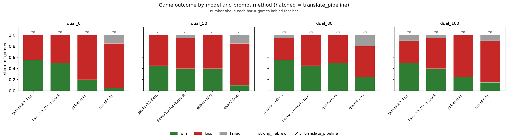
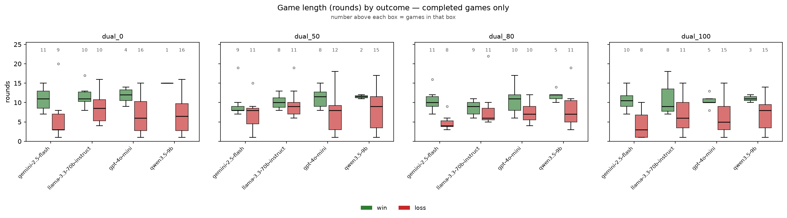
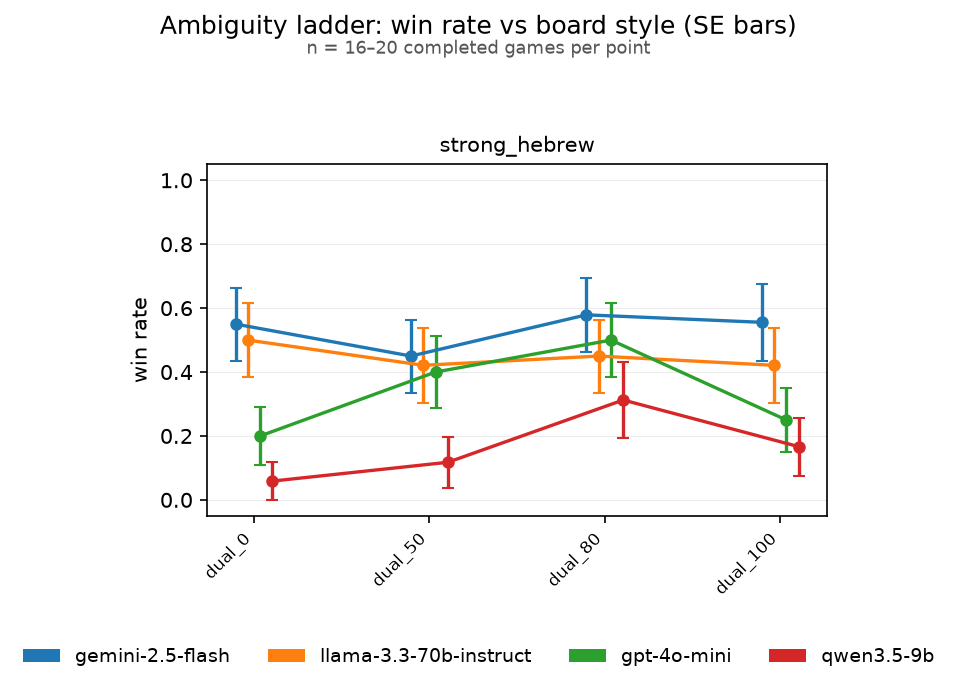
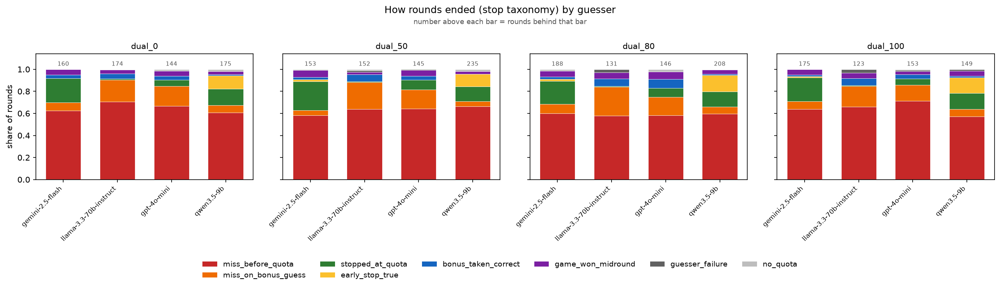
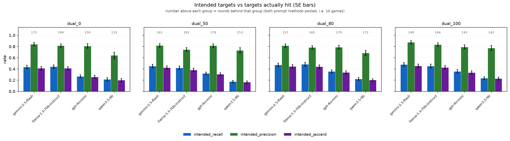
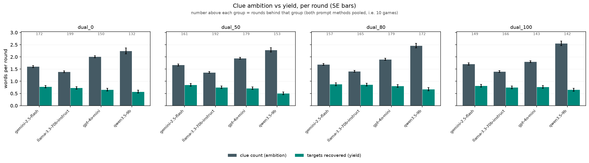
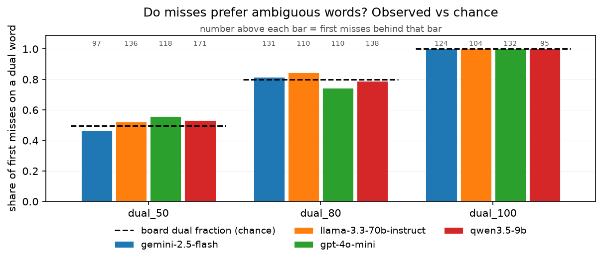
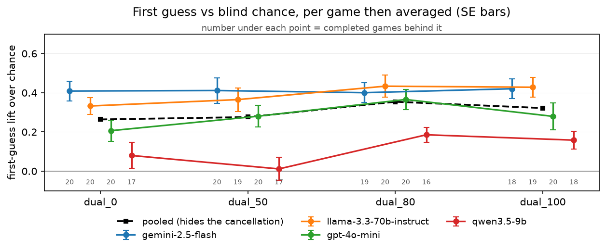
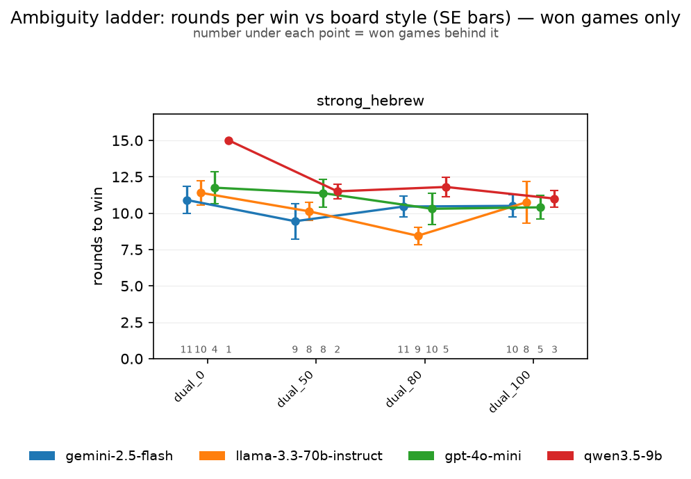
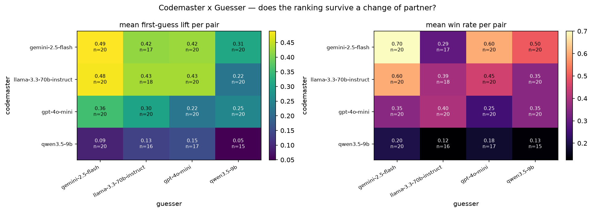

# Codenames-Hebrew results — 20260819T225358145380Z

- Games: **320** (303 completed, 17 not completed)
- Rounds: **2611**
- Models: google/gemini-2.5-flash, meta-llama/llama-3.3-70b-instruct, openai/gpt-4o-mini, qwen/qwen3.5-9b
- Prompt methods: strong_hebrew
- Guesser: google/gemini-2.5-flash, meta-llama/llama-3.3-70b-instruct, openai/gpt-4o-mini, qwen/qwen3.5-9b
- Board styles: dual_0, dual_50, dual_80, dual_100

### How to read these numbers

- Win/loss rates and game length cover **completed games only**. Games that ended because a model could not produce a legal clue are reported separately as a completion rate; scoring them as losses would confuse a formatting failure with a bad clue.
- Games end by finding all 9 targets (win), by hitting the assassin, or by revealing all 8 opponent words — the opposing team then has all of its own and wins. `assassin_share_of_losses` splits the two loss kinds; its denominator is the losses in that group, not the games.
- `%loss` is close to `1 - %win`, and **game length is confounded with outcome** — a short game is an efficient win or an early death. Length is therefore also reported separately for wins and for losses, and `targets_per_round` carries the same confound.
- Games from runs played before 2026-08-22 are re-scored against the opponent-words rule from their own logs, and the rounds that could not have been played under it are dropped. Those games are flagged `rescored`; the players were never told the rule, so their play is unaffected by it.
- SE is `sd / sqrt(n)` at the natural unit (games for game metrics, rounds for round metrics). Proportions also carry a Wilson 95% interval, because at small n a Wald SE of 0 at p=0 or p=1 reads as false certainty.
- Round-level SEs treat rounds within a game as independent. They are not, so those SEs are optimistic.

### Stop taxonomy

The logged `turn_outcome` cannot answer the early-stop question: it records both *stopping short of* the codemaster's count and *stopping at* it after declining the bonus guess as `stopped_early`. Only the first is an early stop. Rounds are therefore reclassified as:

| class | meaning |
|---|---|
| `early_stop_true` | stopped before reaching the count — **the early stop** |
| `stopped_at_quota` | reached the count and declined the bonus guess (correct play) |
| `miss_before_quota` | guessed wrong before reaching the count |
| `miss_on_bonus_guess` | reached the count, took the bonus guess, got it wrong |
| `bonus_taken_correct` | reached the count, took the bonus guess, got it right |
| `game_won_midround` | round ended because the 9th target fell — not a choice |
| `guesser_failure` / `no_quota` | guesser exhausted retries / clue had count 0 |

Rates are computed over eligible rounds only. A guesser may not stop before its first correct guess, so an early stop is impossible when `count = 1`; including those rounds in the denominator would deflate the rate for reasons unrelated to the guesser's judgement.

## Game outcomes — by codemaster

`loss_rate` and `length_*` cover completed games; `completion_rate` is the share of games that played out at all. `win_rate` is `1 - loss_rate` by construction, so only the loss rate carries an SE and a Wilson interval (`loss_lo` / `loss_hi`).

| model                             | n_games | n_completed | completion_rate | win_rate | loss_rate | loss_se | loss_lo | loss_hi | length_mean | length_se | length_win_mean | length_win_se | n_win | length_loss_mean | length_loss_se | n_loss | assassin_share_of_losses | targets_found_mean | targets_found_se | targets_per_round_mean | targets_per_round_se | first_guess_lift_mean | first_guess_lift_se |
|-----------------------------------|---------|-------------|-----------------|----------|-----------|---------|---------|---------|-------------|-----------|-----------------|---------------|-------|------------------|----------------|--------|--------------------------|--------------------|------------------|------------------------|----------------------|-----------------------|---------------------|
| google/gemini-2.5-flash           | 80      | 77          | 0.963           | 0.532    | 0.468     | 0.057   | 0.360   | 0.578   | 8.117       | 0.480     | 10.366          | 0.443         | 41    | 5.556            | 0.679          | 36     | 1.000                    | 6.740              | 0.341            | 0.890                  | 0.037                | 0.410                 | 0.027               |
| meta-llama/llama-3.3-70b-instruct | 80      | 78          | 0.975           | 0.449    | 0.551     | 0.057   | 0.441   | 0.657   | 9.090       | 0.426     | 10.200          | 0.479         | 35    | 8.186            | 0.639          | 43     | 1.000                    | 7.013              | 0.270            | 0.828                  | 0.033                | 0.390                 | 0.026               |
| openai/gpt-4o-mini                | 80      | 80          | 1.000           | 0.338    | 0.662     | 0.053   | 0.554   | 0.757   | 8.137       | 0.463     | 10.852          | 0.522         | 27    | 6.755            | 0.559          | 53     | 1.000                    | 6.000              | 0.335            | 0.748                  | 0.038                | 0.283                 | 0.029               |
| qwen/qwen3.5-9b                   | 80      | 68          | 0.850           | 0.162    | 0.838     | 0.045   | 0.733   | 0.907   | 8.206       | 0.551     | 11.818          | 0.464         | 11    | 7.509            | 0.610          | 57     | 0.947                    | 4.897              | 0.351            | 0.574                  | 0.033                | 0.108                 | 0.027               |

## Game outcomes — by guesser

`loss_rate` and `length_*` cover completed games; `completion_rate` is the share of games that played out at all. `win_rate` is `1 - loss_rate` by construction, so only the loss rate carries an SE and a Wilson interval (`loss_lo` / `loss_hi`).

| guesser_model                     | n_games | n_completed | completion_rate | win_rate | loss_rate | loss_se | loss_lo | loss_hi | length_mean | length_se | length_win_mean | length_win_se | n_win | length_loss_mean | length_loss_se | n_loss | assassin_share_of_losses | targets_found_mean | targets_found_se | targets_per_round_mean | targets_per_round_se | first_guess_lift_mean | first_guess_lift_se |
|-----------------------------------|---------|-------------|-----------------|----------|-----------|---------|---------|---------|-------------|-----------|-----------------|---------------|-------|------------------|----------------|--------|--------------------------|--------------------|------------------|------------------------|----------------------|-----------------------|---------------------|
| google/gemini-2.5-flash           | 80      | 80          | 1.000           | 0.463    | 0.537     | 0.056   | 0.429   | 0.643   | 8.450       | 0.347     | 9.730           | 0.304         | 37    | 7.349            | 0.540          | 43     | 0.977                    | 6.800              | 0.295            | 0.820                  | 0.033                | 0.355                 | 0.029               |
| meta-llama/llama-3.3-70b-instruct | 80      | 71          | 0.887           | 0.310    | 0.690     | 0.055   | 0.575   | 0.786   | 7.634       | 0.447     | 10.136          | 0.618         | 22    | 6.510            | 0.512          | 49     | 1.000                    | 6.127              | 0.339            | 0.832                  | 0.043                | 0.325                 | 0.032               |
| openai/gpt-4o-mini                | 80      | 77          | 0.963           | 0.377    | 0.623     | 0.056   | 0.512   | 0.723   | 7.558       | 0.423     | 10.034          | 0.392         | 29    | 6.062            | 0.532          | 48     | 0.979                    | 5.922              | 0.355            | 0.786                  | 0.037                | 0.313                 | 0.030               |
| qwen/qwen3.5-9b                   | 80      | 75          | 0.938           | 0.347    | 0.653     | 0.055   | 0.541   | 0.751   | 9.907       | 0.623     | 12.731          | 0.622         | 26    | 8.408            | 0.821          | 49     | 0.980                    | 5.920              | 0.351            | 0.624                  | 0.033                | 0.219                 | 0.028               |

## Game outcomes — by codemaster x guesser

`loss_rate` and `length_*` cover completed games; `completion_rate` is the share of games that played out at all. `win_rate` is `1 - loss_rate` by construction, so only the loss rate carries an SE and a Wilson interval (`loss_lo` / `loss_hi`).

| model                             | guesser_model                     | n_games | n_completed | completion_rate | win_rate | loss_rate | loss_se | loss_lo | loss_hi | length_mean | length_se | length_win_mean | length_win_se | n_win | length_loss_mean | length_loss_se | n_loss | assassin_share_of_losses | targets_found_mean | targets_found_se | targets_per_round_mean | targets_per_round_se | first_guess_lift_mean | first_guess_lift_se |
|-----------------------------------|-----------------------------------|---------|-------------|-----------------|----------|-----------|---------|---------|---------|-------------|-----------|-----------------|---------------|-------|------------------|----------------|--------|--------------------------|--------------------|------------------|------------------------|----------------------|-----------------------|---------------------|
| google/gemini-2.5-flash           | google/gemini-2.5-flash           | 20      | 20          | 1.000           | 0.700    | 0.300     | 0.105   | 0.145   | 0.519   | 8.300       | 0.612     | 9.500           | 0.511         | 14    | 5.500            | 0.957          | 6      | 1.000                    | 7.950              | 0.407            | 1.014                  | 0.050                | 0.489                 | 0.036               |
| google/gemini-2.5-flash           | meta-llama/llama-3.3-70b-instruct | 20      | 17          | 0.850           | 0.294    | 0.706     | 0.114   | 0.469   | 0.867   | 7.000       | 0.862     | 10.200          | 1.020         | 5     | 5.667            | 0.907          | 12     | 1.000                    | 6.059              | 0.774            | 0.920                  | 0.099                | 0.418                 | 0.059               |
| google/gemini-2.5-flash           | openai/gpt-4o-mini                | 20      | 20          | 1.000           | 0.600    | 0.400     | 0.112   | 0.219   | 0.613   | 7.700       | 0.874     | 10.000          | 0.718         | 12    | 4.250            | 1.065          | 8      | 1.000                    | 6.600              | 0.712            | 0.907                  | 0.059                | 0.423                 | 0.052               |
| google/gemini-2.5-flash           | qwen/qwen3.5-9b                   | 20      | 20          | 1.000           | 0.500    | 0.500     | 0.115   | 0.299   | 0.701   | 9.300       | 1.316     | 12.100          | 1.260         | 10    | 6.500            | 1.996          | 10     | 1.000                    | 6.250              | 0.757            | 0.726                  | 0.073                | 0.312                 | 0.061               |
| meta-llama/llama-3.3-70b-instruct | google/gemini-2.5-flash           | 20      | 20          | 1.000           | 0.600    | 0.400     | 0.112   | 0.219   | 0.613   | 8.500       | 0.444     | 9.250           | 0.429         | 12    | 7.375            | 0.778          | 8      | 1.000                    | 7.700              | 0.424            | 0.928                  | 0.052                | 0.483                 | 0.042               |
| meta-llama/llama-3.3-70b-instruct | meta-llama/llama-3.3-70b-instruct | 20      | 18          | 0.900           | 0.389    | 0.611     | 0.118   | 0.386   | 0.797   | 8.278       | 0.910     | 10.143          | 1.438         | 7     | 7.091            | 1.074          | 11     | 1.000                    | 6.889              | 0.582            | 0.892                  | 0.071                | 0.429                 | 0.047               |
| meta-llama/llama-3.3-70b-instruct | openai/gpt-4o-mini                | 20      | 20          | 1.000           | 0.450    | 0.550     | 0.114   | 0.342   | 0.742   | 8.600       | 0.600     | 8.889           | 0.588         | 9     | 8.364            | 1.002          | 11     | 1.000                    | 7.350              | 0.477            | 0.899                  | 0.069                | 0.430                 | 0.057               |
| meta-llama/llama-3.3-70b-instruct | qwen/qwen3.5-9b                   | 20      | 20          | 1.000           | 0.350    | 0.650     | 0.109   | 0.433   | 0.819   | 10.900      | 1.187     | 13.571          | 0.869         | 7     | 9.462            | 1.655          | 13     | 1.000                    | 6.100              | 0.632            | 0.598                  | 0.045                | 0.221                 | 0.044               |
| openai/gpt-4o-mini                | google/gemini-2.5-flash           | 20      | 20          | 1.000           | 0.350    | 0.650     | 0.109   | 0.433   | 0.819   | 8.100       | 0.739     | 9.571           | 0.649         | 7     | 7.308            | 1.034          | 13     | 1.000                    | 6.300              | 0.620            | 0.806                  | 0.056                | 0.356                 | 0.056               |
| openai/gpt-4o-mini                | meta-llama/llama-3.3-70b-instruct | 20      | 20          | 1.000           | 0.400    | 0.600     | 0.112   | 0.387   | 0.781   | 7.700       | 0.837     | 10.000          | 1.102         | 8     | 6.167            | 0.983          | 12     | 1.000                    | 6.600              | 0.659            | 0.843                  | 0.092                | 0.303                 | 0.070               |
| openai/gpt-4o-mini                | openai/gpt-4o-mini                | 20      | 20          | 1.000           | 0.250    | 0.750     | 0.099   | 0.531   | 0.888   | 6.900       | 0.885     | 11.400          | 0.400         | 5     | 5.400            | 0.872          | 15     | 1.000                    | 4.900              | 0.721            | 0.679                  | 0.080                | 0.222                 | 0.051               |
| openai/gpt-4o-mini                | qwen/qwen3.5-9b                   | 20      | 20          | 1.000           | 0.350    | 0.650     | 0.109   | 0.433   | 0.819   | 9.850       | 1.134     | 12.714          | 1.190         | 7     | 8.308            | 1.478          | 13     | 1.000                    | 6.200              | 0.663            | 0.664                  | 0.070                | 0.251                 | 0.051               |
| qwen/qwen3.5-9b                   | google/gemini-2.5-flash           | 20      | 20          | 1.000           | 0.200    | 0.800     | 0.092   | 0.584   | 0.919   | 8.900       | 0.932     | 12.250          | 0.629         | 4     | 8.062            | 1.059          | 16     | 0.938                    | 5.250              | 0.680            | 0.533                  | 0.055                | 0.094                 | 0.053               |
| qwen/qwen3.5-9b                   | meta-llama/llama-3.3-70b-instruct | 20      | 16          | 0.800           | 0.125    | 0.875     | 0.085   | 0.640   | 0.965   | 7.500       | 1.033     | 10.500          | 0.500         | 2     | 7.071            | 1.136          | 14     | 1.000                    | 4.750              | 0.629            | 0.656                  | 0.071                | 0.134                 | 0.049               |
| qwen/qwen3.5-9b                   | openai/gpt-4o-mini                | 20      | 17          | 0.850           | 0.176    | 0.824     | 0.095   | 0.590   | 0.938   | 6.941       | 1.027     | 11.333          | 0.667         | 3     | 6.000            | 1.084          | 14     | 0.929                    | 4.647              | 0.767            | 0.636                  | 0.074                | 0.153                 | 0.061               |
| qwen/qwen3.5-9b                   | qwen/qwen3.5-9b                   | 20      | 15          | 0.750           | 0.133    | 0.867     | 0.091   | 0.621   | 0.963   | 9.467       | 1.450     | 13.000          | 2.000         | 2     | 8.923            | 1.611          | 13     | 0.923                    | 4.867              | 0.780            | 0.472                  | 0.063                | 0.049                 | 0.057               |

## Game outcomes — by board style

`loss_rate` and `length_*` cover completed games; `completion_rate` is the share of games that played out at all. `win_rate` is `1 - loss_rate` by construction, so only the loss rate carries an SE and a Wilson interval (`loss_lo` / `loss_hi`).

| board_style | n_games | n_completed | completion_rate | win_rate | loss_rate | loss_se | loss_lo | loss_hi | length_mean | length_se | length_win_mean | length_win_se | n_win | length_loss_mean | length_loss_se | n_loss | assassin_share_of_losses | targets_found_mean | targets_found_se | targets_per_round_mean | targets_per_round_se | first_guess_lift_mean | first_guess_lift_se |
|-------------|---------|-------------|-----------------|----------|-----------|---------|---------|---------|-------------|-----------|-----------------|---------------|-------|------------------|----------------|--------|--------------------------|--------------------|------------------|------------------------|----------------------|-----------------------|---------------------|
| dual_0      | 80      | 77          | 0.963           | 0.338    | 0.662     | 0.054   | 0.551   | 0.758   | 8.416       | 0.530     | 11.385          | 0.535         | 26    | 6.902            | 0.661          | 51     | 0.980                    | 5.818              | 0.352            | 0.711                  | 0.035                | 0.264                 | 0.030               |
| dual_50     | 80      | 76          | 0.950           | 0.355    | 0.645     | 0.055   | 0.533   | 0.743   | 8.789       | 0.467     | 10.370          | 0.534         | 27    | 7.918            | 0.632          | 49     | 0.980                    | 6.263              | 0.335            | 0.725                  | 0.039                | 0.276                 | 0.034               |
| dual_80     | 80      | 75          | 0.938           | 0.467    | 0.533     | 0.058   | 0.422   | 0.642   | 8.613       | 0.424     | 10.086          | 0.446         | 35    | 7.325            | 0.631          | 40     | 0.975                    | 6.920              | 0.287            | 0.860                  | 0.037                | 0.354                 | 0.027               |
| dual_100    | 80      | 75          | 0.938           | 0.347    | 0.653     | 0.055   | 0.541   | 0.751   | 7.747       | 0.482     | 10.615          | 0.535         | 26    | 6.224            | 0.574          | 49     | 1.000                    | 5.813              | 0.355            | 0.769                  | 0.039                | 0.322                 | 0.030               |

## Game outcomes — by codemaster x board style

`loss_rate` and `length_*` cover completed games; `completion_rate` is the share of games that played out at all. `win_rate` is `1 - loss_rate` by construction, so only the loss rate carries an SE and a Wilson interval (`loss_lo` / `loss_hi`).

| model                             | board_style | n_games | n_completed | completion_rate | win_rate | loss_rate | loss_se | loss_lo | loss_hi | length_mean | length_se | length_win_mean | length_win_se | n_win | length_loss_mean | length_loss_se | n_loss | assassin_share_of_losses | targets_found_mean | targets_found_se | targets_per_round_mean | targets_per_round_se | first_guess_lift_mean | first_guess_lift_se |
|-----------------------------------|-------------|---------|-------------|-----------------|----------|-----------|---------|---------|---------|-------------|-----------|-----------------|---------------|-------|------------------|----------------|--------|--------------------------|--------------------|------------------|------------------------|----------------------|-----------------------|---------------------|
| google/gemini-2.5-flash           | dual_0      | 20      | 20          | 1.000           | 0.550    | 0.450     | 0.114   | 0.258   | 0.658   | 8.600       | 1.134     | 10.909          | 0.919         | 11    | 5.778            | 1.920          | 9      | 1.000                    | 6.700              | 0.692            | 0.869                  | 0.070                | 0.409                 | 0.050               |
| google/gemini-2.5-flash           | dual_50     | 20      | 20          | 1.000           | 0.450    | 0.550     | 0.114   | 0.342   | 0.742   | 8.050       | 0.878     | 9.444           | 1.226         | 9     | 6.909            | 1.179          | 11     | 1.000                    | 6.900              | 0.636            | 0.890                  | 0.075                | 0.411                 | 0.065               |
| google/gemini-2.5-flash           | dual_80     | 20      | 19          | 0.950           | 0.579    | 0.421     | 0.116   | 0.231   | 0.637   | 8.053       | 0.829     | 10.455          | 0.718         | 11    | 4.750            | 0.701          | 8      | 1.000                    | 7.105              | 0.616            | 0.924                  | 0.066                | 0.400                 | 0.050               |
| google/gemini-2.5-flash           | dual_100    | 20      | 18          | 0.900           | 0.556    | 0.444     | 0.121   | 0.246   | 0.663   | 7.722       | 1.025     | 10.500          | 0.764         | 10    | 4.250            | 1.306          | 8      | 1.000                    | 6.222              | 0.819            | 0.880                  | 0.086                | 0.420                 | 0.051               |
| meta-llama/llama-3.3-70b-instruct | dual_0      | 20      | 20          | 1.000           | 0.500    | 0.500     | 0.115   | 0.299   | 0.701   | 9.950       | 0.773     | 11.400          | 0.833         | 10    | 8.500            | 1.167          | 10     | 1.000                    | 7.250              | 0.512            | 0.748                  | 0.042                | 0.333                 | 0.043               |
| meta-llama/llama-3.3-70b-instruct | dual_50     | 20      | 19          | 0.950           | 0.421    | 0.579     | 0.116   | 0.363   | 0.769   | 9.684       | 0.709     | 10.125          | 0.639         | 8     | 9.364            | 1.154          | 11     | 1.000                    | 7.211              | 0.469            | 0.787                  | 0.057                | 0.365                 | 0.060               |
| meta-llama/llama-3.3-70b-instruct | dual_80     | 20      | 20          | 1.000           | 0.450    | 0.550     | 0.114   | 0.342   | 0.742   | 8.250       | 0.839     | 8.444           | 0.603         | 9     | 8.091            | 1.480          | 11     | 1.000                    | 7.100              | 0.528            | 0.938                  | 0.085                | 0.434                 | 0.057               |
| meta-llama/llama-3.3-70b-instruct | dual_100    | 20      | 19          | 0.950           | 0.421    | 0.579     | 0.116   | 0.363   | 0.769   | 8.474       | 1.055     | 10.750          | 1.449         | 8     | 6.818            | 1.320          | 11     | 1.000                    | 6.474              | 0.664            | 0.835                  | 0.068                | 0.428                 | 0.049               |
| openai/gpt-4o-mini                | dual_0      | 20      | 20          | 1.000           | 0.200    | 0.800     | 0.092   | 0.584   | 0.919   | 7.500       | 1.014     | 11.750          | 1.109         | 4     | 6.438            | 1.092          | 16     | 1.000                    | 4.900              | 0.725            | 0.660                  | 0.069                | 0.206                 | 0.054               |
| openai/gpt-4o-mini                | dual_50     | 20      | 20          | 1.000           | 0.400    | 0.600     | 0.112   | 0.387   | 0.781   | 8.950       | 1.006     | 11.375          | 0.944         | 8     | 7.333            | 1.394          | 12     | 1.000                    | 6.400              | 0.638            | 0.750                  | 0.072                | 0.280                 | 0.055               |
| openai/gpt-4o-mini                | dual_80     | 20      | 20          | 1.000           | 0.500    | 0.500     | 0.115   | 0.299   | 0.701   | 8.950       | 0.756     | 10.300          | 1.075         | 10    | 7.600            | 0.921          | 10     | 1.000                    | 7.200              | 0.546            | 0.850                  | 0.078                | 0.366                 | 0.052               |
| openai/gpt-4o-mini                | dual_100    | 20      | 20          | 1.000           | 0.250    | 0.750     | 0.099   | 0.531   | 0.888   | 7.150       | 0.898     | 10.400          | 0.812         | 5     | 6.067            | 1.030          | 15     | 1.000                    | 5.500              | 0.690            | 0.731                  | 0.085                | 0.279                 | 0.068               |
| qwen/qwen3.5-9b                   | dual_0      | 20      | 17          | 0.850           | 0.059    | 0.941     | 0.059   | 0.730   | 0.990   | 7.471       | 1.298     | 15.000          | —             | 1     | 7.000            | 1.288          | 16     | 0.938                    | 4.176              | 0.671            | 0.543                  | 0.079                | 0.080                 | 0.066               |
| qwen/qwen3.5-9b                   | dual_50     | 20      | 17          | 0.850           | 0.118    | 0.882     | 0.081   | 0.657   | 0.967   | 8.471       | 1.160     | 11.500          | 0.500         | 2     | 8.067            | 1.282          | 15     | 0.933                    | 4.294              | 0.780            | 0.433                  | 0.065                | 0.011                 | 0.059               |
| qwen/qwen3.5-9b                   | dual_80     | 20      | 16          | 0.800           | 0.312    | 0.688     | 0.120   | 0.444   | 0.858   | 9.312       | 1.044     | 11.800          | 0.663         | 5     | 8.182            | 1.374          | 11     | 0.909                    | 6.125              | 0.632            | 0.697                  | 0.051                | 0.186                 | 0.038               |
| qwen/qwen3.5-9b                   | dual_100    | 20      | 18          | 0.900           | 0.167    | 0.833     | 0.090   | 0.608   | 0.942   | 7.667       | 0.925     | 11.000          | 0.577         | 3     | 7.000            | 1.024          | 15     | 1.000                    | 5.056              | 0.674            | 0.628                  | 0.056                | 0.158                 | 0.045               |

## Game outcomes — by guesser x board style

`loss_rate` and `length_*` cover completed games; `completion_rate` is the share of games that played out at all. `win_rate` is `1 - loss_rate` by construction, so only the loss rate carries an SE and a Wilson interval (`loss_lo` / `loss_hi`).

| guesser_model                     | board_style | n_games | n_completed | completion_rate | win_rate | loss_rate | loss_se | loss_lo | loss_hi | length_mean | length_se | length_win_mean | length_win_se | n_win | length_loss_mean | length_loss_se | n_loss | assassin_share_of_losses | targets_found_mean | targets_found_se | targets_per_round_mean | targets_per_round_se | first_guess_lift_mean | first_guess_lift_se |
|-----------------------------------|-------------|---------|-------------|-----------------|----------|-----------|---------|---------|---------|-------------|-----------|-----------------|---------------|-------|------------------|----------------|--------|--------------------------|--------------------|------------------|------------------------|----------------------|-----------------------|---------------------|
| google/gemini-2.5-flash           | dual_0      | 20      | 20          | 1.000           | 0.400    | 0.600     | 0.112   | 0.387   | 0.781   | 8.000       | 0.903     | 10.000          | 0.732         | 8     | 6.667            | 1.310          | 12     | 0.917                    | 5.950              | 0.709            | 0.754                  | 0.074                | 0.303                 | 0.071               |
| google/gemini-2.5-flash           | dual_50     | 20      | 20          | 1.000           | 0.500    | 0.500     | 0.115   | 0.299   | 0.701   | 7.650       | 0.741     | 9.300           | 0.517         | 10    | 6.000            | 1.202          | 10     | 1.000                    | 6.700              | 0.692            | 0.868                  | 0.078                | 0.384                 | 0.063               |
| google/gemini-2.5-flash           | dual_80     | 20      | 20          | 1.000           | 0.500    | 0.500     | 0.115   | 0.299   | 0.701   | 9.400       | 0.591     | 10.300          | 0.633         | 10    | 8.500            | 0.946          | 10     | 1.000                    | 7.450              | 0.456            | 0.828                  | 0.060                | 0.340                 | 0.049               |
| google/gemini-2.5-flash           | dual_100    | 20      | 20          | 1.000           | 0.450    | 0.550     | 0.114   | 0.342   | 0.742   | 8.750       | 0.441     | 9.333           | 0.601         | 9     | 8.273            | 0.619          | 11     | 1.000                    | 7.100              | 0.435            | 0.832                  | 0.052                | 0.394                 | 0.051               |
| meta-llama/llama-3.3-70b-instruct | dual_0      | 20      | 19          | 0.950           | 0.316    | 0.684     | 0.110   | 0.460   | 0.846   | 9.053       | 1.186     | 13.000          | 1.183         | 6     | 7.231            | 1.392          | 13     | 1.000                    | 6.000              | 0.713            | 0.671                  | 0.062                | 0.247                 | 0.052               |
| meta-llama/llama-3.3-70b-instruct | dual_50     | 20      | 17          | 0.850           | 0.176    | 0.824     | 0.095   | 0.590   | 0.938   | 8.000       | 0.600     | 8.667           | 0.333         | 3     | 7.857            | 0.725          | 14     | 1.000                    | 6.353              | 0.624            | 0.763                  | 0.076                | 0.274                 | 0.069               |
| meta-llama/llama-3.3-70b-instruct | dual_80     | 20      | 18          | 0.900           | 0.389    | 0.611     | 0.118   | 0.386   | 0.797   | 7.000       | 0.560     | 8.429           | 0.869         | 7     | 6.091            | 0.610          | 11     | 1.000                    | 6.778              | 0.592            | 1.008                  | 0.091                | 0.432                 | 0.060               |
| meta-llama/llama-3.3-70b-instruct | dual_100    | 20      | 17          | 0.850           | 0.353    | 0.647     | 0.119   | 0.413   | 0.827   | 6.353       | 0.943     | 10.000          | 0.931         | 6     | 4.364            | 0.917          | 11     | 1.000                    | 5.353              | 0.781            | 0.893                  | 0.100                | 0.349                 | 0.069               |
| openai/gpt-4o-mini                | dual_0      | 20      | 19          | 0.950           | 0.368    | 0.632     | 0.114   | 0.410   | 0.809   | 7.474       | 1.013     | 11.000          | 0.900         | 7     | 5.417            | 1.164          | 12     | 1.000                    | 5.526              | 0.774            | 0.736                  | 0.063                | 0.299                 | 0.059               |
| openai/gpt-4o-mini                | dual_50     | 20      | 19          | 0.950           | 0.421    | 0.579     | 0.116   | 0.363   | 0.769   | 7.579       | 0.863     | 9.875           | 0.611         | 8     | 5.909            | 1.209          | 11     | 0.909                    | 6.053              | 0.782            | 0.762                  | 0.080                | 0.321                 | 0.076               |
| openai/gpt-4o-mini                | dual_80     | 20      | 20          | 1.000           | 0.500    | 0.500     | 0.115   | 0.299   | 0.701   | 7.300       | 0.665     | 9.400           | 0.702         | 10    | 5.200            | 0.629          | 10     | 1.000                    | 6.450              | 0.647            | 0.907                  | 0.075                | 0.350                 | 0.057               |
| openai/gpt-4o-mini                | dual_100    | 20      | 19          | 0.950           | 0.211    | 0.789     | 0.096   | 0.567   | 0.915   | 7.895       | 0.891     | 10.250          | 1.109         | 4     | 7.267            | 1.044          | 15     | 1.000                    | 5.632              | 0.668            | 0.733                  | 0.078                | 0.279                 | 0.053               |
| qwen/qwen3.5-9b                   | dual_0      | 20      | 19          | 0.950           | 0.263    | 0.737     | 0.104   | 0.512   | 0.882   | 9.158       | 1.165     | 12.200          | 1.497         | 5     | 8.071            | 1.400          | 14     | 1.000                    | 5.789              | 0.665            | 0.682                  | 0.082                | 0.205                 | 0.052               |
| qwen/qwen3.5-9b                   | dual_50     | 20      | 20          | 1.000           | 0.300    | 0.700     | 0.105   | 0.481   | 0.855   | 11.750      | 1.081     | 13.667          | 1.498         | 6     | 10.929           | 1.377          | 14     | 1.000                    | 5.950              | 0.600            | 0.516                  | 0.053                | 0.125                 | 0.053               |
| qwen/qwen3.5-9b                   | dual_80     | 20      | 17          | 0.850           | 0.471    | 0.529     | 0.125   | 0.310   | 0.738   | 10.941      | 1.238     | 12.125          | 1.093         | 8     | 9.889            | 2.137          | 9      | 0.889                    | 7.000              | 0.612            | 0.685                  | 0.052                | 0.293                 | 0.049               |
| qwen/qwen3.5-9b                   | dual_100    | 20      | 19          | 0.950           | 0.368    | 0.632     | 0.114   | 0.410   | 0.809   | 7.789       | 1.376     | 13.000          | 1.215         | 7     | 4.750            | 1.467          | 12     | 1.000                    | 5.053              | 0.874            | 0.626                  | 0.069                | 0.264                 | 0.066               |

## Game outcomes — by codemaster x guesser x board style

`loss_rate` and `length_*` cover completed games; `completion_rate` is the share of games that played out at all. `win_rate` is `1 - loss_rate` by construction, so only the loss rate carries an SE and a Wilson interval (`loss_lo` / `loss_hi`).

| model                             | guesser_model                     | board_style | n_games | n_completed | completion_rate | win_rate | loss_rate | loss_se | loss_lo | loss_hi | length_mean | length_se | length_win_mean | length_win_se | n_win | length_loss_mean | length_loss_se | n_loss | assassin_share_of_losses | targets_found_mean | targets_found_se | targets_per_round_mean | targets_per_round_se | first_guess_lift_mean | first_guess_lift_se |
|-----------------------------------|-----------------------------------|-------------|---------|-------------|-----------------|----------|-----------|---------|---------|---------|-------------|-----------|-----------------|---------------|-------|------------------|----------------|--------|--------------------------|--------------------|------------------|------------------------|----------------------|-----------------------|---------------------|
| google/gemini-2.5-flash           | google/gemini-2.5-flash           | dual_0      | 5       | 5           | 1.000           | 0.800    | 0.200     | 0.200   | 0.036   | 0.624   | 8.600       | 1.720     | 10.000          | 1.291         | 4.000 | 3.000            | —              | 1      | 1.000                    | 8.000              | 1.000            | 1.026                  | 0.126                | 0.558                 | 0.079               |
| google/gemini-2.5-flash           | google/gemini-2.5-flash           | dual_50     | 5       | 5           | 1.000           | 0.600    | 0.400     | 0.245   | 0.118   | 0.769   | 6.800       | 1.020     | 8.000           | 0.577         | 3.000 | 5.000            | 2.000          | 2      | 1.000                    | 7.800              | 0.970            | 1.177                  | 0.060                | 0.537                 | 0.062               |
| google/gemini-2.5-flash           | google/gemini-2.5-flash           | dual_80     | 5       | 5           | 1.000           | 0.600    | 0.400     | 0.245   | 0.118   | 0.769   | 8.600       | 1.364     | 10.667          | 0.882         | 3.000 | 5.500            | 0.500          | 2      | 1.000                    | 7.600              | 0.872            | 0.920                  | 0.081                | 0.415                 | 0.051               |
| google/gemini-2.5-flash           | google/gemini-2.5-flash           | dual_100    | 5       | 5           | 1.000           | 0.800    | 0.200     | 0.200   | 0.036   | 0.624   | 9.200       | 0.663     | 9.250           | 0.854         | 4.000 | 9.000            | —              | 1      | 1.000                    | 8.400              | 0.600            | 0.934                  | 0.103                | 0.445                 | 0.093               |
| google/gemini-2.5-flash           | meta-llama/llama-3.3-70b-instruct | dual_0      | 5       | 5           | 1.000           | 0.400    | 0.600     | 0.245   | 0.231   | 0.882   | 7.200       | 1.772     | 10.500          | 2.500         | 2.000 | 5.000            | 1.528          | 3      | 1.000                    | 6.000              | 1.673            | 0.780                  | 0.137                | 0.393                 | 0.118               |
| google/gemini-2.5-flash           | meta-llama/llama-3.3-70b-instruct | dual_50     | 5       | 5           | 1.000           | 0.200    | 0.800     | 0.200   | 0.376   | 0.964   | 8.400       | 0.245     | 8.000           | —             | 1.000 | 8.500            | 0.289          | 4      | 1.000                    | 7.400              | 0.678            | 0.889                  | 0.095                | 0.385                 | 0.094               |
| google/gemini-2.5-flash           | meta-llama/llama-3.3-70b-instruct | dual_80     | 5       | 4           | 0.800           | 0.250    | 0.750     | 0.250   | 0.301   | 0.954   | 6.750       | 1.601     | 10.000          | —             | 1.000 | 5.667            | 1.667          | 3      | 1.000                    | 6.000              | 1.780            | 0.885                  | 0.255                | 0.377                 | 0.176               |
| google/gemini-2.5-flash           | meta-llama/llama-3.3-70b-instruct | dual_100    | 5       | 3           | 0.600           | 0.333    | 0.667     | 0.333   | 0.208   | 0.939   | 4.667       | 3.667     | 12.000          | —             | 1.000 | 1.000            | 0.000          | 2      | 1.000                    | 4.000              | 2.517            | 1.250                  | 0.382                | 0.570                 | 0.070               |
| google/gemini-2.5-flash           | openai/gpt-4o-mini                | dual_0      | 5       | 5           | 1.000           | 0.600    | 0.400     | 0.245   | 0.118   | 0.769   | 8.200       | 2.728     | 12.333          | 1.764         | 3.000 | 2.000            | 1.000          | 2      | 1.000                    | 6.200              | 1.744            | 0.858                  | 0.088                | 0.409                 | 0.077               |
| google/gemini-2.5-flash           | openai/gpt-4o-mini                | dual_50     | 5       | 5           | 1.000           | 0.600    | 0.400     | 0.245   | 0.118   | 0.769   | 6.600       | 1.536     | 8.667           | 0.667         | 3.000 | 3.500            | 2.500          | 2      | 1.000                    | 6.200              | 1.744            | 0.930                  | 0.115                | 0.515                 | 0.142               |
| google/gemini-2.5-flash           | openai/gpt-4o-mini                | dual_80     | 5       | 5           | 1.000           | 0.600    | 0.400     | 0.245   | 0.118   | 0.769   | 6.400       | 1.249     | 8.333           | 0.667         | 3.000 | 3.500            | 0.500          | 2      | 1.000                    | 7.000              | 1.225            | 1.124                  | 0.076                | 0.440                 | 0.095               |
| google/gemini-2.5-flash           | openai/gpt-4o-mini                | dual_100    | 5       | 5           | 1.000           | 0.600    | 0.400     | 0.245   | 0.118   | 0.769   | 9.600       | 1.208     | 10.667          | 1.453         | 3.000 | 8.000            | 2.000          | 2      | 1.000                    | 7.000              | 1.378            | 0.714                  | 0.130                | 0.327                 | 0.104               |
| google/gemini-2.5-flash           | qwen/qwen3.5-9b                   | dual_0      | 5       | 5           | 1.000           | 0.400    | 0.600     | 0.245   | 0.231   | 0.882   | 10.400      | 3.092     | 11.000          | 4.000         | 2.000 | 10.000           | 5.132          | 3      | 1.000                    | 6.600              | 1.288            | 0.810                  | 0.207                | 0.276                 | 0.107               |
| google/gemini-2.5-flash           | qwen/qwen3.5-9b                   | dual_50     | 5       | 5           | 1.000           | 0.400    | 0.600     | 0.245   | 0.231   | 0.882   | 10.400      | 2.977     | 13.500          | 5.500         | 2.000 | 8.333            | 3.756          | 3      | 1.000                    | 6.200              | 1.655            | 0.563                  | 0.185                | 0.208                 | 0.171               |
| google/gemini-2.5-flash           | qwen/qwen3.5-9b                   | dual_80     | 5       | 5           | 1.000           | 0.800    | 0.200     | 0.200   | 0.036   | 0.624   | 10.200      | 2.131     | 12.000          | 1.472         | 4.000 | 3.000            | —              | 1      | 1.000                    | 7.600              | 1.400            | 0.759                  | 0.074                | 0.364                 | 0.108               |
| google/gemini-2.5-flash           | qwen/qwen3.5-9b                   | dual_100    | 5       | 5           | 1.000           | 0.400    | 0.600     | 0.245   | 0.231   | 0.882   | 6.200       | 2.596     | 12.000          | 3.000         | 2.000 | 2.333            | 0.882          | 3      | 1.000                    | 4.600              | 1.833            | 0.770                  | 0.102                | 0.400                 | 0.114               |
| meta-llama/llama-3.3-70b-instruct | google/gemini-2.5-flash           | dual_0      | 5       | 5           | 1.000           | 0.600    | 0.400     | 0.245   | 0.118   | 0.769   | 8.800       | 1.241     | 10.333          | 1.202         | 3.000 | 6.500            | 1.500          | 2      | 1.000                    | 7.600              | 0.980            | 0.874                  | 0.066                | 0.463                 | 0.068               |
| meta-llama/llama-3.3-70b-instruct | google/gemini-2.5-flash           | dual_50     | 5       | 5           | 1.000           | 0.600    | 0.400     | 0.245   | 0.118   | 0.769   | 8.400       | 0.678     | 9.000           | 0.577         | 3.000 | 7.500            | 1.500          | 2      | 1.000                    | 7.800              | 0.970            | 0.916                  | 0.075                | 0.499                 | 0.072               |
| meta-llama/llama-3.3-70b-instruct | google/gemini-2.5-flash           | dual_80     | 5       | 5           | 1.000           | 0.800    | 0.200     | 0.200   | 0.036   | 0.624   | 8.400       | 0.980     | 9.250           | 0.629         | 4.000 | 5.000            | —              | 1      | 1.000                    | 8.600              | 0.400            | 1.069                  | 0.096                | 0.526                 | 0.064               |
| meta-llama/llama-3.3-70b-instruct | google/gemini-2.5-flash           | dual_100    | 5       | 5           | 1.000           | 0.400    | 0.600     | 0.245   | 0.231   | 0.882   | 8.400       | 0.872     | 8.000           | 1.000         | 2.000 | 8.667            | 1.453          | 3      | 1.000                    | 6.800              | 0.970            | 0.855                  | 0.157                | 0.445                 | 0.135               |
| meta-llama/llama-3.3-70b-instruct | meta-llama/llama-3.3-70b-instruct | dual_0      | 5       | 5           | 1.000           | 0.400    | 0.600     | 0.245   | 0.231   | 0.882   | 11.400      | 2.502     | 15.000          | 2.000         | 2.000 | 9.000            | 3.512          | 3      | 1.000                    | 6.600              | 1.364            | 0.591                  | 0.077                | 0.236                 | 0.076               |
| meta-llama/llama-3.3-70b-instruct | meta-llama/llama-3.3-70b-instruct | dual_50     | 5       | 4           | 0.800           | 0.000    | 1.000     | 0.000   | 0.510   | 1.000   | 7.500       | 0.866     | —               | —             | —     | 7.500            | 0.866          | 4      | 1.000                    | 6.500              | 0.866            | 0.877                  | 0.116                | 0.395                 | 0.128               |
| meta-llama/llama-3.3-70b-instruct | meta-llama/llama-3.3-70b-instruct | dual_80     | 5       | 5           | 1.000           | 0.600    | 0.400     | 0.245   | 0.118   | 0.769   | 7.400       | 1.077     | 8.667           | 1.333         | 3.000 | 5.500            | 0.500          | 2      | 1.000                    | 7.800              | 0.970            | 1.087                  | 0.138                | 0.536                 | 0.025               |
| meta-llama/llama-3.3-70b-instruct | meta-llama/llama-3.3-70b-instruct | dual_100    | 5       | 4           | 0.800           | 0.500    | 0.500     | 0.289   | 0.150   | 0.850   | 6.250       | 1.436     | 7.500           | 0.500         | 2.000 | 5.000            | 3.000          | 2      | 1.000                    | 6.500              | 1.658            | 1.040                  | 0.113                | 0.572                 | 0.047               |
| meta-llama/llama-3.3-70b-instruct | openai/gpt-4o-mini                | dual_0      | 5       | 5           | 1.000           | 0.600    | 0.400     | 0.245   | 0.118   | 0.769   | 10.000      | 0.548     | 9.667           | 0.882         | 3.000 | 10.500           | 0.500          | 2      | 1.000                    | 8.200              | 0.583            | 0.838                  | 0.093                | 0.383                 | 0.103               |
| meta-llama/llama-3.3-70b-instruct | openai/gpt-4o-mini                | dual_50     | 5       | 5           | 1.000           | 0.600    | 0.400     | 0.245   | 0.118   | 0.769   | 9.000       | 0.707     | 9.667           | 0.882         | 3.000 | 8.000            | 1.000          | 2      | 1.000                    | 7.800              | 0.970            | 0.861                  | 0.089                | 0.442                 | 0.121               |
| meta-llama/llama-3.3-70b-instruct | openai/gpt-4o-mini                | dual_80     | 5       | 5           | 1.000           | 0.400    | 0.600     | 0.245   | 0.231   | 0.882   | 6.600       | 0.678     | 6.500           | 0.500         | 2.000 | 6.667            | 1.202          | 3      | 1.000                    | 6.600              | 1.288            | 1.037                  | 0.228                | 0.474                 | 0.171               |
| meta-llama/llama-3.3-70b-instruct | openai/gpt-4o-mini                | dual_100    | 5       | 5           | 1.000           | 0.200    | 0.800     | 0.200   | 0.376   | 0.964   | 8.800       | 2.010     | 9.000           | —             | 1.000 | 8.750            | 2.594          | 4      | 1.000                    | 6.800              | 0.970            | 0.862                  | 0.122                | 0.419                 | 0.079               |
| meta-llama/llama-3.3-70b-instruct | qwen/qwen3.5-9b                   | dual_0      | 5       | 5           | 1.000           | 0.400    | 0.600     | 0.245   | 0.231   | 0.882   | 9.600       | 1.536     | 12.000          | 1.000         | 2.000 | 8.000            | 2.082          | 3      | 1.000                    | 6.600              | 1.166            | 0.690                  | 0.045                | 0.248                 | 0.068               |
| meta-llama/llama-3.3-70b-instruct | qwen/qwen3.5-9b                   | dual_50     | 5       | 5           | 1.000           | 0.400    | 0.600     | 0.245   | 0.231   | 0.882   | 13.400      | 1.503     | 12.500          | 0.500         | 2.000 | 14.000           | 2.646          | 3      | 1.000                    | 6.600              | 1.030            | 0.513                  | 0.092                | 0.130                 | 0.107               |
| meta-llama/llama-3.3-70b-instruct | qwen/qwen3.5-9b                   | dual_80     | 5       | 5           | 1.000           | 0.000    | 1.000     | 0.000   | 0.566   | 1.000   | 10.600      | 2.926     | —               | —             | —     | 10.600           | 2.926          | 5      | 1.000                    | 5.400              | 1.030            | 0.562                  | 0.103                | 0.198                 | 0.094               |
| meta-llama/llama-3.3-70b-instruct | qwen/qwen3.5-9b                   | dual_100    | 5       | 5           | 1.000           | 0.600    | 0.400     | 0.245   | 0.118   | 0.769   | 10.000      | 3.376     | 15.333          | 1.453         | 3.000 | 2.000            | 1.000          | 2      | 1.000                    | 5.800              | 1.960            | 0.625                  | 0.111                | 0.306                 | 0.089               |
| openai/gpt-4o-mini                | google/gemini-2.5-flash           | dual_0      | 5       | 5           | 1.000           | 0.200    | 0.800     | 0.200   | 0.376   | 0.964   | 6.400       | 1.778     | 9.000           | —             | 1.000 | 5.750            | 2.136          | 4      | 1.000                    | 4.600              | 1.631            | 0.731                  | 0.120                | 0.249                 | 0.142               |
| openai/gpt-4o-mini                | google/gemini-2.5-flash           | dual_50     | 5       | 5           | 1.000           | 0.400    | 0.600     | 0.245   | 0.231   | 0.882   | 6.800       | 1.625     | 9.500           | 1.500         | 2.000 | 5.000            | 2.000          | 3      | 1.000                    | 5.800              | 1.393            | 0.900                  | 0.145                | 0.448                 | 0.102               |
| openai/gpt-4o-mini                | google/gemini-2.5-flash           | dual_80     | 5       | 5           | 1.000           | 0.400    | 0.600     | 0.245   | 0.231   | 0.882   | 10.600      | 0.872     | 10.000          | 2.000         | 2.000 | 11.000           | 1.000          | 3      | 1.000                    | 7.800              | 0.583            | 0.769                  | 0.111                | 0.287                 | 0.100               |
| openai/gpt-4o-mini                | google/gemini-2.5-flash           | dual_100    | 5       | 5           | 1.000           | 0.400    | 0.600     | 0.245   | 0.231   | 0.882   | 8.600       | 1.030     | 9.500           | 1.500         | 2.000 | 8.000            | 1.528          | 3      | 1.000                    | 7.000              | 0.949            | 0.824                  | 0.085                | 0.439                 | 0.105               |
| openai/gpt-4o-mini                | meta-llama/llama-3.3-70b-instruct | dual_0      | 5       | 5           | 1.000           | 0.400    | 0.600     | 0.245   | 0.231   | 0.882   | 8.200       | 2.634     | 13.500          | 0.500         | 2.000 | 4.667            | 2.728          | 3      | 1.000                    | 5.600              | 1.778            | 0.607                  | 0.164                | 0.146                 | 0.128               |
| openai/gpt-4o-mini                | meta-llama/llama-3.3-70b-instruct | dual_50     | 5       | 5           | 1.000           | 0.400    | 0.600     | 0.245   | 0.231   | 0.882   | 9.400       | 0.678     | 9.000           | 0.000         | 2.000 | 9.667            | 1.202          | 3      | 1.000                    | 7.800              | 0.583            | 0.850                  | 0.093                | 0.319                 | 0.101               |
| openai/gpt-4o-mini                | meta-llama/llama-3.3-70b-instruct | dual_80     | 5       | 5           | 1.000           | 0.400    | 0.600     | 0.245   | 0.231   | 0.882   | 6.200       | 0.374     | 6.000           | 0.000         | 2.000 | 6.333            | 0.667          | 3      | 1.000                    | 7.400              | 0.927            | 1.223                  | 0.175                | 0.575                 | 0.097               |
| openai/gpt-4o-mini                | meta-llama/llama-3.3-70b-instruct | dual_100    | 5       | 5           | 1.000           | 0.400    | 0.600     | 0.245   | 0.231   | 0.882   | 7.000       | 2.074     | 11.500          | 1.500         | 2.000 | 4.000            | 1.528          | 3      | 1.000                    | 5.600              | 1.691            | 0.692                  | 0.198                | 0.174                 | 0.168               |
| openai/gpt-4o-mini                | openai/gpt-4o-mini                | dual_0      | 5       | 5           | 1.000           | 0.200    | 0.800     | 0.200   | 0.376   | 0.964   | 7.400       | 1.860     | 11.000          | —             | 1.000 | 6.500            | 2.102          | 4      | 1.000                    | 4.600              | 1.503            | 0.575                  | 0.069                | 0.181                 | 0.078               |
| openai/gpt-4o-mini                | openai/gpt-4o-mini                | dual_50     | 5       | 5           | 1.000           | 0.400    | 0.600     | 0.245   | 0.231   | 0.882   | 7.600       | 2.337     | 12.000          | 0.000         | 2.000 | 4.667            | 2.728          | 3      | 1.000                    | 5.800              | 1.715            | 0.707                  | 0.212                | 0.200                 | 0.142               |
| openai/gpt-4o-mini                | openai/gpt-4o-mini                | dual_80     | 5       | 5           | 1.000           | 0.400    | 0.600     | 0.245   | 0.231   | 0.882   | 7.400       | 1.600     | 11.000          | 1.000         | 2.000 | 5.000            | 1.000          | 3      | 1.000                    | 5.200              | 1.625            | 0.644                  | 0.111                | 0.236                 | 0.096               |
| openai/gpt-4o-mini                | openai/gpt-4o-mini                | dual_100    | 5       | 5           | 1.000           | 0.000    | 1.000     | 0.000   | 0.566   | 1.000   | 5.200       | 1.562     | —               | —             | —     | 5.200            | 1.562          | 5      | 1.000                    | 4.000              | 1.265            | 0.789                  | 0.232                | 0.270                 | 0.117               |
| openai/gpt-4o-mini                | qwen/qwen3.5-9b                   | dual_0      | 5       | 5           | 1.000           | 0.000    | 1.000     | 0.000   | 0.566   | 1.000   | 8.000       | 2.345     | —               | —             | —     | 8.000            | 2.345          | 5      | 1.000                    | 4.800              | 1.319            | 0.727                  | 0.201                | 0.250                 | 0.104               |
| openai/gpt-4o-mini                | qwen/qwen3.5-9b                   | dual_50     | 5       | 5           | 1.000           | 0.400    | 0.600     | 0.245   | 0.231   | 0.882   | 12.000      | 2.588     | 15.000          | 0.000         | 2.000 | 10.000           | 4.163          | 3      | 1.000                    | 6.200              | 1.356            | 0.543                  | 0.071                | 0.155                 | 0.056               |
| openai/gpt-4o-mini                | qwen/qwen3.5-9b                   | dual_80     | 5       | 5           | 1.000           | 0.800    | 0.200     | 0.200   | 0.036   | 0.624   | 11.600      | 1.568     | 12.250          | 1.843         | 4.000 | 9.000            | —              | 1      | 1.000                    | 8.400              | 0.600            | 0.764                  | 0.099                | 0.364                 | 0.072               |
| openai/gpt-4o-mini                | qwen/qwen3.5-9b                   | dual_100    | 5       | 5           | 1.000           | 0.200    | 0.800     | 0.200   | 0.376   | 0.964   | 7.800       | 2.437     | 10.000          | —             | 1.000 | 7.250            | 3.065          | 4      | 1.000                    | 5.400              | 1.600            | 0.620                  | 0.176                | 0.235                 | 0.157               |
| qwen/qwen3.5-9b                   | google/gemini-2.5-flash           | dual_0      | 5       | 5           | 1.000           | 0.000    | 1.000     | 0.000   | 0.566   | 1.000   | 8.200       | 2.634     | —               | —             | —     | 8.200            | 2.634          | 5      | 0.800                    | 3.600              | 1.166            | 0.385                  | 0.110                | -0.060                | 0.095               |
| qwen/qwen3.5-9b                   | google/gemini-2.5-flash           | dual_50     | 5       | 5           | 1.000           | 0.400    | 0.600     | 0.245   | 0.231   | 0.882   | 8.600       | 2.358     | 11.500          | 0.500         | 2.000 | 6.667            | 3.712          | 3      | 1.000                    | 5.400              | 2.015            | 0.478                  | 0.155                | 0.054                 | 0.136               |
| qwen/qwen3.5-9b                   | google/gemini-2.5-flash           | dual_80     | 5       | 5           | 1.000           | 0.200    | 0.800     | 0.200   | 0.376   | 0.964   | 10.000      | 1.483     | 14.000          | —             | 1.000 | 9.000            | 1.414          | 4      | 1.000                    | 5.800              | 1.281            | 0.552                  | 0.061                | 0.132                 | 0.089               |
| qwen/qwen3.5-9b                   | google/gemini-2.5-flash           | dual_100    | 5       | 5           | 1.000           | 0.200    | 0.800     | 0.200   | 0.376   | 0.964   | 8.800       | 1.158     | 12.000          | —             | 1.000 | 8.000            | 1.080          | 4      | 1.000                    | 6.200              | 0.860            | 0.716                  | 0.055                | 0.248                 | 0.068               |
| qwen/qwen3.5-9b                   | meta-llama/llama-3.3-70b-instruct | dual_0      | 5       | 4           | 0.800           | 0.000    | 1.000     | 0.000   | 0.510   | 1.000   | 9.500       | 2.958     | —               | —             | —     | 9.500            | 2.958          | 4      | 1.000                    | 5.750              | 1.109            | 0.717                  | 0.121                | 0.205                 | 0.061               |
| qwen/qwen3.5-9b                   | meta-llama/llama-3.3-70b-instruct | dual_50     | 5       | 3           | 0.600           | 0.000    | 1.000     | 0.000   | 0.439   | 1.000   | 5.667       | 2.906     | —               | —             | —     | 5.667            | 2.906          | 3      | 1.000                    | 2.000              | 1.155            | 0.255                  | 0.128                | -0.146                | 0.113               |
| qwen/qwen3.5-9b                   | meta-llama/llama-3.3-70b-instruct | dual_80     | 5       | 4           | 0.800           | 0.250    | 0.750     | 0.250   | 0.301   | 0.954   | 7.750       | 1.652     | 11.000          | —             | 1.000 | 6.667            | 1.764          | 3      | 1.000                    | 5.500              | 1.190            | 0.763                  | 0.128                | 0.176                 | 0.084               |
| qwen/qwen3.5-9b                   | meta-llama/llama-3.3-70b-instruct | dual_100    | 5       | 5           | 1.000           | 0.200    | 0.800     | 0.200   | 0.376   | 0.964   | 6.800       | 1.393     | 10.000          | —             | 1.000 | 6.000            | 1.472          | 4      | 1.000                    | 5.000              | 1.140            | 0.763                  | 0.088                | 0.212                 | 0.058               |
| qwen/qwen3.5-9b                   | openai/gpt-4o-mini                | dual_0      | 5       | 4           | 0.800           | 0.000    | 1.000     | 0.000   | 0.510   | 1.000   | 3.500       | 1.555     | —               | —             | —     | 3.500            | 1.555          | 4      | 1.000                    | 2.500              | 1.041            | 0.656                  | 0.236                | 0.204                 | 0.211               |
| qwen/qwen3.5-9b                   | openai/gpt-4o-mini                | dual_50     | 5       | 4           | 0.800           | 0.000    | 1.000     | 0.000   | 0.510   | 1.000   | 7.000       | 2.449     | —               | —             | —     | 7.000            | 2.449          | 4      | 0.750                    | 4.000              | 1.780            | 0.496                  | 0.172                | 0.079                 | 0.158               |
| qwen/qwen3.5-9b                   | openai/gpt-4o-mini                | dual_80     | 5       | 5           | 1.000           | 0.600    | 0.400     | 0.245   | 0.118   | 0.769   | 8.800       | 1.715     | 11.333          | 0.667         | 3.000 | 5.000            | 2.000          | 2      | 1.000                    | 7.000              | 1.265            | 0.823                  | 0.055                | 0.250                 | 0.047               |
| qwen/qwen3.5-9b                   | openai/gpt-4o-mini                | dual_100    | 5       | 4           | 0.800           | 0.000    | 1.000     | 0.000   | 0.510   | 1.000   | 8.000       | 2.198     | —               | —             | —     | 8.000            | 2.198          | 4      | 1.000                    | 4.500              | 1.555            | 0.524                  | 0.099                | 0.056                 | 0.039               |
| qwen/qwen3.5-9b                   | qwen/qwen3.5-9b                   | dual_0      | 5       | 4           | 0.800           | 0.250    | 0.750     | 0.250   | 0.301   | 0.954   | 8.500       | 2.872     | 15.000          | —             | 1.000 | 6.333            | 2.667          | 3      | 1.000                    | 5.000              | 1.871            | 0.456                  | 0.154                | 0.005                 | 0.126               |
| qwen/qwen3.5-9b                   | qwen/qwen3.5-9b                   | dual_50     | 5       | 5           | 1.000           | 0.000    | 1.000     | 0.000   | 0.566   | 1.000   | 11.200      | 1.772     | —               | —             | —     | 11.200           | 1.772          | 5      | 1.000                    | 4.800              | 0.860            | 0.444                  | 0.063                | 0.009                 | 0.072               |
| qwen/qwen3.5-9b                   | qwen/qwen3.5-9b                   | dual_80     | 5       | 2           | 0.400           | 0.000    | 1.000     | 0.000   | 0.342   | 1.000   | 12.000      | 7.000     | —               | —             | —     | 12.000           | 7.000          | 2      | 0.500                    | 6.000              | 2.000            | 0.611                  | 0.189                | 0.177                 | 0.080               |
| qwen/qwen3.5-9b                   | qwen/qwen3.5-9b                   | dual_100    | 5       | 4           | 0.800           | 0.250    | 0.750     | 0.250   | 0.301   | 0.954   | 7.000       | 3.240     | 11.000          | —             | 1.000 | 5.667            | 4.177          | 3      | 1.000                    | 4.250              | 2.213            | 0.455                  | 0.169                | 0.080                 | 0.163               |

## Round metrics — by codemaster

`ambition` = words the codemaster commits one clue to (`count`); `yield` = targets that clue actually bought; `yield_ratio` = yield / ambition. `intended_*` compare the words aimed at with the words hit; `n_lucky_mean` counts targets found that were *not* aimed at. `early_stop_rate` and `bonus_take_rate` are over their eligible rounds only — `n_*_eligible` gives those denominators.

| model                             | n_rounds | first_guess_hit_mean | first_guess_baseline_mean | first_guess_lift_mean | first_guess_lift_se | ambition_mean | ambition_se | yield_mean | yield_se | yield_ratio_mean | yield_ratio_se | intended_recall_mean | intended_recall_se | intended_precision_mean | intended_precision_se | intended_jaccard_mean | intended_jaccard_se | n_lucky_mean | early_stop_rate | early_stop_se | n_early_stop_eligible | bonus_take_rate | bonus_take_se | n_bonus_eligible |
|-----------------------------------|----------|----------------------|---------------------------|-----------------------|---------------------|---------------|-------------|------------|----------|------------------|----------------|----------------------|--------------------|-------------------------|-----------------------|-----------------------|---------------------|--------------|-----------------|---------------|-----------------------|-----------------|---------------|------------------|
| google/gemini-2.5-flash           | 639      | 0.675                | 0.278                     | 0.396                 | 0.019               | 1.667         | 0.021       | 0.833      | 0.028    | 0.563            | 0.020          | 0.458                | 0.017              | 0.837                   | 0.016                 | 0.433                 | 0.016               | 0.163        | 0.123           | 0.021         | 252                   | 0.505           | 0.035         | 206              |
| meta-llama/llama-3.3-70b-instruct | 722      | 0.629                | 0.275                     | 0.353                 | 0.018               | 1.391         | 0.019       | 0.771      | 0.026    | 0.594            | 0.021          | 0.448                | 0.017              | 0.793                   | 0.017                 | 0.414                 | 0.016               | 0.191        | 0.084           | 0.021         | 179                   | 0.622           | 0.028         | 294              |
| openai/gpt-4o-mini                | 651      | 0.594                | 0.297                     | 0.297                 | 0.019               | 1.916         | 0.020       | 0.737      | 0.028    | 0.420            | 0.017          | 0.327                | 0.014              | 0.801                   | 0.018                 | 0.310                 | 0.014               | 0.172        | 0.126           | 0.019         | 309                   | 0.560           | 0.045         | 125              |
| qwen/qwen3.5-9b                   | 599      | 0.464                | 0.327                     | 0.137                 | 0.020               | 2.392         | 0.050       | 0.604      | 0.031    | 0.298            | 0.017          | 0.211                | 0.013              | 0.709                   | 0.025                 | 0.199                 | 0.013               | 0.189        | 0.109           | 0.022         | 211                   | 0.530           | 0.055         | 83               |

## Round metrics — by guesser

`ambition` = words the codemaster commits one clue to (`count`); `yield` = targets that clue actually bought; `yield_ratio` = yield / ambition. `intended_*` compare the words aimed at with the words hit; `n_lucky_mean` counts targets found that were *not* aimed at. `early_stop_rate` and `bonus_take_rate` are over their eligible rounds only — `n_*_eligible` gives those denominators.

| guesser_model                     | n_rounds | first_guess_hit_mean | first_guess_baseline_mean | first_guess_lift_mean | first_guess_lift_se | ambition_mean | ambition_se | yield_mean | yield_se | yield_ratio_mean | yield_ratio_se | intended_recall_mean | intended_recall_se | intended_precision_mean | intended_precision_se | intended_jaccard_mean | intended_jaccard_se | n_lucky_mean | early_stop_rate | early_stop_se | n_early_stop_eligible | bonus_take_rate | bonus_take_se | n_bonus_eligible |
|-----------------------------------|----------|----------------------|---------------------------|-----------------------|---------------------|---------------|-------------|------------|----------|------------------|----------------|----------------------|--------------------|-------------------------|-----------------------|-----------------------|---------------------|--------------|-----------------|---------------|-----------------------|-----------------|---------------|------------------|
| google/gemini-2.5-flash           | 676      | 0.636                | 0.282                     | 0.354                 | 0.019               | 1.858         | 0.033       | 0.805      | 0.027    | 0.518            | 0.019          | 0.431                | 0.016              | 0.853                   | 0.015                 | 0.410                 | 0.016               | 0.145        | 0.030           | 0.011         | 263                   | 0.286           | 0.031         | 213              |
| meta-llama/llama-3.3-70b-instruct | 580      | 0.624                | 0.299                     | 0.325                 | 0.020               | 1.833         | 0.034       | 0.807      | 0.032    | 0.521            | 0.022          | 0.387                | 0.017              | 0.772                   | 0.019                 | 0.353                 | 0.016               | 0.214        | 0.000           | 0.000         | 222                   | 0.970           | 0.013         | 168              |
| openai/gpt-4o-mini                | 588      | 0.614                | 0.291                     | 0.323                 | 0.020               | 1.774         | 0.033       | 0.779      | 0.031    | 0.510            | 0.021          | 0.412                | 0.017              | 0.829                   | 0.017                 | 0.382                 | 0.016               | 0.163        | 0.000           | 0.000         | 213                   | 0.749           | 0.034         | 167              |
| qwen/qwen3.5-9b                   | 767      | 0.516                | 0.301                     | 0.215                 | 0.018               | 1.808         | 0.030       | 0.601      | 0.024    | 0.380            | 0.016          | 0.260                | 0.013              | 0.710                   | 0.022                 | 0.251                 | 0.013               | 0.194        | 0.395           | 0.031         | 253                   | 0.325           | 0.037         | 160              |

## Round metrics — by codemaster x guesser

`ambition` = words the codemaster commits one clue to (`count`); `yield` = targets that clue actually bought; `yield_ratio` = yield / ambition. `intended_*` compare the words aimed at with the words hit; `n_lucky_mean` counts targets found that were *not* aimed at. `early_stop_rate` and `bonus_take_rate` are over their eligible rounds only — `n_*_eligible` gives those denominators.

| model                             | guesser_model                     | n_rounds | first_guess_hit_mean | first_guess_baseline_mean | first_guess_lift_mean | first_guess_lift_se | ambition_mean | ambition_se | yield_mean | yield_se | yield_ratio_mean | yield_ratio_se | intended_recall_mean | intended_recall_se | intended_precision_mean | intended_precision_se | intended_jaccard_mean | intended_jaccard_se | n_lucky_mean | early_stop_rate | early_stop_se | n_early_stop_eligible | bonus_take_rate | bonus_take_se | n_bonus_eligible |
|-----------------------------------|-----------------------------------|----------|----------------------|---------------------------|-----------------------|---------------------|---------------|-------------|------------|----------|------------------|----------------|----------------------|--------------------|-------------------------|-----------------------|-----------------------|---------------------|--------------|-----------------|---------------|-----------------------|-----------------|---------------|------------------|
| google/gemini-2.5-flash           | google/gemini-2.5-flash           | 166      | 0.747                | 0.270                     | 0.477                 | 0.035               | 1.675         | 0.039       | 0.958      | 0.054    | 0.636            | 0.036          | 0.566                | 0.032              | 0.903                   | 0.023                 | 0.546                 | 0.032               | 0.108        | 0.027           | 0.019         | 73                    | 0.185           | 0.048         | 65               |
| google/gemini-2.5-flash           | meta-llama/llama-3.3-70b-instruct | 133      | 0.700                | 0.284                     | 0.416                 | 0.040               | 1.707         | 0.045       | 0.872      | 0.064    | 0.594            | 0.049          | 0.419                | 0.035              | 0.756                   | 0.039                 | 0.373                 | 0.032               | 0.263        | 0.000           | 0.000         | 57                    | 0.976           | 0.024         | 42               |
| google/gemini-2.5-flash           | openai/gpt-4o-mini                | 154      | 0.688                | 0.278                     | 0.411                 | 0.038               | 1.623         | 0.045       | 0.857      | 0.058    | 0.602            | 0.041          | 0.525                | 0.035              | 0.898                   | 0.024                 | 0.496                 | 0.034               | 0.117        | 0.000           | 0.000         | 55                    | 0.717           | 0.062         | 53               |
| google/gemini-2.5-flash           | qwen/qwen3.5-9b                   | 186      | 0.581                | 0.282                     | 0.299                 | 0.037               | 1.667         | 0.038       | 0.672      | 0.047    | 0.444            | 0.032          | 0.334                | 0.029              | 0.770                   | 0.038                 | 0.323                 | 0.029               | 0.177        | 0.433           | 0.061         | 67                    | 0.283           | 0.067         | 46               |
| meta-llama/llama-3.3-70b-instruct | google/gemini-2.5-flash           | 170      | 0.724                | 0.256                     | 0.468                 | 0.034               | 1.394         | 0.039       | 0.906      | 0.052    | 0.699            | 0.041          | 0.581                | 0.034              | 0.874                   | 0.024                 | 0.543                 | 0.033               | 0.153        | 0.000           | 0.000         | 48                    | 0.458           | 0.055         | 83               |
| meta-llama/llama-3.3-70b-instruct | meta-llama/llama-3.3-70b-instruct | 162      | 0.665                | 0.267                     | 0.396                 | 0.036               | 1.401         | 0.042       | 0.827      | 0.058    | 0.638            | 0.047          | 0.488                | 0.035              | 0.821                   | 0.031                 | 0.440                 | 0.033               | 0.185        | 0.000           | 0.000         | 43                    | 0.985           | 0.015         | 65               |
| meta-llama/llama-3.3-70b-instruct | openai/gpt-4o-mini                | 172      | 0.671                | 0.264                     | 0.405                 | 0.036               | 1.384         | 0.038       | 0.855      | 0.058    | 0.644            | 0.043          | 0.514                | 0.034              | 0.852                   | 0.026                 | 0.469                 | 0.032               | 0.186        | 0.000           | 0.000         | 49                    | 0.770           | 0.049         | 74               |
| meta-llama/llama-3.3-70b-instruct | qwen/qwen3.5-9b                   | 218      | 0.495                | 0.306                     | 0.189                 | 0.034               | 1.385         | 0.034       | 0.560      | 0.043    | 0.440            | 0.033          | 0.260                | 0.027              | 0.611                   | 0.045                 | 0.250                 | 0.027               | 0.229        | 0.385           | 0.079         | 39                    | 0.333           | 0.056         | 72               |
| openai/gpt-4o-mini                | google/gemini-2.5-flash           | 162      | 0.617                | 0.281                     | 0.336                 | 0.039               | 1.870         | 0.038       | 0.778      | 0.055    | 0.447            | 0.032          | 0.366                | 0.029              | 0.840                   | 0.032                 | 0.352                 | 0.029               | 0.154        | 0.026           | 0.018         | 78                    | 0.154           | 0.059         | 39               |
| openai/gpt-4o-mini                | meta-llama/llama-3.3-70b-instruct | 154      | 0.634                | 0.298                     | 0.336                 | 0.039               | 1.864         | 0.044       | 0.857      | 0.065    | 0.496            | 0.039          | 0.389                | 0.031              | 0.820                   | 0.032                 | 0.359                 | 0.029               | 0.195        | 0.000           | 0.000         | 74                    | 0.974           | 0.026         | 38               |
| openai/gpt-4o-mini                | openai/gpt-4o-mini                | 138      | 0.587                | 0.317                     | 0.270                 | 0.042               | 1.971         | 0.046       | 0.710      | 0.058    | 0.408            | 0.038          | 0.321                | 0.031              | 0.817                   | 0.039                 | 0.302                 | 0.029               | 0.145        | 0.000           | 0.000         | 65                    | 0.792           | 0.085         | 24               |
| openai/gpt-4o-mini                | qwen/qwen3.5-9b                   | 197      | 0.548                | 0.294                     | 0.254                 | 0.035               | 1.954         | 0.036       | 0.629      | 0.046    | 0.347            | 0.026          | 0.250                | 0.023              | 0.735                   | 0.041                 | 0.243                 | 0.023               | 0.188        | 0.402           | 0.051         | 92                    | 0.333           | 0.098         | 24               |
| qwen/qwen3.5-9b                   | google/gemini-2.5-flash           | 178      | 0.466                | 0.318                     | 0.148                 | 0.038               | 2.461         | 0.089       | 0.590      | 0.053    | 0.296            | 0.030          | 0.217                | 0.024              | 0.765                   | 0.041                 | 0.206                 | 0.024               | 0.163        | 0.062           | 0.030         | 64                    | 0.192           | 0.079         | 26               |
| qwen/qwen3.5-9b                   | meta-llama/llama-3.3-70b-instruct | 131      | 0.489                | 0.353                     | 0.135                 | 0.043               | 2.458         | 0.105       | 0.656      | 0.069    | 0.329            | 0.037          | 0.227                | 0.031              | 0.641                   | 0.056                 | 0.214                 | 0.030               | 0.221        | 0.000           | 0.000         | 48                    | 0.913           | 0.060         | 23               |
| qwen/qwen3.5-9b                   | openai/gpt-4o-mini                | 124      | 0.476                | 0.315                     | 0.161                 | 0.044               | 2.282         | 0.105       | 0.653      | 0.074    | 0.314            | 0.040          | 0.221                | 0.030              | 0.679                   | 0.053                 | 0.200                 | 0.028               | 0.210        | 0.000           | 0.000         | 44                    | 0.688           | 0.120         | 16               |
| qwen/qwen3.5-9b                   | qwen/qwen3.5-9b                   | 166      | 0.434                | 0.324                     | 0.110                 | 0.038               | 2.349         | 0.102       | 0.542      | 0.054    | 0.263            | 0.030          | 0.186                | 0.024              | 0.729                   | 0.049                 | 0.178                 | 0.023               | 0.175        | 0.345           | 0.065         | 55                    | 0.389           | 0.118         | 18               |

## Round metrics — by board style

`ambition` = words the codemaster commits one clue to (`count`); `yield` = targets that clue actually bought; `yield_ratio` = yield / ambition. `intended_*` compare the words aimed at with the words hit; `n_lucky_mean` counts targets found that were *not* aimed at. `early_stop_rate` and `bonus_take_rate` are over their eligible rounds only — `n_*_eligible` gives those denominators.

| board_style | n_rounds | first_guess_hit_mean | first_guess_baseline_mean | first_guess_lift_mean | first_guess_lift_se | ambition_mean | ambition_se | yield_mean | yield_se | yield_ratio_mean | yield_ratio_se | intended_recall_mean | intended_recall_se | intended_precision_mean | intended_precision_se | intended_jaccard_mean | intended_jaccard_se | n_lucky_mean | early_stop_rate | early_stop_se | n_early_stop_eligible | bonus_take_rate | bonus_take_se | n_bonus_eligible |
|-------------|----------|----------------------|---------------------------|-----------------------|---------------------|---------------|-------------|------------|----------|------------------|----------------|----------------------|--------------------|-------------------------|-----------------------|-----------------------|---------------------|--------------|-----------------|---------------|-----------------------|-----------------|---------------|------------------|
| dual_0      | 653      | 0.568                | 0.303                     | 0.266                 | 0.019               | 1.761         | 0.033       | 0.694      | 0.027    | 0.461            | 0.019          | 0.355                | 0.016              | 0.794                   | 0.019                 | 0.335                 | 0.016               | 0.165        | 0.098           | 0.020         | 214                   | 0.594           | 0.037         | 175              |
| dual_50     | 685      | 0.575                | 0.295                     | 0.279                 | 0.019               | 1.794         | 0.029       | 0.712      | 0.027    | 0.460            | 0.018          | 0.348                | 0.015              | 0.782                   | 0.018                 | 0.325                 | 0.015               | 0.185        | 0.122           | 0.021         | 245                   | 0.536           | 0.037         | 183              |
| dual_80     | 673      | 0.612                | 0.282                     | 0.330                 | 0.019               | 1.874         | 0.033       | 0.802      | 0.030    | 0.508            | 0.020          | 0.381                | 0.016              | 0.773                   | 0.018                 | 0.354                 | 0.015               | 0.205        | 0.132           | 0.021         | 258                   | 0.585           | 0.035         | 195              |
| dual_100    | 600      | 0.621                | 0.293                     | 0.327                 | 0.020               | 1.848         | 0.033       | 0.750      | 0.029    | 0.477            | 0.019          | 0.385                | 0.017              | 0.823                   | 0.018                 | 0.366                 | 0.016               | 0.157        | 0.098           | 0.020         | 234                   | 0.548           | 0.040         | 155              |

## Round metrics — by codemaster x board style

`ambition` = words the codemaster commits one clue to (`count`); `yield` = targets that clue actually bought; `yield_ratio` = yield / ambition. `intended_*` compare the words aimed at with the words hit; `n_lucky_mean` counts targets found that were *not* aimed at. `early_stop_rate` and `bonus_take_rate` are over their eligible rounds only — `n_*_eligible` gives those denominators.

| model                             | board_style | n_rounds | first_guess_hit_mean | first_guess_baseline_mean | first_guess_lift_mean | first_guess_lift_se | ambition_mean | ambition_se | yield_mean | yield_se | yield_ratio_mean | yield_ratio_se | intended_recall_mean | intended_recall_se | intended_precision_mean | intended_precision_se | intended_jaccard_mean | intended_jaccard_se | n_lucky_mean | early_stop_rate | early_stop_se | n_early_stop_eligible | bonus_take_rate | bonus_take_se | n_bonus_eligible |
|-----------------------------------|-------------|----------|----------------------|---------------------------|-----------------------|---------------------|---------------|-------------|------------|----------|------------------|----------------|----------------------|--------------------|-------------------------|-----------------------|-----------------------|---------------------|--------------|-----------------|---------------|-----------------------|-----------------|---------------|------------------|
| google/gemini-2.5-flash           | dual_0      | 172      | 0.651                | 0.285                     | 0.366                 | 0.037               | 1.605         | 0.042       | 0.779      | 0.051    | 0.538            | 0.038          | 0.433                | 0.032              | 0.842                   | 0.031                 | 0.413                 | 0.031               | 0.151        | 0.111           | 0.040         | 63                    | 0.500           | 0.070         | 52               |
| google/gemini-2.5-flash           | dual_50     | 161      | 0.683                | 0.274                     | 0.409                 | 0.037               | 1.671         | 0.041       | 0.857      | 0.056    | 0.565            | 0.038          | 0.450                | 0.033              | 0.818                   | 0.032                 | 0.424                 | 0.032               | 0.186        | 0.090           | 0.035         | 67                    | 0.509           | 0.069         | 53               |
| google/gemini-2.5-flash           | dual_80     | 157      | 0.688                | 0.266                     | 0.423                 | 0.037               | 1.688         | 0.038       | 0.879      | 0.060    | 0.586            | 0.040          | 0.471                | 0.035              | 0.814                   | 0.034                 | 0.444                 | 0.034               | 0.191        | 0.188           | 0.049         | 64                    | 0.582           | 0.067         | 55               |
| google/gemini-2.5-flash           | dual_100    | 149      | 0.678                | 0.288                     | 0.390                 | 0.039               | 1.711         | 0.044       | 0.819      | 0.055    | 0.565            | 0.041          | 0.481                | 0.035              | 0.876                   | 0.028                 | 0.455                 | 0.033               | 0.121        | 0.103           | 0.040         | 58                    | 0.413           | 0.073         | 46               |
| meta-llama/llama-3.3-70b-instruct | dual_0      | 199      | 0.598                | 0.276                     | 0.322                 | 0.034               | 1.392         | 0.039       | 0.729      | 0.050    | 0.568            | 0.039          | 0.441                | 0.032              | 0.814                   | 0.032                 | 0.412                 | 0.031               | 0.156        | 0.091           | 0.044         | 44                    | 0.667           | 0.054         | 78               |
| meta-llama/llama-3.3-70b-instruct | dual_50     | 192      | 0.616                | 0.274                     | 0.340                 | 0.036               | 1.365         | 0.035       | 0.755      | 0.050    | 0.589            | 0.040          | 0.419                | 0.032              | 0.746                   | 0.035                 | 0.382                 | 0.030               | 0.224        | 0.109           | 0.046         | 46                    | 0.562           | 0.056         | 80               |
| meta-llama/llama-3.3-70b-instruct | dual_80     | 165      | 0.667                | 0.278                     | 0.389                 | 0.037               | 1.406         | 0.039       | 0.861      | 0.056    | 0.668            | 0.045          | 0.485                | 0.035              | 0.783                   | 0.034                 | 0.441                 | 0.033               | 0.218        | 0.068           | 0.038         | 44                    | 0.635           | 0.056         | 74               |
| meta-llama/llama-3.3-70b-instruct | dual_100    | 166      | 0.644                | 0.275                     | 0.369                 | 0.037               | 1.404         | 0.038       | 0.753      | 0.054    | 0.560            | 0.040          | 0.452                | 0.035              | 0.833                   | 0.033                 | 0.428                 | 0.034               | 0.169        | 0.067           | 0.038         | 45                    | 0.629           | 0.062         | 62               |
| openai/gpt-4o-mini                | dual_0      | 150      | 0.540                | 0.326                     | 0.214                 | 0.041               | 2.007         | 0.040       | 0.653      | 0.055    | 0.352            | 0.032          | 0.269                | 0.027              | 0.809                   | 0.041                 | 0.259                 | 0.026               | 0.153        | 0.085           | 0.033         | 71                    | 0.550           | 0.114         | 20               |
| openai/gpt-4o-mini                | dual_50     | 179      | 0.587                | 0.306                     | 0.281                 | 0.037               | 1.944         | 0.040       | 0.715      | 0.052    | 0.400            | 0.030          | 0.321                | 0.026              | 0.814                   | 0.033                 | 0.305                 | 0.026               | 0.162        | 0.155           | 0.040         | 84                    | 0.562           | 0.089         | 32               |
| openai/gpt-4o-mini                | dual_80     | 179      | 0.615                | 0.274                     | 0.341                 | 0.036               | 1.899         | 0.041       | 0.804      | 0.057    | 0.463            | 0.035          | 0.357                | 0.029              | 0.788                   | 0.035                 | 0.338                 | 0.028               | 0.190        | 0.141           | 0.038         | 85                    | 0.585           | 0.078         | 41               |
| openai/gpt-4o-mini                | dual_100    | 143      | 0.634                | 0.282                     | 0.352                 | 0.040               | 1.804         | 0.040       | 0.769      | 0.058    | 0.462            | 0.037          | 0.357                | 0.031              | 0.793                   | 0.038                 | 0.336                 | 0.030               | 0.182        | 0.116           | 0.039         | 69                    | 0.531           | 0.090         | 32               |
| qwen/qwen3.5-9b                   | dual_0      | 132      | 0.447                | 0.339                     | 0.108                 | 0.043               | 2.242         | 0.122       | 0.576      | 0.063    | 0.318            | 0.040          | 0.216                | 0.032              | 0.641                   | 0.058                 | 0.200                 | 0.030               | 0.212        | 0.111           | 0.053         | 36                    | 0.600           | 0.100         | 25               |
| qwen/qwen3.5-9b                   | dual_50     | 153      | 0.399                | 0.333                     | 0.066                 | 0.040               | 2.288         | 0.088       | 0.503      | 0.055    | 0.246            | 0.030          | 0.175                | 0.023              | 0.730                   | 0.050                 | 0.165                 | 0.023               | 0.163        | 0.125           | 0.048         | 48                    | 0.444           | 0.121         | 18               |
| qwen/qwen3.5-9b                   | dual_80     | 172      | 0.488                | 0.308                     | 0.180                 | 0.037               | 2.465         | 0.096       | 0.674      | 0.064    | 0.325            | 0.034          | 0.221                | 0.026              | 0.686                   | 0.046                 | 0.203                 | 0.024               | 0.221        | 0.108           | 0.039         | 65                    | 0.440           | 0.101         | 25               |
| qwen/qwen3.5-9b                   | dual_100    | 142      | 0.521                | 0.332                     | 0.189                 | 0.042               | 2.556         | 0.094       | 0.655      | 0.061    | 0.301            | 0.029          | 0.235                | 0.027              | 0.773                   | 0.045                 | 0.228                 | 0.027               | 0.155        | 0.097           | 0.038         | 62                    | 0.667           | 0.126         | 15               |

## Round metrics — by guesser x board style

`ambition` = words the codemaster commits one clue to (`count`); `yield` = targets that clue actually bought; `yield_ratio` = yield / ambition. `intended_*` compare the words aimed at with the words hit; `n_lucky_mean` counts targets found that were *not* aimed at. `early_stop_rate` and `bonus_take_rate` are over their eligible rounds only — `n_*_eligible` gives those denominators.

| guesser_model                     | board_style | n_rounds | first_guess_hit_mean | first_guess_baseline_mean | first_guess_lift_mean | first_guess_lift_se | ambition_mean | ambition_se | yield_mean | yield_se | yield_ratio_mean | yield_ratio_se | intended_recall_mean | intended_recall_se | intended_precision_mean | intended_precision_se | intended_jaccard_mean | intended_jaccard_se | n_lucky_mean | early_stop_rate | early_stop_se | n_early_stop_eligible | bonus_take_rate | bonus_take_se | n_bonus_eligible |
|-----------------------------------|-------------|----------|----------------------|---------------------------|-----------------------|---------------------|---------------|-------------|------------|----------|------------------|----------------|----------------------|--------------------|-------------------------|-----------------------|-----------------------|---------------------|--------------|-----------------|---------------|-----------------------|-----------------|---------------|------------------|
| google/gemini-2.5-flash           | dual_0      | 160      | 0.594                | 0.294                     | 0.300                 | 0.041               | 1.812         | 0.070       | 0.744      | 0.056    | 0.507            | 0.040          | 0.419                | 0.034              | 0.863                   | 0.031                 | 0.398                 | 0.033               | 0.125        | 0.000           | 0.000         | 52                    | 0.327           | 0.066         | 52               |
| google/gemini-2.5-flash           | dual_50     | 153      | 0.673                | 0.268                     | 0.405                 | 0.039               | 1.876         | 0.064       | 0.876      | 0.058    | 0.546            | 0.038          | 0.451                | 0.032              | 0.859                   | 0.026                 | 0.422                 | 0.031               | 0.170        | 0.045           | 0.025         | 67                    | 0.200           | 0.057         | 50               |
| google/gemini-2.5-flash           | dual_80     | 188      | 0.606                | 0.276                     | 0.330                 | 0.036               | 1.878         | 0.066       | 0.793      | 0.054    | 0.505            | 0.037          | 0.412                | 0.031              | 0.825                   | 0.031                 | 0.389                 | 0.031               | 0.154        | 0.042           | 0.024         | 71                    | 0.339           | 0.062         | 59               |
| google/gemini-2.5-flash           | dual_100    | 175      | 0.674                | 0.289                     | 0.385                 | 0.036               | 1.863         | 0.060       | 0.811      | 0.050    | 0.518            | 0.033          | 0.446                | 0.031              | 0.869                   | 0.028                 | 0.433                 | 0.031               | 0.131        | 0.027           | 0.019         | 73                    | 0.269           | 0.062         | 52               |
| meta-llama/llama-3.3-70b-instruct | dual_0      | 174      | 0.563                | 0.299                     | 0.264                 | 0.037               | 1.724         | 0.064       | 0.672      | 0.052    | 0.464            | 0.039          | 0.344                | 0.031              | 0.768                   | 0.039                 | 0.321                 | 0.029               | 0.178        | 0.000           | 0.000         | 55                    | 0.955           | 0.032         | 44               |
| meta-llama/llama-3.3-70b-instruct | dual_50     | 152      | 0.593                | 0.298                     | 0.292                 | 0.040               | 1.763         | 0.058       | 0.789      | 0.064    | 0.517            | 0.045          | 0.377                | 0.033              | 0.751                   | 0.038                 | 0.336                 | 0.031               | 0.230        | 0.000           | 0.000         | 56                    | 0.979           | 0.021         | 48               |
| meta-llama/llama-3.3-70b-instruct | dual_80     | 131      | 0.719                | 0.300                     | 0.419                 | 0.041               | 1.954         | 0.075       | 0.977      | 0.072    | 0.604            | 0.047          | 0.444                | 0.035              | 0.784                   | 0.036                 | 0.406                 | 0.034               | 0.260        | 0.000           | 0.000         | 60                    | 0.977           | 0.023         | 44               |
| meta-llama/llama-3.3-70b-instruct | dual_100    | 123      | 0.650                | 0.297                     | 0.354                 | 0.043               | 1.943         | 0.079       | 0.837      | 0.069    | 0.519            | 0.048          | 0.400                | 0.037              | 0.786                   | 0.040                 | 0.363                 | 0.035               | 0.195        | 0.000           | 0.000         | 51                    | 0.969           | 0.031         | 32               |
| openai/gpt-4o-mini                | dual_0      | 144      | 0.604                | 0.302                     | 0.302                 | 0.041               | 1.694         | 0.057       | 0.736      | 0.058    | 0.482            | 0.041          | 0.403                | 0.035              | 0.849                   | 0.034                 | 0.381                 | 0.034               | 0.132        | 0.000           | 0.000         | 51                    | 0.795           | 0.066         | 39               |
| openai/gpt-4o-mini                | dual_50     | 145      | 0.662                | 0.289                     | 0.374                 | 0.040               | 1.800         | 0.062       | 0.793      | 0.056    | 0.534            | 0.040          | 0.449                | 0.034              | 0.870                   | 0.028                 | 0.424                 | 0.033               | 0.145        | 0.000           | 0.000         | 54                    | 0.698           | 0.071         | 43               |
| openai/gpt-4o-mini                | dual_80     | 146      | 0.616                | 0.274                     | 0.342                 | 0.040               | 1.795         | 0.073       | 0.884      | 0.072    | 0.579            | 0.049          | 0.432                | 0.038              | 0.740                   | 0.039                 | 0.383                 | 0.035               | 0.247        | 0.000           | 0.000         | 50                    | 0.750           | 0.063         | 48               |
| openai/gpt-4o-mini                | dual_100    | 153      | 0.576                | 0.298                     | 0.276                 | 0.040               | 1.804         | 0.067       | 0.706      | 0.059    | 0.448            | 0.040          | 0.365                | 0.032              | 0.858                   | 0.033                 | 0.343                 | 0.031               | 0.131        | 0.000           | 0.000         | 58                    | 0.757           | 0.072         | 37               |
| qwen/qwen3.5-9b                   | dual_0      | 175      | 0.520                | 0.314                     | 0.206                 | 0.038               | 1.806         | 0.072       | 0.634      | 0.053    | 0.399            | 0.035          | 0.267                | 0.028              | 0.698                   | 0.046                 | 0.254                 | 0.027               | 0.217        | 0.375           | 0.065         | 56                    | 0.350           | 0.076         | 40               |
| qwen/qwen3.5-9b                   | dual_50     | 235      | 0.447                | 0.315                     | 0.131                 | 0.033               | 1.757         | 0.051       | 0.506      | 0.040    | 0.319            | 0.026          | 0.198                | 0.022              | 0.652                   | 0.044                 | 0.192                 | 0.021               | 0.191        | 0.397           | 0.060         | 68                    | 0.262           | 0.069         | 42               |
| qwen/qwen3.5-9b                   | dual_80     | 208      | 0.548                | 0.281                     | 0.267                 | 0.034               | 1.875         | 0.058       | 0.644      | 0.046    | 0.401            | 0.030          | 0.279                | 0.025              | 0.737                   | 0.040                 | 0.271                 | 0.025               | 0.188        | 0.403           | 0.056         | 77                    | 0.341           | 0.072         | 44               |
| qwen/qwen3.5-9b                   | dual_100    | 149      | 0.578                | 0.291                     | 0.289                 | 0.041               | 1.799         | 0.063       | 0.651      | 0.052    | 0.423            | 0.036          | 0.322                | 0.033              | 0.757                   | 0.044                 | 0.312                 | 0.032               | 0.181        | 0.404           | 0.069         | 52                    | 0.353           | 0.083         | 34               |

## Round metrics — by codemaster x guesser x board style

`ambition` = words the codemaster commits one clue to (`count`); `yield` = targets that clue actually bought; `yield_ratio` = yield / ambition. `intended_*` compare the words aimed at with the words hit; `n_lucky_mean` counts targets found that were *not* aimed at. `early_stop_rate` and `bonus_take_rate` are over their eligible rounds only — `n_*_eligible` gives those denominators.

| model                             | guesser_model                     | board_style | n_rounds | first_guess_hit_mean | first_guess_baseline_mean | first_guess_lift_mean | first_guess_lift_se | ambition_mean | ambition_se | yield_mean | yield_se | yield_ratio_mean | yield_ratio_se | intended_recall_mean | intended_recall_se | intended_precision_mean | intended_precision_se | intended_jaccard_mean | intended_jaccard_se | n_lucky_mean | early_stop_rate | early_stop_se | n_early_stop_eligible | bonus_take_rate | bonus_take_se | n_bonus_eligible |
|-----------------------------------|-----------------------------------|-------------|----------|----------------------|---------------------------|-----------------------|---------------------|---------------|-------------|------------|----------|------------------|----------------|----------------------|--------------------|-------------------------|-----------------------|-----------------------|---------------------|--------------|-----------------|---------------|-----------------------|-----------------|---------------|------------------|
| google/gemini-2.5-flash           | google/gemini-2.5-flash           | dual_0      | 43       | 0.767                | 0.262                     | 0.505                 | 0.067               | 1.512         | 0.077       | 0.930      | 0.096    | 0.698            | 0.077          | 0.616                | 0.064              | 0.924                   | 0.038                 | 0.589                 | 0.063               | 0.093        | 0.000           | 0.000         | 15                    | 0.316           | 0.110         | 19               |
| google/gemini-2.5-flash           | google/gemini-2.5-flash           | dual_50     | 34       | 0.824                | 0.269                     | 0.555                 | 0.070               | 1.824         | 0.079       | 1.147      | 0.120    | 0.676            | 0.066          | 0.588                | 0.065              | 0.875                   | 0.049                 | 0.564                 | 0.067               | 0.176        | 0.050           | 0.050         | 20                    | 0.067           | 0.067         | 15               |
| google/gemini-2.5-flash           | google/gemini-2.5-flash           | dual_80     | 43       | 0.698                | 0.267                     | 0.431                 | 0.070               | 1.628         | 0.075       | 0.884      | 0.106    | 0.593            | 0.073          | 0.512                | 0.068              | 0.850                   | 0.059                 | 0.492                 | 0.067               | 0.140        | 0.056           | 0.056         | 18                    | 0.250           | 0.112         | 16               |
| google/gemini-2.5-flash           | google/gemini-2.5-flash           | dual_100    | 46       | 0.717                | 0.282                     | 0.435                 | 0.071               | 1.761         | 0.077       | 0.913      | 0.107    | 0.587            | 0.068          | 0.554                | 0.063              | 0.955                   | 0.033                 | 0.543                 | 0.062               | 0.043        | 0.000           | 0.000         | 20                    | 0.067           | 0.067         | 15               |
| google/gemini-2.5-flash           | meta-llama/llama-3.3-70b-instruct | dual_0      | 36       | 0.722                | 0.275                     | 0.447                 | 0.075               | 1.611         | 0.100       | 0.833      | 0.102    | 0.588            | 0.087          | 0.454                | 0.067              | 0.846                   | 0.067                 | 0.435                 | 0.065               | 0.167        | 0.000           | 0.000         | 15                    | 1.000           | 0.000         | 11               |
| google/gemini-2.5-flash           | meta-llama/llama-3.3-70b-instruct | dual_50     | 42       | 0.667                | 0.288                     | 0.379                 | 0.072               | 1.810         | 0.070       | 0.881      | 0.124    | 0.567            | 0.090          | 0.401                | 0.062              | 0.750                   | 0.071                 | 0.347                 | 0.055               | 0.262        | 0.000           | 0.000         | 20                    | 1.000           | 0.000         | 11               |
| google/gemini-2.5-flash           | meta-llama/llama-3.3-70b-instruct | dual_80     | 31       | 0.714                | 0.295                     | 0.421                 | 0.088               | 1.710         | 0.083       | 0.871      | 0.145    | 0.581            | 0.096          | 0.387                | 0.072              | 0.717                   | 0.086                 | 0.347                 | 0.069               | 0.323        | 0.000           | 0.000         | 12                    | 1.000           | 0.000         | 12               |
| google/gemini-2.5-flash           | meta-llama/llama-3.3-70b-instruct | dual_100    | 24       | 0.708                | 0.278                     | 0.430                 | 0.090               | 1.667         | 0.115       | 0.917      | 0.146    | 0.667            | 0.130          | 0.438                | 0.087              | 0.676                   | 0.095                 | 0.361                 | 0.075               | 0.333        | 0.000           | 0.000         | 10                    | 0.875           | 0.125         | 8                |
| google/gemini-2.5-flash           | openai/gpt-4o-mini                | dual_0      | 41       | 0.634                | 0.290                     | 0.344                 | 0.075               | 1.659         | 0.090       | 0.756      | 0.109    | 0.488            | 0.069          | 0.419                | 0.064              | 0.872                   | 0.058                 | 0.404                 | 0.063               | 0.122        | 0.000           | 0.000         | 16                    | 0.800           | 0.133         | 10               |
| google/gemini-2.5-flash           | openai/gpt-4o-mini                | dual_50     | 33       | 0.818                | 0.287                     | 0.531                 | 0.073               | 1.576         | 0.098       | 0.939      | 0.097    | 0.692            | 0.079          | 0.631                | 0.067              | 0.944                   | 0.031                 | 0.606                 | 0.067               | 0.091        | 0.000           | 0.000         | 12                    | 0.769           | 0.122         | 13               |
| google/gemini-2.5-flash           | openai/gpt-4o-mini                | dual_80     | 32       | 0.688                | 0.245                     | 0.443                 | 0.082               | 1.594         | 0.099       | 1.094      | 0.170    | 0.750            | 0.108          | 0.609                | 0.086              | 0.818                   | 0.068                 | 0.547                 | 0.081               | 0.219        | 0.000           | 0.000         | 11                    | 0.688           | 0.120         | 16               |
| google/gemini-2.5-flash           | openai/gpt-4o-mini                | dual_100    | 48       | 0.646                | 0.283                     | 0.362                 | 0.070               | 1.646         | 0.081       | 0.729      | 0.088    | 0.538            | 0.074          | 0.486                | 0.062              | 0.935                   | 0.038                 | 0.465                 | 0.060               | 0.062        | 0.000           | 0.000         | 16                    | 0.643           | 0.133         | 14               |
| google/gemini-2.5-flash           | qwen/qwen3.5-9b                   | dual_0      | 52       | 0.519                | 0.307                     | 0.212                 | 0.070               | 1.635         | 0.078       | 0.635      | 0.099    | 0.410            | 0.065          | 0.279                | 0.052              | 0.710                   | 0.081                 | 0.260                 | 0.050               | 0.212        | 0.412           | 0.123         | 17                    | 0.083           | 0.083         | 12               |
| google/gemini-2.5-flash           | qwen/qwen3.5-9b                   | dual_50     | 52       | 0.519                | 0.259                     | 0.260                 | 0.068               | 1.519         | 0.075       | 0.596      | 0.088    | 0.410            | 0.061          | 0.285                | 0.055              | 0.704                   | 0.085                 | 0.279                 | 0.055               | 0.192        | 0.333           | 0.126         | 15                    | 0.357           | 0.133         | 14               |
| google/gemini-2.5-flash           | qwen/qwen3.5-9b                   | dual_80     | 51       | 0.667                | 0.260                     | 0.406                 | 0.067               | 1.784         | 0.058       | 0.745      | 0.083    | 0.480            | 0.056          | 0.402                | 0.056              | 0.838                   | 0.062                 | 0.399                 | 0.056               | 0.137        | 0.478           | 0.106         | 23                    | 0.455           | 0.157         | 11               |
| google/gemini-2.5-flash           | qwen/qwen3.5-9b                   | dual_100    | 31       | 0.645                | 0.311                     | 0.335                 | 0.092               | 1.774         | 0.089       | 0.742      | 0.113    | 0.495            | 0.077          | 0.398                | 0.071              | 0.825                   | 0.075                 | 0.382                 | 0.071               | 0.161        | 0.500           | 0.151         | 12                    | 0.222           | 0.147         | 9                |
| meta-llama/llama-3.3-70b-instruct | google/gemini-2.5-flash           | dual_0      | 44       | 0.727                | 0.267                     | 0.461                 | 0.069               | 1.409         | 0.082       | 0.864      | 0.095    | 0.678            | 0.078          | 0.598                | 0.066              | 0.922                   | 0.040                 | 0.572                 | 0.065               | 0.091        | 0.000           | 0.000         | 12                    | 0.476           | 0.112         | 21               |
| meta-llama/llama-3.3-70b-instruct | google/gemini-2.5-flash           | dual_50     | 42       | 0.738                | 0.238                     | 0.501                 | 0.067               | 1.405         | 0.077       | 0.929      | 0.104    | 0.726            | 0.086          | 0.583                | 0.066              | 0.855                   | 0.047                 | 0.532                 | 0.064               | 0.190        | 0.000           | 0.000         | 12                    | 0.333           | 0.105         | 21               |
| meta-llama/llama-3.3-70b-instruct | google/gemini-2.5-flash           | dual_80     | 42       | 0.738                | 0.239                     | 0.499                 | 0.066               | 1.357         | 0.075       | 1.024      | 0.116    | 0.786            | 0.090          | 0.619                | 0.070              | 0.839                   | 0.054                 | 0.563                 | 0.068               | 0.190        | 0.000           | 0.000         | 11                    | 0.522           | 0.106         | 23               |
| meta-llama/llama-3.3-70b-instruct | google/gemini-2.5-flash           | dual_100    | 42       | 0.690                | 0.280                     | 0.411                 | 0.074               | 1.405         | 0.077       | 0.810      | 0.098    | 0.607            | 0.075          | 0.524                | 0.068              | 0.879                   | 0.054                 | 0.504                 | 0.067               | 0.143        | 0.000           | 0.000         | 13                    | 0.500           | 0.121         | 18               |
| meta-llama/llama-3.3-70b-instruct | meta-llama/llama-3.3-70b-instruct | dual_0      | 57       | 0.474                | 0.248                     | 0.225                 | 0.062               | 1.333         | 0.076       | 0.579      | 0.100    | 0.462            | 0.076          | 0.342                | 0.059              | 0.787                   | 0.071                 | 0.311                 | 0.055               | 0.140        | 0.000           | 0.000         | 9                     | 0.941           | 0.059         | 17               |
| meta-llama/llama-3.3-70b-instruct | meta-llama/llama-3.3-70b-instruct | dual_50     | 38       | 0.694                | 0.262                     | 0.422                 | 0.076               | 1.289         | 0.075       | 0.895      | 0.124    | 0.697            | 0.102          | 0.526                | 0.073              | 0.820                   | 0.057                 | 0.461                 | 0.068               | 0.211        | 0.000           | 0.000         | 10                    | 1.000           | 0.000         | 20               |
| meta-llama/llama-3.3-70b-instruct | meta-llama/llama-3.3-70b-instruct | dual_80     | 37       | 0.811                | 0.274                     | 0.537                 | 0.064               | 1.514         | 0.083       | 1.054      | 0.109    | 0.797            | 0.100          | 0.581                | 0.066              | 0.817                   | 0.056                 | 0.514                 | 0.062               | 0.270        | 0.000           | 0.000         | 15                    | 1.000           | 0.000         | 15               |
| meta-llama/llama-3.3-70b-instruct | meta-llama/llama-3.3-70b-instruct | dual_100    | 30       | 0.821                | 0.298                     | 0.526                 | 0.075               | 1.533         | 0.093       | 0.933      | 0.117    | 0.700            | 0.098          | 0.600                | 0.081              | 0.870                   | 0.065                 | 0.567                 | 0.079               | 0.133        | 0.000           | 0.000         | 9                     | 1.000           | 0.000         | 13               |
| meta-llama/llama-3.3-70b-instruct | openai/gpt-4o-mini                | dual_0      | 50       | 0.640                | 0.278                     | 0.362                 | 0.069               | 1.380         | 0.075       | 0.820      | 0.106    | 0.637            | 0.082          | 0.537                | 0.065              | 0.896                   | 0.042                 | 0.497                 | 0.063               | 0.120        | 0.000           | 0.000         | 12                    | 0.773           | 0.091         | 22               |
| meta-llama/llama-3.3-70b-instruct | openai/gpt-4o-mini                | dual_50     | 45       | 0.711                | 0.244                     | 0.467                 | 0.066               | 1.311         | 0.070       | 0.867      | 0.103    | 0.689            | 0.085          | 0.556                | 0.064              | 0.870                   | 0.047                 | 0.509                 | 0.062               | 0.178        | 0.000           | 0.000         | 12                    | 0.700           | 0.105         | 20               |
| meta-llama/llama-3.3-70b-instruct | openai/gpt-4o-mini                | dual_80     | 33       | 0.727                | 0.282                     | 0.445                 | 0.083               | 1.455         | 0.088       | 1.000      | 0.138    | 0.758            | 0.105          | 0.591                | 0.077              | 0.840                   | 0.056                 | 0.525                 | 0.073               | 0.242        | 0.000           | 0.000         | 10                    | 0.824           | 0.095         | 17               |
| meta-llama/llama-3.3-70b-instruct | openai/gpt-4o-mini                | dual_100    | 44       | 0.619                | 0.255                     | 0.359                 | 0.071               | 1.409         | 0.075       | 0.773      | 0.121    | 0.523            | 0.080          | 0.386                | 0.063              | 0.788                   | 0.070                 | 0.354                 | 0.060               | 0.227        | 0.000           | 0.000         | 15                    | 0.800           | 0.107         | 15               |
| meta-llama/llama-3.3-70b-instruct | qwen/qwen3.5-9b                   | dual_0      | 48       | 0.583                | 0.314                     | 0.270                 | 0.073               | 1.458         | 0.079       | 0.688      | 0.095    | 0.521            | 0.073          | 0.312                | 0.061              | 0.625                   | 0.088                 | 0.295                 | 0.059               | 0.271        | 0.364           | 0.152         | 11                    | 0.500           | 0.121         | 18               |
| meta-llama/llama-3.3-70b-instruct | qwen/qwen3.5-9b                   | dual_50     | 67       | 0.433                | 0.322                     | 0.110                 | 0.064               | 1.418         | 0.061       | 0.493      | 0.075    | 0.373            | 0.056          | 0.164                | 0.042              | 0.431                   | 0.089                 | 0.157                 | 0.041               | 0.284        | 0.417           | 0.149         | 12                    | 0.211           | 0.096         | 19               |
| meta-llama/llama-3.3-70b-instruct | qwen/qwen3.5-9b                   | dual_80     | 53       | 0.472                | 0.309                     | 0.163                 | 0.068               | 1.340         | 0.071       | 0.509      | 0.079    | 0.423            | 0.065          | 0.240                | 0.054              | 0.620                   | 0.097                 | 0.237                 | 0.054               | 0.189        | 0.375           | 0.183         | 8                     | 0.316           | 0.110         | 19               |
| meta-llama/llama-3.3-70b-instruct | qwen/qwen3.5-9b                   | dual_100    | 50       | 0.521                | 0.275                     | 0.249                 | 0.072               | 1.320         | 0.067       | 0.580      | 0.095    | 0.470            | 0.075          | 0.360                | 0.064              | 0.793                   | 0.078                 | 0.345                 | 0.063               | 0.160        | 0.375           | 0.183         | 8                     | 0.312           | 0.120         | 16               |
| openai/gpt-4o-mini                | google/gemini-2.5-flash           | dual_0      | 32       | 0.500                | 0.277                     | 0.223                 | 0.089               | 1.969         | 0.084       | 0.719      | 0.144    | 0.359            | 0.072          | 0.281                | 0.064              | 0.844                   | 0.088                 | 0.276                 | 0.063               | 0.156        | 0.000           | 0.000         | 15                    | 0.000           | 0.000         | 6                |
| openai/gpt-4o-mini                | google/gemini-2.5-flash           | dual_50     | 34       | 0.706                | 0.280                     | 0.426                 | 0.080               | 1.882         | 0.082       | 0.853      | 0.113    | 0.475            | 0.065          | 0.402                | 0.054              | 0.896                   | 0.042                 | 0.377                 | 0.053               | 0.147        | 0.000           | 0.000         | 20                    | 0.143           | 0.143         | 7                |
| openai/gpt-4o-mini                | google/gemini-2.5-flash           | dual_80     | 53       | 0.547                | 0.287                     | 0.260                 | 0.070               | 1.925         | 0.071       | 0.736      | 0.105    | 0.410            | 0.059          | 0.343                | 0.054              | 0.810                   | 0.063                 | 0.327                 | 0.054               | 0.151        | 0.043           | 0.043         | 23                    | 0.231           | 0.122         | 13               |
| openai/gpt-4o-mini                | google/gemini-2.5-flash           | dual_100    | 43       | 0.721                | 0.277                     | 0.444                 | 0.070               | 1.721         | 0.069       | 0.814      | 0.090    | 0.535            | 0.061          | 0.430                | 0.059              | 0.823                   | 0.064                 | 0.419                 | 0.059               | 0.163        | 0.050           | 0.050         | 20                    | 0.154           | 0.104         | 13               |
| openai/gpt-4o-mini                | meta-llama/llama-3.3-70b-instruct | dual_0      | 41       | 0.585                | 0.342                     | 0.243                 | 0.078               | 1.927         | 0.081       | 0.683      | 0.101    | 0.419            | 0.070          | 0.333                | 0.057              | 0.812                   | 0.073                 | 0.313                 | 0.055               | 0.146        | 0.000           | 0.000         | 18                    | 1.000           | 0.000         | 6                |
| openai/gpt-4o-mini                | meta-llama/llama-3.3-70b-instruct | dual_50     | 47       | 0.596                | 0.298                     | 0.298                 | 0.072               | 1.830         | 0.076       | 0.830      | 0.119    | 0.472            | 0.066          | 0.362                | 0.057              | 0.762                   | 0.067                 | 0.337                 | 0.056               | 0.234        | 0.000           | 0.000         | 21                    | 0.923           | 0.077         | 13               |
| openai/gpt-4o-mini                | meta-llama/llama-3.3-70b-instruct | dual_80     | 31       | 0.839                | 0.280                     | 0.559                 | 0.072               | 1.903         | 0.117       | 1.194      | 0.142    | 0.683            | 0.084          | 0.543                | 0.068              | 0.859                   | 0.058                 | 0.516                 | 0.067               | 0.226        | 0.000           | 0.000         | 19                    | 1.000           | 0.000         | 12               |
| openai/gpt-4o-mini                | meta-llama/llama-3.3-70b-instruct | dual_100    | 35       | 0.559                | 0.261                     | 0.299                 | 0.085               | 1.800         | 0.090       | 0.800      | 0.152    | 0.452            | 0.090          | 0.352                | 0.063              | 0.860                   | 0.050                 | 0.305                 | 0.055               | 0.171        | 0.000           | 0.000         | 16                    | 1.000           | 0.000         | 7                |
| openai/gpt-4o-mini                | openai/gpt-4o-mini                | dual_0      | 37       | 0.541                | 0.337                     | 0.204                 | 0.084               | 2.054         | 0.086       | 0.622      | 0.105    | 0.320            | 0.058          | 0.239                | 0.048              | 0.800                   | 0.084                 | 0.230                 | 0.047               | 0.135        | 0.000           | 0.000         | 18                    | 1.000           | 0.000         | 4                |
| openai/gpt-4o-mini                | openai/gpt-4o-mini                | dual_50     | 38       | 0.632                | 0.307                     | 0.324                 | 0.079               | 2.053         | 0.099       | 0.763      | 0.116    | 0.434            | 0.065          | 0.377                | 0.061              | 0.861                   | 0.062                 | 0.364                 | 0.061               | 0.132        | 0.000           | 0.000         | 18                    | 0.625           | 0.183         | 8                |
| openai/gpt-4o-mini                | openai/gpt-4o-mini                | dual_80     | 37       | 0.568                | 0.297                     | 0.271                 | 0.082               | 1.865         | 0.096       | 0.703      | 0.115    | 0.459            | 0.089          | 0.329                | 0.067              | 0.738                   | 0.089                 | 0.297                 | 0.062               | 0.189        | 0.000           | 0.000         | 14                    | 0.750           | 0.164         | 8                |
| openai/gpt-4o-mini                | openai/gpt-4o-mini                | dual_100    | 26       | 0.615                | 0.332                     | 0.284                 | 0.097               | 1.885         | 0.064       | 0.769      | 0.139    | 0.423            | 0.091          | 0.346                | 0.067              | 0.875                   | 0.072                 | 0.321                 | 0.061               | 0.115        | 0.000           | 0.000         | 15                    | 1.000           | 0.000         | 4                |
| openai/gpt-4o-mini                | qwen/qwen3.5-9b                   | dual_0      | 40       | 0.525                | 0.340                     | 0.185                 | 0.080               | 2.075         | 0.066       | 0.600      | 0.100    | 0.308            | 0.053          | 0.221                | 0.043              | 0.786                   | 0.088                 | 0.217                 | 0.043               | 0.175        | 0.300           | 0.105         | 20                    | 0.250           | 0.250         | 4                |
| openai/gpt-4o-mini                | qwen/qwen3.5-9b                   | dual_50     | 60       | 0.483                | 0.326                     | 0.158                 | 0.065               | 2.000         | 0.067       | 0.517      | 0.073    | 0.281            | 0.043          | 0.208                | 0.038              | 0.759                   | 0.077                 | 0.203                 | 0.037               | 0.133        | 0.520           | 0.102         | 25                    | 0.000           | 0.000         | 4                |
| openai/gpt-4o-mini                | qwen/qwen3.5-9b                   | dual_80     | 58       | 0.586                | 0.243                     | 0.343                 | 0.063               | 1.897         | 0.068       | 0.724      | 0.095    | 0.397            | 0.053          | 0.287                | 0.046              | 0.745                   | 0.071                 | 0.277                 | 0.045               | 0.207        | 0.379           | 0.092         | 29                    | 0.375           | 0.183         | 8                |
| openai/gpt-4o-mini                | qwen/qwen3.5-9b                   | dual_100    | 39       | 0.615                | 0.274                     | 0.341                 | 0.076               | 1.846         | 0.086       | 0.692      | 0.098    | 0.415            | 0.062          | 0.286                | 0.062              | 0.646                   | 0.097                 | 0.282                 | 0.062               | 0.256        | 0.389           | 0.118         | 18                    | 0.500           | 0.189         | 8                |
| qwen/qwen3.5-9b                   | google/gemini-2.5-flash           | dual_0      | 41       | 0.341                | 0.369                     | -0.027                | 0.075               | 2.439         | 0.204       | 0.439      | 0.105    | 0.237            | 0.069          | 0.125                | 0.043              | 0.607                   | 0.119                 | 0.108                 | 0.038               | 0.171        | 0.000           | 0.000         | 10                    | 0.167           | 0.167         | 6                |
| qwen/qwen3.5-9b                   | google/gemini-2.5-flash           | dual_50     | 43       | 0.465                | 0.289                     | 0.176                 | 0.078               | 2.372         | 0.166       | 0.628      | 0.115    | 0.316            | 0.063          | 0.249                | 0.053              | 0.800                   | 0.076                 | 0.235                 | 0.052               | 0.163        | 0.133           | 0.091         | 15                    | 0.143           | 0.143         | 7                |
| qwen/qwen3.5-9b                   | google/gemini-2.5-flash           | dual_80     | 50       | 0.480                | 0.302                     | 0.178                 | 0.069               | 2.480         | 0.188       | 0.580      | 0.095    | 0.282            | 0.054          | 0.216                | 0.046              | 0.792                   | 0.079                 | 0.210                 | 0.046               | 0.140        | 0.053           | 0.053         | 19                    | 0.143           | 0.143         | 7                |
| qwen/qwen3.5-9b                   | google/gemini-2.5-flash           | dual_100    | 44       | 0.568                | 0.319                     | 0.250                 | 0.075               | 2.545         | 0.157       | 0.705      | 0.106    | 0.345            | 0.056          | 0.273                | 0.051              | 0.800                   | 0.071                 | 0.264                 | 0.050               | 0.182        | 0.050           | 0.050         | 20                    | 0.333           | 0.211         | 6                |
| qwen/qwen3.5-9b                   | meta-llama/llama-3.3-70b-instruct | dual_0      | 40       | 0.525                | 0.351                     | 0.174                 | 0.077               | 2.175         | 0.199       | 0.650      | 0.111    | 0.398            | 0.078          | 0.257                | 0.063              | 0.595                   | 0.101                 | 0.236                 | 0.059               | 0.275        | 0.000           | 0.000         | 13                    | 0.900           | 0.100         | 10               |
| qwen/qwen3.5-9b                   | meta-llama/llama-3.3-70b-instruct | dual_50     | 25       | 0.320                | 0.370                     | -0.050                | 0.095               | 2.280         | 0.235       | 0.400      | 0.129    | 0.221            | 0.081          | 0.120                | 0.054              | 0.500                   | 0.164                 | 0.105                 | 0.050               | 0.200        | 0.000           | 0.000         | 5                     | 1.000           | 0.000         | 4                |
| qwen/qwen3.5-9b                   | meta-llama/llama-3.3-70b-instruct | dual_80     | 32       | 0.500                | 0.352                     | 0.148                 | 0.089               | 2.750         | 0.196       | 0.781      | 0.178    | 0.327            | 0.069          | 0.246                | 0.064              | 0.688                   | 0.107                 | 0.232                 | 0.062               | 0.219        | 0.000           | 0.000         | 14                    | 0.800           | 0.200         | 5                |
| qwen/qwen3.5-9b                   | meta-llama/llama-3.3-70b-instruct | dual_100    | 34       | 0.559                | 0.345                     | 0.214                 | 0.086               | 2.647         | 0.202       | 0.735      | 0.129    | 0.325            | 0.062          | 0.246                | 0.060              | 0.711                   | 0.103                 | 0.244                 | 0.060               | 0.176        | 0.000           | 0.000         | 16                    | 1.000           | 0.000         | 4                |
| qwen/qwen3.5-9b                   | openai/gpt-4o-mini                | dual_0      | 16       | 0.562                | 0.327                     | 0.236                 | 0.124               | 1.938         | 0.281       | 0.688      | 0.176    | 0.345            | 0.111          | 0.310                | 0.100              | 0.722                   | 0.147                 | 0.298                 | 0.099               | 0.188        | 0.000           | 0.000         | 5                     | 0.667           | 0.333         | 3                |
| qwen/qwen3.5-9b                   | openai/gpt-4o-mini                | dual_50     | 29       | 0.448                | 0.335                     | 0.113                 | 0.092               | 2.483         | 0.154       | 0.552      | 0.127    | 0.247            | 0.059          | 0.172                | 0.047              | 0.731                   | 0.108                 | 0.161                 | 0.045               | 0.172        | 0.000           | 0.000         | 12                    | 0.500           | 0.500         | 2                |
| qwen/qwen3.5-9b                   | openai/gpt-4o-mini                | dual_80     | 44       | 0.523                | 0.271                     | 0.252                 | 0.074               | 2.136         | 0.194       | 0.795      | 0.144    | 0.409            | 0.085          | 0.258                | 0.060              | 0.562                   | 0.089                 | 0.217                 | 0.052               | 0.318        | 0.000           | 0.000         | 15                    | 0.714           | 0.184         | 7                |
| qwen/qwen3.5-9b                   | openai/gpt-4o-mini                | dual_100    | 35       | 0.400                | 0.348                     | 0.052                 | 0.082               | 2.457         | 0.210       | 0.543      | 0.138    | 0.243            | 0.060          | 0.181                | 0.049              | 0.798                   | 0.099                 | 0.174                 | 0.048               | 0.114        | 0.000           | 0.000         | 12                    | 0.750           | 0.250         | 4                |
| qwen/qwen3.5-9b                   | qwen/qwen3.5-9b                   | dual_0      | 35       | 0.429                | 0.295                     | 0.133                 | 0.084               | 2.229         | 0.296       | 0.600      | 0.137    | 0.310            | 0.079          | 0.240                | 0.067              | 0.689                   | 0.119                 | 0.232                 | 0.066               | 0.200        | 0.500           | 0.189         | 8                     | 0.500           | 0.224         | 6                |
| qwen/qwen3.5-9b                   | qwen/qwen3.5-9b                   | dual_50     | 56       | 0.357                | 0.349                     | 0.009                 | 0.064               | 2.125         | 0.157       | 0.429      | 0.084    | 0.200            | 0.044          | 0.141                | 0.034              | 0.750                   | 0.092                 | 0.137                 | 0.034               | 0.143        | 0.250           | 0.112         | 16                    | 0.400           | 0.245         | 5                |
| qwen/qwen3.5-9b                   | qwen/qwen3.5-9b                   | dual_80     | 46       | 0.457                | 0.320                     | 0.136                 | 0.072               | 2.565         | 0.180       | 0.587      | 0.110    | 0.293            | 0.063          | 0.176                | 0.042              | 0.698                   | 0.094                 | 0.161                 | 0.038               | 0.217        | 0.353           | 0.119         | 17                    | 0.167           | 0.167         | 6                |
| qwen/qwen3.5-9b                   | qwen/qwen3.5-9b                   | dual_100    | 29       | 0.552                | 0.318                     | 0.234                 | 0.094               | 2.586         | 0.189       | 0.621      | 0.115    | 0.276            | 0.056          | 0.224                | 0.055              | 0.781                   | 0.102                 | 0.221                 | 0.055               | 0.138        | 0.357           | 0.133         | 14                    | 1.000           | —             | 1                |

## Ambition vs recovery — by clue count

Grouped by the codemaster's own `count`, this is the answer to "should the codemaster be asking for more words?" Read `intended_recall` (share of the aimed-at words the guesser actually found) against `yield_mean` (targets that clue bought). If recall falls faster than yield rises, larger clues buy misses rather than speed and the small counts are correct play, not timidity. **Observational**: `count` is chosen by the model, not assigned, so harder boards and weaker links select into the higher counts. Only a forced-count run (M4) separates the two.

| count | n_rounds | first_guess_hit_mean | first_guess_baseline_mean | first_guess_lift_mean | first_guess_lift_se | yield_mean | yield_se | yield_ratio_mean | yield_ratio_se | intended_recall_mean | intended_recall_se | intended_precision_mean | intended_precision_se | intended_jaccard_mean | intended_jaccard_se | n_lucky_mean | early_stop_rate | early_stop_se | n_early_stop_eligible | bonus_take_rate | bonus_take_se | n_bonus_eligible |
|-------|----------|----------------------|---------------------------|-----------------------|---------------------|------------|----------|------------------|----------------|----------------------|--------------------|-------------------------|-----------------------|-----------------------|---------------------|--------------|-----------------|---------------|-----------------------|-----------------|---------------|------------------|
| 0     | 21       | 0.571                | 0.304                     | 0.267                 | 0.105               | 0.714      | 0.156    | —                | —              | —                    | —                  | 0.000                   | 0.000                 | —                     | —                   | 0.714        | —               | —             | 0                     | —               | —             | 0                |
| 1     | 909      | 0.631                | 0.242                     | 0.389                 | 0.016               | 0.700      | 0.020    | 0.700            | 0.020          | 0.552                | 0.017              | 0.825                   | 0.014                 | 0.518                 | 0.016               | 0.147        | —               | —             | 0                     | 0.593           | 0.023         | 462              |
| 2     | 1338     | 0.595                | 0.316                     | 0.278                 | 0.013               | 0.788      | 0.021    | 0.394            | 0.010          | 0.294                | 0.009              | 0.781                   | 0.013                 | 0.277                 | 0.008               | 0.200        | 0.116           | 0.011         | 783                   | 0.515           | 0.033         | 235              |
| 3     | 254      | 0.539                | 0.332                     | 0.207                 | 0.031               | 0.720      | 0.052    | 0.240            | 0.017          | 0.186                | 0.015              | 0.785                   | 0.031                 | 0.177                 | 0.014               | 0.161        | 0.117           | 0.028         | 137                   | 0.545           | 0.157         | 11               |
| 4     | 56       | 0.321                | 0.354                     | -0.032                | 0.063               | 0.500      | 0.114    | 0.125            | 0.028          | 0.089                | 0.021              | 0.750                   | 0.080                 | 0.081                 | 0.018               | 0.143        | 0.000           | 0.000         | 18                    | —               | —             | 0                |
| 5     | 23       | 0.435                | 0.352                     | 0.082                 | 0.106               | 0.478      | 0.124    | 0.096            | 0.025          | 0.087                | 0.021              | 0.950                   | 0.050                 | 0.086                 | 0.021               | 0.043        | 0.000           | 0.000         | 10                    | —               | —             | 0                |
| 6     | 8        | 0.250                | 0.349                     | -0.099                | 0.168               | 0.375      | 0.263    | 0.062            | 0.044          | 0.042                | 0.042              | 0.500                   | 0.500                 | 0.042                 | 0.042               | 0.125        | 0.500           | 0.500         | 2                     | —               | —             | 0                |
| 7     | 1        | 1.000                | 0.467                     | 0.533                 | —                   | 1.000      | —        | 0.143            | —              | 0.143                | —                  | 1.000                   | —                     | 0.143                 | —                   | 0.000        | 0.000           | —             | 1                     | —               | —             | 0                |
| 8     | 1        | 0.000                | 0.360                     | -0.360                | —                   | 0.000      | —        | 0.000            | —              | 0.000                | —                  | —                       | —                     | 0.000                 | —                   | 0.000        | —               | —             | 0                     | —               | —             | 0                |

## Stop behaviour — counts and shares

Grouped by *guesser*: stopping early, taking the bonus guess and missing before quota are all decisions the guesser makes, so grouping them by codemaster attributes them to the wrong player.

| guesser_model                     | board_style | n_rounds | miss_before_quota | miss_on_bonus_guess | stopped_at_quota | early_stop_true | bonus_taken_correct | game_won_midround | guesser_failure | no_quota | miss_before_quota_share | miss_on_bonus_guess_share | stopped_at_quota_share | early_stop_true_share | bonus_taken_correct_share | game_won_midround_share | guesser_failure_share | no_quota_share |
|-----------------------------------|-------------|----------|-------------------|---------------------|------------------|-----------------|---------------------|-------------------|-----------------|----------|-------------------------|---------------------------|------------------------|-----------------------|---------------------------|-------------------------|-----------------------|----------------|
| google/gemini-2.5-flash           | dual_0      | 160      | 100               | 12                  | 35               | 0               | 5                   | 8                 | 0               | 0        | 0.625                   | 0.075                     | 0.219                  | 0.000                 | 0.031                     | 0.050                   | 0.000                 | 0.000          |
| google/gemini-2.5-flash           | dual_50     | 153      | 89                | 7                   | 40               | 3               | 3                   | 10                | 0               | 1        | 0.582                   | 0.046                     | 0.261                  | 0.020                 | 0.020                     | 0.065                   | 0.000                 | 0.007          |
| google/gemini-2.5-flash           | dual_80     | 188      | 113               | 16                  | 39               | 3               | 4                   | 10                | 0               | 3        | 0.601                   | 0.085                     | 0.207                  | 0.016                 | 0.021                     | 0.053                   | 0.000                 | 0.016          |
| google/gemini-2.5-flash           | dual_100    | 175      | 112               | 12                  | 38               | 2               | 2                   | 9                 | 0               | 0        | 0.640                   | 0.069                     | 0.217                  | 0.011                 | 0.011                     | 0.051                   | 0.000                 | 0.000          |
| meta-llama/llama-3.3-70b-instruct | dual_0      | 174      | 123               | 34                  | 2                | 0               | 8                   | 6                 | 0               | 1        | 0.707                   | 0.195                     | 0.011                  | 0.000                 | 0.046                     | 0.034                   | 0.000                 | 0.006          |
| meta-llama/llama-3.3-70b-instruct | dual_50     | 152      | 97                | 37                  | 1                | 0               | 10                  | 3                 | 2               | 2        | 0.638                   | 0.243                     | 0.007                  | 0.000                 | 0.066                     | 0.020                   | 0.013                 | 0.013          |
| meta-llama/llama-3.3-70b-instruct | dual_80     | 131      | 76                | 34                  | 1                | 0               | 9                   | 7                 | 4               | 0        | 0.580                   | 0.260                     | 0.008                  | 0.000                 | 0.069                     | 0.053                   | 0.031                 | 0.000          |
| meta-llama/llama-3.3-70b-instruct | dual_100    | 123      | 81                | 23                  | 1                | 0               | 8                   | 6                 | 4               | 0        | 0.659                   | 0.187                     | 0.008                  | 0.000                 | 0.065                     | 0.049                   | 0.033                 | 0.000          |
| openai/gpt-4o-mini                | dual_0      | 144      | 96                | 26                  | 8                | 0               | 5                   | 7                 | 0               | 2        | 0.667                   | 0.181                     | 0.056                  | 0.000                 | 0.035                     | 0.049                   | 0.000                 | 0.014          |
| openai/gpt-4o-mini                | dual_50     | 145      | 93                | 25                  | 13               | 0               | 5                   | 8                 | 1               | 0        | 0.641                   | 0.172                     | 0.090                  | 0.000                 | 0.034                     | 0.055                   | 0.007                 | 0.000          |
| openai/gpt-4o-mini                | dual_80     | 146      | 85                | 24                  | 12               | 0               | 12                  | 10                | 0               | 3        | 0.582                   | 0.164                     | 0.082                  | 0.000                 | 0.082                     | 0.068                   | 0.000                 | 0.021          |
| openai/gpt-4o-mini                | dual_100    | 153      | 109               | 22                  | 9                | 0               | 6                   | 4                 | 2               | 1        | 0.712                   | 0.144                     | 0.059                  | 0.000                 | 0.039                     | 0.026                   | 0.013                 | 0.007          |
| qwen/qwen3.5-9b                   | dual_0      | 175      | 106               | 12                  | 26               | 21              | 2                   | 5                 | 0               | 3        | 0.606                   | 0.069                     | 0.149                  | 0.120                 | 0.011                     | 0.029                   | 0.000                 | 0.017          |
| qwen/qwen3.5-9b                   | dual_50     | 235      | 156               | 11                  | 31               | 27              | 0                   | 6                 | 0               | 4        | 0.664                   | 0.047                     | 0.132                  | 0.115                 | 0.000                     | 0.026                   | 0.000                 | 0.017          |
| qwen/qwen3.5-9b                   | dual_80     | 208      | 124               | 13                  | 29               | 31              | 2                   | 8                 | 0               | 1        | 0.596                   | 0.062                     | 0.139                  | 0.149                 | 0.010                     | 0.038                   | 0.000                 | 0.005          |
| qwen/qwen3.5-9b                   | dual_100    | 149      | 85                | 10                  | 22               | 21              | 2                   | 7                 | 2               | 0        | 0.570                   | 0.067                     | 0.148                  | 0.141                 | 0.013                     | 0.047                   | 0.013                 | 0.000          |

## Codemaster compliance and retries

Per-*call* compliance. A model that only produces a legal clue after several corrective retries is less reliable than one that gets it right first time, even at an equal win rate.

| model                             | n_games | codemaster_compliance_rate_mean | codemaster_compliance_rate_se | codemaster_call_failures_mean | total_api_calls_mean | duration_s_mean | duration_s_se | rejection_reasons                                                                                                                                                          |
|-----------------------------------|---------|---------------------------------|-------------------------------|-------------------------------|----------------------|-----------------|---------------|----------------------------------------------------------------------------------------------------------------------------------------------------------------------------|
| google/gemini-2.5-flash           | 80      | 0.924                           | 0.013                         | 0.025                         | 24.012               | 97.215          | 5.583         | guess_not_available: 111, clue_on_board: 38, targets_not_on_board: 26, json_parse: 6                                                                                       |
| meta-llama/llama-3.3-70b-instruct | 80      | 0.953                           | 0.010                         | 0.000                         | 27.012               | 138.943         | 6.696         | guess_not_available: 192, json_parse: 35, targets_not_on_board: 17, clue_on_board: 2                                                                                       |
| openai/gpt-4o-mini                | 80      | 0.886                           | 0.013                         | 0.000                         | 24.312               | 105.785         | 6.176         | guess_not_available: 89, clue_on_board: 65, targets_not_on_board: 27, count_mismatch: 11, json_parse: 7, clue_not_single_word: 3                                           |
| qwen/qwen3.5-9b                   | 80      | 0.523                           | 0.022                         | 0.150                         | 27.988               | 202.064         | 14.962        | json_parse: 398, targets_not_on_board: 119, guess_not_available: 108, clue_on_board: 42, clue_not_single_word: 6, missing_keys: 2, count_mismatch: 2, duplicate_targets: 1 |

## Guesser compliance and retries

Grouped by guesser, which is one row when the guesser is fixed. Compliance is a property of the model doing the calling, so grouping the guesser's by *codemaster* would average over whichever guessers that codemaster happened to be paired with.

| guesser_model                     | n_games | guesser_compliance_rate_mean | guesser_compliance_rate_se | total_api_calls_mean | duration_s_mean | duration_s_se | rejection_reasons                                                                                                                                                        |
|-----------------------------------|---------|------------------------------|----------------------------|----------------------|-----------------|---------------|--------------------------------------------------------------------------------------------------------------------------------------------------------------------------|
| google/gemini-2.5-flash           | 80      | 0.983                        | 0.004                      | 25.875               | 131.302         | 11.411        | json_parse: 106, targets_not_on_board: 44, clue_on_board: 38, guess_not_available: 24, count_mismatch: 1, missing_keys: 1                                                |
| meta-llama/llama-3.3-70b-instruct | 80      | 0.879                        | 0.019                      | 24.262               | 137.875         | 10.012        | json_parse: 146, guess_not_available: 138, targets_not_on_board: 57, clue_on_board: 32, count_mismatch: 6, clue_not_single_word: 1                                       |
| openai/gpt-4o-mini                | 80      | 0.903                        | 0.014                      | 23.488               | 107.945         | 6.787         | guess_not_available: 135, json_parse: 90, targets_not_on_board: 33, clue_on_board: 32, count_mismatch: 5, clue_not_single_word: 3, missing_keys: 1, duplicate_targets: 1 |
| qwen/qwen3.5-9b                   | 80      | 0.867                        | 0.014                      | 29.700               | 166.885         | 11.185        | guess_not_available: 203, json_parse: 104, targets_not_on_board: 55, clue_on_board: 45, clue_not_single_word: 5, count_mismatch: 1                                       |

## Does ambiguity actually bite?

`observed` = share of first misses landing on a dual-list word; `expected` = that board's own dual fraction. `lift` near 1 means ambiguous words are missed at exactly their base rate, i.e. lexical ambiguity is not the mechanism driving errors.

| board_style | guesser_model                     | n_misses | observed | observed_lo | observed_hi | expected | lift  |
|-------------|-----------------------------------|----------|----------|-------------|-------------|----------|-------|
| dual_0      | google/gemini-2.5-flash           | 112      | 0.000    | 0.000       | 0.033       | 0.000    | —     |
| dual_50     | google/gemini-2.5-flash           | 97       | 0.464    | 0.368       | 0.563       | 0.496    | 0.935 |
| dual_80     | google/gemini-2.5-flash           | 131      | 0.817    | 0.742       | 0.874       | 0.800    | 1.021 |
| dual_100    | google/gemini-2.5-flash           | 124      | 1.000    | 0.970       | 1.000       | 1.000    | 1.000 |
| dual_0      | meta-llama/llama-3.3-70b-instruct | 158      | 0.000    | 0.000       | 0.024       | 0.000    | —     |
| dual_50     | meta-llama/llama-3.3-70b-instruct | 136      | 0.522    | 0.439       | 0.604       | 0.496    | 1.053 |
| dual_80     | meta-llama/llama-3.3-70b-instruct | 110      | 0.845    | 0.766       | 0.901       | 0.800    | 1.057 |
| dual_100    | meta-llama/llama-3.3-70b-instruct | 104      | 1.000    | 0.964       | 1.000       | 1.000    | 1.000 |
| dual_0      | openai/gpt-4o-mini                | 122      | 0.000    | 0.000       | 0.031       | 0.000    | —     |
| dual_50     | openai/gpt-4o-mini                | 118      | 0.559    | 0.469       | 0.646       | 0.496    | 1.128 |
| dual_80     | openai/gpt-4o-mini                | 110      | 0.745    | 0.657       | 0.818       | 0.800    | 0.932 |
| dual_100    | openai/gpt-4o-mini                | 132      | 1.000    | 0.972       | 1.000       | 1.000    | 1.000 |
| dual_0      | qwen/qwen3.5-9b                   | 119      | 0.000    | 0.000       | 0.031       | 0.000    | —     |
| dual_50     | qwen/qwen3.5-9b                   | 171      | 0.532    | 0.457       | 0.605       | 0.496    | 1.073 |
| dual_80     | qwen/qwen3.5-9b                   | 138      | 0.790    | 0.714       | 0.850       | 0.800    | 0.987 |
| dual_100    | qwen/qwen3.5-9b                   | 95       | 1.000    | 0.961       | 1.000       | 1.000    | 1.000 |

## How large should the next run be? — per design cell

Projected from this run's own within-cell variance. `games_per_cell` = `n_boards x n_trials` for each (model, method, board_style) cell. `*_ci_halfwidth` is the 95% interval half-width; `mdd_*` is the smallest cell-to-cell difference detectable at alpha=0.05 with 80% power; `api_calls_total` prices the whole run. This is the **most pessimistic** view — a cell holds model, method and board style all fixed, so it is answering 'can I compare two single cells?', which is rarely the question.

| games_per_cell | n_cells | games_total | win_rate_ci_halfwidth | mdd_win_rate | first_guess_lift_ci_halfwidth | mdd_first_guess_lift | game_length_ci_halfwidth | mdd_game_length | api_calls_total |
|----------------|---------|-------------|-----------------------|--------------|-------------------------------|----------------------|--------------------------|-----------------|-----------------|
| 5              | 64      | 320         | 0.419                 | 0.847        | 0.206                         | 0.416                | 3.691                    | 7.461           | 8342.178        |
| 10             | 64      | 640         | 0.296                 | 0.599        | 0.145                         | 0.294                | 2.610                    | 5.275           | 16684.356       |
| 20             | 64      | 1280        | 0.210                 | 0.424        | 0.103                         | 0.208                | 1.845                    | 3.730           | 33368.713       |
| 40             | 64      | 2560        | 0.148                 | 0.300        | 0.073                         | 0.147                | 1.305                    | 2.638           | 66737.426       |

## How large should the next run be? — per comparison

The same projection for the comparisons actually of interest, each of which collapses over the other two factors and so pools far more games per arm. Size the run from this table: pick the comparison that has to come out conclusive, find the smallest `games_per_cell` whose `mdd_*` is below the effect you care about, then read the cost off the per-cell table above.

**Which outcome variable you size against changes the answer by a large factor.** `mdd_win_rate` and `mdd_first_guess_lift` are both reported because first-guess lift separates the models far more sharply than win rate does, so a run sized to resolve win rate is several times larger than one sized to resolve lift. Compare each `mdd_*` against the observed spread in that same metric from the tables above, not across metrics.

| comparison                                   | levels | games_per_cell | games_per_arm | mdd_win_rate | mdd_first_guess_lift | mdd_game_length |
|----------------------------------------------|--------|----------------|---------------|--------------|----------------------|-----------------|
| model (collapsing the other factors)         | 4      | 5              | 80.000        | 0.212        | 0.104                | 1.865           |
| model (collapsing the other factors)         | 4      | 10             | 160.000       | 0.150        | 0.073                | 1.319           |
| model (collapsing the other factors)         | 4      | 20             | 320.000       | 0.106        | 0.052                | 0.933           |
| model (collapsing the other factors)         | 4      | 40             | 640.000       | 0.075        | 0.037                | 0.659           |
| guesser_model (collapsing the other factors) | 4      | 5              | 80.000        | 0.212        | 0.104                | 1.865           |
| guesser_model (collapsing the other factors) | 4      | 10             | 160.000       | 0.150        | 0.073                | 1.319           |
| guesser_model (collapsing the other factors) | 4      | 20             | 320.000       | 0.106        | 0.052                | 0.933           |
| guesser_model (collapsing the other factors) | 4      | 40             | 640.000       | 0.075        | 0.037                | 0.659           |
| board_style (collapsing the other factors)   | 4      | 5              | 80.000        | 0.212        | 0.104                | 1.865           |
| board_style (collapsing the other factors)   | 4      | 10             | 160.000       | 0.150        | 0.073                | 1.319           |
| board_style (collapsing the other factors)   | 4      | 20             | 320.000       | 0.106        | 0.052                | 0.933           |
| board_style (collapsing the other factors)   | 4      | 40             | 640.000       | 0.075        | 0.037                | 0.659           |
| model x guesser_model (per cell)             | 16     | 5              | 20.000        | 0.424        | 0.208                | 3.730           |
| model x guesser_model (per cell)             | 16     | 10             | 40.000        | 0.300        | 0.147                | 2.638           |
| model x guesser_model (per cell)             | 16     | 20             | 80.000        | 0.212        | 0.104                | 1.865           |
| model x guesser_model (per cell)             | 16     | 40             | 160.000       | 0.150        | 0.073                | 1.319           |

## Figures

### outcome composition

### game length

### ambiguity ladder

### stop behaviour

### intended overlap

### ambition vs yield

### dual miss lift

### first guess lift

### win length ladder

### pair matrix

