# Codenames-Hebrew results — 20260823T191234131145Z

- Games: **8640** (8399 completed, 241 not completed)
- Rounds: **70331**
- Models: google/gemini-2.5-flash, meta-llama/llama-3.3-70b-instruct, openai/gpt-4o-mini, qwen/qwen3.5-9b
- Prompt methods: strong_hebrew, translate_pipeline
- Guesser: google/gemini-2.5-flash, meta-llama/llama-3.3-70b-instruct, openai/gpt-4o-mini, qwen/qwen3.5-9b
- Board styles: dual_0, natural, dual_100

### How to read these numbers

- Win/loss rates and game length cover **completed games only**. Games that ended because a model could not produce a legal clue are reported separately as a completion rate; scoring them as losses would confuse a formatting failure with a bad clue.
- Games end by finding all 9 targets (win), by hitting the assassin, or by revealing all 8 opponent words — the opposing team then has all of its own and wins. `assassin_share_of_losses` splits the two loss kinds; its denominator is the losses in that group, not the games.
- `%loss` is close to `1 - %win`, and **game length is confounded with outcome** — a short game is an efficient win or an early death. Length is therefore also reported separately for wins and for losses, and `targets_per_round` carries the same confound.
- Games from runs played before 2026-08-22 are re-scored against the opponent-words rule from their own logs, and the rounds that could not have been played under it are dropped. Those games are flagged `rescored`; the players were never told the rule, so their play is unaffected by it.
- SE is `sd / sqrt(n)` at the natural unit (games for game metrics, rounds for round metrics). Proportions also carry a Wilson 95% interval, because at small n a Wald SE of 0 at p=0 or p=1 reads as false certainty.
- Round-level SEs treat rounds within a game as independent. They are not, so those SEs are optimistic.

### Stop taxonomy

The logged `turn_outcome` cannot answer the early-stop question: it records both *stopping short of* the codemaster's count and *stopping at* it after declining the bonus guess as `stopped_early`. Only the first is an early stop. Rounds are therefore reclassified as:

| class | meaning |
|---|---|
| `early_stop_true` | stopped before reaching the count — **the early stop** |
| `stopped_at_quota` | reached the count and declined the bonus guess (correct play) |
| `miss_before_quota` | guessed wrong before reaching the count |
| `miss_on_bonus_guess` | reached the count, took the bonus guess, got it wrong |
| `bonus_taken_correct` | reached the count, took the bonus guess, got it right |
| `game_won_midround` | round ended because the 9th target fell — not a choice |
| `guesser_failure` / `no_quota` | guesser exhausted retries / clue had count 0 |

Rates are computed over eligible rounds only. A guesser may not stop before its first correct guess, so an early stop is impossible when `count = 1`; including those rounds in the denominator would deflate the rate for reasons unrelated to the guesser's judgement.

## Game outcomes — by codemaster

`loss_rate` and `length_*` cover completed games; `completion_rate` is the share of games that played out at all. `win_rate` is `1 - loss_rate` by construction, so only the loss rate carries an SE and a Wilson interval (`loss_lo` / `loss_hi`).

| model                             | n_games | n_completed | completion_rate | win_rate | loss_rate | loss_se | loss_lo | loss_hi | length_mean | length_se | length_win_mean | length_win_se | n_win | length_loss_mean | length_loss_se | n_loss | assassin_share_of_losses | targets_found_mean | targets_found_se | targets_per_round_mean | targets_per_round_se | first_guess_lift_mean | first_guess_lift_se |
|-----------------------------------|---------|-------------|-----------------|----------|-----------|---------|---------|---------|-------------|-----------|-----------------|---------------|-------|------------------|----------------|--------|--------------------------|--------------------|------------------|------------------------|----------------------|-----------------------|---------------------|
| google/gemini-2.5-flash           | 2160    | 2114        | 0.979           | 0.469    | 0.531     | 0.011   | 0.509   | 0.552   | 7.861       | 0.086     | 9.538           | 0.093         | 992   | 6.379            | 0.125          | 1122   | 0.968                    | 6.669              | 0.062            | 0.917                  | 0.009                | 0.375                 | 0.006               |
| meta-llama/llama-3.3-70b-instruct | 2160    | 2135        | 0.988           | 0.393    | 0.607     | 0.011   | 0.587   | 0.628   | 8.306       | 0.090     | 10.158          | 0.104         | 838   | 7.109            | 0.121          | 1297   | 0.958                    | 6.476              | 0.060            | 0.859                  | 0.008                | 0.336                 | 0.005               |
| openai/gpt-4o-mini                | 2160    | 2107        | 0.975           | 0.411    | 0.589     | 0.011   | 0.568   | 0.610   | 8.207       | 0.090     | 10.062          | 0.103         | 865   | 6.915            | 0.122          | 1242   | 0.971                    | 6.442              | 0.062            | 0.841                  | 0.008                | 0.327                 | 0.006               |
| qwen/qwen3.5-9b                   | 2160    | 2043        | 0.946           | 0.223    | 0.777     | 0.009   | 0.759   | 0.795   | 8.536       | 0.104     | 11.873          | 0.142         | 455   | 7.580            | 0.117          | 1588   | 0.950                    | 5.337              | 0.066            | 0.651                  | 0.008                | 0.152                 | 0.006               |

## Game outcomes — by guesser

`loss_rate` and `length_*` cover completed games; `completion_rate` is the share of games that played out at all. `win_rate` is `1 - loss_rate` by construction, so only the loss rate carries an SE and a Wilson interval (`loss_lo` / `loss_hi`).

| guesser_model                     | n_games | n_completed | completion_rate | win_rate | loss_rate | loss_se | loss_lo | loss_hi | length_mean | length_se | length_win_mean | length_win_se | n_win | length_loss_mean | length_loss_se | n_loss | assassin_share_of_losses | targets_found_mean | targets_found_se | targets_per_round_mean | targets_per_round_se | first_guess_lift_mean | first_guess_lift_se |
|-----------------------------------|---------|-------------|-----------------|----------|-----------|---------|---------|---------|-------------|-----------|-----------------|---------------|-------|------------------|----------------|--------|--------------------------|--------------------|------------------|------------------------|----------------------|-----------------------|---------------------|
| google/gemini-2.5-flash           | 2160    | 2122        | 0.982           | 0.513    | 0.487     | 0.011   | 0.466   | 0.508   | 7.706       | 0.076     | 9.271           | 0.071         | 1089  | 6.056            | 0.116          | 1033   | 0.980                    | 6.874              | 0.060            | 0.939                  | 0.008                | 0.407                 | 0.006               |
| meta-llama/llama-3.3-70b-instruct | 2160    | 2068        | 0.957           | 0.319    | 0.681     | 0.010   | 0.660   | 0.701   | 7.441       | 0.084     | 9.709           | 0.095         | 660   | 6.379            | 0.104          | 1408   | 0.967                    | 5.912              | 0.066            | 0.838                  | 0.009                | 0.279                 | 0.006               |
| openai/gpt-4o-mini                | 2160    | 2100        | 0.972           | 0.395    | 0.605     | 0.011   | 0.584   | 0.625   | 7.259       | 0.076     | 9.110           | 0.084         | 830   | 6.049            | 0.100          | 1270   | 0.962                    | 6.352              | 0.063            | 0.920                  | 0.009                | 0.348                 | 0.006               |
| qwen/qwen3.5-9b                   | 2160    | 2109        | 0.976           | 0.271    | 0.729     | 0.010   | 0.710   | 0.748   | 10.478      | 0.112     | 14.037          | 0.122         | 571   | 9.157            | 0.132          | 1538   | 0.941                    | 5.809              | 0.063            | 0.577                  | 0.006                | 0.162                 | 0.005               |

## Game outcomes — by codemaster x guesser

`loss_rate` and `length_*` cover completed games; `completion_rate` is the share of games that played out at all. `win_rate` is `1 - loss_rate` by construction, so only the loss rate carries an SE and a Wilson interval (`loss_lo` / `loss_hi`).

| model                             | guesser_model                     | n_games | n_completed | completion_rate | win_rate | loss_rate | loss_se | loss_lo | loss_hi | length_mean | length_se | length_win_mean | length_win_se | n_win | length_loss_mean | length_loss_se | n_loss | assassin_share_of_losses | targets_found_mean | targets_found_se | targets_per_round_mean | targets_per_round_se | first_guess_lift_mean | first_guess_lift_se |
|-----------------------------------|-----------------------------------|---------|-------------|-----------------|----------|-----------|---------|---------|---------|-------------|-----------|-----------------|---------------|-------|------------------|----------------|--------|--------------------------|--------------------|------------------|------------------------|----------------------|-----------------------|---------------------|
| google/gemini-2.5-flash           | google/gemini-2.5-flash           | 540     | 537         | 0.994           | 0.663    | 0.337     | 0.020   | 0.298   | 0.378   | 7.222       | 0.123     | 8.472           | 0.101         | 356   | 4.762            | 0.209          | 181    | 0.989                    | 7.521              | 0.109            | 1.078                  | 0.015                | 0.521                 | 0.010               |
| google/gemini-2.5-flash           | meta-llama/llama-3.3-70b-instruct | 540     | 519         | 0.961           | 0.374    | 0.626     | 0.021   | 0.584   | 0.667   | 7.008       | 0.157     | 9.124           | 0.155         | 194   | 5.745            | 0.203          | 325    | 0.969                    | 6.200              | 0.130            | 0.936                  | 0.018                | 0.346                 | 0.012               |
| google/gemini-2.5-flash           | openai/gpt-4o-mini                | 540     | 530         | 0.981           | 0.489    | 0.511     | 0.022   | 0.469   | 0.554   | 6.875       | 0.137     | 8.498           | 0.142         | 259   | 5.325            | 0.189          | 271    | 0.982                    | 6.800              | 0.120            | 1.041                  | 0.018                | 0.438                 | 0.010               |
| google/gemini-2.5-flash           | qwen/qwen3.5-9b                   | 540     | 528         | 0.978           | 0.347    | 0.653     | 0.021   | 0.612   | 0.693   | 10.341      | 0.213     | 13.525          | 0.204         | 183   | 8.652            | 0.267          | 345    | 0.945                    | 6.131              | 0.127            | 0.610                  | 0.012                | 0.193                 | 0.010               |
| meta-llama/llama-3.3-70b-instruct | google/gemini-2.5-flash           | 540     | 540         | 1.000           | 0.530    | 0.470     | 0.021   | 0.429   | 0.513   | 7.780       | 0.154     | 9.399           | 0.139         | 286   | 5.957            | 0.240          | 254    | 0.965                    | 7.093              | 0.113            | 0.983                  | 0.015                | 0.457                 | 0.009               |
| meta-llama/llama-3.3-70b-instruct | meta-llama/llama-3.3-70b-instruct | 540     | 518         | 0.959           | 0.365    | 0.635     | 0.021   | 0.593   | 0.675   | 7.583       | 0.155     | 9.508           | 0.166         | 189   | 6.477            | 0.201          | 329    | 0.973                    | 6.309              | 0.122            | 0.895                  | 0.017                | 0.320                 | 0.010               |
| meta-llama/llama-3.3-70b-instruct | openai/gpt-4o-mini                | 540     | 538         | 0.996           | 0.411    | 0.589     | 0.021   | 0.547   | 0.630   | 7.520       | 0.150     | 9.258           | 0.170         | 221   | 6.309            | 0.199          | 317    | 0.953                    | 6.745              | 0.112            | 0.971                  | 0.016                | 0.395                 | 0.010               |
| meta-llama/llama-3.3-70b-instruct | qwen/qwen3.5-9b                   | 540     | 539         | 0.998           | 0.263    | 0.737     | 0.019   | 0.698   | 0.772   | 10.312      | 0.222     | 13.951          | 0.239         | 142   | 9.010            | 0.260          | 397    | 0.947                    | 5.751              | 0.124            | 0.588                  | 0.011                | 0.170                 | 0.009               |
| openai/gpt-4o-mini                | google/gemini-2.5-flash           | 540     | 528         | 0.978           | 0.568    | 0.432     | 0.022   | 0.390   | 0.474   | 7.657       | 0.137     | 9.133           | 0.125         | 300   | 5.715            | 0.212          | 228    | 0.996                    | 7.133              | 0.115            | 0.969                  | 0.015                | 0.431                 | 0.010               |
| openai/gpt-4o-mini                | meta-llama/llama-3.3-70b-instruct | 540     | 523         | 0.969           | 0.348    | 0.652     | 0.021   | 0.610   | 0.692   | 7.358       | 0.168     | 9.703           | 0.193         | 182   | 6.106            | 0.206          | 341    | 0.979                    | 6.059              | 0.131            | 0.871                  | 0.017                | 0.318                 | 0.011               |
| openai/gpt-4o-mini                | openai/gpt-4o-mini                | 540     | 527         | 0.976           | 0.436    | 0.564     | 0.022   | 0.521   | 0.605   | 7.129       | 0.137     | 8.883           | 0.138         | 230   | 5.771            | 0.184          | 297    | 0.976                    | 6.535              | 0.124            | 0.939                  | 0.016                | 0.377                 | 0.011               |
| openai/gpt-4o-mini                | qwen/qwen3.5-9b                   | 540     | 529         | 0.980           | 0.289    | 0.711     | 0.020   | 0.671   | 0.748   | 10.669      | 0.219     | 14.085          | 0.234         | 153   | 9.279            | 0.261          | 376    | 0.944                    | 6.038              | 0.123            | 0.588                  | 0.011                | 0.183                 | 0.010               |
| qwen/qwen3.5-9b                   | google/gemini-2.5-flash           | 540     | 517         | 0.957           | 0.284    | 0.716     | 0.020   | 0.675   | 0.753   | 8.182       | 0.183     | 11.238          | 0.195         | 147   | 6.968            | 0.214          | 370    | 0.976                    | 5.710              | 0.130            | 0.717                  | 0.015                | 0.210                 | 0.011               |
| qwen/qwen3.5-9b                   | meta-llama/llama-3.3-70b-instruct | 540     | 508         | 0.941           | 0.187    | 0.813     | 0.017   | 0.777   | 0.845   | 7.827       | 0.189     | 11.316          | 0.230         | 95    | 7.024            | 0.207          | 413    | 0.949                    | 5.059              | 0.136            | 0.648                  | 0.016                | 0.126                 | 0.011               |
| qwen/qwen3.5-9b                   | openai/gpt-4o-mini                | 540     | 505         | 0.935           | 0.238    | 0.762     | 0.019   | 0.723   | 0.797   | 7.517       | 0.183     | 10.592          | 0.227         | 120   | 6.558            | 0.206          | 385    | 0.945                    | 5.271              | 0.134            | 0.720                  | 0.017                | 0.172                 | 0.012               |
| qwen/qwen3.5-9b                   | qwen/qwen3.5-9b                   | 540     | 513         | 0.950           | 0.181    | 0.819     | 0.017   | 0.783   | 0.850   | 10.598      | 0.243     | 15.097          | 0.319         | 93    | 9.602            | 0.265          | 420    | 0.931                    | 5.302              | 0.126            | 0.518                  | 0.012                | 0.099                 | 0.010               |

## Game outcomes — by codemaster x prompt method

`loss_rate` and `length_*` cover completed games; `completion_rate` is the share of games that played out at all. `win_rate` is `1 - loss_rate` by construction, so only the loss rate carries an SE and a Wilson interval (`loss_lo` / `loss_hi`).

| model                             | method             | n_games | n_completed | completion_rate | win_rate | loss_rate | loss_se | loss_lo | loss_hi | length_mean | length_se | length_win_mean | length_win_se | n_win | length_loss_mean | length_loss_se | n_loss | assassin_share_of_losses | targets_found_mean | targets_found_se | targets_per_round_mean | targets_per_round_se | first_guess_lift_mean | first_guess_lift_se |
|-----------------------------------|--------------------|---------|-------------|-----------------|----------|-----------|---------|---------|---------|-------------|-----------|-----------------|---------------|-------|------------------|----------------|--------|--------------------------|--------------------|------------------|------------------------|----------------------|-----------------------|---------------------|
| google/gemini-2.5-flash           | strong_hebrew      | 1080    | 1053        | 0.975           | 0.468    | 0.532     | 0.015   | 0.502   | 0.562   | 8.115       | 0.124     | 10.012          | 0.133         | 493   | 6.445            | 0.174          | 560    | 0.966                    | 6.640              | 0.088            | 0.872                  | 0.011                | 0.355                 | 0.008               |
| google/gemini-2.5-flash           | translate_pipeline | 1080    | 1061        | 0.982           | 0.470    | 0.530     | 0.015   | 0.500   | 0.560   | 7.610       | 0.119     | 9.070           | 0.128         | 499   | 6.313            | 0.178          | 562    | 0.970                    | 6.697              | 0.087            | 0.962                  | 0.013                | 0.395                 | 0.009               |
| meta-llama/llama-3.3-70b-instruct | strong_hebrew      | 1080    | 1060        | 0.981           | 0.374    | 0.626     | 0.015   | 0.597   | 0.655   | 8.673       | 0.135     | 10.894          | 0.154         | 396   | 7.348            | 0.176          | 664    | 0.952                    | 6.359              | 0.088            | 0.796                  | 0.011                | 0.301                 | 0.008               |
| meta-llama/llama-3.3-70b-instruct | translate_pipeline | 1080    | 1075        | 0.995           | 0.411    | 0.589     | 0.015   | 0.559   | 0.618   | 7.944       | 0.119     | 9.498           | 0.133         | 442   | 6.859            | 0.166          | 633    | 0.965                    | 6.592              | 0.081            | 0.921                  | 0.012                | 0.371                 | 0.008               |
| openai/gpt-4o-mini                | strong_hebrew      | 1080    | 1078        | 0.998           | 0.380    | 0.620     | 0.015   | 0.590   | 0.648   | 8.494       | 0.130     | 10.612          | 0.147         | 410   | 7.195            | 0.170          | 668    | 0.969                    | 6.253              | 0.089            | 0.783                  | 0.011                | 0.281                 | 0.008               |
| openai/gpt-4o-mini                | translate_pipeline | 1080    | 1029        | 0.953           | 0.442    | 0.558     | 0.015   | 0.527   | 0.588   | 7.906       | 0.124     | 9.567           | 0.141         | 455   | 6.589            | 0.173          | 574    | 0.974                    | 6.639              | 0.087            | 0.902                  | 0.012                | 0.376                 | 0.008               |
| qwen/qwen3.5-9b                   | strong_hebrew      | 1080    | 1026        | 0.950           | 0.154    | 0.846     | 0.011   | 0.823   | 0.867   | 8.899       | 0.153     | 12.766          | 0.227         | 158   | 8.195            | 0.165          | 868    | 0.934                    | 5.015              | 0.090            | 0.582                  | 0.010                | 0.095                 | 0.007               |
| qwen/qwen3.5-9b                   | translate_pipeline | 1080    | 1017        | 0.942           | 0.292    | 0.708     | 0.014   | 0.679   | 0.735   | 8.170       | 0.141     | 11.397          | 0.175         | 297   | 6.839            | 0.161          | 720    | 0.968                    | 5.663              | 0.095            | 0.720                  | 0.012                | 0.209                 | 0.008               |

## Game outcomes — by clue count floor

`loss_rate` and `length_*` cover completed games; `completion_rate` is the share of games that played out at all. `win_rate` is `1 - loss_rate` by construction, so only the loss rate carries an SE and a Wilson interval (`loss_lo` / `loss_hi`).

| count_constraint | n_games | n_completed | completion_rate | win_rate | loss_rate | loss_se | loss_lo | loss_hi | length_mean | length_se | length_win_mean | length_win_se | n_win | length_loss_mean | length_loss_se | n_loss | assassin_share_of_losses | targets_found_mean | targets_found_se | targets_per_round_mean | targets_per_round_se | first_guess_lift_mean | first_guess_lift_se |
|------------------|---------|-------------|-----------------|----------|-----------|---------|---------|---------|-------------|-----------|-----------------|---------------|-------|------------------|----------------|--------|--------------------------|--------------------|------------------|------------------------|----------------------|-----------------------|---------------------|
| free             | 2880    | 2816        | 0.978           | 0.388    | 0.612     | 0.009   | 0.594   | 0.630   | 8.394       | 0.080     | 10.306          | 0.092         | 1093  | 7.181            | 0.107          | 1723   | 0.966                    | 6.321              | 0.055            | 0.806                  | 0.007                | 0.304                 | 0.005               |
| min2             | 2880    | 2804        | 0.974           | 0.378    | 0.622     | 0.009   | 0.604   | 0.639   | 8.277       | 0.081     | 10.089          | 0.096         | 1061  | 7.174            | 0.107          | 1743   | 0.956                    | 6.268              | 0.055            | 0.820                  | 0.007                | 0.304                 | 0.005               |
| min3             | 2880    | 2779        | 0.965           | 0.358    | 0.642     | 0.009   | 0.624   | 0.659   | 8.002       | 0.081     | 10.153          | 0.097         | 996   | 6.801            | 0.103          | 1783   | 0.960                    | 6.127              | 0.055            | 0.830                  | 0.008                | 0.288                 | 0.005               |

## Game outcomes — by codemaster x clue count floor

`loss_rate` and `length_*` cover completed games; `completion_rate` is the share of games that played out at all. `win_rate` is `1 - loss_rate` by construction, so only the loss rate carries an SE and a Wilson interval (`loss_lo` / `loss_hi`).

| model                             | count_constraint | n_games | n_completed | completion_rate | win_rate | loss_rate | loss_se | loss_lo | loss_hi | length_mean | length_se | length_win_mean | length_win_se | n_win | length_loss_mean | length_loss_se | n_loss | assassin_share_of_losses | targets_found_mean | targets_found_se | targets_per_round_mean | targets_per_round_se | first_guess_lift_mean | first_guess_lift_se |
|-----------------------------------|------------------|---------|-------------|-----------------|----------|-----------|---------|---------|---------|-------------|-----------|-----------------|---------------|-------|------------------|----------------|--------|--------------------------|--------------------|------------------|------------------------|----------------------|-----------------------|---------------------|
| google/gemini-2.5-flash           | free             | 720     | 704         | 0.978           | 0.494    | 0.506     | 0.019   | 0.469   | 0.542   | 8.072       | 0.147     | 9.710           | 0.154         | 348   | 6.472            | 0.218          | 356    | 0.972                    | 6.801              | 0.106            | 0.904                  | 0.014                | 0.391                 | 0.010               |
| google/gemini-2.5-flash           | min2             | 720     | 704         | 0.978           | 0.462    | 0.538     | 0.019   | 0.501   | 0.575   | 7.925       | 0.152     | 9.351           | 0.166         | 325   | 6.702            | 0.225          | 379    | 0.947                    | 6.676              | 0.106            | 0.920                  | 0.016                | 0.377                 | 0.010               |
| google/gemini-2.5-flash           | min3             | 720     | 706         | 0.981           | 0.452    | 0.548     | 0.019   | 0.511   | 0.585   | 7.588       | 0.150     | 9.542           | 0.165         | 319   | 5.977            | 0.203          | 387    | 0.984                    | 6.530              | 0.110            | 0.928                  | 0.016                | 0.358                 | 0.010               |
| meta-llama/llama-3.3-70b-instruct | free             | 720     | 709         | 0.985           | 0.409    | 0.591     | 0.018   | 0.554   | 0.627   | 8.550       | 0.158     | 10.376          | 0.171         | 290   | 7.286            | 0.220          | 419    | 0.962                    | 6.570              | 0.105            | 0.829                  | 0.013                | 0.341                 | 0.009               |
| meta-llama/llama-3.3-70b-instruct | min2             | 720     | 713         | 0.990           | 0.404    | 0.596     | 0.018   | 0.560   | 0.631   | 8.261       | 0.155     | 9.955           | 0.183         | 288   | 7.113            | 0.211          | 425    | 0.962                    | 6.508              | 0.102            | 0.879                  | 0.015                | 0.351                 | 0.010               |
| meta-llama/llama-3.3-70b-instruct | min3             | 720     | 713         | 0.990           | 0.365    | 0.635     | 0.018   | 0.599   | 0.670   | 8.108       | 0.155     | 10.138          | 0.185         | 260   | 6.943            | 0.201          | 453    | 0.951                    | 6.352              | 0.103            | 0.869                  | 0.015                | 0.315                 | 0.009               |
| openai/gpt-4o-mini                | free             | 720     | 703         | 0.976           | 0.435    | 0.565     | 0.019   | 0.528   | 0.601   | 8.489       | 0.154     | 10.190          | 0.176         | 306   | 7.179            | 0.214          | 397    | 0.970                    | 6.677              | 0.103            | 0.850                  | 0.014                | 0.337                 | 0.009               |
| openai/gpt-4o-mini                | min2             | 720     | 702         | 0.975           | 0.412    | 0.588     | 0.019   | 0.552   | 0.624   | 8.335       | 0.155     | 10.042          | 0.178         | 289   | 7.140            | 0.214          | 413    | 0.978                    | 6.474              | 0.108            | 0.827                  | 0.013                | 0.329                 | 0.010               |
| openai/gpt-4o-mini                | min3             | 720     | 702         | 0.975           | 0.385    | 0.615     | 0.018   | 0.579   | 0.651   | 7.796       | 0.157     | 9.941           | 0.183         | 270   | 6.456            | 0.204          | 432    | 0.965                    | 6.174              | 0.112            | 0.847                  | 0.015                | 0.315                 | 0.010               |
| qwen/qwen3.5-9b                   | free             | 720     | 700         | 0.972           | 0.213    | 0.787     | 0.015   | 0.755   | 0.816   | 8.463       | 0.178     | 11.799          | 0.261         | 149   | 7.561            | 0.198          | 551    | 0.964                    | 5.230              | 0.114            | 0.639                  | 0.014                | 0.147                 | 0.010               |
| qwen/qwen3.5-9b                   | min2             | 720     | 685         | 0.951           | 0.232    | 0.768     | 0.016   | 0.735   | 0.798   | 8.596       | 0.182     | 11.925          | 0.236         | 159   | 7.589            | 0.207          | 526    | 0.941                    | 5.387              | 0.115            | 0.649                  | 0.014                | 0.155                 | 0.010               |
| qwen/qwen3.5-9b                   | min3             | 720     | 658         | 0.914           | 0.223    | 0.777     | 0.016   | 0.743   | 0.807   | 8.552       | 0.181     | 11.891          | 0.240         | 147   | 7.591            | 0.204          | 511    | 0.943                    | 5.400              | 0.114            | 0.665                  | 0.013                | 0.153                 | 0.010               |

## Game outcomes — by clue count floor x board style

`loss_rate` and `length_*` cover completed games; `completion_rate` is the share of games that played out at all. `win_rate` is `1 - loss_rate` by construction, so only the loss rate carries an SE and a Wilson interval (`loss_lo` / `loss_hi`).

| count_constraint | board_style | n_games | n_completed | completion_rate | win_rate | loss_rate | loss_se | loss_lo | loss_hi | length_mean | length_se | length_win_mean | length_win_se | n_win | length_loss_mean | length_loss_se | n_loss | assassin_share_of_losses | targets_found_mean | targets_found_se | targets_per_round_mean | targets_per_round_se | first_guess_lift_mean | first_guess_lift_se |
|------------------|-------------|---------|-------------|-----------------|----------|-----------|---------|---------|---------|-------------|-----------|-----------------|---------------|-------|------------------|----------------|--------|--------------------------|--------------------|------------------|------------------------|----------------------|-----------------------|---------------------|
| free             | dual_0      | 960     | 941         | 0.980           | 0.413    | 0.587     | 0.016   | 0.555   | 0.618   | 8.288       | 0.137     | 10.532          | 0.158         | 389   | 6.707            | 0.178          | 552    | 0.971                    | 6.391              | 0.094            | 0.825                  | 0.012                | 0.315                 | 0.009               |
| min2             | dual_0      | 960     | 931         | 0.970           | 0.433    | 0.567     | 0.016   | 0.535   | 0.599   | 8.347       | 0.139     | 10.139          | 0.157         | 403   | 6.979            | 0.194          | 528    | 0.949                    | 6.448              | 0.095            | 0.833                  | 0.013                | 0.315                 | 0.009               |
| min3             | dual_0      | 960     | 926         | 0.965           | 0.391    | 0.609     | 0.016   | 0.577   | 0.640   | 8.085       | 0.137     | 10.260          | 0.162         | 362   | 6.690            | 0.176          | 564    | 0.954                    | 6.311              | 0.094            | 0.856                  | 0.013                | 0.301                 | 0.009               |
| free             | natural     | 960     | 934         | 0.973           | 0.399    | 0.601     | 0.016   | 0.569   | 0.632   | 8.854       | 0.138     | 10.035          | 0.156         | 373   | 8.070            | 0.197          | 561    | 0.947                    | 6.590              | 0.090            | 0.802                  | 0.012                | 0.306                 | 0.009               |
| min2             | natural     | 960     | 935         | 0.974           | 0.379    | 0.621     | 0.016   | 0.590   | 0.652   | 8.428       | 0.140     | 9.808           | 0.169         | 354   | 7.587            | 0.192          | 581    | 0.952                    | 6.432              | 0.091            | 0.833                  | 0.013                | 0.316                 | 0.009               |
| min3             | natural     | 960     | 929         | 0.968           | 0.376    | 0.624     | 0.016   | 0.593   | 0.655   | 8.270       | 0.136     | 9.983           | 0.165         | 349   | 7.240            | 0.181          | 580    | 0.953                    | 6.390              | 0.090            | 0.851                  | 0.013                | 0.304                 | 0.009               |
| free             | dual_100    | 960     | 941         | 0.980           | 0.352    | 0.648     | 0.016   | 0.617   | 0.678   | 8.043       | 0.139     | 10.344          | 0.166         | 331   | 6.793            | 0.174          | 610    | 0.980                    | 5.985              | 0.099            | 0.789                  | 0.012                | 0.291                 | 0.009               |
| min2             | dual_100    | 960     | 938         | 0.977           | 0.324    | 0.676     | 0.015   | 0.645   | 0.705   | 8.057       | 0.140     | 10.349          | 0.175         | 304   | 6.957            | 0.174          | 634    | 0.967                    | 5.925              | 0.097            | 0.794                  | 0.013                | 0.281                 | 0.009               |
| min3             | dual_100    | 960     | 924         | 0.963           | 0.308    | 0.692     | 0.015   | 0.661   | 0.720   | 7.649       | 0.145     | 10.225          | 0.179         | 285   | 6.501            | 0.176          | 639    | 0.970                    | 5.677              | 0.102            | 0.783                  | 0.013                | 0.259                 | 0.009               |

## Game outcomes — by board style

`loss_rate` and `length_*` cover completed games; `completion_rate` is the share of games that played out at all. `win_rate` is `1 - loss_rate` by construction, so only the loss rate carries an SE and a Wilson interval (`loss_lo` / `loss_hi`).

| board_style | n_games | n_completed | completion_rate | win_rate | loss_rate | loss_se | loss_lo | loss_hi | length_mean | length_se | length_win_mean | length_win_se | n_win | length_loss_mean | length_loss_se | n_loss | assassin_share_of_losses | targets_found_mean | targets_found_se | targets_per_round_mean | targets_per_round_se | first_guess_lift_mean | first_guess_lift_se |
|-------------|---------|-------------|-----------------|----------|-----------|---------|---------|---------|-------------|-----------|-----------------|---------------|-------|------------------|----------------|--------|--------------------------|--------------------|------------------|------------------------|----------------------|-----------------------|---------------------|
| dual_0      | 2880    | 2798        | 0.972           | 0.412    | 0.588     | 0.009   | 0.569   | 0.606   | 8.241       | 0.080     | 10.309          | 0.092         | 1154  | 6.788            | 0.105          | 1644   | 0.958                    | 6.383              | 0.055            | 0.838                  | 0.007                | 0.310                 | 0.005               |
| natural     | 2880    | 2798        | 0.972           | 0.385    | 0.615     | 0.009   | 0.597   | 0.633   | 8.518       | 0.080     | 9.943           | 0.094         | 1076  | 7.627            | 0.110          | 1722   | 0.951                    | 6.471              | 0.052            | 0.829                  | 0.007                | 0.309                 | 0.005               |
| dual_100    | 2880    | 2803        | 0.973           | 0.328    | 0.672     | 0.009   | 0.654   | 0.689   | 7.918       | 0.082     | 10.309          | 0.100         | 920   | 6.749            | 0.101          | 1883   | 0.972                    | 5.864              | 0.057            | 0.789                  | 0.007                | 0.277                 | 0.005               |

## Game outcomes — by codemaster x board style

`loss_rate` and `length_*` cover completed games; `completion_rate` is the share of games that played out at all. `win_rate` is `1 - loss_rate` by construction, so only the loss rate carries an SE and a Wilson interval (`loss_lo` / `loss_hi`).

| model                             | board_style | n_games | n_completed | completion_rate | win_rate | loss_rate | loss_se | loss_lo | loss_hi | length_mean | length_se | length_win_mean | length_win_se | n_win | length_loss_mean | length_loss_se | n_loss | assassin_share_of_losses | targets_found_mean | targets_found_se | targets_per_round_mean | targets_per_round_se | first_guess_lift_mean | first_guess_lift_se |
|-----------------------------------|-------------|---------|-------------|-----------------|----------|-----------|---------|---------|---------|-------------|-----------|-----------------|---------------|-------|------------------|----------------|--------|--------------------------|--------------------|------------------|------------------------|----------------------|-----------------------|---------------------|
| google/gemini-2.5-flash           | dual_0      | 720     | 703         | 0.976           | 0.501    | 0.499     | 0.019   | 0.462   | 0.536   | 7.886       | 0.153     | 9.693           | 0.163         | 352   | 6.074            | 0.221          | 351    | 0.963                    | 6.826              | 0.105            | 0.951                  | 0.015                | 0.397                 | 0.010               |
| google/gemini-2.5-flash           | natural     | 720     | 704         | 0.978           | 0.479    | 0.521     | 0.019   | 0.484   | 0.558   | 8.125       | 0.147     | 9.356           | 0.158         | 337   | 6.995            | 0.226          | 367    | 0.954                    | 6.891              | 0.102            | 0.917                  | 0.016                | 0.377                 | 0.010               |
| google/gemini-2.5-flash           | dual_100    | 720     | 707         | 0.982           | 0.429    | 0.571     | 0.019   | 0.535   | 0.607   | 7.574       | 0.148     | 9.561           | 0.163         | 303   | 6.084            | 0.199          | 404    | 0.985                    | 6.291              | 0.113            | 0.884                  | 0.015                | 0.351                 | 0.010               |
| meta-llama/llama-3.3-70b-instruct | dual_0      | 720     | 714         | 0.992           | 0.434    | 0.566     | 0.019   | 0.529   | 0.602   | 8.241       | 0.154     | 10.287          | 0.177         | 310   | 6.671            | 0.204          | 404    | 0.958                    | 6.550              | 0.105            | 0.865                  | 0.014                | 0.343                 | 0.010               |
| meta-llama/llama-3.3-70b-instruct | natural     | 720     | 715         | 0.993           | 0.404    | 0.596     | 0.018   | 0.559   | 0.631   | 8.582       | 0.154     | 9.865           | 0.176         | 289   | 7.711            | 0.220          | 426    | 0.948                    | 6.769              | 0.095            | 0.889                  | 0.014                | 0.356                 | 0.009               |
| meta-llama/llama-3.3-70b-instruct | dual_100    | 720     | 706         | 0.981           | 0.339    | 0.661     | 0.018   | 0.626   | 0.695   | 8.092       | 0.160     | 10.343          | 0.185         | 239   | 6.940            | 0.203          | 467    | 0.968                    | 6.105              | 0.109            | 0.823                  | 0.014                | 0.308                 | 0.009               |
| openai/gpt-4o-mini                | dual_0      | 720     | 704         | 0.978           | 0.449    | 0.551     | 0.019   | 0.514   | 0.588   | 8.318       | 0.152     | 10.073          | 0.164         | 316   | 6.889            | 0.215          | 388    | 0.966                    | 6.636              | 0.106            | 0.859                  | 0.014                | 0.334                 | 0.010               |
| openai/gpt-4o-mini                | natural     | 720     | 693         | 0.963           | 0.430    | 0.570     | 0.019   | 0.533   | 0.606   | 8.548       | 0.155     | 9.802           | 0.178         | 298   | 7.603            | 0.226          | 395    | 0.962                    | 6.727              | 0.100            | 0.860                  | 0.014                | 0.347                 | 0.009               |
| openai/gpt-4o-mini                | dual_100    | 720     | 710         | 0.986           | 0.354    | 0.646     | 0.018   | 0.611   | 0.681   | 7.763       | 0.159     | 10.359          | 0.198         | 251   | 6.344            | 0.190          | 459    | 0.983                    | 5.970              | 0.115            | 0.805                  | 0.014                | 0.301                 | 0.010               |
| qwen/qwen3.5-9b                   | dual_0      | 720     | 677         | 0.940           | 0.260    | 0.740     | 0.017   | 0.706   | 0.772   | 8.527       | 0.177     | 12.006          | 0.230         | 176   | 7.305            | 0.198          | 501    | 0.948                    | 5.484              | 0.115            | 0.671                  | 0.013                | 0.161                 | 0.010               |
| qwen/qwen3.5-9b                   | natural     | 720     | 686         | 0.953           | 0.222    | 0.778     | 0.016   | 0.746   | 0.808   | 8.824       | 0.179     | 11.671          | 0.251         | 152   | 8.013            | 0.206          | 534    | 0.942                    | 5.469              | 0.111            | 0.642                  | 0.013                | 0.152                 | 0.009               |
| qwen/qwen3.5-9b                   | dual_100    | 720     | 680         | 0.944           | 0.187    | 0.813     | 0.015   | 0.782   | 0.841   | 8.254       | 0.185     | 11.929          | 0.257         | 127   | 7.410            | 0.203          | 553    | 0.958                    | 5.057              | 0.116            | 0.639                  | 0.014                | 0.143                 | 0.010               |

## Game outcomes — by guesser x board style

`loss_rate` and `length_*` cover completed games; `completion_rate` is the share of games that played out at all. `win_rate` is `1 - loss_rate` by construction, so only the loss rate carries an SE and a Wilson interval (`loss_lo` / `loss_hi`).

| guesser_model                     | board_style | n_games | n_completed | completion_rate | win_rate | loss_rate | loss_se | loss_lo | loss_hi | length_mean | length_se | length_win_mean | length_win_se | n_win | length_loss_mean | length_loss_se | n_loss | assassin_share_of_losses | targets_found_mean | targets_found_se | targets_per_round_mean | targets_per_round_se | first_guess_lift_mean | first_guess_lift_se |
|-----------------------------------|-------------|---------|-------------|-----------------|----------|-----------|---------|---------|---------|-------------|-----------|-----------------|---------------|-------|------------------|----------------|--------|--------------------------|--------------------|------------------|------------------------|----------------------|-----------------------|---------------------|
| google/gemini-2.5-flash           | dual_0      | 720     | 707         | 0.982           | 0.529    | 0.471     | 0.019   | 0.434   | 0.508   | 7.579       | 0.130     | 9.291           | 0.119         | 374   | 5.655            | 0.194          | 333    | 0.982                    | 6.885              | 0.106            | 0.957                  | 0.014                | 0.411                 | 0.010               |
| google/gemini-2.5-flash           | natural     | 720     | 704         | 0.978           | 0.533    | 0.467     | 0.019   | 0.431   | 0.504   | 7.768       | 0.128     | 8.984           | 0.120         | 375   | 6.383            | 0.214          | 329    | 0.976                    | 7.098              | 0.098            | 0.969                  | 0.014                | 0.427                 | 0.009               |
| google/gemini-2.5-flash           | dual_100    | 720     | 711         | 0.988           | 0.478    | 0.522     | 0.019   | 0.485   | 0.558   | 7.771       | 0.134     | 9.565           | 0.127         | 340   | 6.127            | 0.194          | 371    | 0.981                    | 6.641              | 0.108            | 0.891                  | 0.013                | 0.382                 | 0.010               |
| meta-llama/llama-3.3-70b-instruct | dual_0      | 720     | 691         | 0.960           | 0.360    | 0.640     | 0.018   | 0.603   | 0.675   | 7.512       | 0.139     | 9.763           | 0.144         | 249   | 6.244            | 0.175          | 442    | 0.964                    | 6.126              | 0.112            | 0.851                  | 0.015                | 0.286                 | 0.010               |
| meta-llama/llama-3.3-70b-instruct | natural     | 720     | 689         | 0.957           | 0.356    | 0.644     | 0.018   | 0.608   | 0.679   | 7.999       | 0.144     | 9.478           | 0.162         | 245   | 7.182            | 0.194          | 444    | 0.948                    | 6.313              | 0.108            | 0.849                  | 0.015                | 0.295                 | 0.010               |
| meta-llama/llama-3.3-70b-instruct | dual_100    | 720     | 688         | 0.956           | 0.241    | 0.759     | 0.016   | 0.725   | 0.789   | 6.812       | 0.150     | 9.970           | 0.195         | 166   | 5.808            | 0.165          | 522    | 0.985                    | 5.294              | 0.118            | 0.815                  | 0.016                | 0.255                 | 0.010               |
| openai/gpt-4o-mini                | dual_0      | 720     | 698         | 0.969           | 0.428    | 0.572     | 0.019   | 0.535   | 0.608   | 7.284       | 0.132     | 9.110           | 0.146         | 299   | 5.915            | 0.175          | 399    | 0.952                    | 6.457              | 0.107            | 0.944                  | 0.015                | 0.361                 | 0.010               |
| openai/gpt-4o-mini                | natural     | 720     | 699         | 0.971           | 0.389    | 0.611     | 0.018   | 0.574   | 0.646   | 7.362       | 0.127     | 8.949           | 0.136         | 272   | 6.351            | 0.173          | 427    | 0.958                    | 6.472              | 0.105            | 0.917                  | 0.015                | 0.350                 | 0.010               |
| openai/gpt-4o-mini                | dual_100    | 720     | 703         | 0.976           | 0.368    | 0.632     | 0.018   | 0.595   | 0.666   | 7.131       | 0.137     | 9.278           | 0.153         | 259   | 5.878            | 0.171          | 444    | 0.975                    | 6.128              | 0.113            | 0.900                  | 0.015                | 0.332                 | 0.010               |
| qwen/qwen3.5-9b                   | dual_0      | 720     | 702         | 0.975           | 0.330    | 0.670     | 0.018   | 0.634   | 0.703   | 10.575      | 0.193     | 14.082          | 0.189         | 232   | 8.845            | 0.234          | 470    | 0.940                    | 6.058              | 0.110            | 0.600                  | 0.011                | 0.182                 | 0.009               |
| qwen/qwen3.5-9b                   | natural     | 720     | 706         | 0.981           | 0.261    | 0.739     | 0.017   | 0.706   | 0.770   | 10.916      | 0.191     | 13.989          | 0.218         | 184   | 9.833            | 0.229          | 522    | 0.931                    | 5.997              | 0.102            | 0.581                  | 0.010                | 0.165                 | 0.008               |
| qwen/qwen3.5-9b                   | dual_100    | 720     | 701         | 0.974           | 0.221    | 0.779     | 0.016   | 0.747   | 0.808   | 9.940       | 0.198     | 14.026          | 0.236         | 155   | 8.780            | 0.221          | 546    | 0.952                    | 5.369              | 0.112            | 0.549                  | 0.010                | 0.138                 | 0.009               |

## Game outcomes — by codemaster x guesser x board style

`loss_rate` and `length_*` cover completed games; `completion_rate` is the share of games that played out at all. `win_rate` is `1 - loss_rate` by construction, so only the loss rate carries an SE and a Wilson interval (`loss_lo` / `loss_hi`).

| model                             | guesser_model                     | board_style | n_games | n_completed | completion_rate | win_rate | loss_rate | loss_se | loss_lo | loss_hi | length_mean | length_se | length_win_mean | length_win_se | n_win | length_loss_mean | length_loss_se | n_loss | assassin_share_of_losses | targets_found_mean | targets_found_se | targets_per_round_mean | targets_per_round_se | first_guess_lift_mean | first_guess_lift_se |
|-----------------------------------|-----------------------------------|-------------|---------|-------------|-----------------|----------|-----------|---------|---------|---------|-------------|-----------|-----------------|---------------|-------|------------------|----------------|--------|--------------------------|--------------------|------------------|------------------------|----------------------|-----------------------|---------------------|
| google/gemini-2.5-flash           | google/gemini-2.5-flash           | dual_0      | 180     | 178         | 0.989           | 0.652    | 0.348     | 0.036   | 0.282   | 0.421   | 7.270       | 0.217     | 8.448           | 0.180         | 116   | 5.065            | 0.395          | 62     | 0.968                    | 7.601              | 0.183            | 1.101                  | 0.027                | 0.526                 | 0.017               |
| google/gemini-2.5-flash           | google/gemini-2.5-flash           | natural     | 180     | 179         | 0.994           | 0.676    | 0.324     | 0.035   | 0.260   | 0.396   | 7.011       | 0.202     | 8.231           | 0.162         | 121   | 4.466            | 0.331          | 58     | 1.000                    | 7.570              | 0.189            | 1.101                  | 0.028                | 0.529                 | 0.018               |
| google/gemini-2.5-flash           | google/gemini-2.5-flash           | dual_100    | 180     | 180         | 1.000           | 0.661    | 0.339     | 0.035   | 0.274   | 0.411   | 7.383       | 0.221     | 8.739           | 0.183         | 119   | 4.738            | 0.355          | 61     | 1.000                    | 7.394              | 0.197            | 1.033                  | 0.023                | 0.508                 | 0.015               |
| google/gemini-2.5-flash           | meta-llama/llama-3.3-70b-instruct | dual_0      | 180     | 175         | 0.972           | 0.451    | 0.549     | 0.038   | 0.475   | 0.620   | 6.971       | 0.262     | 9.190           | 0.245         | 79    | 5.146            | 0.333          | 96     | 0.979                    | 6.451              | 0.222            | 0.965                  | 0.030                | 0.373                 | 0.020               |
| google/gemini-2.5-flash           | meta-llama/llama-3.3-70b-instruct | natural     | 180     | 171         | 0.950           | 0.392    | 0.608     | 0.037   | 0.533   | 0.678   | 7.661       | 0.274     | 8.985           | 0.257         | 67    | 6.808            | 0.398          | 104    | 0.942                    | 6.608              | 0.212            | 0.911                  | 0.030                | 0.351                 | 0.021               |
| google/gemini-2.5-flash           | meta-llama/llama-3.3-70b-instruct | dual_100    | 180     | 173         | 0.961           | 0.277    | 0.723     | 0.034   | 0.652   | 0.784   | 6.399       | 0.273     | 9.208           | 0.327         | 48    | 5.320            | 0.307          | 125    | 0.984                    | 5.543              | 0.231            | 0.931                  | 0.034                | 0.316                 | 0.020               |
| google/gemini-2.5-flash           | openai/gpt-4o-mini                | dual_0      | 180     | 175         | 0.972           | 0.491    | 0.509     | 0.038   | 0.435   | 0.582   | 6.766       | 0.248     | 8.535           | 0.263         | 86    | 5.056            | 0.326          | 89     | 0.966                    | 6.823              | 0.201            | 1.089                  | 0.029                | 0.472                 | 0.016               |
| google/gemini-2.5-flash           | openai/gpt-4o-mini                | natural     | 180     | 176         | 0.978           | 0.506    | 0.494     | 0.038   | 0.421   | 0.568   | 7.239       | 0.239     | 8.427           | 0.238         | 89    | 6.023            | 0.376          | 87     | 0.977                    | 7.062              | 0.201            | 1.026                  | 0.034                | 0.425                 | 0.019               |
| google/gemini-2.5-flash           | openai/gpt-4o-mini                | dual_100    | 180     | 179         | 0.994           | 0.469    | 0.531     | 0.037   | 0.458   | 0.602   | 6.626       | 0.227     | 8.536           | 0.237         | 84    | 4.937            | 0.274          | 95     | 1.000                    | 6.520              | 0.221            | 1.007                  | 0.027                | 0.416                 | 0.017               |
| google/gemini-2.5-flash           | qwen/qwen3.5-9b                   | dual_0      | 180     | 175         | 0.972           | 0.406    | 0.594     | 0.037   | 0.520   | 0.664   | 10.549      | 0.384     | 13.690          | 0.328         | 71    | 8.404            | 0.509          | 104    | 0.942                    | 6.417              | 0.221            | 0.644                  | 0.023                | 0.216                 | 0.018               |
| google/gemini-2.5-flash           | qwen/qwen3.5-9b                   | natural     | 180     | 178         | 0.989           | 0.337    | 0.663     | 0.036   | 0.591   | 0.728   | 10.567      | 0.355     | 13.417          | 0.366         | 60    | 9.119            | 0.447          | 118    | 0.924                    | 6.309              | 0.204            | 0.631                  | 0.021                | 0.203                 | 0.017               |
| google/gemini-2.5-flash           | qwen/qwen3.5-9b                   | dual_100    | 180     | 175         | 0.972           | 0.297    | 0.703     | 0.035   | 0.631   | 0.766   | 9.903       | 0.370     | 13.423          | 0.379         | 52    | 8.415            | 0.437          | 123    | 0.967                    | 5.663              | 0.230            | 0.555                  | 0.019                | 0.160                 | 0.018               |
| meta-llama/llama-3.3-70b-instruct | google/gemini-2.5-flash           | dual_0      | 180     | 180         | 1.000           | 0.561    | 0.439     | 0.037   | 0.368   | 0.512   | 7.650       | 0.260     | 9.446           | 0.253         | 101   | 5.354            | 0.359          | 79     | 0.987                    | 7.161              | 0.195            | 1.011                  | 0.024                | 0.471                 | 0.016               |
| meta-llama/llama-3.3-70b-instruct | google/gemini-2.5-flash           | natural     | 180     | 180         | 1.000           | 0.533    | 0.467     | 0.037   | 0.395   | 0.539   | 7.694       | 0.264     | 8.917           | 0.219         | 96    | 6.298            | 0.465          | 84     | 0.964                    | 7.228              | 0.191            | 1.016                  | 0.026                | 0.471                 | 0.017               |
| meta-llama/llama-3.3-70b-instruct | google/gemini-2.5-flash           | dual_100    | 180     | 180         | 1.000           | 0.494    | 0.506     | 0.037   | 0.433   | 0.578   | 7.994       | 0.276     | 9.865           | 0.241         | 89    | 6.165            | 0.410          | 91     | 0.945                    | 6.889              | 0.202            | 0.923                  | 0.026                | 0.430                 | 0.016               |
| meta-llama/llama-3.3-70b-instruct | meta-llama/llama-3.3-70b-instruct | dual_0      | 180     | 175         | 0.972           | 0.383    | 0.617     | 0.037   | 0.543   | 0.686   | 7.434       | 0.250     | 9.567           | 0.265         | 67    | 6.111            | 0.309          | 108    | 0.981                    | 6.297              | 0.212            | 0.883                  | 0.027                | 0.314                 | 0.019               |
| meta-llama/llama-3.3-70b-instruct | meta-llama/llama-3.3-70b-instruct | natural     | 180     | 176         | 0.978           | 0.403    | 0.597     | 0.037   | 0.523   | 0.666   | 8.210       | 0.269     | 9.056           | 0.281         | 71    | 7.638            | 0.400          | 105    | 0.943                    | 6.852              | 0.187            | 0.937                  | 0.029                | 0.356                 | 0.017               |
| meta-llama/llama-3.3-70b-instruct | meta-llama/llama-3.3-70b-instruct | dual_100    | 180     | 167         | 0.928           | 0.305    | 0.695     | 0.036   | 0.621   | 0.759   | 7.078       | 0.281     | 10.059          | 0.311         | 51    | 5.767            | 0.311          | 116    | 0.991                    | 5.749              | 0.228            | 0.863                  | 0.031                | 0.290                 | 0.018               |
| meta-llama/llama-3.3-70b-instruct | openai/gpt-4o-mini                | dual_0      | 180     | 179         | 0.994           | 0.447    | 0.553     | 0.037   | 0.480   | 0.624   | 7.609       | 0.266     | 9.287           | 0.294         | 80    | 6.253            | 0.366          | 99     | 0.919                    | 6.821              | 0.193            | 0.976                  | 0.030                | 0.404                 | 0.018               |
| meta-llama/llama-3.3-70b-instruct | openai/gpt-4o-mini                | natural     | 180     | 180         | 1.000           | 0.400    | 0.600     | 0.037   | 0.527   | 0.669   | 7.539       | 0.244     | 9.153           | 0.282         | 72    | 6.463            | 0.322          | 108    | 0.954                    | 6.878              | 0.183            | 0.982                  | 0.028                | 0.404                 | 0.017               |
| meta-llama/llama-3.3-70b-instruct | openai/gpt-4o-mini                | dual_100    | 180     | 179         | 0.994           | 0.385    | 0.615     | 0.036   | 0.542   | 0.683   | 7.413       | 0.269     | 9.333           | 0.308         | 69    | 6.209            | 0.348          | 110    | 0.982                    | 6.536              | 0.205            | 0.956                  | 0.028                | 0.377                 | 0.017               |
| meta-llama/llama-3.3-70b-instruct | qwen/qwen3.5-9b                   | dual_0      | 180     | 180         | 1.000           | 0.344    | 0.656     | 0.036   | 0.584   | 0.721   | 10.244      | 0.385     | 13.726          | 0.395         | 62    | 8.415            | 0.470          | 118    | 0.949                    | 5.917              | 0.226            | 0.593                  | 0.020                | 0.184                 | 0.017               |
| meta-llama/llama-3.3-70b-instruct | qwen/qwen3.5-9b                   | natural     | 180     | 179         | 0.994           | 0.279    | 0.721     | 0.034   | 0.651   | 0.781   | 10.888      | 0.373     | 13.860          | 0.390         | 50    | 9.736            | 0.458          | 129    | 0.938                    | 6.117              | 0.193            | 0.619                  | 0.020                | 0.192                 | 0.016               |
| meta-llama/llama-3.3-70b-instruct | qwen/qwen3.5-9b                   | dual_100    | 180     | 180         | 1.000           | 0.167    | 0.833     | 0.028   | 0.772   | 0.881   | 9.806       | 0.394     | 14.567          | 0.439         | 30    | 8.853            | 0.425          | 150    | 0.953                    | 5.222              | 0.217            | 0.553                  | 0.019                | 0.134                 | 0.016               |
| openai/gpt-4o-mini                | google/gemini-2.5-flash           | dual_0      | 180     | 175         | 0.972           | 0.606    | 0.394     | 0.037   | 0.325   | 0.468   | 7.571       | 0.238     | 9.104           | 0.185         | 106   | 5.217            | 0.388          | 69     | 1.000                    | 7.223              | 0.200            | 1.007                  | 0.026                | 0.458                 | 0.017               |
| openai/gpt-4o-mini                | google/gemini-2.5-flash           | natural     | 180     | 174         | 0.967           | 0.626    | 0.374     | 0.037   | 0.305   | 0.447   | 7.874       | 0.208     | 8.872           | 0.203         | 109   | 6.200            | 0.355          | 65     | 0.985                    | 7.500              | 0.177            | 0.995                  | 0.024                | 0.451                 | 0.016               |
| openai/gpt-4o-mini                | google/gemini-2.5-flash           | dual_100    | 180     | 179         | 0.994           | 0.475    | 0.525     | 0.037   | 0.452   | 0.597   | 7.531       | 0.264     | 9.506           | 0.271         | 85    | 5.745            | 0.348          | 94     | 1.000                    | 6.687              | 0.216            | 0.905                  | 0.027                | 0.384                 | 0.020               |
| openai/gpt-4o-mini                | meta-llama/llama-3.3-70b-instruct | dual_0      | 180     | 175         | 0.972           | 0.383    | 0.617     | 0.037   | 0.543   | 0.686   | 7.657       | 0.287     | 9.776           | 0.274         | 67    | 6.343            | 0.381          | 108    | 0.972                    | 6.337              | 0.222            | 0.866                  | 0.031                | 0.300                 | 0.020               |
| openai/gpt-4o-mini                | meta-llama/llama-3.3-70b-instruct | natural     | 180     | 171         | 0.950           | 0.392    | 0.608     | 0.037   | 0.533   | 0.678   | 7.784       | 0.278     | 9.328           | 0.330         | 67    | 6.788            | 0.375          | 104    | 0.990                    | 6.503              | 0.206            | 0.919                  | 0.029                | 0.367                 | 0.019               |
| openai/gpt-4o-mini                | meta-llama/llama-3.3-70b-instruct | dual_100    | 180     | 177         | 0.983           | 0.271    | 0.729     | 0.034   | 0.659   | 0.789   | 6.650       | 0.301     | 10.125          | 0.420         | 48    | 5.357            | 0.314          | 129    | 0.977                    | 5.356              | 0.240            | 0.828                  | 0.029                | 0.289                 | 0.020               |
| openai/gpt-4o-mini                | openai/gpt-4o-mini                | dual_0      | 180     | 177         | 0.983           | 0.497    | 0.503     | 0.038   | 0.430   | 0.576   | 7.271       | 0.234     | 8.875           | 0.231         | 88    | 5.685            | 0.330          | 89     | 0.978                    | 6.831              | 0.205            | 0.974                  | 0.027                | 0.396                 | 0.017               |
| openai/gpt-4o-mini                | openai/gpt-4o-mini                | natural     | 180     | 173         | 0.961           | 0.428    | 0.572     | 0.038   | 0.498   | 0.644   | 7.075       | 0.221     | 8.743           | 0.220         | 74    | 5.828            | 0.294          | 99     | 0.980                    | 6.566              | 0.212            | 0.938                  | 0.026                | 0.379                 | 0.018               |
| openai/gpt-4o-mini                | openai/gpt-4o-mini                | dual_100    | 180     | 177         | 0.983           | 0.384    | 0.616     | 0.037   | 0.542   | 0.684   | 7.040       | 0.256     | 9.044           | 0.266         | 68    | 5.789            | 0.330          | 109    | 0.972                    | 6.209              | 0.223            | 0.905                  | 0.028                | 0.356                 | 0.021               |
| openai/gpt-4o-mini                | qwen/qwen3.5-9b                   | dual_0      | 180     | 177         | 0.983           | 0.311    | 0.689     | 0.035   | 0.618   | 0.753   | 10.757      | 0.361     | 14.218          | 0.356         | 55    | 9.197            | 0.429          | 122    | 0.934                    | 6.158              | 0.212            | 0.591                  | 0.019                | 0.184                 | 0.016               |
| openai/gpt-4o-mini                | qwen/qwen3.5-9b                   | natural     | 180     | 175         | 0.972           | 0.274    | 0.726     | 0.034   | 0.655   | 0.786   | 11.423      | 0.388     | 14.208          | 0.452         | 48    | 10.370           | 0.474          | 127    | 0.913                    | 6.337              | 0.196            | 0.592                  | 0.019                | 0.193                 | 0.016               |
| openai/gpt-4o-mini                | qwen/qwen3.5-9b                   | dual_100    | 180     | 177         | 0.983           | 0.282    | 0.718     | 0.034   | 0.647   | 0.779   | 9.836       | 0.381     | 13.820          | 0.422         | 50    | 8.268            | 0.431          | 127    | 0.984                    | 5.621              | 0.229            | 0.582                  | 0.020                | 0.174                 | 0.018               |
| qwen/qwen3.5-9b                   | google/gemini-2.5-flash           | dual_0      | 180     | 174         | 0.967           | 0.293    | 0.707     | 0.035   | 0.635   | 0.769   | 7.828       | 0.317     | 11.294          | 0.294         | 51    | 6.390            | 0.360          | 123    | 0.976                    | 5.529              | 0.236            | 0.702                  | 0.025                | 0.185                 | 0.019               |
| qwen/qwen3.5-9b                   | google/gemini-2.5-flash           | natural     | 180     | 171         | 0.950           | 0.287    | 0.713     | 0.035   | 0.642   | 0.776   | 8.532       | 0.326     | 11.224          | 0.412         | 49    | 7.451            | 0.385          | 122    | 0.967                    | 6.058              | 0.211            | 0.754                  | 0.025                | 0.249                 | 0.018               |
| qwen/qwen3.5-9b                   | google/gemini-2.5-flash           | dual_100    | 180     | 172         | 0.956           | 0.273    | 0.727     | 0.034   | 0.656   | 0.788   | 8.192       | 0.309     | 11.191          | 0.301         | 47    | 7.064            | 0.362          | 125    | 0.984                    | 5.547              | 0.226            | 0.694                  | 0.026                | 0.197                 | 0.020               |
| qwen/qwen3.5-9b                   | meta-llama/llama-3.3-70b-instruct | dual_0      | 180     | 166         | 0.922           | 0.217    | 0.783     | 0.032   | 0.714   | 0.839   | 8.012       | 0.311     | 11.361          | 0.334         | 36    | 7.085            | 0.345          | 130    | 0.931                    | 5.380              | 0.229            | 0.683                  | 0.027                | 0.151                 | 0.019               |
| qwen/qwen3.5-9b                   | meta-llama/llama-3.3-70b-instruct | natural     | 180     | 171         | 0.950           | 0.234    | 0.766     | 0.032   | 0.697   | 0.823   | 8.333       | 0.325     | 11.300          | 0.394         | 40    | 7.427            | 0.373          | 131    | 0.924                    | 5.275              | 0.238            | 0.627                  | 0.028                | 0.105                 | 0.019               |
| qwen/qwen3.5-9b                   | meta-llama/llama-3.3-70b-instruct | dual_100    | 180     | 171         | 0.950           | 0.111    | 0.889     | 0.024   | 0.833   | 0.928   | 7.140       | 0.338     | 11.263          | 0.512         | 19    | 6.625            | 0.353          | 152    | 0.987                    | 4.532              | 0.235            | 0.636                  | 0.029                | 0.122                 | 0.021               |
| qwen/qwen3.5-9b                   | openai/gpt-4o-mini                | dual_0      | 180     | 167         | 0.928           | 0.269    | 0.731     | 0.034   | 0.659   | 0.792   | 7.491       | 0.306     | 10.356          | 0.416         | 45    | 6.434            | 0.344          | 122    | 0.951                    | 5.287              | 0.235            | 0.728                  | 0.030                | 0.163                 | 0.020               |
| qwen/qwen3.5-9b                   | openai/gpt-4o-mini                | natural     | 180     | 170         | 0.944           | 0.218    | 0.782     | 0.032   | 0.714   | 0.838   | 7.594       | 0.309     | 10.216          | 0.355         | 37    | 6.865            | 0.358          | 133    | 0.932                    | 5.335              | 0.221            | 0.712                  | 0.026                | 0.183                 | 0.020               |
| qwen/qwen3.5-9b                   | openai/gpt-4o-mini                | dual_100    | 180     | 168         | 0.933           | 0.226    | 0.774     | 0.032   | 0.705   | 0.831   | 7.464       | 0.335     | 11.237          | 0.380         | 38    | 6.362            | 0.365          | 130    | 0.954                    | 5.190              | 0.239            | 0.721                  | 0.031                | 0.171                 | 0.022               |
| qwen/qwen3.5-9b                   | qwen/qwen3.5-9b                   | dual_0      | 180     | 170         | 0.944           | 0.259    | 0.741     | 0.034   | 0.671   | 0.801   | 10.765      | 0.413     | 15.045          | 0.432         | 44    | 9.270            | 0.468          | 126    | 0.937                    | 5.735              | 0.219            | 0.570                  | 0.023                | 0.145                 | 0.018               |
| qwen/qwen3.5-9b                   | qwen/qwen3.5-9b                   | natural     | 180     | 174         | 0.967           | 0.149    | 0.851     | 0.027   | 0.790   | 0.896   | 10.793      | 0.415     | 15.154          | 0.597         | 26    | 10.027           | 0.448          | 148    | 0.946                    | 5.213              | 0.213            | 0.480                  | 0.016                | 0.071                 | 0.015               |
| qwen/qwen3.5-9b                   | qwen/qwen3.5-9b                   | dual_100    | 180     | 169         | 0.939           | 0.136    | 0.864     | 0.026   | 0.804   | 0.908   | 10.231      | 0.439     | 15.130          | 0.750         | 23    | 9.459            | 0.463          | 146    | 0.911                    | 4.959              | 0.221            | 0.503                  | 0.025                | 0.081                 | 0.017               |

## Game outcomes — by codemaster x prompt method x board style

`loss_rate` and `length_*` cover completed games; `completion_rate` is the share of games that played out at all. `win_rate` is `1 - loss_rate` by construction, so only the loss rate carries an SE and a Wilson interval (`loss_lo` / `loss_hi`).

| model                             | method             | board_style | n_games | n_completed | completion_rate | win_rate | loss_rate | loss_se | loss_lo | loss_hi | length_mean | length_se | length_win_mean | length_win_se | n_win | length_loss_mean | length_loss_se | n_loss | assassin_share_of_losses | targets_found_mean | targets_found_se | targets_per_round_mean | targets_per_round_se | first_guess_lift_mean | first_guess_lift_se |
|-----------------------------------|--------------------|-------------|---------|-------------|-----------------|----------|-----------|---------|---------|---------|-------------|-----------|-----------------|---------------|-------|------------------|----------------|--------|--------------------------|--------------------|------------------|------------------------|----------------------|-----------------------|---------------------|
| google/gemini-2.5-flash           | strong_hebrew      | dual_0      | 360     | 352         | 0.978           | 0.491    | 0.509     | 0.027   | 0.456   | 0.560   | 8.230       | 0.219     | 10.121          | 0.233         | 173   | 6.402            | 0.313          | 179    | 0.961                    | 6.849              | 0.146            | 0.911                  | 0.020                | 0.382                 | 0.014               |
| google/gemini-2.5-flash           | strong_hebrew      | natural     | 360     | 350         | 0.972           | 0.489    | 0.511     | 0.027   | 0.459   | 0.563   | 8.280       | 0.215     | 9.860           | 0.228         | 171   | 6.771            | 0.323          | 179    | 0.961                    | 6.823              | 0.150            | 0.877                  | 0.021                | 0.360                 | 0.015               |
| google/gemini-2.5-flash           | strong_hebrew      | dual_100    | 360     | 351         | 0.975           | 0.425    | 0.575     | 0.026   | 0.523   | 0.626   | 7.835       | 0.211     | 10.060          | 0.231         | 149   | 6.193            | 0.273          | 202    | 0.975                    | 6.248              | 0.160            | 0.829                  | 0.018                | 0.324                 | 0.013               |
| google/gemini-2.5-flash           | translate_pipeline | dual_0      | 360     | 351         | 0.975           | 0.510    | 0.490     | 0.027   | 0.438   | 0.542   | 7.541       | 0.213     | 9.279           | 0.225         | 179   | 5.733            | 0.311          | 172    | 0.965                    | 6.803              | 0.151            | 0.990                  | 0.023                | 0.413                 | 0.015               |
| google/gemini-2.5-flash           | translate_pipeline | natural     | 360     | 354         | 0.983           | 0.469    | 0.531     | 0.027   | 0.479   | 0.582   | 7.972       | 0.199     | 8.837           | 0.211         | 166   | 7.207            | 0.316          | 188    | 0.947                    | 6.958              | 0.138            | 0.957                  | 0.023                | 0.395                 | 0.015               |
| google/gemini-2.5-flash           | translate_pipeline | dual_100    | 360     | 356         | 0.989           | 0.433    | 0.567     | 0.026   | 0.516   | 0.618   | 7.317       | 0.207     | 9.078           | 0.224         | 154   | 5.975            | 0.289          | 202    | 0.995                    | 6.334              | 0.160            | 0.938                  | 0.023                | 0.378                 | 0.015               |
| meta-llama/llama-3.3-70b-instruct | strong_hebrew      | dual_0      | 360     | 356         | 0.989           | 0.413    | 0.587     | 0.026   | 0.535   | 0.637   | 8.461       | 0.235     | 11.204          | 0.261         | 147   | 6.531            | 0.288          | 209    | 0.962                    | 6.329              | 0.156            | 0.805                  | 0.019                | 0.307                 | 0.014               |
| meta-llama/llama-3.3-70b-instruct | strong_hebrew      | natural     | 360     | 355         | 0.986           | 0.389    | 0.611     | 0.026   | 0.560   | 0.661   | 9.070       | 0.231     | 10.667          | 0.276         | 138   | 8.055            | 0.317          | 217    | 0.940                    | 6.693              | 0.141            | 0.821                  | 0.018                | 0.319                 | 0.013               |
| meta-llama/llama-3.3-70b-instruct | strong_hebrew      | dual_100    | 360     | 349         | 0.969           | 0.318    | 0.682     | 0.025   | 0.631   | 0.729   | 8.484       | 0.236     | 10.766          | 0.256         | 111   | 7.420            | 0.301          | 238    | 0.954                    | 6.052              | 0.157            | 0.762                  | 0.018                | 0.276                 | 0.013               |
| meta-llama/llama-3.3-70b-instruct | translate_pipeline | dual_0      | 360     | 358         | 0.994           | 0.455    | 0.545     | 0.026   | 0.493   | 0.596   | 8.022       | 0.200     | 9.460           | 0.223         | 163   | 6.821            | 0.289          | 195    | 0.954                    | 6.771              | 0.140            | 0.925                  | 0.021                | 0.379                 | 0.013               |
| meta-llama/llama-3.3-70b-instruct | translate_pipeline | natural     | 360     | 360         | 1.000           | 0.419    | 0.581     | 0.026   | 0.529   | 0.630   | 8.100       | 0.202     | 9.132           | 0.206         | 151   | 7.354            | 0.304          | 209    | 0.957                    | 6.844              | 0.129            | 0.956                  | 0.021                | 0.392                 | 0.013               |
| meta-llama/llama-3.3-70b-instruct | translate_pipeline | dual_100    | 360     | 357         | 0.992           | 0.359    | 0.641     | 0.025   | 0.590   | 0.689   | 7.709       | 0.215     | 9.977           | 0.261         | 128   | 6.441            | 0.268          | 229    | 0.983                    | 6.157              | 0.152            | 0.882                  | 0.022                | 0.340                 | 0.013               |
| openai/gpt-4o-mini                | strong_hebrew      | dual_0      | 360     | 360         | 1.000           | 0.436    | 0.564     | 0.026   | 0.512   | 0.614   | 8.781       | 0.219     | 10.637          | 0.228         | 157   | 7.345            | 0.311          | 203    | 0.961                    | 6.583              | 0.151            | 0.805                  | 0.019                | 0.292                 | 0.013               |
| openai/gpt-4o-mini                | strong_hebrew      | natural     | 360     | 359         | 0.997           | 0.393    | 0.607     | 0.026   | 0.556   | 0.656   | 8.596       | 0.222     | 10.121          | 0.249         | 141   | 7.610            | 0.311          | 218    | 0.968                    | 6.468              | 0.144            | 0.818                  | 0.018                | 0.309                 | 0.013               |
| openai/gpt-4o-mini                | strong_hebrew      | dual_100    | 360     | 359         | 0.997           | 0.312    | 0.688     | 0.024   | 0.638   | 0.734   | 8.106       | 0.232     | 11.196          | 0.293         | 112   | 6.704            | 0.267          | 247    | 0.976                    | 5.708              | 0.163            | 0.727                  | 0.019                | 0.240                 | 0.014               |
| openai/gpt-4o-mini                | translate_pipeline | dual_0      | 360     | 344         | 0.956           | 0.462    | 0.538     | 0.027   | 0.485   | 0.590   | 7.834       | 0.207     | 9.516           | 0.228         | 159   | 6.389            | 0.293          | 185    | 0.973                    | 6.692              | 0.149            | 0.916                  | 0.021                | 0.378                 | 0.014               |
| openai/gpt-4o-mini                | translate_pipeline | natural     | 360     | 334         | 0.928           | 0.470    | 0.530     | 0.027   | 0.476   | 0.583   | 8.497       | 0.217     | 9.516           | 0.253         | 157   | 7.593            | 0.329          | 177    | 0.955                    | 7.006              | 0.137            | 0.906                  | 0.020                | 0.388                 | 0.013               |
| openai/gpt-4o-mini                | translate_pipeline | dual_100    | 360     | 351         | 0.975           | 0.396    | 0.604     | 0.026   | 0.552   | 0.654   | 7.413       | 0.215     | 9.683           | 0.256         | 139   | 5.925            | 0.268          | 212    | 0.991                    | 6.239              | 0.160            | 0.885                  | 0.020                | 0.363                 | 0.015               |
| qwen/qwen3.5-9b                   | strong_hebrew      | dual_0      | 360     | 341         | 0.947           | 0.185    | 0.815     | 0.021   | 0.771   | 0.853   | 8.941       | 0.250     | 12.698          | 0.367         | 63    | 8.090            | 0.270          | 278    | 0.928                    | 5.220              | 0.154            | 0.598                  | 0.016                | 0.102                 | 0.013               |
| qwen/qwen3.5-9b                   | strong_hebrew      | natural     | 360     | 343         | 0.953           | 0.155    | 0.845     | 0.020   | 0.803   | 0.880   | 9.292       | 0.269     | 12.868          | 0.332         | 53    | 8.638            | 0.297          | 290    | 0.917                    | 5.117              | 0.153            | 0.565                  | 0.015                | 0.093                 | 0.012               |
| qwen/qwen3.5-9b                   | strong_hebrew      | dual_100    | 360     | 342         | 0.950           | 0.123    | 0.877     | 0.018   | 0.838   | 0.908   | 8.462       | 0.272     | 12.738          | 0.507         | 42    | 7.863            | 0.286          | 300    | 0.957                    | 4.708              | 0.158            | 0.582                  | 0.020                | 0.091                 | 0.014               |
| qwen/qwen3.5-9b                   | translate_pipeline | dual_0      | 360     | 336         | 0.933           | 0.336    | 0.664     | 0.026   | 0.612   | 0.712   | 8.107       | 0.249     | 11.619          | 0.288         | 113   | 6.327            | 0.278          | 223    | 0.973                    | 5.753              | 0.170            | 0.744                  | 0.021                | 0.221                 | 0.014               |
| qwen/qwen3.5-9b                   | translate_pipeline | natural     | 360     | 343         | 0.953           | 0.289    | 0.711     | 0.025   | 0.661   | 0.757   | 8.356       | 0.233     | 11.030          | 0.326         | 99    | 7.270            | 0.271          | 244    | 0.971                    | 5.822              | 0.159            | 0.720                  | 0.019                | 0.210                 | 0.014               |
| qwen/qwen3.5-9b                   | translate_pipeline | dual_100    | 360     | 338         | 0.939           | 0.251    | 0.749     | 0.024   | 0.700   | 0.792   | 8.044       | 0.249     | 11.529          | 0.284         | 85    | 6.874            | 0.283          | 253    | 0.960                    | 5.411              | 0.167            | 0.696                  | 0.020                | 0.196                 | 0.014               |

## Round metrics — by codemaster

`ambition` = words the codemaster commits one clue to (`count`); `yield` = targets that clue actually bought; `yield_ratio` = yield / ambition. `intended_*` compare the words aimed at with the words hit; `n_lucky_mean` counts targets found that were *not* aimed at. `early_stop_rate` and `bonus_take_rate` are over their eligible rounds only — `n_*_eligible` gives those denominators.

| model                             | n_rounds | first_guess_hit_mean | first_guess_baseline_mean | first_guess_lift_mean | first_guess_lift_se | ambition_mean | ambition_se | yield_mean | yield_se | yield_ratio_mean | yield_ratio_se | intended_recall_mean | intended_recall_se | intended_precision_mean | intended_precision_se | intended_jaccard_mean | intended_jaccard_se | n_lucky_mean | early_stop_rate | early_stop_se | n_early_stop_eligible | bonus_take_rate | bonus_take_se | n_bonus_eligible |
|-----------------------------------|----------|----------------------|---------------------------|-----------------------|---------------------|---------------|-------------|------------|----------|------------------|----------------|----------------------|--------------------|-------------------------|-----------------------|-----------------------|---------------------|--------------|-----------------|---------------|-----------------------|-----------------|---------------|------------------|
| google/gemini-2.5-flash           | 16820    | 0.638                | 0.284                     | 0.354                 | 0.004               | 2.240         | 0.005       | 0.846      | 0.006    | 0.413            | 0.003          | 0.360                | 0.003              | 0.891                   | 0.003                 | 0.347                 | 0.003               | 0.117        | 0.147           | 0.004         | 9100                  | 0.551           | 0.010         | 2331             |
| meta-llama/llama-3.3-70b-instruct | 17921    | 0.594                | 0.291                     | 0.303                 | 0.004               | 2.431         | 0.007       | 0.777      | 0.006    | 0.360            | 0.003          | 0.303                | 0.003              | 0.872                   | 0.003                 | 0.291                 | 0.002               | 0.123        | 0.150           | 0.004         | 8993                  | 0.572           | 0.011         | 2063             |
| openai/gpt-4o-mini                | 17641    | 0.602                | 0.294                     | 0.308                 | 0.004               | 2.425         | 0.006       | 0.787      | 0.006    | 0.357            | 0.003          | 0.298                | 0.002              | 0.863                   | 0.003                 | 0.285                 | 0.002               | 0.135        | 0.159           | 0.004         | 9451                  | 0.528           | 0.012         | 1685             |
| qwen/qwen3.5-9b                   | 17949    | 0.472                | 0.323                     | 0.149                 | 0.004               | 2.703         | 0.009       | 0.626      | 0.006    | 0.267            | 0.003          | 0.194                | 0.002              | 0.758                   | 0.004                 | 0.184                 | 0.002               | 0.165        | 0.176           | 0.004         | 7481                  | 0.588           | 0.013         | 1331             |

## Round metrics — by guesser

`ambition` = words the codemaster commits one clue to (`count`); `yield` = targets that clue actually bought; `yield_ratio` = yield / ambition. `intended_*` compare the words aimed at with the words hit; `n_lucky_mean` counts targets found that were *not* aimed at. `early_stop_rate` and `bonus_take_rate` are over their eligible rounds only — `n_*_eligible` gives those denominators.

| guesser_model                     | n_rounds | first_guess_hit_mean | first_guess_baseline_mean | first_guess_lift_mean | first_guess_lift_se | ambition_mean | ambition_se | yield_mean | yield_se | yield_ratio_mean | yield_ratio_se | intended_recall_mean | intended_recall_se | intended_precision_mean | intended_precision_se | intended_jaccard_mean | intended_jaccard_se | n_lucky_mean | early_stop_rate | early_stop_se | n_early_stop_eligible | bonus_take_rate | bonus_take_se | n_bonus_eligible |
|-----------------------------------|----------|----------------------|---------------------------|-----------------------|---------------------|---------------|-------------|------------|----------|------------------|----------------|----------------------|--------------------|-------------------------|-----------------------|-----------------------|---------------------|--------------|-----------------|---------------|-----------------------|-----------------|---------------|------------------|
| google/gemini-2.5-flash           | 16555    | 0.673                | 0.281                     | 0.392                 | 0.004               | 2.404         | 0.007       | 0.891      | 0.006    | 0.418            | 0.003          | 0.367                | 0.003              | 0.895                   | 0.002                 | 0.356                 | 0.003               | 0.117        | 0.069           | 0.003         | 9432                  | 0.129           | 0.007         | 2193             |
| meta-llama/llama-3.3-70b-instruct | 15902    | 0.571                | 0.304                     | 0.267                 | 0.004               | 2.474         | 0.008       | 0.790      | 0.007    | 0.360            | 0.003          | 0.288                | 0.003              | 0.836                   | 0.003                 | 0.271                 | 0.003               | 0.158        | 0.000           | 0.000         | 7831                  | 0.909           | 0.007         | 1889             |
| openai/gpt-4o-mini                | 15503    | 0.630                | 0.296                     | 0.334                 | 0.004               | 2.461         | 0.008       | 0.875      | 0.007    | 0.402            | 0.003          | 0.335                | 0.003              | 0.870                   | 0.003                 | 0.318                 | 0.003               | 0.147        | 0.003           | 0.001         | 8411                  | 0.899           | 0.007         | 2029             |
| qwen/qwen3.5-9b                   | 22371    | 0.468                | 0.309                     | 0.159                 | 0.003               | 2.470         | 0.006       | 0.555      | 0.004    | 0.251            | 0.002          | 0.196                | 0.002              | 0.797                   | 0.004                 | 0.190                 | 0.002               | 0.124        | 0.517           | 0.005         | 9351                  | 0.240           | 0.012         | 1299             |

## Round metrics — by codemaster x guesser

`ambition` = words the codemaster commits one clue to (`count`); `yield` = targets that clue actually bought; `yield_ratio` = yield / ambition. `intended_*` compare the words aimed at with the words hit; `n_lucky_mean` counts targets found that were *not* aimed at. `early_stop_rate` and `bonus_take_rate` are over their eligible rounds only — `n_*_eligible` gives those denominators.

| model                             | guesser_model                     | n_rounds | first_guess_hit_mean | first_guess_baseline_mean | first_guess_lift_mean | first_guess_lift_se | ambition_mean | ambition_se | yield_mean | yield_se | yield_ratio_mean | yield_ratio_se | intended_recall_mean | intended_recall_se | intended_precision_mean | intended_precision_se | intended_jaccard_mean | intended_jaccard_se | n_lucky_mean | early_stop_rate | early_stop_se | n_early_stop_eligible | bonus_take_rate | bonus_take_se | n_bonus_eligible |
|-----------------------------------|-----------------------------------|----------|----------------------|---------------------------|-----------------------|---------------------|---------------|-------------|------------|----------|------------------|----------------|----------------------|--------------------|-------------------------|-----------------------|-----------------------|---------------------|--------------|-----------------|---------------|-----------------------|-----------------|---------------|------------------|
| google/gemini-2.5-flash           | google/gemini-2.5-flash           | 3884     | 0.783                | 0.261                     | 0.522                 | 0.007               | 2.192         | 0.011       | 1.041      | 0.012    | 0.521            | 0.006          | 0.489                | 0.006              | 0.953                   | 0.003                 | 0.480                 | 0.006               | 0.071        | 0.056           | 0.005         | 2501                  | 0.112           | 0.012         | 715              |
| google/gemini-2.5-flash           | meta-llama/llama-3.3-70b-instruct | 3750     | 0.627                | 0.291                     | 0.336                 | 0.008               | 2.259         | 0.012       | 0.878      | 0.014    | 0.422            | 0.007          | 0.350                | 0.006              | 0.865                   | 0.006                 | 0.331                 | 0.006               | 0.152        | 0.000           | 0.000         | 1996                  | 0.923           | 0.011         | 583              |
| google/gemini-2.5-flash           | openai/gpt-4o-mini                | 3685     | 0.709                | 0.282                     | 0.426                 | 0.008               | 2.241         | 0.012       | 0.989      | 0.014    | 0.482            | 0.007          | 0.425                | 0.006              | 0.916                   | 0.004                 | 0.406                 | 0.006               | 0.121        | 0.002           | 0.001         | 2206                  | 0.911           | 0.011         | 630              |
| google/gemini-2.5-flash           | qwen/qwen3.5-9b                   | 5501     | 0.496                | 0.298                     | 0.198                 | 0.007               | 2.261         | 0.010       | 0.592      | 0.009    | 0.287            | 0.005          | 0.231                | 0.004              | 0.819                   | 0.007                 | 0.224                 | 0.004               | 0.122        | 0.497           | 0.010         | 2397                  | 0.228           | 0.021         | 403              |
| meta-llama/llama-3.3-70b-instruct | google/gemini-2.5-flash           | 4201     | 0.701                | 0.272                     | 0.429                 | 0.007               | 2.381         | 0.015       | 0.912      | 0.012    | 0.430            | 0.006          | 0.382                | 0.005              | 0.916                   | 0.004                 | 0.371                 | 0.005               | 0.102        | 0.068           | 0.005         | 2449                  | 0.164           | 0.015         | 580              |
| meta-llama/llama-3.3-70b-instruct | meta-llama/llama-3.3-70b-instruct | 4097     | 0.596                | 0.295                     | 0.301                 | 0.008               | 2.443         | 0.015       | 0.820      | 0.013    | 0.379            | 0.006          | 0.319                | 0.005              | 0.878                   | 0.006                 | 0.301                 | 0.005               | 0.130        | 0.000           | 0.000         | 2036                  | 0.887           | 0.014         | 539              |
| meta-llama/llama-3.3-70b-instruct | openai/gpt-4o-mini                | 4057     | 0.653                | 0.287                     | 0.366                 | 0.007               | 2.411         | 0.015       | 0.897      | 0.013    | 0.416            | 0.006          | 0.351                | 0.005              | 0.886                   | 0.005                 | 0.334                 | 0.005               | 0.139        | 0.004           | 0.001         | 2218                  | 0.876           | 0.014         | 588              |
| meta-llama/llama-3.3-70b-instruct | qwen/qwen3.5-9b                   | 5566     | 0.468                | 0.306                     | 0.162                 | 0.007               | 2.476         | 0.013       | 0.558      | 0.009    | 0.253            | 0.004          | 0.197                | 0.004              | 0.800                   | 0.007                 | 0.190                 | 0.004               | 0.122        | 0.512           | 0.010         | 2290                  | 0.258           | 0.023         | 356              |
| openai/gpt-4o-mini                | google/gemini-2.5-flash           | 4121     | 0.699                | 0.277                     | 0.422                 | 0.007               | 2.368         | 0.013       | 0.933      | 0.012    | 0.434            | 0.006          | 0.374                | 0.005              | 0.887                   | 0.005                 | 0.361                 | 0.005               | 0.139        | 0.071           | 0.005         | 2492                  | 0.092           | 0.013         | 534              |
| openai/gpt-4o-mini                | meta-llama/llama-3.3-70b-instruct | 3942     | 0.605                | 0.302                     | 0.303                 | 0.008               | 2.449         | 0.014       | 0.825      | 0.013    | 0.368            | 0.006          | 0.298                | 0.005              | 0.848                   | 0.006                 | 0.281                 | 0.005               | 0.160        | 0.000           | 0.000         | 2129                  | 0.908           | 0.014         | 413              |
| openai/gpt-4o-mini                | openai/gpt-4o-mini                | 3846     | 0.671                | 0.291                     | 0.380                 | 0.008               | 2.460         | 0.014       | 0.918      | 0.013    | 0.414            | 0.006          | 0.355                | 0.005              | 0.894                   | 0.005                 | 0.338                 | 0.005               | 0.134        | 0.001           | 0.001         | 2293                  | 0.905           | 0.014         | 452              |
| openai/gpt-4o-mini                | qwen/qwen3.5-9b                   | 5732     | 0.484                | 0.303                     | 0.181                 | 0.007               | 2.426         | 0.011       | 0.569      | 0.009    | 0.255            | 0.004          | 0.205                | 0.004              | 0.821                   | 0.007                 | 0.199                 | 0.004               | 0.115        | 0.521           | 0.010         | 2537                  | 0.199           | 0.024         | 286              |
| qwen/qwen3.5-9b                   | google/gemini-2.5-flash           | 4349     | 0.522                | 0.312                     | 0.210                 | 0.008               | 2.649         | 0.018       | 0.697      | 0.012    | 0.300            | 0.005          | 0.234                | 0.005              | 0.803                   | 0.007                 | 0.226                 | 0.005               | 0.153        | 0.083           | 0.006         | 1990                  | 0.162           | 0.019         | 364              |
| qwen/qwen3.5-9b                   | meta-llama/llama-3.3-70b-instruct | 4113     | 0.463                | 0.328                     | 0.135                 | 0.008               | 2.725         | 0.019       | 0.647      | 0.013    | 0.277            | 0.006          | 0.191                | 0.004              | 0.733                   | 0.009                 | 0.176                 | 0.004               | 0.190        | 0.000           | 0.000         | 1670                  | 0.921           | 0.014         | 354              |
| qwen/qwen3.5-9b                   | openai/gpt-4o-mini                | 3915     | 0.493                | 0.324                     | 0.169                 | 0.008               | 2.722         | 0.019       | 0.702      | 0.014    | 0.299            | 0.006          | 0.213                | 0.005              | 0.753                   | 0.009                 | 0.198                 | 0.005               | 0.194        | 0.003           | 0.001         | 1694                  | 0.911           | 0.015         | 359              |
| qwen/qwen3.5-9b                   | qwen/qwen3.5-9b                   | 5572     | 0.424                | 0.328                     | 0.097                 | 0.007               | 2.715         | 0.016       | 0.500      | 0.009    | 0.212            | 0.004          | 0.152                | 0.003              | 0.739                   | 0.009                 | 0.148                 | 0.003               | 0.137        | 0.539           | 0.011         | 2127                  | 0.280           | 0.028         | 254              |

## Round metrics — by codemaster x prompt method

`ambition` = words the codemaster commits one clue to (`count`); `yield` = targets that clue actually bought; `yield_ratio` = yield / ambition. `intended_*` compare the words aimed at with the words hit; `n_lucky_mean` counts targets found that were *not* aimed at. `early_stop_rate` and `bonus_take_rate` are over their eligible rounds only — `n_*_eligible` gives those denominators.

| model                             | method             | n_rounds | first_guess_hit_mean | first_guess_baseline_mean | first_guess_lift_mean | first_guess_lift_se | ambition_mean | ambition_se | yield_mean | yield_se | yield_ratio_mean | yield_ratio_se | intended_recall_mean | intended_recall_se | intended_precision_mean | intended_precision_se | intended_jaccard_mean | intended_jaccard_se | n_lucky_mean | early_stop_rate | early_stop_se | n_early_stop_eligible | bonus_take_rate | bonus_take_se | n_bonus_eligible |
|-----------------------------------|--------------------|----------|----------------------|---------------------------|-----------------------|---------------------|---------------|-------------|------------|----------|------------------|----------------|----------------------|--------------------|-------------------------|-----------------------|-----------------------|---------------------|--------------|-----------------|---------------|-----------------------|-----------------|---------------|------------------|
| google/gemini-2.5-flash           | strong_hebrew      | 8642     | 0.628                | 0.287                     | 0.341                 | 0.005               | 2.111         | 0.007       | 0.817      | 0.008    | 0.428            | 0.005          | 0.366                | 0.004              | 0.878                   | 0.004                 | 0.351                 | 0.004               | 0.124        | 0.144           | 0.005         | 4383                  | 0.555           | 0.013         | 1437             |
| google/gemini-2.5-flash           | translate_pipeline | 8178     | 0.648                | 0.281                     | 0.367                 | 0.005               | 2.376         | 0.008       | 0.878      | 0.009    | 0.398            | 0.004          | 0.354                | 0.004              | 0.904                   | 0.003                 | 0.343                 | 0.004               | 0.109        | 0.149           | 0.005         | 4717                  | 0.544           | 0.017         | 894              |
| meta-llama/llama-3.3-70b-instruct | strong_hebrew      | 9352     | 0.567                | 0.293                     | 0.274                 | 0.005               | 2.086         | 0.007       | 0.731      | 0.008    | 0.386            | 0.004          | 0.313                | 0.004              | 0.843                   | 0.004                 | 0.297                 | 0.004               | 0.137        | 0.145           | 0.005         | 4177                  | 0.587           | 0.013         | 1493             |
| meta-llama/llama-3.3-70b-instruct | translate_pipeline | 8569     | 0.623                | 0.289                     | 0.334                 | 0.005               | 2.808         | 0.011       | 0.829      | 0.009    | 0.332            | 0.004          | 0.293                | 0.003              | 0.899                   | 0.004                 | 0.283                 | 0.003               | 0.107        | 0.154           | 0.005         | 4816                  | 0.533           | 0.021         | 570              |
| openai/gpt-4o-mini                | strong_hebrew      | 9165     | 0.564                | 0.298                     | 0.266                 | 0.005               | 2.226         | 0.007       | 0.736      | 0.008    | 0.359            | 0.004          | 0.294                | 0.003              | 0.846                   | 0.004                 | 0.281                 | 0.003               | 0.136        | 0.157           | 0.005         | 4530                  | 0.534           | 0.015         | 1069             |
| openai/gpt-4o-mini                | translate_pipeline | 8476     | 0.643                | 0.289                     | 0.354                 | 0.005               | 2.640         | 0.011       | 0.843      | 0.008    | 0.354            | 0.004          | 0.302                | 0.003              | 0.878                   | 0.004                 | 0.290                 | 0.003               | 0.134        | 0.160           | 0.005         | 4921                  | 0.518           | 0.020         | 616              |
| qwen/qwen3.5-9b                   | strong_hebrew      | 9243     | 0.425                | 0.334                     | 0.091                 | 0.005               | 2.603         | 0.011       | 0.563      | 0.008    | 0.250            | 0.004          | 0.166                | 0.003              | 0.706                   | 0.007                 | 0.156                 | 0.003               | 0.176        | 0.180           | 0.007         | 3391                  | 0.600           | 0.018         | 750              |
| qwen/qwen3.5-9b                   | translate_pipeline | 8706     | 0.522                | 0.312                     | 0.210                 | 0.005               | 2.809         | 0.013       | 0.692      | 0.008    | 0.286            | 0.004          | 0.224                | 0.003              | 0.803                   | 0.005                 | 0.214                 | 0.003               | 0.154        | 0.173           | 0.006         | 4090                  | 0.573           | 0.021         | 581              |

## Round metrics — by clue count floor

`ambition` = words the codemaster commits one clue to (`count`); `yield` = targets that clue actually bought; `yield_ratio` = yield / ambition. `intended_*` compare the words aimed at with the words hit; `n_lucky_mean` counts targets found that were *not* aimed at. `early_stop_rate` and `bonus_take_rate` are over their eligible rounds only — `n_*_eligible` gives those denominators.

| count_constraint | n_rounds | first_guess_hit_mean | first_guess_baseline_mean | first_guess_lift_mean | first_guess_lift_se | ambition_mean | ambition_se | yield_mean | yield_se | yield_ratio_mean | yield_ratio_se | intended_recall_mean | intended_recall_se | intended_precision_mean | intended_precision_se | intended_jaccard_mean | intended_jaccard_se | n_lucky_mean | early_stop_rate | early_stop_se | n_early_stop_eligible | bonus_take_rate | bonus_take_se | n_bonus_eligible |
|------------------|----------|----------------------|---------------------------|-----------------------|---------------------|---------------|-------------|------------|----------|------------------|----------------|----------------------|--------------------|-------------------------|-----------------------|-----------------------|---------------------|--------------|-----------------|---------------|-----------------------|-----------------|---------------|------------------|
| free             | 24016    | 0.580                | 0.294                     | 0.285                 | 0.003               | 2.227         | 0.007       | 0.751      | 0.005    | 0.400            | 0.003          | 0.321                | 0.002              | 0.835                   | 0.003                 | 0.305                 | 0.002               | 0.146        | 0.147           | 0.003         | 10639                 | 0.572           | 0.008         | 4099             |
| min2             | 23612    | 0.578                | 0.296                     | 0.282                 | 0.003               | 2.166         | 0.004       | 0.757      | 0.005    | 0.367            | 0.002          | 0.299                | 0.002              | 0.835                   | 0.003                 | 0.285                 | 0.002               | 0.149        | 0.150           | 0.003         | 12532                 | 0.554           | 0.010         | 2736             |
| min3             | 22703    | 0.568                | 0.306                     | 0.262                 | 0.003               | 2.992         | 0.006       | 0.764      | 0.005    | 0.275            | 0.002          | 0.241                | 0.002              | 0.883                   | 0.002                 | 0.234                 | 0.002               | 0.110        | 0.173           | 0.003         | 11854                 | 0.478           | 0.021         | 575              |

## Round metrics — by codemaster x clue count floor

`ambition` = words the codemaster commits one clue to (`count`); `yield` = targets that clue actually bought; `yield_ratio` = yield / ambition. `intended_*` compare the words aimed at with the words hit; `n_lucky_mean` counts targets found that were *not* aimed at. `early_stop_rate` and `bonus_take_rate` are over their eligible rounds only — `n_*_eligible` gives those denominators.

| model                             | count_constraint | n_rounds | first_guess_hit_mean | first_guess_baseline_mean | first_guess_lift_mean | first_guess_lift_se | ambition_mean | ambition_se | yield_mean | yield_se | yield_ratio_mean | yield_ratio_se | intended_recall_mean | intended_recall_se | intended_precision_mean | intended_precision_se | intended_jaccard_mean | intended_jaccard_se | n_lucky_mean | early_stop_rate | early_stop_se | n_early_stop_eligible | bonus_take_rate | bonus_take_se | n_bonus_eligible |
|-----------------------------------|------------------|----------|----------------------|---------------------------|-----------------------|---------------------|---------------|-------------|------------|----------|------------------|----------------|----------------------|--------------------|-------------------------|-----------------------|-----------------------|---------------------|--------------|-----------------|---------------|-----------------------|-----------------|---------------|------------------|
| google/gemini-2.5-flash           | free             | 5756     | 0.648                | 0.279                     | 0.369                 | 0.006               | 1.897         | 0.008       | 0.839      | 0.010    | 0.485            | 0.006          | 0.415                | 0.005              | 0.879                   | 0.005                 | 0.397                 | 0.005               | 0.128        | 0.140           | 0.007         | 2769                  | 0.562           | 0.014         | 1321             |
| google/gemini-2.5-flash           | min2             | 5637     | 0.635                | 0.284                     | 0.351                 | 0.007               | 2.042         | 0.006       | 0.841      | 0.011    | 0.425            | 0.005          | 0.365                | 0.005              | 0.879                   | 0.005                 | 0.351                 | 0.005               | 0.128        | 0.133           | 0.006         | 3241                  | 0.558           | 0.017         | 831              |
| google/gemini-2.5-flash           | min3             | 5427     | 0.630                | 0.290                     | 0.340                 | 0.007               | 2.810         | 0.009       | 0.860      | 0.011    | 0.326            | 0.004          | 0.295                | 0.004              | 0.916                   | 0.004                 | 0.289                 | 0.004               | 0.093        | 0.167           | 0.007         | 3090                  | 0.436           | 0.037         | 179              |
| meta-llama/llama-3.3-70b-instruct | free             | 6153     | 0.598                | 0.280                     | 0.318                 | 0.006               | 1.911         | 0.010       | 0.766      | 0.010    | 0.443            | 0.006          | 0.359                | 0.005              | 0.847                   | 0.005                 | 0.340                 | 0.005               | 0.143        | 0.138           | 0.007         | 2617                  | 0.585           | 0.013         | 1341             |
| meta-llama/llama-3.3-70b-instruct | min2             | 5939     | 0.602                | 0.291                     | 0.311                 | 0.006               | 2.225         | 0.008       | 0.786      | 0.010    | 0.367            | 0.005          | 0.308                | 0.004              | 0.863                   | 0.005                 | 0.295                 | 0.004               | 0.132        | 0.147           | 0.006         | 3266                  | 0.576           | 0.020         | 590              |
| meta-llama/llama-3.3-70b-instruct | min3             | 5829     | 0.581                | 0.303                     | 0.278                 | 0.007               | 3.191         | 0.013       | 0.781      | 0.011    | 0.267            | 0.004          | 0.239                | 0.004              | 0.906                   | 0.004                 | 0.234                 | 0.004               | 0.092        | 0.163           | 0.007         | 3110                  | 0.417           | 0.043         | 132              |
| openai/gpt-4o-mini                | free             | 6092     | 0.604                | 0.293                     | 0.311                 | 0.006               | 2.399         | 0.014       | 0.785      | 0.010    | 0.376            | 0.005          | 0.312                | 0.004              | 0.861                   | 0.005                 | 0.298                 | 0.004               | 0.136        | 0.154           | 0.006         | 3086                  | 0.547           | 0.018         | 757              |
| openai/gpt-4o-mini                | min2             | 5959     | 0.602                | 0.289                     | 0.313                 | 0.006               | 2.063         | 0.006       | 0.781      | 0.010    | 0.392            | 0.005          | 0.319                | 0.004              | 0.842                   | 0.005                 | 0.303                 | 0.004               | 0.153        | 0.147           | 0.006         | 3290                  | 0.526           | 0.018         | 783              |
| openai/gpt-4o-mini                | min3             | 5590     | 0.599                | 0.300                     | 0.299                 | 0.007               | 2.839         | 0.009       | 0.796      | 0.011    | 0.298            | 0.004          | 0.260                | 0.004              | 0.887                   | 0.005                 | 0.253                 | 0.004               | 0.114        | 0.177           | 0.007         | 3075                  | 0.441           | 0.041         | 145              |
| qwen/qwen3.5-9b                   | free             | 6015     | 0.471                | 0.324                     | 0.147                 | 0.006               | 2.692         | 0.020       | 0.618      | 0.010    | 0.296            | 0.005          | 0.200                | 0.004              | 0.730                   | 0.008                 | 0.187                 | 0.004               | 0.179        | 0.156           | 0.008         | 2167                  | 0.596           | 0.019         | 680              |
| qwen/qwen3.5-9b                   | min2             | 6077     | 0.478                | 0.318                     | 0.161                 | 0.006               | 2.324         | 0.010       | 0.628      | 0.010    | 0.289            | 0.005          | 0.209                | 0.004              | 0.739                   | 0.007                 | 0.198                 | 0.004               | 0.179        | 0.179           | 0.007         | 2735                  | 0.564           | 0.022         | 532              |
| qwen/qwen3.5-9b                   | min3             | 5857     | 0.467                | 0.328                     | 0.139                 | 0.007               | 3.108         | 0.012       | 0.630      | 0.010    | 0.215            | 0.004          | 0.173                | 0.003              | 0.808                   | 0.007                 | 0.166                 | 0.003               | 0.138        | 0.190           | 0.008         | 2579                  | 0.655           | 0.044         | 119              |

## Round metrics — by clue count floor x board style

`ambition` = words the codemaster commits one clue to (`count`); `yield` = targets that clue actually bought; `yield_ratio` = yield / ambition. `intended_*` compare the words aimed at with the words hit; `n_lucky_mean` counts targets found that were *not* aimed at. `early_stop_rate` and `bonus_take_rate` are over their eligible rounds only — `n_*_eligible` gives those denominators.

| count_constraint | board_style | n_rounds | first_guess_hit_mean | first_guess_baseline_mean | first_guess_lift_mean | first_guess_lift_se | ambition_mean | ambition_se | yield_mean | yield_se | yield_ratio_mean | yield_ratio_se | intended_recall_mean | intended_recall_se | intended_precision_mean | intended_precision_se | intended_jaccard_mean | intended_jaccard_se | n_lucky_mean | early_stop_rate | early_stop_se | n_early_stop_eligible | bonus_take_rate | bonus_take_se | n_bonus_eligible |
|------------------|-------------|----------|----------------------|---------------------------|-----------------------|---------------------|---------------|-------------|------------|----------|------------------|----------------|----------------------|--------------------|-------------------------|-----------------------|-----------------------|---------------------|--------------|-----------------|---------------|-----------------------|-----------------|---------------|------------------|
| free             | dual_0      | 7900     | 0.595                | 0.294                     | 0.301                 | 0.006               | 2.203         | 0.013       | 0.770      | 0.009    | 0.419            | 0.005          | 0.335                | 0.004              | 0.830                   | 0.005                 | 0.317                 | 0.004               | 0.156        | 0.149           | 0.006         | 3505                  | 0.571           | 0.013         | 1453             |
| min2             | dual_0      | 7901     | 0.592                | 0.296                     | 0.296                 | 0.006               | 2.160         | 0.007       | 0.773      | 0.009    | 0.377            | 0.004          | 0.309                | 0.004              | 0.839                   | 0.005                 | 0.296                 | 0.004               | 0.149        | 0.153           | 0.006         | 4259                  | 0.540           | 0.017         | 913              |
| min3             | dual_0      | 7621     | 0.578                | 0.306                     | 0.271                 | 0.006               | 2.990         | 0.010       | 0.779      | 0.009    | 0.283            | 0.004          | 0.247                | 0.003              | 0.883                   | 0.004                 | 0.241                 | 0.003               | 0.113        | 0.167           | 0.006         | 4030                  | 0.507           | 0.034         | 213              |
| free             | natural     | 8422     | 0.574                | 0.293                     | 0.281                 | 0.005               | 2.218         | 0.012       | 0.742      | 0.008    | 0.398            | 0.005          | 0.326                | 0.004              | 0.851                   | 0.005                 | 0.311                 | 0.004               | 0.130        | 0.150           | 0.006         | 3670                  | 0.568           | 0.013         | 1455             |
| min2             | natural     | 8036     | 0.583                | 0.294                     | 0.289                 | 0.006               | 2.148         | 0.007       | 0.765      | 0.009    | 0.372            | 0.004          | 0.309                | 0.004              | 0.849                   | 0.005                 | 0.296                 | 0.004               | 0.137        | 0.146           | 0.005         | 4316                  | 0.561           | 0.016         | 984              |
| min3             | natural     | 7826     | 0.573                | 0.303                     | 0.270                 | 0.006               | 2.970         | 0.010       | 0.774      | 0.009    | 0.279            | 0.003          | 0.246                | 0.003              | 0.890                   | 0.004                 | 0.240                 | 0.003               | 0.103        | 0.180           | 0.006         | 4124                  | 0.458           | 0.037         | 179              |
| free             | dual_100    | 7694     | 0.570                | 0.295                     | 0.274                 | 0.006               | 2.260         | 0.012       | 0.742      | 0.009    | 0.382            | 0.005          | 0.302                | 0.004              | 0.824                   | 0.005                 | 0.287                 | 0.004               | 0.155        | 0.142           | 0.006         | 3464                  | 0.579           | 0.014         | 1191             |
| min2             | dual_100    | 7675     | 0.558                | 0.297                     | 0.261                 | 0.006               | 2.191         | 0.007       | 0.734      | 0.009    | 0.351            | 0.004          | 0.278                | 0.004              | 0.817                   | 0.005                 | 0.264                 | 0.004               | 0.160        | 0.152           | 0.006         | 3957                  | 0.561           | 0.017         | 839              |
| min3             | dual_100    | 7256     | 0.552                | 0.308                     | 0.244                 | 0.006               | 3.017         | 0.010       | 0.739      | 0.010    | 0.263            | 0.003          | 0.228                | 0.003              | 0.875                   | 0.005                 | 0.221                 | 0.003               | 0.114        | 0.173           | 0.006         | 3700                  | 0.464           | 0.037         | 183              |

## Round metrics — by board style

`ambition` = words the codemaster commits one clue to (`count`); `yield` = targets that clue actually bought; `yield_ratio` = yield / ambition. `intended_*` compare the words aimed at with the words hit; `n_lucky_mean` counts targets found that were *not* aimed at. `early_stop_rate` and `bonus_take_rate` are over their eligible rounds only — `n_*_eligible` gives those denominators.

| board_style | n_rounds | first_guess_hit_mean | first_guess_baseline_mean | first_guess_lift_mean | first_guess_lift_se | ambition_mean | ambition_se | yield_mean | yield_se | yield_ratio_mean | yield_ratio_se | intended_recall_mean | intended_recall_se | intended_precision_mean | intended_precision_se | intended_jaccard_mean | intended_jaccard_se | n_lucky_mean | early_stop_rate | early_stop_se | n_early_stop_eligible | bonus_take_rate | bonus_take_se | n_bonus_eligible |
|-------------|----------|----------------------|---------------------------|-----------------------|---------------------|---------------|-------------|------------|----------|------------------|----------------|----------------------|--------------------|-------------------------|-----------------------|-----------------------|---------------------|--------------|-----------------|---------------|-----------------------|-----------------|---------------|------------------|
| dual_0      | 23422    | 0.588                | 0.299                     | 0.290                 | 0.003               | 2.445         | 0.006       | 0.774      | 0.005    | 0.360            | 0.003          | 0.298                | 0.002              | 0.850                   | 0.003                 | 0.285                 | 0.002               | 0.139        | 0.156           | 0.003         | 11794                 | 0.555           | 0.010         | 2579             |
| natural     | 24284    | 0.577                | 0.296                     | 0.280                 | 0.003               | 2.437         | 0.006       | 0.760      | 0.005    | 0.351            | 0.002          | 0.295                | 0.002              | 0.862                   | 0.003                 | 0.283                 | 0.002               | 0.124        | 0.159           | 0.003         | 12110                 | 0.558           | 0.010         | 2618             |
| dual_100    | 22625    | 0.560                | 0.300                     | 0.260                 | 0.003               | 2.479         | 0.006       | 0.738      | 0.005    | 0.333            | 0.002          | 0.270                | 0.002              | 0.838                   | 0.003                 | 0.258                 | 0.002               | 0.144        | 0.156           | 0.003         | 11121                 | 0.563           | 0.011         | 2213             |

## Round metrics — by codemaster x board style

`ambition` = words the codemaster commits one clue to (`count`); `yield` = targets that clue actually bought; `yield_ratio` = yield / ambition. `intended_*` compare the words aimed at with the words hit; `n_lucky_mean` counts targets found that were *not* aimed at. `early_stop_rate` and `bonus_take_rate` are over their eligible rounds only — `n_*_eligible` gives those denominators.

| model                             | board_style | n_rounds | first_guess_hit_mean | first_guess_baseline_mean | first_guess_lift_mean | first_guess_lift_se | ambition_mean | ambition_se | yield_mean | yield_se | yield_ratio_mean | yield_ratio_se | intended_recall_mean | intended_recall_se | intended_precision_mean | intended_precision_se | intended_jaccard_mean | intended_jaccard_se | n_lucky_mean | early_stop_rate | early_stop_se | n_early_stop_eligible | bonus_take_rate | bonus_take_se | n_bonus_eligible |
|-----------------------------------|-------------|----------|----------------------|---------------------------|-----------------------|---------------------|---------------|-------------|------------|----------|------------------|----------------|----------------------|--------------------|-------------------------|-----------------------|-----------------------|---------------------|--------------|-----------------|---------------|-----------------------|-----------------|---------------|------------------|
| google/gemini-2.5-flash           | dual_0      | 5601     | 0.654                | 0.284                     | 0.370                 | 0.006               | 2.210         | 0.010       | 0.866      | 0.010    | 0.430            | 0.005          | 0.376                | 0.005              | 0.896                   | 0.004                 | 0.363                 | 0.005               | 0.117        | 0.147           | 0.006         | 3058                  | 0.532           | 0.017         | 831              |
| google/gemini-2.5-flash           | natural     | 5807     | 0.638                | 0.284                     | 0.354                 | 0.006               | 2.223         | 0.009       | 0.846      | 0.010    | 0.413            | 0.005          | 0.365                | 0.005              | 0.901                   | 0.004                 | 0.354                 | 0.005               | 0.101        | 0.142           | 0.006         | 3150                  | 0.562           | 0.017         | 818              |
| google/gemini-2.5-flash           | dual_100    | 5412     | 0.622                | 0.285                     | 0.337                 | 0.007               | 2.290         | 0.010       | 0.827      | 0.011    | 0.396            | 0.005          | 0.337                | 0.005              | 0.874                   | 0.005                 | 0.322                 | 0.005               | 0.133        | 0.152           | 0.007         | 2892                  | 0.560           | 0.019         | 682              |
| meta-llama/llama-3.3-70b-instruct | dual_0      | 5918     | 0.612                | 0.293                     | 0.319                 | 0.006               | 2.423         | 0.013       | 0.793      | 0.010    | 0.374            | 0.005          | 0.315                | 0.004              | 0.871                   | 0.005                 | 0.301                 | 0.004               | 0.124        | 0.149           | 0.006         | 3016                  | 0.581           | 0.019         | 701              |
| meta-llama/llama-3.3-70b-instruct | natural     | 6183     | 0.593                | 0.286                     | 0.306                 | 0.006               | 2.410         | 0.012       | 0.787      | 0.010    | 0.366            | 0.005          | 0.314                | 0.004              | 0.887                   | 0.004                 | 0.301                 | 0.004               | 0.112        | 0.163           | 0.007         | 3091                  | 0.568           | 0.018         | 750              |
| meta-llama/llama-3.3-70b-instruct | dual_100    | 5820     | 0.576                | 0.294                     | 0.282                 | 0.006               | 2.463         | 0.013       | 0.752      | 0.010    | 0.341            | 0.005          | 0.280                | 0.004              | 0.854                   | 0.005                 | 0.268                 | 0.004               | 0.133        | 0.138           | 0.006         | 2886                  | 0.567           | 0.020         | 612              |
| openai/gpt-4o-mini                | dual_0      | 5941     | 0.611                | 0.294                     | 0.317                 | 0.006               | 2.413         | 0.011       | 0.802      | 0.010    | 0.367            | 0.005          | 0.306                | 0.004              | 0.860                   | 0.005                 | 0.293                 | 0.004               | 0.141        | 0.155           | 0.006         | 3194                  | 0.531           | 0.020         | 599              |
| openai/gpt-4o-mini                | natural     | 6105     | 0.608                | 0.291                     | 0.317                 | 0.006               | 2.429         | 0.011       | 0.790      | 0.010    | 0.359            | 0.005          | 0.303                | 0.004              | 0.870                   | 0.005                 | 0.291                 | 0.004               | 0.127        | 0.164           | 0.006         | 3307                  | 0.523           | 0.021         | 575              |
| openai/gpt-4o-mini                | dual_100    | 5595     | 0.585                | 0.297                     | 0.289                 | 0.007               | 2.434         | 0.011       | 0.769      | 0.010    | 0.343            | 0.005          | 0.284                | 0.004              | 0.857                   | 0.005                 | 0.271                 | 0.004               | 0.137        | 0.157           | 0.007         | 2950                  | 0.530           | 0.022         | 511              |
| qwen/qwen3.5-9b                   | dual_0      | 5962     | 0.481                | 0.324                     | 0.158                 | 0.006               | 2.718         | 0.015       | 0.641      | 0.010    | 0.273            | 0.005          | 0.198                | 0.004              | 0.752                   | 0.007                 | 0.187                 | 0.004               | 0.174        | 0.179           | 0.008         | 2526                  | 0.589           | 0.023         | 448              |
| qwen/qwen3.5-9b                   | natural     | 6189     | 0.472                | 0.323                     | 0.148                 | 0.006               | 2.675         | 0.015       | 0.623      | 0.010    | 0.270            | 0.005          | 0.201                | 0.004              | 0.773                   | 0.007                 | 0.191                 | 0.004               | 0.153        | 0.168           | 0.007         | 2562                  | 0.577           | 0.023         | 475              |
| qwen/qwen3.5-9b                   | dual_100    | 5798     | 0.463                | 0.323                     | 0.140                 | 0.007               | 2.717         | 0.016       | 0.612      | 0.010    | 0.258            | 0.005          | 0.184                | 0.004              | 0.748                   | 0.008                 | 0.174                 | 0.003               | 0.170        | 0.181           | 0.008         | 2393                  | 0.600           | 0.024         | 408              |

## Round metrics — by guesser x board style

`ambition` = words the codemaster commits one clue to (`count`); `yield` = targets that clue actually bought; `yield_ratio` = yield / ambition. `intended_*` compare the words aimed at with the words hit; `n_lucky_mean` counts targets found that were *not* aimed at. `early_stop_rate` and `bonus_take_rate` are over their eligible rounds only — `n_*_eligible` gives those denominators.

| guesser_model                     | board_style | n_rounds | first_guess_hit_mean | first_guess_baseline_mean | first_guess_lift_mean | first_guess_lift_se | ambition_mean | ambition_se | yield_mean | yield_se | yield_ratio_mean | yield_ratio_se | intended_recall_mean | intended_recall_se | intended_precision_mean | intended_precision_se | intended_jaccard_mean | intended_jaccard_se | n_lucky_mean | early_stop_rate | early_stop_se | n_early_stop_eligible | bonus_take_rate | bonus_take_se | n_bonus_eligible |
|-----------------------------------|-------------|----------|----------------------|---------------------------|-----------------------|---------------------|---------------|-------------|------------|----------|------------------|----------------|----------------------|--------------------|-------------------------|-----------------------|-----------------------|---------------------|--------------|-----------------|---------------|-----------------------|-----------------|---------------|------------------|
| google/gemini-2.5-flash           | dual_0      | 5440     | 0.684                | 0.284                     | 0.401                 | 0.006               | 2.388         | 0.013       | 0.906      | 0.010    | 0.431            | 0.005          | 0.381                | 0.005              | 0.900                   | 0.004                 | 0.370                 | 0.005               | 0.114        | 0.071           | 0.005         | 3113                  | 0.137           | 0.012         | 764              |
| google/gemini-2.5-flash           | natural     | 5531     | 0.681                | 0.276                     | 0.405                 | 0.006               | 2.398         | 0.013       | 0.913      | 0.010    | 0.429            | 0.005          | 0.378                | 0.005              | 0.901                   | 0.004                 | 0.368                 | 0.005               | 0.113        | 0.075           | 0.005         | 3172                  | 0.140           | 0.013         | 762              |
| google/gemini-2.5-flash           | dual_100    | 5584     | 0.653                | 0.283                     | 0.370                 | 0.006               | 2.425         | 0.013       | 0.854      | 0.010    | 0.395            | 0.005          | 0.341                | 0.004              | 0.885                   | 0.005                 | 0.330                 | 0.004               | 0.125        | 0.060           | 0.004         | 3147                  | 0.106           | 0.012         | 667              |
| meta-llama/llama-3.3-70b-instruct | dual_0      | 5327     | 0.584                | 0.301                     | 0.283                 | 0.007               | 2.466         | 0.013       | 0.814      | 0.012    | 0.378            | 0.006          | 0.300                | 0.005              | 0.836                   | 0.006                 | 0.281                 | 0.004               | 0.169        | 0.000           | 0.000         | 2653                  | 0.912           | 0.011         | 674              |
| meta-llama/llama-3.3-70b-instruct | natural     | 5685     | 0.577                | 0.303                     | 0.274                 | 0.007               | 2.445         | 0.013       | 0.788      | 0.011    | 0.362            | 0.005          | 0.299                | 0.004              | 0.857                   | 0.005                 | 0.283                 | 0.004               | 0.137        | 0.000           | 0.000         | 2828                  | 0.909           | 0.011         | 671              |
| meta-llama/llama-3.3-70b-instruct | dual_100    | 4890     | 0.550                | 0.308                     | 0.241                 | 0.007               | 2.517         | 0.014       | 0.767      | 0.012    | 0.339            | 0.006          | 0.262                | 0.005              | 0.812                   | 0.007                 | 0.246                 | 0.004               | 0.172        | 0.000           | 0.000         | 2350                  | 0.904           | 0.013         | 544              |
| openai/gpt-4o-mini                | dual_0      | 5152     | 0.644                | 0.302                     | 0.342                 | 0.007               | 2.469         | 0.013       | 0.887      | 0.012    | 0.409            | 0.006          | 0.341                | 0.005              | 0.867                   | 0.005                 | 0.325                 | 0.005               | 0.151        | 0.001           | 0.001         | 2840                  | 0.898           | 0.012         | 678              |
| openai/gpt-4o-mini                | natural     | 5262     | 0.635                | 0.291                     | 0.344                 | 0.007               | 2.445         | 0.013       | 0.879      | 0.012    | 0.405            | 0.006          | 0.345                | 0.005              | 0.881                   | 0.005                 | 0.329                 | 0.005               | 0.134        | 0.003           | 0.001         | 2881                  | 0.883           | 0.012         | 715              |
| openai/gpt-4o-mini                | dual_100    | 5089     | 0.611                | 0.296                     | 0.315                 | 0.007               | 2.470         | 0.014       | 0.858      | 0.012    | 0.391            | 0.006          | 0.319                | 0.005              | 0.860                   | 0.005                 | 0.300                 | 0.004               | 0.158        | 0.004           | 0.001         | 2690                  | 0.920           | 0.011         | 636              |
| qwen/qwen3.5-9b                   | dual_0      | 7503     | 0.484                | 0.306                     | 0.178                 | 0.006               | 2.454         | 0.011       | 0.572      | 0.008    | 0.263            | 0.004          | 0.205                | 0.003              | 0.795                   | 0.006                 | 0.199                 | 0.003               | 0.129        | 0.508           | 0.009         | 3188                  | 0.220           | 0.019         | 463              |
| qwen/qwen3.5-9b                   | natural     | 7806     | 0.462                | 0.309                     | 0.152                 | 0.006               | 2.454         | 0.011       | 0.551      | 0.008    | 0.251            | 0.004          | 0.199                | 0.003              | 0.810                   | 0.006                 | 0.193                 | 0.003               | 0.115        | 0.519           | 0.009         | 3229                  | 0.240           | 0.020         | 470              |
| qwen/qwen3.5-9b                   | dual_100    | 7062     | 0.457                | 0.310                     | 0.147                 | 0.006               | 2.503         | 0.011       | 0.541      | 0.008    | 0.240            | 0.004          | 0.184                | 0.003              | 0.784                   | 0.007                 | 0.179                 | 0.003               | 0.128        | 0.523           | 0.009         | 2934                  | 0.265           | 0.023         | 366              |

## Round metrics — by codemaster x guesser x board style

`ambition` = words the codemaster commits one clue to (`count`); `yield` = targets that clue actually bought; `yield_ratio` = yield / ambition. `intended_*` compare the words aimed at with the words hit; `n_lucky_mean` counts targets found that were *not* aimed at. `early_stop_rate` and `bonus_take_rate` are over their eligible rounds only — `n_*_eligible` gives those denominators.

| model                             | guesser_model                     | board_style | n_rounds | first_guess_hit_mean | first_guess_baseline_mean | first_guess_lift_mean | first_guess_lift_se | ambition_mean | ambition_se | yield_mean | yield_se | yield_ratio_mean | yield_ratio_se | intended_recall_mean | intended_recall_se | intended_precision_mean | intended_precision_se | intended_jaccard_mean | intended_jaccard_se | n_lucky_mean | early_stop_rate | early_stop_se | n_early_stop_eligible | bonus_take_rate | bonus_take_se | n_bonus_eligible |
|-----------------------------------|-----------------------------------|-------------|----------|----------------------|---------------------------|-----------------------|---------------------|---------------|-------------|------------|----------|------------------|----------------|----------------------|--------------------|-------------------------|-----------------------|-----------------------|---------------------|--------------|-----------------|---------------|-----------------------|-----------------|---------------|------------------|
| google/gemini-2.5-flash           | google/gemini-2.5-flash           | dual_0      | 1300     | 0.786                | 0.264                     | 0.522                 | 0.012               | 2.165         | 0.020       | 1.045      | 0.020    | 0.533            | 0.010          | 0.503                | 0.010              | 0.955                   | 0.005                 | 0.494                 | 0.010               | 0.068        | 0.045           | 0.007         | 825                   | 0.137           | 0.021         | 263              |
| google/gemini-2.5-flash           | google/gemini-2.5-flash           | natural     | 1255     | 0.800                | 0.258                     | 0.542                 | 0.012               | 2.194         | 0.020       | 1.080      | 0.020    | 0.535            | 0.010          | 0.509                | 0.010              | 0.963                   | 0.005                 | 0.502                 | 0.010               | 0.057        | 0.065           | 0.009         | 828                   | 0.101           | 0.020         | 238              |
| google/gemini-2.5-flash           | google/gemini-2.5-flash           | dual_100    | 1329     | 0.764                | 0.260                     | 0.503                 | 0.012               | 2.218         | 0.020       | 1.002      | 0.020    | 0.495            | 0.010          | 0.456                | 0.009              | 0.941                   | 0.006                 | 0.445                 | 0.009               | 0.087        | 0.058           | 0.008         | 848                   | 0.093           | 0.020         | 214              |
| google/gemini-2.5-flash           | meta-llama/llama-3.3-70b-instruct | dual_0      | 1240     | 0.659                | 0.285                     | 0.374                 | 0.014               | 2.235         | 0.020       | 0.927      | 0.024    | 0.457            | 0.012          | 0.386                | 0.010              | 0.884                   | 0.009                 | 0.365                 | 0.010               | 0.149        | 0.000           | 0.000         | 677                   | 0.906           | 0.020         | 212              |
| google/gemini-2.5-flash           | meta-llama/llama-3.3-70b-instruct | natural     | 1358     | 0.631                | 0.292                     | 0.339                 | 0.013               | 2.220         | 0.020       | 0.854      | 0.022    | 0.416            | 0.011          | 0.352                | 0.010              | 0.873                   | 0.010                 | 0.336                 | 0.009               | 0.130        | 0.000           | 0.000         | 727                   | 0.947           | 0.015         | 209              |
| google/gemini-2.5-flash           | meta-llama/llama-3.3-70b-instruct | dual_100    | 1152     | 0.589                | 0.296                     | 0.293                 | 0.015               | 2.330         | 0.020       | 0.852      | 0.027    | 0.390            | 0.012          | 0.309                | 0.010              | 0.834                   | 0.012                 | 0.287                 | 0.009               | 0.182        | 0.000           | 0.000         | 592                   | 0.914           | 0.022         | 162              |
| google/gemini-2.5-flash           | openai/gpt-4o-mini                | dual_0      | 1202     | 0.732                | 0.288                     | 0.444                 | 0.013               | 2.235         | 0.021       | 1.009      | 0.023    | 0.495            | 0.012          | 0.434                | 0.010              | 0.911                   | 0.008                 | 0.414                 | 0.010               | 0.131        | 0.001           | 0.001         | 743                   | 0.889           | 0.022         | 208              |
| google/gemini-2.5-flash           | openai/gpt-4o-mini                | natural     | 1297     | 0.699                | 0.275                     | 0.424                 | 0.013               | 2.199         | 0.019       | 0.975      | 0.023    | 0.475            | 0.011          | 0.432                | 0.010              | 0.931                   | 0.007                 | 0.417                 | 0.010               | 0.093        | 0.003           | 0.002         | 766                   | 0.906           | 0.020         | 223              |
| google/gemini-2.5-flash           | openai/gpt-4o-mini                | dual_100    | 1186     | 0.695                | 0.284                     | 0.411                 | 0.014               | 2.293         | 0.021       | 0.984      | 0.025    | 0.475            | 0.012          | 0.409                | 0.010              | 0.905                   | 0.008                 | 0.385                 | 0.010               | 0.143        | 0.003           | 0.002         | 697                   | 0.940           | 0.017         | 199              |
| google/gemini-2.5-flash           | qwen/qwen3.5-9b                   | dual_0      | 1859     | 0.508                | 0.294                     | 0.213                 | 0.012               | 2.210         | 0.016       | 0.607      | 0.016    | 0.299            | 0.008          | 0.244                | 0.007              | 0.828                   | 0.011                 | 0.236                 | 0.007               | 0.121        | 0.504           | 0.018         | 813                   | 0.196           | 0.033         | 148              |
| google/gemini-2.5-flash           | qwen/qwen3.5-9b                   | natural     | 1897     | 0.494                | 0.302                     | 0.192                 | 0.011               | 2.260         | 0.016       | 0.596      | 0.016    | 0.288            | 0.008          | 0.234                | 0.007              | 0.831                   | 0.011                 | 0.226                 | 0.007               | 0.115        | 0.472           | 0.017         | 829                   | 0.243           | 0.035         | 148              |
| google/gemini-2.5-flash           | qwen/qwen3.5-9b                   | dual_100    | 1745     | 0.485                | 0.297                     | 0.187                 | 0.012               | 2.315         | 0.017       | 0.572      | 0.016    | 0.271            | 0.008          | 0.215                | 0.007              | 0.796                   | 0.013                 | 0.209                 | 0.007               | 0.130        | 0.517           | 0.018         | 755                   | 0.252           | 0.042         | 107              |
| meta-llama/llama-3.3-70b-instruct | google/gemini-2.5-flash           | dual_0      | 1377     | 0.726                | 0.279                     | 0.447                 | 0.012               | 2.390         | 0.026       | 0.936      | 0.019    | 0.448            | 0.010          | 0.400                | 0.009              | 0.915                   | 0.007                 | 0.388                 | 0.009               | 0.103        | 0.076           | 0.009         | 816                   | 0.169           | 0.027         | 195              |
| meta-llama/llama-3.3-70b-instruct | google/gemini-2.5-flash           | natural     | 1385     | 0.699                | 0.264                     | 0.435                 | 0.012               | 2.359         | 0.026       | 0.939      | 0.021    | 0.444            | 0.010          | 0.397                | 0.009              | 0.924                   | 0.007                 | 0.385                 | 0.009               | 0.095        | 0.085           | 0.010         | 799                   | 0.176           | 0.026         | 210              |
| meta-llama/llama-3.3-70b-instruct | google/gemini-2.5-flash           | dual_100    | 1439     | 0.679                | 0.273                     | 0.406                 | 0.012               | 2.394         | 0.025       | 0.862      | 0.019    | 0.401            | 0.010          | 0.351                | 0.009              | 0.909                   | 0.008                 | 0.342                 | 0.009               | 0.106        | 0.043           | 0.007         | 834                   | 0.143           | 0.027         | 175              |
| meta-llama/llama-3.3-70b-instruct | meta-llama/llama-3.3-70b-instruct | dual_0      | 1330     | 0.605                | 0.292                     | 0.313                 | 0.014               | 2.427         | 0.026       | 0.839      | 0.023    | 0.401            | 0.012          | 0.336                | 0.010              | 0.886                   | 0.009                 | 0.315                 | 0.009               | 0.132        | 0.000           | 0.000         | 655                   | 0.908           | 0.021         | 195              |
| meta-llama/llama-3.3-70b-instruct | meta-llama/llama-3.3-70b-instruct | natural     | 1484     | 0.601                | 0.295                     | 0.306                 | 0.013               | 2.427         | 0.026       | 0.825      | 0.022    | 0.381            | 0.011          | 0.325                | 0.009              | 0.886                   | 0.009                 | 0.308                 | 0.009               | 0.121        | 0.000           | 0.000         | 748                   | 0.882           | 0.023         | 195              |
| meta-llama/llama-3.3-70b-instruct | meta-llama/llama-3.3-70b-instruct | dual_100    | 1283     | 0.582                | 0.298                     | 0.283                 | 0.014               | 2.480         | 0.026       | 0.795      | 0.024    | 0.355            | 0.011          | 0.294                | 0.009              | 0.860                   | 0.011                 | 0.279                 | 0.009               | 0.140        | 0.000           | 0.000         | 633                   | 0.866           | 0.028         | 149              |
| meta-llama/llama-3.3-70b-instruct | openai/gpt-4o-mini                | dual_0      | 1367     | 0.668                | 0.294                     | 0.374                 | 0.013               | 2.426         | 0.027       | 0.896      | 0.022    | 0.418            | 0.011          | 0.355                | 0.009              | 0.890                   | 0.009                 | 0.340                 | 0.009               | 0.131        | 0.001           | 0.001         | 762                   | 0.876           | 0.024         | 193              |
| meta-llama/llama-3.3-70b-instruct | openai/gpt-4o-mini                | natural     | 1357     | 0.659                | 0.277                     | 0.382                 | 0.013               | 2.365         | 0.025       | 0.912      | 0.023    | 0.429            | 0.011          | 0.370                | 0.010              | 0.903                   | 0.008                 | 0.352                 | 0.009               | 0.127        | 0.007           | 0.003         | 747                   | 0.860           | 0.024         | 215              |
| meta-llama/llama-3.3-70b-instruct | openai/gpt-4o-mini                | dual_100    | 1333     | 0.631                | 0.289                     | 0.342                 | 0.013               | 2.443         | 0.027       | 0.881      | 0.023    | 0.402            | 0.011          | 0.329                | 0.009              | 0.864                   | 0.010                 | 0.310                 | 0.009               | 0.158        | 0.004           | 0.002         | 709                   | 0.894           | 0.023         | 180              |
| meta-llama/llama-3.3-70b-instruct | qwen/qwen3.5-9b                   | dual_0      | 1844     | 0.490                | 0.302                     | 0.187                 | 0.012               | 2.444         | 0.022       | 0.578      | 0.015    | 0.267            | 0.008          | 0.205                | 0.007              | 0.791                   | 0.013                 | 0.198                 | 0.007               | 0.130        | 0.492           | 0.018         | 783                   | 0.237           | 0.039         | 118              |
| meta-llama/llama-3.3-70b-instruct | qwen/qwen3.5-9b                   | natural     | 1957     | 0.465                | 0.302                     | 0.163                 | 0.011               | 2.463         | 0.022       | 0.562      | 0.015    | 0.256            | 0.008          | 0.208                | 0.007              | 0.834                   | 0.011                 | 0.202                 | 0.007               | 0.106        | 0.540           | 0.018         | 797                   | 0.246           | 0.038         | 130              |
| meta-llama/llama-3.3-70b-instruct | qwen/qwen3.5-9b                   | dual_100    | 1765     | 0.447                | 0.313                     | 0.134                 | 0.012               | 2.522         | 0.023       | 0.533      | 0.016    | 0.235            | 0.008          | 0.175                | 0.006              | 0.771                   | 0.014                 | 0.169                 | 0.006               | 0.131        | 0.504           | 0.019         | 710                   | 0.296           | 0.044         | 108              |
| openai/gpt-4o-mini                | google/gemini-2.5-flash           | dual_0      | 1360     | 0.718                | 0.276                     | 0.442                 | 0.012               | 2.337         | 0.023       | 0.956      | 0.020    | 0.452            | 0.010          | 0.396                | 0.009              | 0.900                   | 0.008                 | 0.382                 | 0.009               | 0.131        | 0.077           | 0.009         | 830                   | 0.115           | 0.023         | 192              |
| openai/gpt-4o-mini                | google/gemini-2.5-flash           | natural     | 1405     | 0.711                | 0.273                     | 0.437                 | 0.012               | 2.406         | 0.023       | 0.953      | 0.020    | 0.440            | 0.010          | 0.380                | 0.009              | 0.888                   | 0.008                 | 0.367                 | 0.009               | 0.141        | 0.072           | 0.009         | 862                   | 0.091           | 0.022         | 175              |
| openai/gpt-4o-mini                | google/gemini-2.5-flash           | dual_100    | 1356     | 0.668                | 0.282                     | 0.386                 | 0.013               | 2.361         | 0.021       | 0.889      | 0.021    | 0.410            | 0.010          | 0.346                | 0.009              | 0.871                   | 0.009                 | 0.333                 | 0.009               | 0.145        | 0.062           | 0.009         | 800                   | 0.066           | 0.019         | 167              |
| openai/gpt-4o-mini                | meta-llama/llama-3.3-70b-instruct | dual_0      | 1359     | 0.602                | 0.297                     | 0.305                 | 0.013               | 2.461         | 0.025       | 0.833      | 0.023    | 0.371            | 0.011          | 0.295                | 0.009              | 0.840                   | 0.011                 | 0.279                 | 0.008               | 0.172        | 0.000           | 0.000         | 732                   | 0.901           | 0.025         | 142              |
| openai/gpt-4o-mini                | meta-llama/llama-3.3-70b-instruct | natural     | 1380     | 0.631                | 0.300                     | 0.331                 | 0.013               | 2.417         | 0.024       | 0.843      | 0.021    | 0.383            | 0.010          | 0.320                | 0.009              | 0.869                   | 0.010                 | 0.302                 | 0.008               | 0.141        | 0.000           | 0.000         | 778                   | 0.923           | 0.023         | 142              |
| openai/gpt-4o-mini                | meta-llama/llama-3.3-70b-instruct | dual_100    | 1203     | 0.577                | 0.308                     | 0.269                 | 0.014               | 2.473         | 0.026       | 0.796      | 0.024    | 0.349            | 0.011          | 0.276                | 0.009              | 0.830                   | 0.012                 | 0.259                 | 0.009               | 0.168        | 0.000           | 0.000         | 619                   | 0.899           | 0.027         | 129              |
| openai/gpt-4o-mini                | openai/gpt-4o-mini                | dual_0      | 1303     | 0.690                | 0.294                     | 0.397                 | 0.013               | 2.427         | 0.023       | 0.945      | 0.023    | 0.433            | 0.011          | 0.369                | 0.009              | 0.890                   | 0.008                 | 0.351                 | 0.009               | 0.144        | 0.001           | 0.001         | 789                   | 0.919           | 0.022         | 160              |
| openai/gpt-4o-mini                | openai/gpt-4o-mini                | natural     | 1275     | 0.679                | 0.288                     | 0.392                 | 0.013               | 2.510         | 0.025       | 0.925      | 0.022    | 0.414            | 0.011          | 0.359                | 0.009              | 0.898                   | 0.008                 | 0.344                 | 0.009               | 0.126        | 0.001           | 0.001         | 772                   | 0.882           | 0.026         | 152              |
| openai/gpt-4o-mini                | openai/gpt-4o-mini                | dual_100    | 1268     | 0.642                | 0.292                     | 0.351                 | 0.014               | 2.443         | 0.023       | 0.883      | 0.023    | 0.394            | 0.011          | 0.336                | 0.009              | 0.894                   | 0.009                 | 0.319                 | 0.009               | 0.132        | 0.001           | 0.001         | 732                   | 0.914           | 0.024         | 140              |
| openai/gpt-4o-mini                | qwen/qwen3.5-9b                   | dual_0      | 1919     | 0.487                | 0.305                     | 0.182                 | 0.011               | 2.422         | 0.019       | 0.573      | 0.015    | 0.261            | 0.007          | 0.207                | 0.006              | 0.809                   | 0.012                 | 0.200                 | 0.006               | 0.122        | 0.511           | 0.017         | 843                   | 0.200           | 0.039         | 105              |
| openai/gpt-4o-mini                | qwen/qwen3.5-9b                   | natural     | 2045     | 0.477                | 0.300                     | 0.177                 | 0.011               | 2.401         | 0.018       | 0.559      | 0.014    | 0.252            | 0.007          | 0.204                | 0.006              | 0.826                   | 0.011                 | 0.198                 | 0.006               | 0.108        | 0.535           | 0.017         | 895                   | 0.189           | 0.038         | 106              |
| openai/gpt-4o-mini                | qwen/qwen3.5-9b                   | dual_100    | 1768     | 0.487                | 0.304                     | 0.183                 | 0.012               | 2.457         | 0.019       | 0.575      | 0.016    | 0.251            | 0.007          | 0.204                | 0.006              | 0.829                   | 0.012                 | 0.198                 | 0.006               | 0.114        | 0.514           | 0.018         | 799                   | 0.213           | 0.048         | 75               |
| qwen/qwen3.5-9b                   | google/gemini-2.5-flash           | dual_0      | 1403     | 0.517                | 0.315                     | 0.202                 | 0.013               | 2.644         | 0.030       | 0.701      | 0.021    | 0.299            | 0.010          | 0.236                | 0.008              | 0.805                   | 0.013                 | 0.227                 | 0.008               | 0.152        | 0.090           | 0.011         | 642                   | 0.123           | 0.031         | 114              |
| qwen/qwen3.5-9b                   | google/gemini-2.5-flash           | natural     | 1486     | 0.537                | 0.306                     | 0.230                 | 0.013               | 2.600         | 0.030       | 0.711      | 0.020    | 0.314            | 0.009          | 0.247                | 0.008              | 0.809                   | 0.013                 | 0.239                 | 0.008               | 0.149        | 0.079           | 0.010         | 683                   | 0.216           | 0.035         | 139              |
| qwen/qwen3.5-9b                   | google/gemini-2.5-flash           | dual_100    | 1460     | 0.513                | 0.316                     | 0.197                 | 0.013               | 2.705         | 0.030       | 0.679      | 0.021    | 0.285            | 0.009          | 0.220                | 0.008              | 0.794                   | 0.013                 | 0.211                 | 0.007               | 0.159        | 0.080           | 0.011         | 665                   | 0.135           | 0.033         | 111              |
| qwen/qwen3.5-9b                   | meta-llama/llama-3.3-70b-instruct | dual_0      | 1398     | 0.479                | 0.328                     | 0.151                 | 0.013               | 2.712         | 0.031       | 0.671      | 0.022    | 0.291            | 0.011          | 0.193                | 0.008              | 0.714                   | 0.015                 | 0.176                 | 0.007               | 0.218        | 0.000           | 0.000         | 589                   | 0.944           | 0.021         | 125              |
| qwen/qwen3.5-9b                   | meta-llama/llama-3.3-70b-instruct | natural     | 1463     | 0.453                | 0.325                     | 0.128                 | 0.013               | 2.698         | 0.030       | 0.637      | 0.022    | 0.274            | 0.010          | 0.203                | 0.008              | 0.780                   | 0.014                 | 0.189                 | 0.007               | 0.154        | 0.000           | 0.000         | 575                   | 0.872           | 0.030         | 125              |
| qwen/qwen3.5-9b                   | meta-llama/llama-3.3-70b-instruct | dual_100    | 1252     | 0.457                | 0.331                     | 0.126                 | 0.014               | 2.770         | 0.035       | 0.633      | 0.023    | 0.266            | 0.011          | 0.173                | 0.008              | 0.700                   | 0.017                 | 0.161                 | 0.007               | 0.201        | 0.000           | 0.000         | 506                   | 0.952           | 0.021         | 104              |
| qwen/qwen3.5-9b                   | openai/gpt-4o-mini                | dual_0      | 1280     | 0.490                | 0.332                     | 0.158                 | 0.014               | 2.778         | 0.033       | 0.705      | 0.024    | 0.294            | 0.011          | 0.210                | 0.009              | 0.740                   | 0.016                 | 0.196                 | 0.008               | 0.198        | 0.000           | 0.000         | 546                   | 0.923           | 0.025         | 117              |
| qwen/qwen3.5-9b                   | openai/gpt-4o-mini                | natural     | 1333     | 0.506                | 0.324                     | 0.182                 | 0.014               | 2.706         | 0.032       | 0.707      | 0.023    | 0.305            | 0.011          | 0.220                | 0.008              | 0.763                   | 0.014                 | 0.205                 | 0.008               | 0.188        | 0.002           | 0.002         | 596                   | 0.880           | 0.029         | 125              |
| qwen/qwen3.5-9b                   | openai/gpt-4o-mini                | dual_100    | 1302     | 0.484                | 0.318                     | 0.166                 | 0.014               | 2.684         | 0.034       | 0.694      | 0.024    | 0.298            | 0.011          | 0.209                | 0.008              | 0.754                   | 0.015                 | 0.192                 | 0.008               | 0.197        | 0.007           | 0.004         | 552                   | 0.932           | 0.023         | 117              |
| qwen/qwen3.5-9b                   | qwen/qwen3.5-9b                   | dual_0      | 1881     | 0.450                | 0.322                     | 0.128                 | 0.011               | 2.738         | 0.027       | 0.530      | 0.015    | 0.226            | 0.007          | 0.164                | 0.006              | 0.746                   | 0.014                 | 0.160                 | 0.006               | 0.141        | 0.527           | 0.018         | 749                   | 0.261           | 0.046         | 92               |
| qwen/qwen3.5-9b                   | qwen/qwen3.5-9b                   | natural     | 1907     | 0.411                | 0.335                     | 0.076                 | 0.011               | 2.695         | 0.026       | 0.486      | 0.015    | 0.208            | 0.007          | 0.149                | 0.006              | 0.739                   | 0.015                 | 0.144                 | 0.006               | 0.132        | 0.531           | 0.019         | 708                   | 0.291           | 0.049         | 86               |
| qwen/qwen3.5-9b                   | qwen/qwen3.5-9b                   | dual_100    | 1784     | 0.411                | 0.326                     | 0.086                 | 0.012               | 2.713         | 0.027       | 0.484      | 0.015    | 0.201            | 0.007          | 0.144                | 0.006              | 0.733                   | 0.016                 | 0.140                 | 0.006               | 0.137        | 0.560           | 0.019         | 670                   | 0.289           | 0.052         | 76               |

## Round metrics — by codemaster x prompt method x board style

`ambition` = words the codemaster commits one clue to (`count`); `yield` = targets that clue actually bought; `yield_ratio` = yield / ambition. `intended_*` compare the words aimed at with the words hit; `n_lucky_mean` counts targets found that were *not* aimed at. `early_stop_rate` and `bonus_take_rate` are over their eligible rounds only — `n_*_eligible` gives those denominators.

| model                             | method             | board_style | n_rounds | first_guess_hit_mean | first_guess_baseline_mean | first_guess_lift_mean | first_guess_lift_se | ambition_mean | ambition_se | yield_mean | yield_se | yield_ratio_mean | yield_ratio_se | intended_recall_mean | intended_recall_se | intended_precision_mean | intended_precision_se | intended_jaccard_mean | intended_jaccard_se | n_lucky_mean | early_stop_rate | early_stop_se | n_early_stop_eligible | bonus_take_rate | bonus_take_se | n_bonus_eligible |
|-----------------------------------|--------------------|-------------|----------|----------------------|---------------------------|-----------------------|---------------------|---------------|-------------|------------|----------|------------------|----------------|----------------------|--------------------|-------------------------|-----------------------|-----------------------|---------------------|--------------|-----------------|---------------|-----------------------|-----------------|---------------|------------------|
| google/gemini-2.5-flash           | strong_hebrew      | dual_0      | 2940     | 0.640                | 0.289                     | 0.351                 | 0.009               | 2.101         | 0.013       | 0.833      | 0.014    | 0.443            | 0.008          | 0.381                | 0.007              | 0.885                   | 0.006                 | 0.365                 | 0.007               | 0.123        | 0.141           | 0.009         | 1483                  | 0.532           | 0.022         | 526              |
| google/gemini-2.5-flash           | strong_hebrew      | natural     | 2921     | 0.636                | 0.287                     | 0.349                 | 0.009               | 2.106         | 0.013       | 0.823      | 0.014    | 0.431            | 0.008          | 0.373                | 0.007              | 0.886                   | 0.006                 | 0.359                 | 0.007               | 0.114        | 0.147           | 0.009         | 1499                  | 0.567           | 0.022         | 492              |
| google/gemini-2.5-flash           | strong_hebrew      | dual_100    | 2781     | 0.608                | 0.286                     | 0.322                 | 0.009               | 2.127         | 0.012       | 0.794      | 0.015    | 0.409            | 0.008          | 0.342                | 0.007              | 0.862                   | 0.007                 | 0.327                 | 0.007               | 0.136        | 0.143           | 0.009         | 1401                  | 0.570           | 0.024         | 419              |
| google/gemini-2.5-flash           | translate_pipeline | dual_0      | 2661     | 0.670                | 0.278                     | 0.391                 | 0.009               | 2.331         | 0.014       | 0.902      | 0.016    | 0.417            | 0.007          | 0.371                | 0.007              | 0.907                   | 0.006                 | 0.360                 | 0.007               | 0.110        | 0.152           | 0.009         | 1575                  | 0.531           | 0.029         | 305              |
| google/gemini-2.5-flash           | translate_pipeline | natural     | 2886     | 0.640                | 0.281                     | 0.359                 | 0.009               | 2.340         | 0.013       | 0.868      | 0.015    | 0.395            | 0.007          | 0.358                | 0.006              | 0.916                   | 0.006                 | 0.350                 | 0.006               | 0.088        | 0.137           | 0.008         | 1651                  | 0.555           | 0.028         | 326              |
| google/gemini-2.5-flash           | translate_pipeline | dual_100    | 2631     | 0.636                | 0.284                     | 0.352                 | 0.010               | 2.461         | 0.015       | 0.863      | 0.016    | 0.383            | 0.007          | 0.331                | 0.006              | 0.887                   | 0.006                 | 0.317                 | 0.006               | 0.131        | 0.161           | 0.010         | 1491                  | 0.544           | 0.031         | 263              |
| meta-llama/llama-3.3-70b-instruct | strong_hebrew      | dual_0      | 3037     | 0.585                | 0.297                     | 0.288                 | 0.009               | 2.072         | 0.013       | 0.746      | 0.014    | 0.406            | 0.008          | 0.330                | 0.007              | 0.848                   | 0.007                 | 0.313                 | 0.006               | 0.136        | 0.139           | 0.009         | 1368                  | 0.597           | 0.022         | 514              |
| meta-llama/llama-3.3-70b-instruct | strong_hebrew      | natural     | 3267     | 0.565                | 0.289                     | 0.276                 | 0.009               | 2.076         | 0.013       | 0.734      | 0.013    | 0.389            | 0.007          | 0.324                | 0.006              | 0.864                   | 0.007                 | 0.309                 | 0.006               | 0.120        | 0.154           | 0.010         | 1441                  | 0.569           | 0.021         | 538              |
| meta-llama/llama-3.3-70b-instruct | strong_hebrew      | dual_100    | 3048     | 0.550                | 0.293                     | 0.257                 | 0.009               | 2.112         | 0.013       | 0.711      | 0.014    | 0.363            | 0.007          | 0.283                | 0.006              | 0.816                   | 0.008                 | 0.269                 | 0.006               | 0.156        | 0.140           | 0.009         | 1368                  | 0.596           | 0.023         | 441              |
| meta-llama/llama-3.3-70b-instruct | translate_pipeline | dual_0      | 2881     | 0.640                | 0.288                     | 0.352                 | 0.009               | 2.794         | 0.020       | 0.843      | 0.015    | 0.340            | 0.006          | 0.298                | 0.006              | 0.894                   | 0.006                 | 0.289                 | 0.006               | 0.112        | 0.157           | 0.009         | 1648                  | 0.535           | 0.037         | 187              |
| meta-llama/llama-3.3-70b-instruct | translate_pipeline | natural     | 2916     | 0.624                | 0.284                     | 0.340                 | 0.009               | 2.783         | 0.019       | 0.845      | 0.015    | 0.340            | 0.006          | 0.303                | 0.006              | 0.911                   | 0.005                 | 0.293                 | 0.006               | 0.103        | 0.170           | 0.009         | 1650                  | 0.566           | 0.034         | 212              |
| meta-llama/llama-3.3-70b-instruct | translate_pipeline | dual_100    | 2772     | 0.605                | 0.296                     | 0.309                 | 0.009               | 2.849         | 0.020       | 0.797      | 0.015    | 0.316            | 0.006          | 0.276                | 0.006              | 0.893                   | 0.007                 | 0.268                 | 0.006               | 0.108        | 0.135           | 0.009         | 1518                  | 0.491           | 0.038         | 171              |
| openai/gpt-4o-mini                | strong_hebrew      | dual_0      | 3161     | 0.575                | 0.296                     | 0.279                 | 0.009               | 2.207         | 0.011       | 0.750      | 0.014    | 0.372            | 0.007          | 0.305                | 0.006              | 0.848                   | 0.007                 | 0.291                 | 0.006               | 0.140        | 0.158           | 0.009         | 1567                  | 0.519           | 0.025         | 391              |
| openai/gpt-4o-mini                | strong_hebrew      | natural     | 3086     | 0.577                | 0.295                     | 0.281                 | 0.009               | 2.215         | 0.011       | 0.752      | 0.014    | 0.369            | 0.007          | 0.306                | 0.006              | 0.858                   | 0.007                 | 0.293                 | 0.006               | 0.129        | 0.158           | 0.009         | 1555                  | 0.543           | 0.026         | 372              |
| openai/gpt-4o-mini                | strong_hebrew      | dual_100    | 2918     | 0.538                | 0.304                     | 0.234                 | 0.009               | 2.260         | 0.011       | 0.703      | 0.014    | 0.334            | 0.007          | 0.269                | 0.006              | 0.830                   | 0.008                 | 0.257                 | 0.006               | 0.138        | 0.156           | 0.010         | 1408                  | 0.542           | 0.029         | 306              |
| openai/gpt-4o-mini                | translate_pipeline | dual_0      | 2780     | 0.652                | 0.292                     | 0.360                 | 0.009               | 2.647         | 0.019       | 0.860      | 0.015    | 0.363            | 0.007          | 0.307                | 0.006              | 0.873                   | 0.007                 | 0.295                 | 0.006               | 0.141        | 0.153           | 0.009         | 1627                  | 0.553           | 0.035         | 208              |
| openai/gpt-4o-mini                | translate_pipeline | natural     | 3019     | 0.640                | 0.287                     | 0.353                 | 0.009               | 2.647         | 0.018       | 0.829      | 0.014    | 0.348            | 0.006          | 0.300                | 0.005              | 0.880                   | 0.006                 | 0.289                 | 0.005               | 0.125        | 0.170           | 0.009         | 1752                  | 0.488           | 0.035         | 203              |
| openai/gpt-4o-mini                | translate_pipeline | dual_100    | 2677     | 0.637                | 0.289                     | 0.348                 | 0.009               | 2.623         | 0.019       | 0.840      | 0.015    | 0.352            | 0.007          | 0.300                | 0.006              | 0.882                   | 0.006                 | 0.288                 | 0.006               | 0.136        | 0.158           | 0.009         | 1542                  | 0.512           | 0.035         | 205              |
| qwen/qwen3.5-9b                   | strong_hebrew      | dual_0      | 3085     | 0.431                | 0.333                     | 0.098                 | 0.009               | 2.612         | 0.019       | 0.583      | 0.014    | 0.258            | 0.007          | 0.170                | 0.005              | 0.700                   | 0.011                 | 0.159                 | 0.005               | 0.188        | 0.178           | 0.011         | 1146                  | 0.615           | 0.030         | 257              |
| qwen/qwen3.5-9b                   | strong_hebrew      | natural     | 3210     | 0.424                | 0.334                     | 0.090                 | 0.009               | 2.566         | 0.019       | 0.551      | 0.013    | 0.249            | 0.006          | 0.170                | 0.005              | 0.719                   | 0.011                 | 0.161                 | 0.005               | 0.162        | 0.179           | 0.011         | 1169                  | 0.585           | 0.030         | 265              |
| qwen/qwen3.5-9b                   | strong_hebrew      | dual_100    | 2948     | 0.419                | 0.335                     | 0.084                 | 0.009               | 2.634         | 0.020       | 0.555      | 0.014    | 0.241            | 0.007          | 0.157                | 0.005              | 0.698                   | 0.012                 | 0.146                 | 0.005               | 0.179        | 0.183           | 0.012         | 1076                  | 0.601           | 0.033         | 228              |
| qwen/qwen3.5-9b                   | translate_pipeline | dual_0      | 2877     | 0.535                | 0.314                     | 0.221                 | 0.009               | 2.832         | 0.024       | 0.703      | 0.015    | 0.289            | 0.006          | 0.227                | 0.006              | 0.797                   | 0.009                 | 0.217                 | 0.005               | 0.158        | 0.180           | 0.010         | 1380                  | 0.555           | 0.036         | 191              |
| qwen/qwen3.5-9b                   | translate_pipeline | natural     | 2979     | 0.523                | 0.312                     | 0.210                 | 0.009               | 2.793         | 0.023       | 0.701      | 0.015    | 0.292            | 0.007          | 0.233                | 0.006              | 0.821                   | 0.009                 | 0.222                 | 0.005               | 0.144        | 0.159           | 0.010         | 1393                  | 0.567           | 0.034         | 210              |
| qwen/qwen3.5-9b                   | translate_pipeline | dual_100    | 2850     | 0.509                | 0.310                     | 0.199                 | 0.009               | 2.802         | 0.024       | 0.672      | 0.015    | 0.275            | 0.006          | 0.212                | 0.005              | 0.790                   | 0.010                 | 0.203                 | 0.005               | 0.160        | 0.178           | 0.011         | 1317                  | 0.600           | 0.037         | 180              |

## Ambition vs recovery — by clue count

Grouped by the codemaster's own `count`, this is the answer to "should the codemaster be asking for more words?" Read `intended_recall` (share of the aimed-at words the guesser actually found) against `yield_mean` (targets that clue bought). If recall falls faster than yield rises, larger clues buy misses rather than speed and the small counts are correct play, not timidity. **Observational**: `count` is chosen by the model, not assigned, so harder boards and weaker links select into the higher counts. Only a forced-count run (M4) separates the two.

| count | n_rounds | first_guess_hit_mean | first_guess_baseline_mean | first_guess_lift_mean | first_guess_lift_se | yield_mean | yield_se | yield_ratio_mean | yield_ratio_se | intended_recall_mean | intended_recall_se | intended_precision_mean | intended_precision_se | intended_jaccard_mean | intended_jaccard_se | n_lucky_mean | early_stop_rate | early_stop_se | n_early_stop_eligible | bonus_take_rate | bonus_take_se | n_bonus_eligible |
|-------|----------|----------------------|---------------------------|-----------------------|---------------------|------------|----------|------------------|----------------|----------------------|--------------------|-------------------------|-----------------------|-----------------------|---------------------|--------------|-----------------|---------------|-----------------------|-----------------|---------------|------------------|
| 0     | 129      | 0.279                | 0.299                     | -0.020                | 0.040               | 0.326      | 0.053    | —                | —              | —                    | —                  | 0.000                   | 0.000                 | —                     | —                   | 0.326        | —               | —             | 0                     | —               | —             | 0                |
| 1     | 8681     | 0.565                | 0.186                     | 0.379                 | 0.005               | 0.599      | 0.006    | 0.599            | 0.006          | 0.521                | 0.005              | 0.899                   | 0.004                 | 0.505                 | 0.005               | 0.078        | —               | —             | 0                     | 0.588           | 0.011         | 2077             |
| 2     | 30027    | 0.580                | 0.297                     | 0.284                 | 0.003               | 0.753      | 0.004    | 0.376            | 0.002          | 0.303                | 0.002              | 0.837                   | 0.002                 | 0.288                 | 0.002               | 0.147        | 0.142           | 0.003         | 17032                 | 0.567           | 0.008         | 4283             |
| 3     | 25125    | 0.582                | 0.327                     | 0.255                 | 0.003               | 0.810      | 0.005    | 0.270            | 0.002          | 0.222                | 0.002              | 0.850                   | 0.003                 | 0.213                 | 0.001               | 0.143        | 0.174           | 0.003         | 14543                 | 0.469           | 0.016         | 1003             |
| 4     | 4645     | 0.555                | 0.343                     | 0.212                 | 0.007               | 0.815      | 0.013    | 0.204            | 0.003          | 0.169                | 0.003              | 0.853                   | 0.006                 | 0.164                 | 0.003               | 0.137        | 0.163           | 0.007         | 2564                  | 0.340           | 0.070         | 47               |
| 5     | 1099     | 0.522                | 0.349                     | 0.173                 | 0.015               | 0.746      | 0.027    | 0.149            | 0.005          | 0.128                | 0.005              | 0.873                   | 0.012                 | 0.125                 | 0.005               | 0.105        | 0.141           | 0.015         | 569                   | —               | —             | 0                |
| 6     | 285      | 0.527                | 0.358                     | 0.168                 | 0.030               | 0.804      | 0.055    | 0.134            | 0.009          | 0.119                | 0.008              | 0.893                   | 0.022                 | 0.116                 | 0.008               | 0.091        | 0.148           | 0.029         | 149                   | —               | —             | 0                |
| 7     | 157      | 0.497                | 0.364                     | 0.133                 | 0.041               | 0.783      | 0.076    | 0.112            | 0.011          | 0.100                | 0.010              | 0.901                   | 0.028                 | 0.098                 | 0.010               | 0.083        | 0.179           | 0.044         | 78                    | —               | —             | 0                |
| 8     | 96       | 0.542                | 0.371                     | 0.171                 | 0.052               | 0.792      | 0.090    | 0.099            | 0.011          | 0.095                | 0.011              | 0.965                   | 0.022                 | 0.095                 | 0.011               | 0.031        | 0.096           | 0.041         | 52                    | —               | —             | 0                |
| 9     | 87       | 0.437                | 0.370                     | 0.067                 | 0.054               | 0.701      | 0.109    | 0.078            | 0.012          | 0.078                | 0.012              | 1.000                   | 0.000                 | 0.078                 | 0.012               | 0.000        | 0.105           | 0.050         | 38                    | —               | —             | 0                |

## Stop behaviour — counts and shares

Grouped by *guesser*: stopping early, taking the bonus guess and missing before quota are all decisions the guesser makes, so grouping them by codemaster attributes them to the wrong player.

| guesser_model                     | board_style | n_rounds | miss_before_quota | miss_on_bonus_guess | stopped_at_quota | early_stop_true | bonus_taken_correct | game_won_midround | guesser_failure | no_quota | miss_before_quota_share | miss_on_bonus_guess_share | stopped_at_quota_share | early_stop_true_share | bonus_taken_correct_share | game_won_midround_share | guesser_failure_share | no_quota_share |
|-----------------------------------|-------------|----------|-------------------|---------------------|------------------|-----------------|---------------------|-------------------|-----------------|----------|-------------------------|---------------------------|------------------------|-----------------------|---------------------------|-------------------------|-----------------------|----------------|
| google/gemini-2.5-flash           | dual_0      | 5440     | 4069              | 85                  | 659              | 221             | 20                  | 374               | 3               | 9        | 0.748                   | 0.016                     | 0.121                  | 0.041                 | 0.004                     | 0.069                   | 0.001                 | 0.002          |
| google/gemini-2.5-flash           | natural     | 5531     | 4137              | 86                  | 655              | 238             | 21                  | 375               | 2               | 17       | 0.748                   | 0.016                     | 0.118                  | 0.043                 | 0.004                     | 0.068                   | 0.000                 | 0.003          |
| google/gemini-2.5-flash           | dual_100    | 5584     | 4377              | 56                  | 596              | 188             | 15                  | 340               | 6               | 6        | 0.784                   | 0.010                     | 0.107                  | 0.034                 | 0.003                     | 0.061                   | 0.001                 | 0.001          |
| meta-llama/llama-3.3-70b-instruct | dual_0      | 5327     | 4361              | 441                 | 59               | 0               | 174                 | 249               | 31              | 12       | 0.819                   | 0.083                     | 0.011                  | 0.000                 | 0.033                     | 0.047                   | 0.006                 | 0.002          |
| meta-llama/llama-3.3-70b-instruct | natural     | 5685     | 4707              | 468                 | 61               | 0               | 142                 | 245               | 53              | 9        | 0.828                   | 0.082                     | 0.011                  | 0.000                 | 0.025                     | 0.043                   | 0.009                 | 0.002          |
| meta-llama/llama-3.3-70b-instruct | dual_100    | 4890     | 4068              | 373                 | 52               | 0               | 119                 | 166               | 101             | 11       | 0.832                   | 0.076                     | 0.011                  | 0.000                 | 0.024                     | 0.034                   | 0.021                 | 0.002          |
| openai/gpt-4o-mini                | dual_0      | 5152     | 4160              | 471                 | 69               | 3               | 138                 | 299               | 5               | 7        | 0.807                   | 0.091                     | 0.013                  | 0.001                 | 0.027                     | 0.058                   | 0.001                 | 0.001          |
| openai/gpt-4o-mini                | natural     | 5262     | 4251              | 503                 | 84               | 9               | 128                 | 272               | 9               | 6        | 0.808                   | 0.096                     | 0.016                  | 0.002                 | 0.024                     | 0.052                   | 0.002                 | 0.001          |
| openai/gpt-4o-mini                | dual_100    | 5089     | 4157              | 426                 | 51               | 10              | 159                 | 259               | 16              | 11       | 0.817                   | 0.084                     | 0.010                  | 0.002                 | 0.031                     | 0.051                   | 0.003                 | 0.002          |
| qwen/qwen3.5-9b                   | dual_0      | 7503     | 5160              | 70                  | 361              | 1621            | 32                  | 232               | 17              | 10       | 0.688                   | 0.009                     | 0.048                  | 0.216                 | 0.004                     | 0.031                   | 0.002                 | 0.001          |
| qwen/qwen3.5-9b                   | natural     | 7806     | 5449              | 80                  | 357              | 1676            | 33                  | 184               | 10              | 17       | 0.698                   | 0.010                     | 0.046                  | 0.215                 | 0.004                     | 0.024                   | 0.001                 | 0.002          |
| qwen/qwen3.5-9b                   | dual_100    | 7062     | 4993              | 75                  | 269              | 1534            | 22                  | 155               | 6               | 8        | 0.707                   | 0.011                     | 0.038                  | 0.217                 | 0.003                     | 0.022                   | 0.001                 | 0.001          |

## Stop behaviour — by clue-count floor

Shares only; the counts are in the table above. The floor sets how many guesses the guesser is owed, so it is the assigned treatment an early stop is early *against* — read `early_stop_true_share` down the floors, not across the models. Rounds where the codemaster named a count of 1 cannot contain an early stop at all and land in `stopped_at_quota`, so a floor that raises the count mechanically moves mass between those two columns before any judgement is involved.

| guesser_model                     | count_constraint | n_rounds | miss_before_quota_share | miss_on_bonus_guess_share | stopped_at_quota_share | early_stop_true_share | bonus_taken_correct_share | game_won_midround_share | guesser_failure_share | no_quota_share |
|-----------------------------------|------------------|----------|-------------------------|---------------------------|------------------------|-----------------------|---------------------------|-------------------------|-----------------------|----------------|
| google/gemini-2.5-flash           | free             | 5768     | 0.688                   | 0.036                     | 0.168                  | 0.026                 | 0.009                     | 0.067                   | 0.001                 | 0.006          |
| google/gemini-2.5-flash           | min2             | 5548     | 0.754                   | 0.004                     | 0.144                  | 0.030                 | 0.001                     | 0.067                   | 0.001                 | 0.000          |
| google/gemini-2.5-flash           | min3             | 5239     | 0.846                   | 0.000                     | 0.027                  | 0.063                 | 0.000                     | 0.063                   | 0.001                 | 0.000          |
| meta-llama/llama-3.3-70b-instruct | free             | 5583     | 0.761                   | 0.122                     | 0.011                  | 0.000                 | 0.043                     | 0.042                   | 0.016                 | 0.006          |
| meta-llama/llama-3.3-70b-instruct | min2             | 5211     | 0.807                   | 0.098                     | 0.008                  | 0.000                 | 0.033                     | 0.043                   | 0.011                 | 0.000          |
| meta-llama/llama-3.3-70b-instruct | min3             | 5108     | 0.916                   | 0.018                     | 0.013                  | 0.000                 | 0.005                     | 0.040                   | 0.008                 | 0.000          |
| openai/gpt-4o-mini                | free             | 5198     | 0.731                   | 0.141                     | 0.024                  | 0.001                 | 0.044                     | 0.053                   | 0.002                 | 0.005          |
| openai/gpt-4o-mini                | min2             | 5210     | 0.796                   | 0.106                     | 0.007                  | 0.002                 | 0.033                     | 0.055                   | 0.002                 | 0.000          |
| openai/gpt-4o-mini                | min3             | 5095     | 0.906                   | 0.023                     | 0.009                  | 0.002                 | 0.005                     | 0.053                   | 0.002                 | 0.000          |
| qwen/qwen3.5-9b                   | free             | 7467     | 0.670                   | 0.020                     | 0.080                  | 0.189                 | 0.008                     | 0.026                   | 0.002                 | 0.005          |
| qwen/qwen3.5-9b                   | min2             | 7643     | 0.696                   | 0.008                     | 0.045                  | 0.223                 | 0.003                     | 0.024                   | 0.002                 | 0.000          |
| qwen/qwen3.5-9b                   | min3             | 7261     | 0.728                   | 0.002                     | 0.007                  | 0.236                 | 0.000                     | 0.027                   | 0.001                 | 0.000          |

## Codemaster compliance and retries

Per-*call* compliance. A model that only produces a legal clue after several corrective retries is less reliable than one that gets it right first time, even at an equal win rate.

| model                             | n_games | codemaster_compliance_rate_mean | codemaster_compliance_rate_se | codemaster_call_failures_mean | total_api_calls_mean | duration_s_mean | duration_s_se | rejection_reasons                                                                                                                                                                                                                                |
|-----------------------------------|---------|---------------------------------|-------------------------------|-------------------------------|----------------------|-----------------|---------------|--------------------------------------------------------------------------------------------------------------------------------------------------------------------------------------------------------------------------------------------------|
| google/gemini-2.5-flash           | 2160    | 0.923                           | 0.003                         | 0.014                         | 24.054               | 98.727          | 1.078         | guess_not_available: 3440, targets_not_on_board: 867, clue_on_board: 686, json_parse: 251, count_below_floor: 193, bad_action: 1, missing_keys: 1, clue_not_single_word: 1                                                                       |
| meta-llama/llama-3.3-70b-instruct | 2160    | 0.941                           | 0.002                         | 0.000                         | 25.122               | 149.212         | 1.890         | guess_not_available: 4058, clue_on_board: 784, json_parse: 368, targets_not_on_board: 259, count_mismatch: 181, count_below_floor: 38, bad_action: 4, missing_keys: 1                                                                            |
| openai/gpt-4o-mini                | 2160    | 0.848                           | 0.003                         | 0.023                         | 25.560               | 109.991         | 1.224         | clue_on_board: 3149, guess_not_available: 2972, targets_not_on_board: 664, json_parse: 193, clue_not_single_word: 132, count_mismatch: 30, count_below_floor: 7, bad_action: 6, missing_keys: 5                                                  |
| qwen/qwen3.5-9b                   | 2160    | 0.651                           | 0.004                         | 0.053                         | 28.411               | 142.394         | 1.937         | targets_not_on_board: 5430, clue_on_board: 3824, guess_not_available: 3376, json_parse: 873, count_below_floor: 845, clue_not_single_word: 278, count_mismatch: 150, bad_field_types: 66, missing_keys: 65, duplicate_targets: 57, bad_action: 5 |

## Guesser compliance and retries

Grouped by guesser, which is one row when the guesser is fixed. Compliance is a property of the model doing the calling, so grouping the guesser's by *codemaster* would average over whichever guessers that codemaster happened to be paired with.

| guesser_model                     | n_games | guesser_compliance_rate_mean | guesser_compliance_rate_se | total_api_calls_mean | duration_s_mean | duration_s_se | rejection_reasons                                                                                                                                                                                                                                |
|-----------------------------------|---------|------------------------------|----------------------------|----------------------|-----------------|---------------|--------------------------------------------------------------------------------------------------------------------------------------------------------------------------------------------------------------------------------------------------|
| google/gemini-2.5-flash           | 2160    | 0.983                        | 0.001                      | 23.949               | 109.296         | 1.251         | clue_on_board: 2008, targets_not_on_board: 1707, guess_not_available: 602, count_below_floor: 260, json_parse: 198, clue_not_single_word: 110, count_mismatch: 95, missing_keys: 19, bad_field_types: 17, duplicate_targets: 10                  |
| meta-llama/llama-3.3-70b-instruct | 2160    | 0.888                        | 0.003                      | 23.951               | 117.669         | 1.482         | guess_not_available: 3914, clue_on_board: 1855, targets_not_on_board: 1633, json_parse: 756, count_below_floor: 253, clue_not_single_word: 97, count_mismatch: 90, duplicate_targets: 17, bad_field_types: 16, missing_keys: 12, bad_action: 1   |
| openai/gpt-4o-mini                | 2160    | 0.925                        | 0.002                      | 23.215               | 107.683         | 1.304         | guess_not_available: 2680, clue_on_board: 1948, targets_not_on_board: 1618, count_below_floor: 223, json_parse: 183, clue_not_single_word: 82, count_mismatch: 77, missing_keys: 21, bad_field_types: 20, duplicate_targets: 9                   |
| qwen/qwen3.5-9b                   | 2160    | 0.850                        | 0.002                      | 32.031               | 165.677         | 2.077         | guess_not_available: 6650, clue_on_board: 2632, targets_not_on_board: 2262, json_parse: 548, count_below_floor: 347, clue_not_single_word: 122, count_mismatch: 99, duplicate_targets: 21, missing_keys: 20, bad_action: 15, bad_field_types: 13 |

## Does ambiguity actually bite?

`observed` = share of first misses landing on a dual-list word; `expected` = that board's own dual fraction. `lift` near 1 means ambiguous words are missed at exactly their base rate, i.e. lexical ambiguity is not the mechanism driving errors.

| board_style | guesser_model                     | n_misses | observed | observed_lo | observed_hi | expected | lift  |
|-------------|-----------------------------------|----------|----------|-------------|-------------|----------|-------|
| dual_0      | google/gemini-2.5-flash           | 4160     | 0.000    | 0.000       | 0.001       | 0.000    | —     |
| natural     | google/gemini-2.5-flash           | 4240     | 0.289    | 0.275       | 0.303       | 0.247    | 1.171 |
| dual_100    | google/gemini-2.5-flash           | 4438     | 1.000    | 0.999       | 1.000       | 1.000    | 1.000 |
| dual_0      | meta-llama/llama-3.3-70b-instruct | 4814     | 0.000    | 0.000       | 0.001       | 0.000    | —     |
| natural     | meta-llama/llama-3.3-70b-instruct | 5184     | 0.277    | 0.265       | 0.289       | 0.247    | 1.121 |
| dual_100    | meta-llama/llama-3.3-70b-instruct | 4451     | 1.000    | 0.999       | 1.000       | 1.000    | 1.000 |
| dual_0      | openai/gpt-4o-mini                | 4634     | 0.000    | 0.000       | 0.001       | 0.000    | —     |
| natural     | openai/gpt-4o-mini                | 4759     | 0.275    | 0.262       | 0.288       | 0.247    | 1.114 |
| dual_100    | openai/gpt-4o-mini                | 4592     | 1.000    | 0.999       | 1.000       | 1.000    | 1.000 |
| dual_0      | qwen/qwen3.5-9b                   | 5237     | 0.000    | 0.000       | 0.001       | 0.000    | —     |
| natural     | qwen/qwen3.5-9b                   | 5544     | 0.263    | 0.252       | 0.275       | 0.247    | 1.066 |
| dual_100    | qwen/qwen3.5-9b                   | 5074     | 1.000    | 0.999       | 1.000       | 1.000    | 1.000 |

## Round-1 agreement — self-consistency

On round 1 nothing is revealed, so the codemaster's input is fixed by (board, model, method, floor) and the guesser cannot have influenced it. The guesser-runs of one cell are therefore repeat draws from an IDENTICAL prompt. `is_unanimous_mean` is the share of cells where a model gave one clue every time; `self_jaccard_mean` is the mean overlap of the words it aimed at. A low unanimity beside a high Jaccard means unstable phrasing but a stable strategy. **Temperature is each provider's default and is neither set nor recorded**, so this is self-consistency at default sampling settings, not at a controlled temperature.

| model                             | n   | n_draws_mean | n_distinct_clues_mean | is_unanimous_mean | modal_share_mean | n_distinct_target_sets_mean | self_jaccard_mean | is_unanimous_lo | is_unanimous_hi |
|-----------------------------------|-----|--------------|-----------------------|-------------------|------------------|-----------------------------|-------------------|-----------------|-----------------|
| google/gemini-2.5-flash           | 540 | 3.983        | 2.219                 | 0.285             | 0.679            | 2.265                       | 0.638             | 0.249           | 0.325           |
| meta-llama/llama-3.3-70b-instruct | 540 | 4.000        | 2.007                 | 0.348             | 0.720            | 2.244                       | 0.684             | 0.309           | 0.389           |
| openai/gpt-4o-mini                | 540 | 3.991        | 3.350                 | 0.026             | 0.402            | 3.320                       | 0.410             | 0.016           | 0.043           |
| qwen/qwen3.5-9b                   | 540 | 3.956        | 3.881                 | 0.000             | 0.272            | 3.820                       | 0.292             | 0.000           | 0.007           |

## Round-1 agreement — across codemasters

Pairs from DIFFERENT codemasters only; including same-codemaster pairs would fold self-consistency into the agreement number and inflate it for the most stable models.

| board_style | n   | n_distinct_clues_mean | n_distinct_clues_se | n_distinct_clues_n | pairwise_clue_agreement_mean | pairwise_clue_agreement_se | pairwise_clue_agreement_n | pairwise_target_jaccard_mean | pairwise_target_jaccard_se | pairwise_target_jaccard_n |
|-------------|-----|-----------------------|---------------------|--------------------|------------------------------|----------------------------|---------------------------|------------------------------|----------------------------|---------------------------|
| dual_0      | 180 | 10.483                | 0.139               | 180                | 0.038                        | 0.005                      | 180                       | 0.274                        | 0.007                      | 180                       |
| natural     | 180 | 10.006                | 0.149               | 180                | 0.052                        | 0.005                      | 180                       | 0.284                        | 0.007                      | 180                       |
| dual_100    | 180 | 10.972                | 0.134               | 180                | 0.032                        | 0.004                      | 180                       | 0.272                        | 0.007                      | 180                       |

## How large should the next run be? — per design cell

Projected from this run's own within-cell variance. `games_per_cell` = `n_boards x n_trials` for each (model, method, board_style) cell. `*_ci_halfwidth` is the 95% interval half-width; `mdd_*` is the smallest cell-to-cell difference detectable at alpha=0.05 with 80% power; `api_calls_total` prices the whole run. This is the **most pessimistic** view — a cell holds model, method and board style all fixed, so it is answering 'can I compare two single cells?', which is rarely the question.

| games_per_cell | n_cells | games_total | win_rate_ci_halfwidth | mdd_win_rate | first_guess_lift_ci_halfwidth | mdd_first_guess_lift | game_length_ci_halfwidth | mdd_game_length | api_calls_total |
|----------------|---------|-------------|-----------------------|--------------|-------------------------------|----------------------|--------------------------|-----------------|-----------------|
| 5              | 288     | 1440        | 0.407                 | 0.824        | 0.207                         | 0.419                | 3.532                    | 7.140           | 37183.684       |
| 10             | 288     | 2880        | 0.288                 | 0.582        | 0.146                         | 0.296                | 2.497                    | 5.049           | 74367.368       |
| 20             | 288     | 5760        | 0.204                 | 0.412        | 0.104                         | 0.209                | 1.766                    | 3.570           | 148734.735      |
| 40             | 288     | 11520       | 0.144                 | 0.291        | 0.073                         | 0.148                | 1.249                    | 2.524           | 297469.470      |

## How large should the next run be? — per comparison

The same projection for the comparisons actually of interest, each of which collapses over the other two factors and so pools far more games per arm. Size the run from this table: pick the comparison that has to come out conclusive, find the smallest `games_per_cell` whose `mdd_*` is below the effect you care about, then read the cost off the per-cell table above.

**Which outcome variable you size against changes the answer by a large factor.** `mdd_win_rate` and `mdd_first_guess_lift` are both reported because first-guess lift separates the models far more sharply than win rate does, so a run sized to resolve win rate is several times larger than one sized to resolve lift. Compare each `mdd_*` against the observed spread in that same metric from the tables above, not across metrics.

| comparison                                      | levels | games_per_cell | games_per_arm | mdd_win_rate | mdd_first_guess_lift | mdd_game_length |
|-------------------------------------------------|--------|----------------|---------------|--------------|----------------------|-----------------|
| model (collapsing the other factors)            | 4      | 5              | 360.000       | 0.097        | 0.049                | 0.841           |
| model (collapsing the other factors)            | 4      | 10             | 720.000       | 0.069        | 0.035                | 0.595           |
| model (collapsing the other factors)            | 4      | 20             | 1440.000      | 0.049        | 0.025                | 0.421           |
| model (collapsing the other factors)            | 4      | 40             | 2880.000      | 0.034        | 0.017                | 0.297           |
| guesser_model (collapsing the other factors)    | 4      | 5              | 360.000       | 0.097        | 0.049                | 0.841           |
| guesser_model (collapsing the other factors)    | 4      | 10             | 720.000       | 0.069        | 0.035                | 0.595           |
| guesser_model (collapsing the other factors)    | 4      | 20             | 1440.000      | 0.049        | 0.025                | 0.421           |
| guesser_model (collapsing the other factors)    | 4      | 40             | 2880.000      | 0.034        | 0.017                | 0.297           |
| method (collapsing the other factors)           | 2      | 5              | 720.000       | 0.069        | 0.035                | 0.595           |
| method (collapsing the other factors)           | 2      | 10             | 1440.000      | 0.049        | 0.025                | 0.421           |
| method (collapsing the other factors)           | 2      | 20             | 2880.000      | 0.034        | 0.017                | 0.297           |
| method (collapsing the other factors)           | 2      | 40             | 5760.000      | 0.024        | 0.012                | 0.210           |
| count_constraint (collapsing the other factors) | 3      | 5              | 480.000       | 0.084        | 0.043                | 0.729           |
| count_constraint (collapsing the other factors) | 3      | 10             | 960.000       | 0.059        | 0.030                | 0.515           |
| count_constraint (collapsing the other factors) | 3      | 20             | 1920.000      | 0.042        | 0.021                | 0.364           |
| count_constraint (collapsing the other factors) | 3      | 40             | 3840.000      | 0.030        | 0.015                | 0.258           |
| board_style (collapsing the other factors)      | 3      | 5              | 480.000       | 0.084        | 0.043                | 0.729           |
| board_style (collapsing the other factors)      | 3      | 10             | 960.000       | 0.059        | 0.030                | 0.515           |
| board_style (collapsing the other factors)      | 3      | 20             | 1920.000      | 0.042        | 0.021                | 0.364           |
| board_style (collapsing the other factors)      | 3      | 40             | 3840.000      | 0.030        | 0.015                | 0.258           |
| model x guesser_model (per cell)                | 16     | 5              | 90.000        | 0.194        | 0.099                | 1.683           |
| model x guesser_model (per cell)                | 16     | 10             | 180.000       | 0.137        | 0.070                | 1.190           |
| model x guesser_model (per cell)                | 16     | 20             | 360.000       | 0.097        | 0.049                | 0.841           |
| model x guesser_model (per cell)                | 16     | 40             | 720.000       | 0.069        | 0.035                | 0.595           |

## Figures

### outcome composition

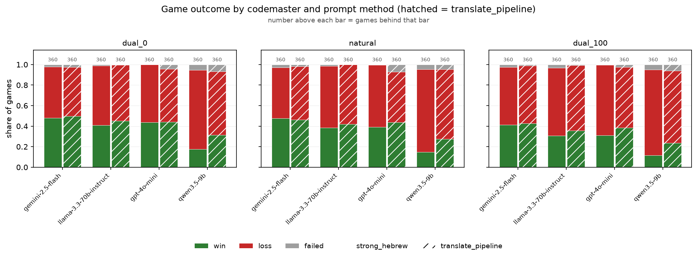

### game length

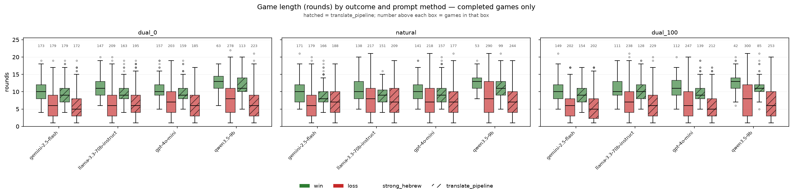

### win rate by floor

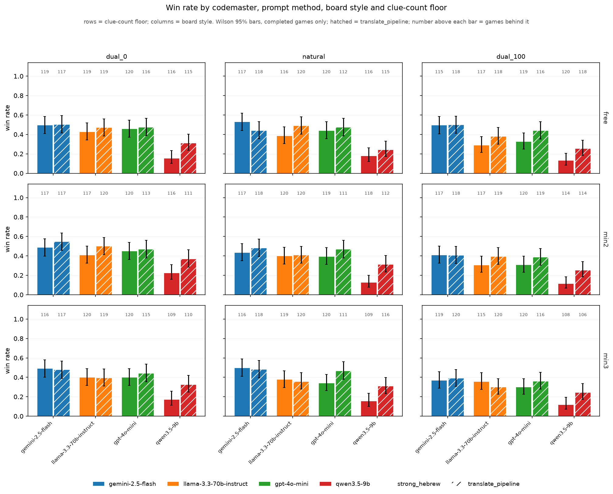

### win rate by guesser

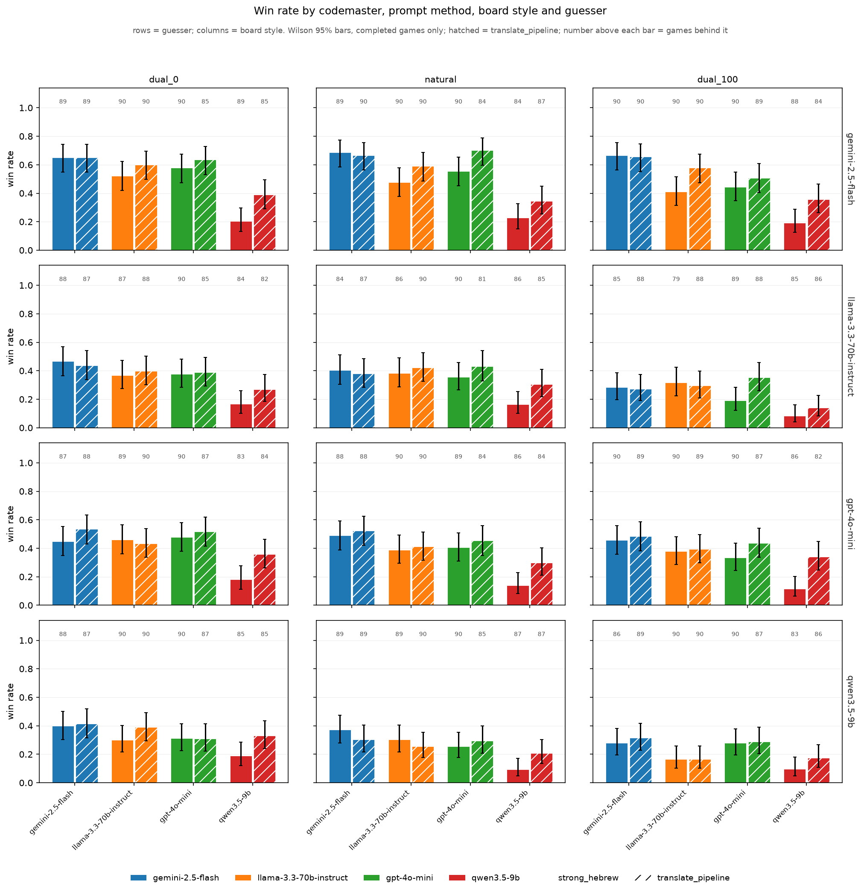

### outcome mix by floor

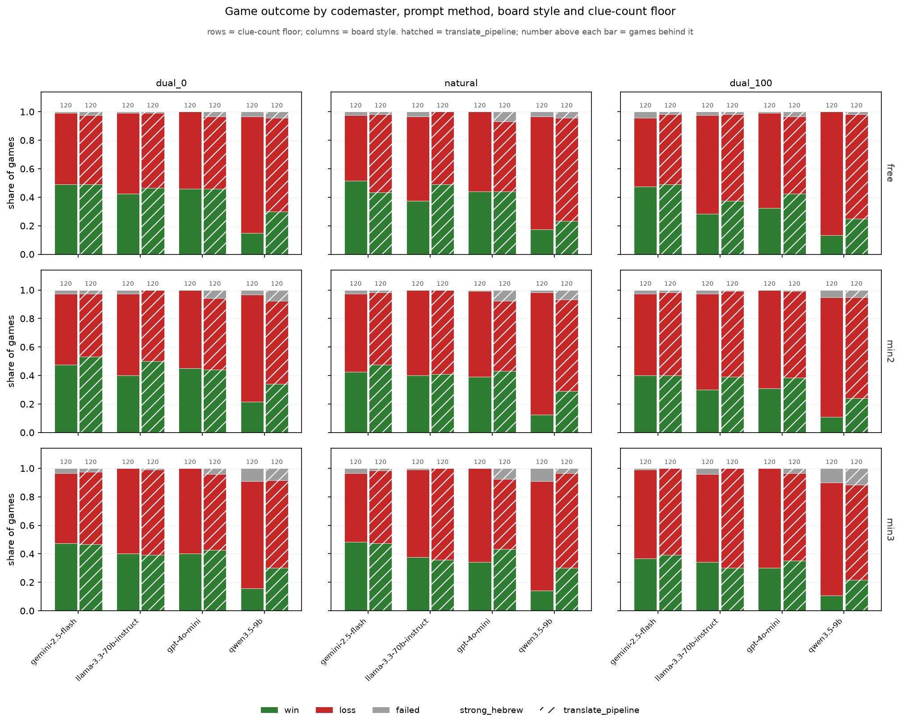

### outcome mix by guesser

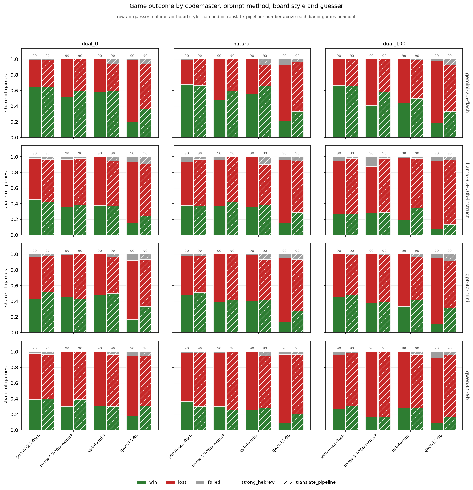

### game length by floor

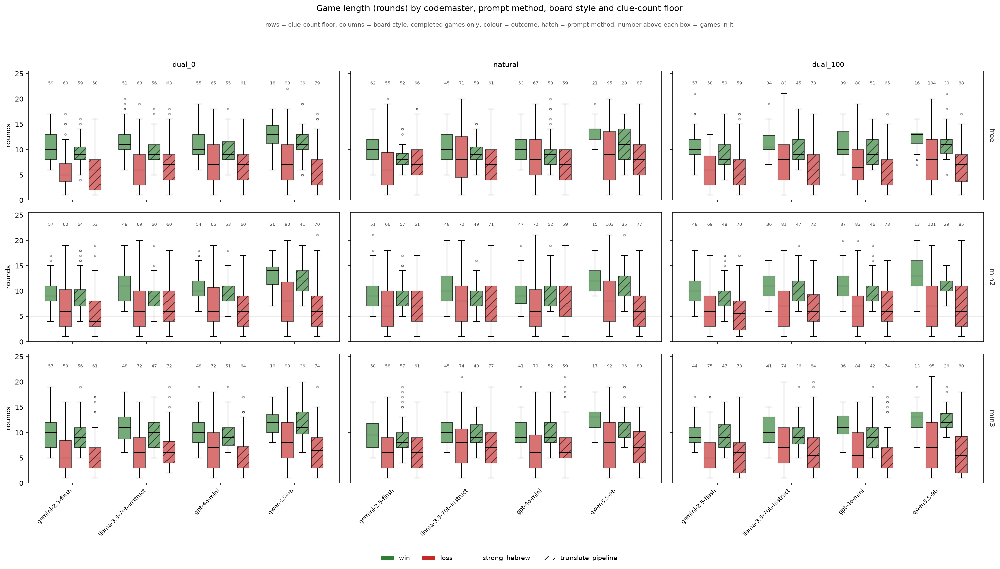

### game length by guesser

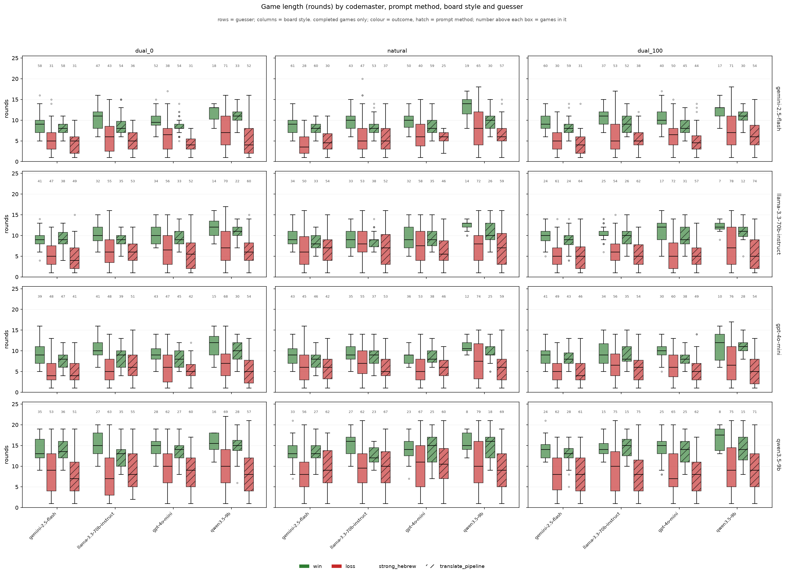

### first guess vs chance

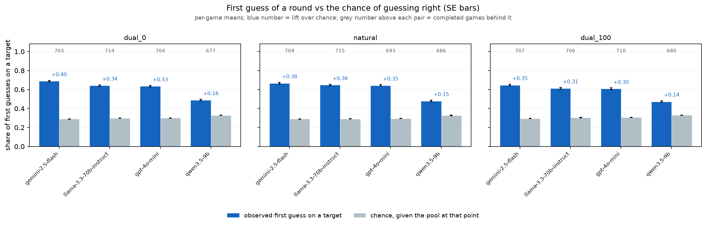

### pair matrix

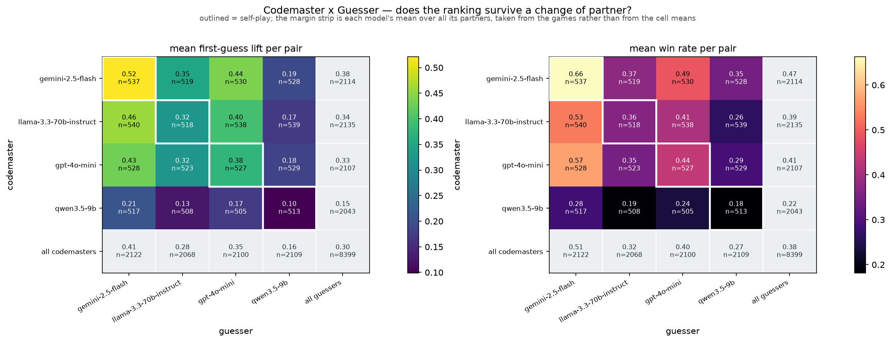

### count by round

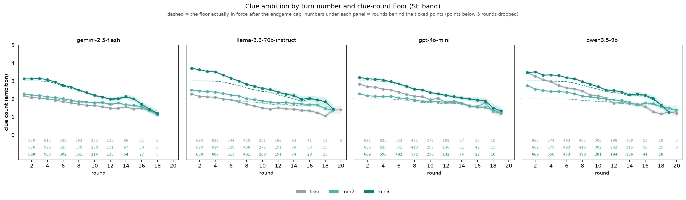

### self consistency

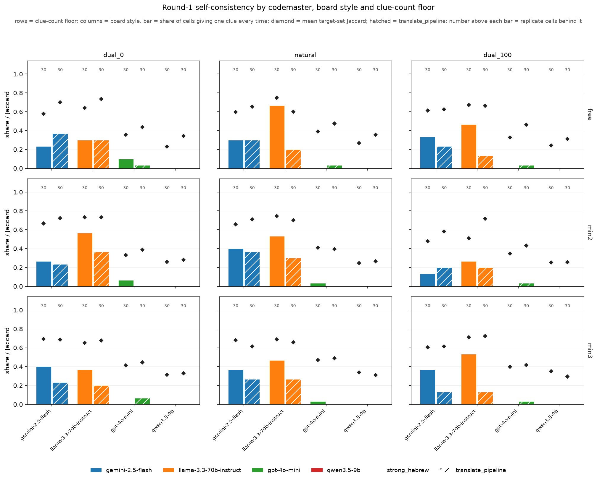

### cross model agreement

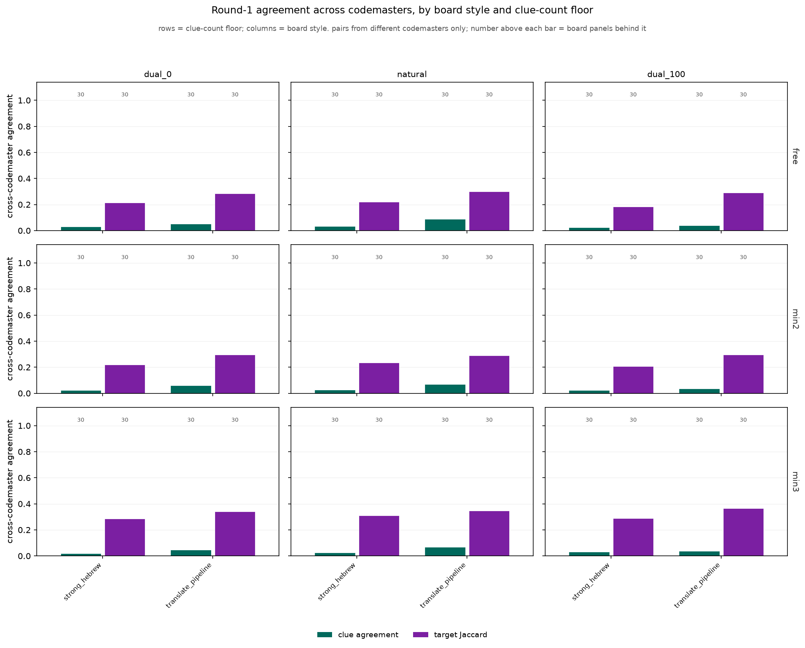
