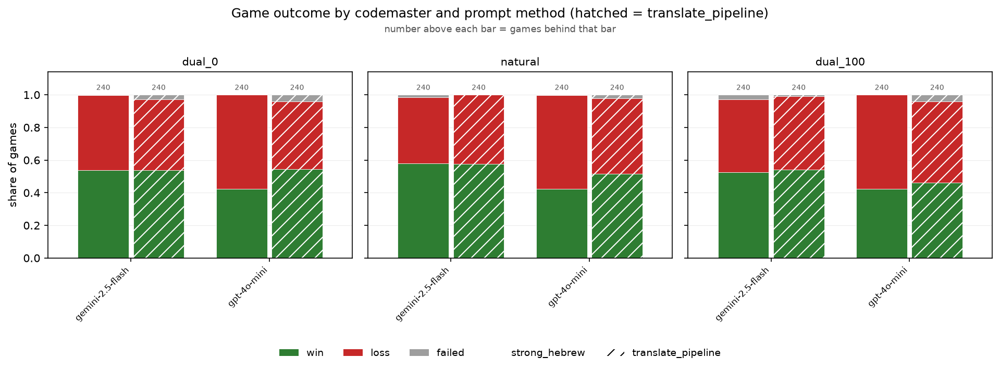
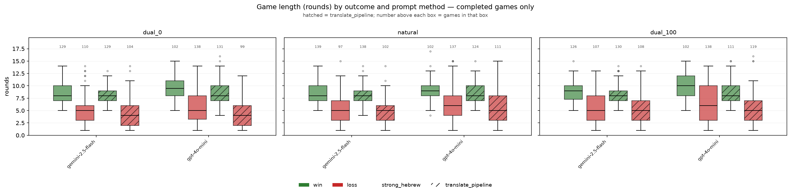
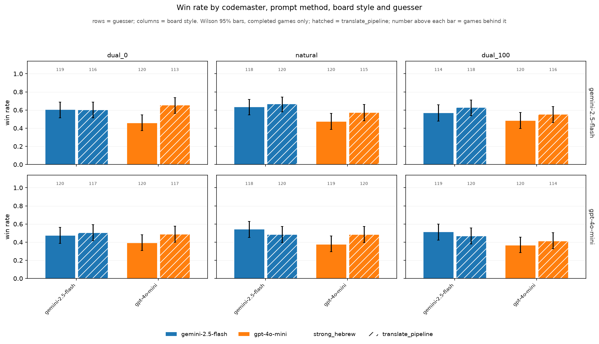
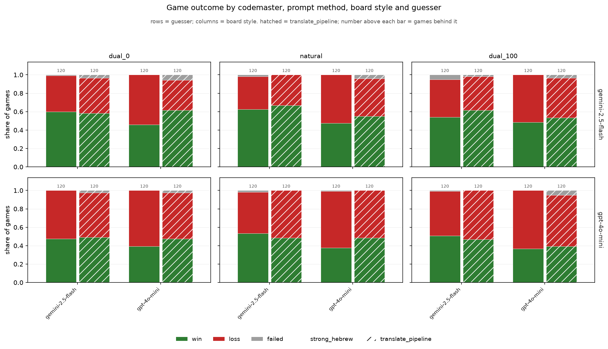
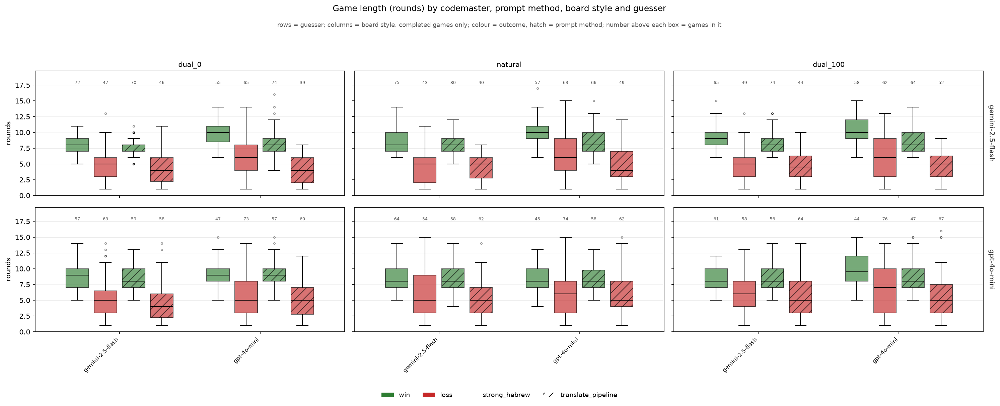
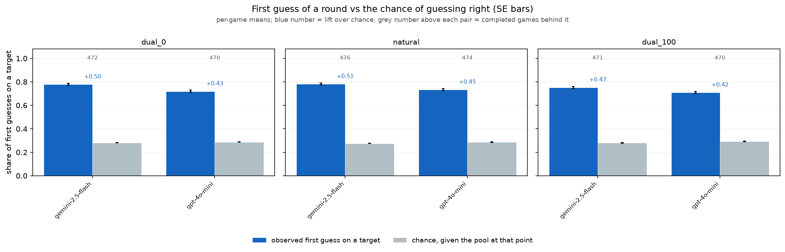
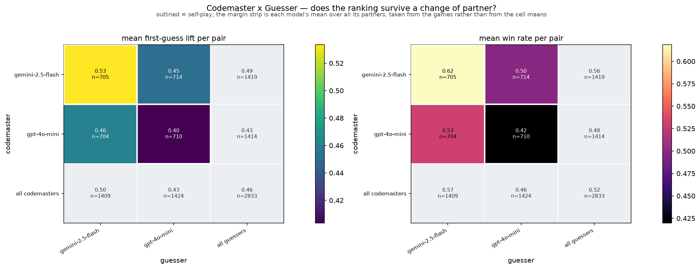
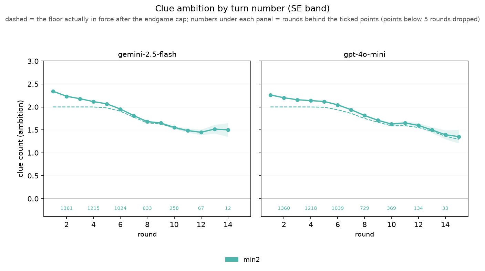

# Codenames-Hebrew results — 20260829T225350499567Z

- Games: **2880** (2833 completed, 47 not completed)
- Rounds: **20358**
- Models: google/gemini-2.5-flash, openai/gpt-4o-mini
- Prompt methods: strong_hebrew, translate_pipeline
- Guesser: google/gemini-2.5-flash, openai/gpt-4o-mini
- Board styles: dual_0, natural, dual_100

### How to read these numbers

- Win/loss rates and game length cover **completed games only**. Games that ended because a model could not produce a legal clue are reported separately as a completion rate; scoring them as losses would confuse a formatting failure with a bad clue.
- Games end by finding all 9 targets (win), by hitting the assassin, or by revealing all 8 opponent words — the opposing team then has all of its own and wins. `assassin_share_of_losses` splits the two loss kinds; its denominator is the losses in that group, not the games.
- `%loss` is close to `1 - %win`, and **game length is confounded with outcome** — a short game is an efficient win or an early death. Length is therefore also reported separately for wins and for losses, and `targets_per_round` carries the same confound.
- Games from runs played before 2026-08-22 are re-scored against the opponent-words rule from their own logs, and the rounds that could not have been played under it are dropped. Those games are flagged `rescored`; the players were never told the rule, so their play is unaffected by it.
- SE is `sd / sqrt(n)` at the natural unit (games for game metrics, rounds for round metrics). Proportions also carry a Wilson 95% interval, because at small n a Wald SE of 0 at p=0 or p=1 reads as false certainty.
- Round-level SEs treat rounds within a game as independent. They are not, so those SEs are optimistic.

### Stop taxonomy

The logged `turn_outcome` cannot answer the early-stop question: it records both *stopping short of* the codemaster's count and *stopping at* it after declining the bonus guess as `stopped_early`. Only the first is an early stop. Rounds are therefore reclassified as:

| class | meaning |
|---|---|
| `early_stop_true` | stopped before reaching the count — **the early stop** |
| `stopped_at_quota` | reached the count and declined the bonus guess (correct play) |
| `miss_before_quota` | guessed wrong before reaching the count |
| `miss_on_bonus_guess` | reached the count, took the bonus guess, got it wrong |
| `bonus_taken_correct` | reached the count, took the bonus guess, got it right |
| `game_won_midround` | round ended because the 9th target fell — not a choice |
| `guesser_failure` / `no_quota` | guesser exhausted retries / clue had count 0 |

Rates are computed over eligible rounds only. A guesser may not stop before its first correct guess, so an early stop is impossible when `count = 1`; including those rounds in the denominator would deflate the rate for reasons unrelated to the guesser's judgement.

## Game outcomes — by codemaster

`loss_rate` and `length_*` cover completed games; `completion_rate` is the share of games that played out at all. `win_rate` is `1 - loss_rate` by construction, so only the loss rate carries an SE and a Wilson interval (`loss_lo` / `loss_hi`).

| model                   | n_games | n_completed | completion_rate | win_rate | loss_rate | loss_se | loss_lo | loss_hi | length_mean | length_se | length_win_mean | length_win_se | n_win | length_loss_mean | length_loss_se | n_loss | assassin_share_of_losses | targets_found_mean | targets_found_se | targets_per_round_mean | targets_per_round_se | first_guess_lift_mean | first_guess_lift_se |
|-------------------------|---------|-------------|-----------------|----------|-----------|---------|---------|---------|-------------|-----------|-----------------|---------------|-------|------------------|----------------|--------|--------------------------|--------------------|------------------|------------------------|----------------------|-----------------------|---------------------|
| google/gemini-2.5-flash | 1440    | 1419        | 0.985           | 0.557    | 0.443     | 0.013   | 0.417   | 0.469   | 6.908       | 0.077     | 8.365           | 0.065         | 791   | 5.073            | 0.118          | 628    | 0.992                    | 7.111              | 0.071            | 1.074                  | 0.010                | 0.492                 | 0.006               |
| openai/gpt-4o-mini      | 1440    | 1414        | 0.982           | 0.475    | 0.525     | 0.013   | 0.499   | 0.551   | 7.293       | 0.087     | 9.049           | 0.083         | 672   | 5.702            | 0.122          | 742    | 0.988                    | 6.788              | 0.073            | 0.975                  | 0.009                | 0.432                 | 0.006               |

## Game outcomes — by guesser

`loss_rate` and `length_*` cover completed games; `completion_rate` is the share of games that played out at all. `win_rate` is `1 - loss_rate` by construction, so only the loss rate carries an SE and a Wilson interval (`loss_lo` / `loss_hi`).

| guesser_model           | n_games | n_completed | completion_rate | win_rate | loss_rate | loss_se | loss_lo | loss_hi | length_mean | length_se | length_win_mean | length_win_se | n_win | length_loss_mean | length_loss_se | n_loss | assassin_share_of_losses | targets_found_mean | targets_found_se | targets_per_round_mean | targets_per_round_se | first_guess_lift_mean | first_guess_lift_se |
|-------------------------|---------|-------------|-----------------|----------|-----------|---------|---------|---------|-------------|-----------|-----------------|---------------|-------|------------------|----------------|--------|--------------------------|--------------------|------------------|------------------------|----------------------|-----------------------|---------------------|
| google/gemini-2.5-flash | 1440    | 1409        | 0.978           | 0.575    | 0.425     | 0.013   | 0.400   | 0.451   | 7.132       | 0.079     | 8.621           | 0.067         | 810   | 5.119            | 0.121          | 599    | 0.995                    | 7.133              | 0.071            | 1.035                  | 0.009                | 0.497                 | 0.006               |
| openai/gpt-4o-mini      | 1440    | 1424        | 0.989           | 0.459    | 0.541     | 0.013   | 0.515   | 0.567   | 7.069       | 0.086     | 8.752           | 0.084         | 653   | 5.643            | 0.119          | 771    | 0.986                    | 6.768              | 0.072            | 1.014                  | 0.010                | 0.427                 | 0.006               |

## Game outcomes — by codemaster x guesser

`loss_rate` and `length_*` cover completed games; `completion_rate` is the share of games that played out at all. `win_rate` is `1 - loss_rate` by construction, so only the loss rate carries an SE and a Wilson interval (`loss_lo` / `loss_hi`).

| model                   | guesser_model           | n_games | n_completed | completion_rate | win_rate | loss_rate | loss_se | loss_lo | loss_hi | length_mean | length_se | length_win_mean | length_win_se | n_win | length_loss_mean | length_loss_se | n_loss | assassin_share_of_losses | targets_found_mean | targets_found_se | targets_per_round_mean | targets_per_round_se | first_guess_lift_mean | first_guess_lift_se |
|-------------------------|-------------------------|---------|-------------|-----------------|----------|-----------|---------|---------|---------|-------------|-----------|-----------------|---------------|-------|------------------|----------------|--------|--------------------------|--------------------|------------------|------------------------|----------------------|-----------------------|---------------------|
| google/gemini-2.5-flash | google/gemini-2.5-flash | 720     | 705         | 0.979           | 0.618    | 0.382     | 0.018   | 0.346   | 0.418   | 6.830       | 0.101     | 8.188           | 0.079         | 436   | 4.628            | 0.156          | 269    | 1.000                    | 7.295              | 0.100            | 1.094                  | 0.012                | 0.533                 | 0.008               |
| google/gemini-2.5-flash | openai/gpt-4o-mini      | 720     | 714         | 0.992           | 0.497    | 0.503     | 0.019   | 0.466   | 0.539   | 6.986       | 0.116     | 8.583           | 0.107         | 355   | 5.407            | 0.168          | 359    | 0.986                    | 6.929              | 0.100            | 1.055                  | 0.014                | 0.451                 | 0.008               |
| openai/gpt-4o-mini      | google/gemini-2.5-flash | 720     | 704         | 0.978           | 0.531    | 0.469     | 0.019   | 0.432   | 0.506   | 7.435       | 0.121     | 9.126           | 0.105         | 374   | 5.518            | 0.177          | 330    | 0.991                    | 6.972              | 0.102            | 0.976                  | 0.011                | 0.461                 | 0.008               |
| openai/gpt-4o-mini      | openai/gpt-4o-mini      | 720     | 710         | 0.986           | 0.420    | 0.580     | 0.019   | 0.544   | 0.616   | 7.152       | 0.125     | 8.953           | 0.131         | 298   | 5.850            | 0.167          | 412    | 0.985                    | 6.606              | 0.104            | 0.973                  | 0.014                | 0.403                 | 0.010               |

## Game outcomes — by codemaster x prompt method

`loss_rate` and `length_*` cover completed games; `completion_rate` is the share of games that played out at all. `win_rate` is `1 - loss_rate` by construction, so only the loss rate carries an SE and a Wilson interval (`loss_lo` / `loss_hi`).

| model                   | method             | n_games | n_completed | completion_rate | win_rate | loss_rate | loss_se | loss_lo | loss_hi | length_mean | length_se | length_win_mean | length_win_se | n_win | length_loss_mean | length_loss_se | n_loss | assassin_share_of_losses | targets_found_mean | targets_found_se | targets_per_round_mean | targets_per_round_se | first_guess_lift_mean | first_guess_lift_se |
|-------------------------|--------------------|---------|-------------|-----------------|----------|-----------|---------|---------|---------|-------------|-----------|-----------------|---------------|-------|------------------|----------------|--------|--------------------------|--------------------|------------------|------------------------|----------------------|-----------------------|---------------------|
| google/gemini-2.5-flash | strong_hebrew      | 720     | 708         | 0.983           | 0.556    | 0.444     | 0.019   | 0.407   | 0.480   | 7.112       | 0.110     | 8.553           | 0.092         | 394   | 5.303            | 0.172          | 314    | 0.997                    | 7.099              | 0.101            | 1.032                  | 0.013                | 0.467                 | 0.009               |
| google/gemini-2.5-flash | translate_pipeline | 720     | 711         | 0.988           | 0.558    | 0.442     | 0.019   | 0.406   | 0.478   | 6.706       | 0.107     | 8.179           | 0.091         | 397   | 4.844            | 0.161          | 314    | 0.987                    | 7.122              | 0.099            | 1.116                  | 0.014                | 0.517                 | 0.008               |
| openai/gpt-4o-mini      | strong_hebrew      | 720     | 719         | 0.999           | 0.426    | 0.574     | 0.018   | 0.538   | 0.610   | 7.636       | 0.128     | 9.592           | 0.125         | 306   | 6.186            | 0.171          | 413    | 0.983                    | 6.619              | 0.103            | 0.907                  | 0.013                | 0.372                 | 0.009               |
| openai/gpt-4o-mini      | translate_pipeline | 720     | 695         | 0.965           | 0.527    | 0.473     | 0.019   | 0.437   | 0.511   | 6.938       | 0.117     | 8.596           | 0.104         | 366   | 5.094            | 0.166          | 329    | 0.994                    | 6.963              | 0.104            | 1.045                  | 0.012                | 0.494                 | 0.008               |

## Game outcomes — by board style

`loss_rate` and `length_*` cover completed games; `completion_rate` is the share of games that played out at all. `win_rate` is `1 - loss_rate` by construction, so only the loss rate carries an SE and a Wilson interval (`loss_lo` / `loss_hi`).

| board_style | n_games | n_completed | completion_rate | win_rate | loss_rate | loss_se | loss_lo | loss_hi | length_mean | length_se | length_win_mean | length_win_se | n_win | length_loss_mean | length_loss_se | n_loss | assassin_share_of_losses | targets_found_mean | targets_found_se | targets_per_round_mean | targets_per_round_se | first_guess_lift_mean | first_guess_lift_se |
|-------------|---------|-------------|-----------------|----------|-----------|---------|---------|---------|-------------|-----------|-----------------|---------------|-------|------------------|----------------|--------|--------------------------|--------------------|------------------|------------------------|----------------------|-----------------------|---------------------|
| dual_0      | 960     | 942         | 0.981           | 0.521    | 0.479     | 0.016   | 0.447   | 0.511   | 6.908       | 0.100     | 8.617           | 0.088         | 491   | 5.047            | 0.140          | 451    | 0.993                    | 6.877              | 0.090            | 1.040                  | 0.012                | 0.464                 | 0.008               |
| natural     | 960     | 950         | 0.990           | 0.529    | 0.471     | 0.016   | 0.439   | 0.502   | 7.139       | 0.098     | 8.584           | 0.086         | 503   | 5.512            | 0.151          | 447    | 0.984                    | 7.062              | 0.086            | 1.032                  | 0.011                | 0.477                 | 0.007               |
| dual_100    | 960     | 941         | 0.980           | 0.498    | 0.502     | 0.016   | 0.470   | 0.533   | 7.254       | 0.105     | 8.846           | 0.098         | 469   | 5.672            | 0.153          | 472    | 0.992                    | 6.909              | 0.088            | 1.001                  | 0.011                | 0.445                 | 0.008               |

## Game outcomes — by codemaster x board style

`loss_rate` and `length_*` cover completed games; `completion_rate` is the share of games that played out at all. `win_rate` is `1 - loss_rate` by construction, so only the loss rate carries an SE and a Wilson interval (`loss_lo` / `loss_hi`).

| model                   | board_style | n_games | n_completed | completion_rate | win_rate | loss_rate | loss_se | loss_lo | loss_hi | length_mean | length_se | length_win_mean | length_win_se | n_win | length_loss_mean | length_loss_se | n_loss | assassin_share_of_losses | targets_found_mean | targets_found_se | targets_per_round_mean | targets_per_round_se | first_guess_lift_mean | first_guess_lift_se |
|-------------------------|-------------|---------|-------------|-----------------|----------|-----------|---------|---------|---------|-------------|-----------|-----------------|---------------|-------|------------------|----------------|--------|--------------------------|--------------------|------------------|------------------------|----------------------|-----------------------|---------------------|
| google/gemini-2.5-flash | dual_0      | 480     | 472         | 0.983           | 0.547    | 0.453     | 0.023   | 0.409   | 0.498   | 6.636       | 0.134     | 8.256           | 0.113         | 258   | 4.682            | 0.190          | 214    | 0.995                    | 6.936              | 0.127            | 1.097                  | 0.018                | 0.497                 | 0.011               |
| google/gemini-2.5-flash | natural     | 480     | 476         | 0.992           | 0.582    | 0.418     | 0.023   | 0.375   | 0.463   | 7.011       | 0.132     | 8.386           | 0.111         | 277   | 5.095            | 0.211          | 199    | 0.990                    | 7.250              | 0.121            | 1.069                  | 0.016                | 0.506                 | 0.010               |
| google/gemini-2.5-flash | dual_100    | 480     | 471         | 0.981           | 0.544    | 0.456     | 0.023   | 0.412   | 0.502   | 7.079       | 0.134     | 8.453           | 0.115         | 256   | 5.442            | 0.211          | 215    | 0.991                    | 7.144              | 0.119            | 1.057                  | 0.015                | 0.473                 | 0.010               |
| openai/gpt-4o-mini      | dual_0      | 480     | 470         | 0.979           | 0.496    | 0.504     | 0.023   | 0.459   | 0.549   | 7.181       | 0.147     | 9.017           | 0.133         | 233   | 5.376            | 0.202          | 237    | 0.992                    | 6.817              | 0.129            | 0.982                  | 0.017                | 0.431                 | 0.011               |
| openai/gpt-4o-mini      | natural     | 480     | 474         | 0.988           | 0.477    | 0.523     | 0.023   | 0.478   | 0.568   | 7.268       | 0.144     | 8.827           | 0.134         | 226   | 5.847            | 0.211          | 248    | 0.980                    | 6.873              | 0.122            | 0.996                  | 0.015                | 0.448                 | 0.010               |
| openai/gpt-4o-mini      | dual_100    | 480     | 470         | 0.979           | 0.453    | 0.547     | 0.023   | 0.502   | 0.591   | 7.430       | 0.161     | 9.319           | 0.162         | 213   | 5.864            | 0.218          | 257    | 0.992                    | 6.672              | 0.129            | 0.946                  | 0.015                | 0.418                 | 0.011               |

## Game outcomes — by guesser x board style

`loss_rate` and `length_*` cover completed games; `completion_rate` is the share of games that played out at all. `win_rate` is `1 - loss_rate` by construction, so only the loss rate carries an SE and a Wilson interval (`loss_lo` / `loss_hi`).

| guesser_model           | board_style | n_games | n_completed | completion_rate | win_rate | loss_rate | loss_se | loss_lo | loss_hi | length_mean | length_se | length_win_mean | length_win_se | n_win | length_loss_mean | length_loss_se | n_loss | assassin_share_of_losses | targets_found_mean | targets_found_se | targets_per_round_mean | targets_per_round_se | first_guess_lift_mean | first_guess_lift_se |
|-------------------------|-------------|---------|-------------|-----------------|----------|-----------|---------|---------|---------|-------------|-----------|-----------------|---------------|-------|------------------|----------------|--------|--------------------------|--------------------|------------------|------------------------|----------------------|-----------------------|---------------------|
| google/gemini-2.5-flash | dual_0      | 480     | 468         | 0.975           | 0.579    | 0.421     | 0.023   | 0.377   | 0.466   | 6.989       | 0.134     | 8.413           | 0.111         | 271   | 5.030            | 0.211          | 197    | 0.995                    | 7.152              | 0.124            | 1.060                  | 0.016                | 0.507                 | 0.010               |
| google/gemini-2.5-flash | natural     | 480     | 473         | 0.985           | 0.588    | 0.412     | 0.023   | 0.369   | 0.457   | 7.214       | 0.134     | 8.629           | 0.109         | 278   | 5.195            | 0.215          | 195    | 0.990                    | 7.241              | 0.120            | 1.032                  | 0.014                | 0.509                 | 0.010               |
| google/gemini-2.5-flash | dual_100    | 480     | 468         | 0.975           | 0.558    | 0.442     | 0.023   | 0.398   | 0.488   | 7.192       | 0.143     | 8.828           | 0.124         | 261   | 5.130            | 0.207          | 207    | 1.000                    | 7.006              | 0.126            | 1.013                  | 0.014                | 0.476                 | 0.010               |
| openai/gpt-4o-mini      | dual_0      | 480     | 474         | 0.988           | 0.464    | 0.536     | 0.023   | 0.491   | 0.580   | 6.827       | 0.148     | 8.868           | 0.139         | 220   | 5.059            | 0.188          | 254    | 0.992                    | 6.605              | 0.130            | 1.020                  | 0.019                | 0.422                 | 0.012               |
| openai/gpt-4o-mini      | natural     | 480     | 477         | 0.994           | 0.472    | 0.528     | 0.023   | 0.483   | 0.573   | 7.065       | 0.143     | 8.529           | 0.137         | 225   | 5.758            | 0.209          | 252    | 0.980                    | 6.885              | 0.123            | 1.032                  | 0.018                | 0.444                 | 0.011               |
| openai/gpt-4o-mini      | dual_100    | 480     | 473         | 0.985           | 0.440    | 0.560     | 0.023   | 0.515   | 0.604   | 7.315       | 0.153     | 8.870           | 0.158         | 208   | 6.094            | 0.216          | 265    | 0.985                    | 6.812              | 0.123            | 0.989                  | 0.017                | 0.415                 | 0.011               |

## Game outcomes — by codemaster x guesser x board style

`loss_rate` and `length_*` cover completed games; `completion_rate` is the share of games that played out at all. `win_rate` is `1 - loss_rate` by construction, so only the loss rate carries an SE and a Wilson interval (`loss_lo` / `loss_hi`).

| model                   | guesser_model           | board_style | n_games | n_completed | completion_rate | win_rate | loss_rate | loss_se | loss_lo | loss_hi | length_mean | length_se | length_win_mean | length_win_se | n_win | length_loss_mean | length_loss_se | n_loss | assassin_share_of_losses | targets_found_mean | targets_found_se | targets_per_round_mean | targets_per_round_se | first_guess_lift_mean | first_guess_lift_se |
|-------------------------|-------------------------|-------------|---------|-------------|-----------------|----------|-----------|---------|---------|---------|-------------|-----------|-----------------|---------------|-------|------------------|----------------|--------|--------------------------|--------------------|------------------|------------------------|----------------------|-----------------------|---------------------|
| google/gemini-2.5-flash | google/gemini-2.5-flash | dual_0      | 240     | 235         | 0.979           | 0.604    | 0.396     | 0.032   | 0.335   | 0.459   | 6.553       | 0.166     | 7.880           | 0.123         | 142   | 4.527            | 0.259          | 93     | 1.000                    | 7.170              | 0.179            | 1.110                  | 0.023                | 0.539                 | 0.015               |
| google/gemini-2.5-flash | google/gemini-2.5-flash | natural     | 240     | 238         | 0.992           | 0.651    | 0.349     | 0.031   | 0.291   | 0.411   | 6.966       | 0.170     | 8.232           | 0.130         | 155   | 4.602            | 0.276          | 83     | 1.000                    | 7.483              | 0.165            | 1.094                  | 0.020                | 0.552                 | 0.014               |
| google/gemini-2.5-flash | google/gemini-2.5-flash | dual_100    | 240     | 232         | 0.967           | 0.599    | 0.401     | 0.032   | 0.340   | 0.465   | 6.970       | 0.187     | 8.453           | 0.152         | 139   | 4.753            | 0.278          | 93     | 1.000                    | 7.228              | 0.173            | 1.078                  | 0.021                | 0.509                 | 0.014               |
| google/gemini-2.5-flash | openai/gpt-4o-mini      | dual_0      | 240     | 237         | 0.988           | 0.489    | 0.511     | 0.033   | 0.447   | 0.574   | 6.717       | 0.210     | 8.716           | 0.192         | 116   | 4.802            | 0.271          | 121    | 0.992                    | 6.705              | 0.179            | 1.084                  | 0.028                | 0.455                 | 0.015               |
| google/gemini-2.5-flash | openai/gpt-4o-mini      | natural     | 240     | 238         | 0.992           | 0.513    | 0.487     | 0.032   | 0.425   | 0.551   | 7.055       | 0.202     | 8.582           | 0.188         | 122   | 5.448            | 0.300          | 116    | 0.983                    | 7.017              | 0.177            | 1.043                  | 0.025                | 0.459                 | 0.015               |
| google/gemini-2.5-flash | openai/gpt-4o-mini      | dual_100    | 240     | 239         | 0.996           | 0.490    | 0.510     | 0.032   | 0.447   | 0.573   | 7.184       | 0.191     | 8.453           | 0.175         | 117   | 5.967            | 0.297          | 122    | 0.984                    | 7.063              | 0.165            | 1.036                  | 0.023                | 0.439                 | 0.014               |
| openai/gpt-4o-mini      | google/gemini-2.5-flash | dual_0      | 240     | 233         | 0.971           | 0.554    | 0.446     | 0.033   | 0.384   | 0.511   | 7.429       | 0.208     | 9.000           | 0.177         | 129   | 5.481            | 0.320          | 104    | 0.990                    | 7.133              | 0.173            | 1.009                  | 0.021                | 0.474                 | 0.013               |
| openai/gpt-4o-mini      | google/gemini-2.5-flash | natural     | 240     | 235         | 0.979           | 0.523    | 0.477     | 0.033   | 0.414   | 0.540   | 7.464       | 0.207     | 9.130           | 0.176         | 123   | 5.634            | 0.307          | 112    | 0.982                    | 6.996              | 0.174            | 0.970                  | 0.018                | 0.466                 | 0.013               |
| openai/gpt-4o-mini      | google/gemini-2.5-flash | dual_100    | 240     | 236         | 0.983           | 0.517    | 0.483     | 0.033   | 0.420   | 0.547   | 7.411       | 0.215     | 9.254           | 0.195         | 122   | 5.439            | 0.297          | 114    | 1.000                    | 6.788              | 0.183            | 0.950                  | 0.019                | 0.444                 | 0.015               |
| openai/gpt-4o-mini      | openai/gpt-4o-mini      | dual_0      | 240     | 237         | 0.988           | 0.439    | 0.561     | 0.032   | 0.498   | 0.623   | 6.937       | 0.209     | 9.038           | 0.202         | 104   | 5.293            | 0.259          | 133    | 0.992                    | 6.506              | 0.190            | 0.956                  | 0.025                | 0.389                 | 0.018               |
| openai/gpt-4o-mini      | openai/gpt-4o-mini      | natural     | 240     | 239         | 0.996           | 0.431    | 0.569     | 0.032   | 0.506   | 0.630   | 7.075       | 0.201     | 8.466           | 0.200         | 103   | 6.022            | 0.290          | 136    | 0.978                    | 6.753              | 0.171            | 1.021                  | 0.025                | 0.430                 | 0.015               |
| openai/gpt-4o-mini      | openai/gpt-4o-mini      | dual_100    | 240     | 234         | 0.975           | 0.389    | 0.611     | 0.032   | 0.547   | 0.671   | 7.449       | 0.240     | 9.407           | 0.274         | 91    | 6.203            | 0.311          | 143    | 0.986                    | 6.556              | 0.182            | 0.942                  | 0.024                | 0.391                 | 0.017               |

## Game outcomes — by codemaster x prompt method x board style

`loss_rate` and `length_*` cover completed games; `completion_rate` is the share of games that played out at all. `win_rate` is `1 - loss_rate` by construction, so only the loss rate carries an SE and a Wilson interval (`loss_lo` / `loss_hi`).

| model                   | method             | board_style | n_games | n_completed | completion_rate | win_rate | loss_rate | loss_se | loss_lo | loss_hi | length_mean | length_se | length_win_mean | length_win_se | n_win | length_loss_mean | length_loss_se | n_loss | assassin_share_of_losses | targets_found_mean | targets_found_se | targets_per_round_mean | targets_per_round_se | first_guess_lift_mean | first_guess_lift_se |
|-------------------------|--------------------|-------------|---------|-------------|-----------------|----------|-----------|---------|---------|---------|-------------|-----------|-----------------|---------------|-------|------------------|----------------|--------|--------------------------|--------------------|------------------|------------------------|----------------------|-----------------------|---------------------|
| google/gemini-2.5-flash | strong_hebrew      | dual_0      | 240     | 239         | 0.996           | 0.540    | 0.460     | 0.032   | 0.398   | 0.524   | 6.870       | 0.190     | 8.481           | 0.166         | 129   | 4.982            | 0.268          | 110    | 1.000                    | 6.921              | 0.176            | 1.057                  | 0.025                | 0.468                 | 0.016               |
| google/gemini-2.5-flash | strong_hebrew      | natural     | 240     | 236         | 0.983           | 0.589    | 0.411     | 0.032   | 0.350   | 0.475   | 7.225       | 0.191     | 8.554           | 0.156         | 139   | 5.320            | 0.322          | 97     | 0.990                    | 7.216              | 0.178            | 1.010                  | 0.021                | 0.472                 | 0.015               |
| google/gemini-2.5-flash | strong_hebrew      | dual_100    | 240     | 233         | 0.971           | 0.541    | 0.459     | 0.033   | 0.396   | 0.523   | 7.245       | 0.191     | 8.627           | 0.155         | 126   | 5.617            | 0.307          | 107    | 1.000                    | 7.163              | 0.171            | 1.028                  | 0.022                | 0.461                 | 0.015               |
| google/gemini-2.5-flash | translate_pipeline | dual_0      | 240     | 233         | 0.971           | 0.554    | 0.446     | 0.033   | 0.384   | 0.511   | 6.395       | 0.188     | 8.031           | 0.151         | 129   | 4.365            | 0.267          | 104    | 0.990                    | 6.953              | 0.183            | 1.138                  | 0.026                | 0.527                 | 0.015               |
| google/gemini-2.5-flash | translate_pipeline | natural     | 240     | 240         | 1.000           | 0.575    | 0.425     | 0.032   | 0.364   | 0.488   | 6.800       | 0.181     | 8.217           | 0.157         | 138   | 4.882            | 0.274          | 102    | 0.990                    | 7.283              | 0.166            | 1.126                  | 0.024                | 0.539                 | 0.014               |
| google/gemini-2.5-flash | translate_pipeline | dual_100    | 240     | 238         | 0.992           | 0.546    | 0.454     | 0.032   | 0.392   | 0.517   | 6.916       | 0.187     | 8.285           | 0.167         | 130   | 5.269            | 0.289          | 108    | 0.981                    | 7.126              | 0.167            | 1.084                  | 0.022                | 0.485                 | 0.014               |
| openai/gpt-4o-mini      | strong_hebrew      | dual_0      | 240     | 240         | 1.000           | 0.425    | 0.575     | 0.032   | 0.512   | 0.636   | 7.454       | 0.212     | 9.461           | 0.190         | 102   | 5.971            | 0.281          | 138    | 0.993                    | 6.642              | 0.179            | 0.921                  | 0.022                | 0.372                 | 0.015               |
| openai/gpt-4o-mini      | strong_hebrew      | natural     | 240     | 239         | 0.996           | 0.427    | 0.573     | 0.032   | 0.510   | 0.634   | 7.519       | 0.214     | 9.294           | 0.211         | 102   | 6.197            | 0.292          | 137    | 0.971                    | 6.653              | 0.175            | 0.928                  | 0.022                | 0.393                 | 0.014               |
| openai/gpt-4o-mini      | strong_hebrew      | dual_100    | 240     | 240         | 1.000           | 0.425    | 0.575     | 0.032   | 0.512   | 0.636   | 7.933       | 0.238     | 10.020          | 0.241         | 102   | 6.391            | 0.315          | 138    | 0.986                    | 6.562              | 0.181            | 0.872                  | 0.022                | 0.353                 | 0.016               |
| openai/gpt-4o-mini      | translate_pipeline | dual_0      | 240     | 230         | 0.958           | 0.570    | 0.430     | 0.033   | 0.368   | 0.495   | 6.896       | 0.203     | 8.672           | 0.180         | 131   | 4.545            | 0.263          | 99     | 0.990                    | 7.000              | 0.186            | 1.046                  | 0.024                | 0.494                 | 0.016               |
| openai/gpt-4o-mini      | translate_pipeline | natural     | 240     | 235         | 0.979           | 0.528    | 0.472     | 0.033   | 0.409   | 0.536   | 7.013       | 0.193     | 8.444           | 0.164         | 124   | 5.414            | 0.300          | 111    | 0.991                    | 7.098              | 0.170            | 1.064                  | 0.021                | 0.503                 | 0.013               |
| openai/gpt-4o-mini      | translate_pipeline | dual_100    | 240     | 230         | 0.958           | 0.483    | 0.517     | 0.033   | 0.453   | 0.581   | 6.904       | 0.210     | 8.676           | 0.199         | 111   | 5.252            | 0.289          | 119    | 1.000                    | 6.787              | 0.183            | 1.023                  | 0.020                | 0.485                 | 0.015               |

## Round metrics — by codemaster

`ambition` = words the codemaster commits one clue to (`count`); `yield` = targets that clue actually bought; `yield_ratio` = yield / ambition. `intended_*` compare the words aimed at with the words hit; `n_lucky_mean` counts targets found that were *not* aimed at. `early_stop_rate` and `bonus_take_rate` are over their eligible rounds only — `n_*_eligible` gives those denominators.

| model                   | n_rounds | first_guess_hit_mean | first_guess_baseline_mean | first_guess_lift_mean | first_guess_lift_se | ambition_mean | ambition_se | yield_mean | yield_se | yield_ratio_mean | yield_ratio_se | intended_recall_mean | intended_recall_se | intended_precision_mean | intended_precision_se | intended_jaccard_mean | intended_jaccard_se | n_lucky_mean | early_stop_rate | early_stop_se | n_early_stop_eligible | bonus_take_rate | bonus_take_se | n_bonus_eligible |
|-------------------------|----------|----------------------|---------------------------|-----------------------|---------------------|---------------|-------------|------------|----------|------------------|----------------|----------------------|--------------------|-------------------------|-----------------------|-----------------------|---------------------|--------------|-----------------|---------------|-----------------------|-----------------|---------------|------------------|
| google/gemini-2.5-flash | 9862     | 0.757                | 0.270                     | 0.487                 | 0.004               | 2.047         | 0.005       | 1.031      | 0.008    | 0.521            | 0.004          | 0.468                | 0.003              | 0.923                   | 0.002                 | 0.452                 | 0.003               | 0.112        | 0.017           | 0.002         | 6666                  | 0.464           | 0.012         | 1877             |
| openai/gpt-4o-mini      | 10496    | 0.698                | 0.279                     | 0.419                 | 0.005               | 2.049         | 0.005       | 0.931      | 0.008    | 0.469            | 0.004          | 0.399                | 0.003              | 0.881                   | 0.003                 | 0.379                 | 0.003               | 0.150        | 0.018           | 0.002         | 6645                  | 0.479           | 0.012         | 1749             |

## Round metrics — by guesser

`ambition` = words the codemaster commits one clue to (`count`); `yield` = targets that clue actually bought; `yield_ratio` = yield / ambition. `intended_*` compare the words aimed at with the words hit; `n_lucky_mean` counts targets found that were *not* aimed at. `early_stop_rate` and `bonus_take_rate` are over their eligible rounds only — `n_*_eligible` gives those denominators.

| guesser_model           | n_rounds | first_guess_hit_mean | first_guess_baseline_mean | first_guess_lift_mean | first_guess_lift_se | ambition_mean | ambition_se | yield_mean | yield_se | yield_ratio_mean | yield_ratio_se | intended_recall_mean | intended_recall_se | intended_precision_mean | intended_precision_se | intended_jaccard_mean | intended_jaccard_se | n_lucky_mean | early_stop_rate | early_stop_se | n_early_stop_eligible | bonus_take_rate | bonus_take_se | n_bonus_eligible |
|-------------------------|----------|----------------------|---------------------------|-----------------------|---------------------|---------------|-------------|------------|----------|------------------|----------------|----------------------|--------------------|-------------------------|-----------------------|-----------------------|---------------------|--------------|-----------------|---------------|-----------------------|-----------------|---------------|------------------|
| google/gemini-2.5-flash | 10215    | 0.759                | 0.267                     | 0.492                 | 0.004               | 2.042         | 0.005       | 1.001      | 0.007    | 0.509            | 0.004          | 0.457                | 0.003              | 0.917                   | 0.003                 | 0.444                 | 0.003               | 0.110        | 0.033           | 0.002         | 6943                  | 0.030           | 0.004         | 1886             |
| openai/gpt-4o-mini      | 10143    | 0.694                | 0.282                     | 0.412                 | 0.005               | 2.053         | 0.005       | 0.958      | 0.008    | 0.480            | 0.004          | 0.407                | 0.003              | 0.886                   | 0.003                 | 0.385                 | 0.003               | 0.154        | 0.000           | 0.000         | 6368                  | 0.949           | 0.005         | 1740             |

## Round metrics — by codemaster x guesser

`ambition` = words the codemaster commits one clue to (`count`); `yield` = targets that clue actually bought; `yield_ratio` = yield / ambition. `intended_*` compare the words aimed at with the words hit; `n_lucky_mean` counts targets found that were *not* aimed at. `early_stop_rate` and `bonus_take_rate` are over their eligible rounds only — `n_*_eligible` gives those denominators.

| model                   | guesser_model           | n_rounds | first_guess_hit_mean | first_guess_baseline_mean | first_guess_lift_mean | first_guess_lift_se | ambition_mean | ambition_se | yield_mean | yield_se | yield_ratio_mean | yield_ratio_se | intended_recall_mean | intended_recall_se | intended_precision_mean | intended_precision_se | intended_jaccard_mean | intended_jaccard_se | n_lucky_mean | early_stop_rate | early_stop_se | n_early_stop_eligible | bonus_take_rate | bonus_take_se | n_bonus_eligible |
|-------------------------|-------------------------|----------|----------------------|---------------------------|-----------------------|---------------------|---------------|-------------|------------|----------|------------------|----------------|----------------------|--------------------|-------------------------|-----------------------|-----------------------|---------------------|--------------|-----------------|---------------|-----------------------|-----------------|---------------|------------------|
| google/gemini-2.5-flash | google/gemini-2.5-flash | 4856     | 0.801                | 0.261                     | 0.540                 | 0.006               | 2.042         | 0.007       | 1.071      | 0.010    | 0.545            | 0.005          | 0.509                | 0.005              | 0.948                   | 0.003                 | 0.499                 | 0.005               | 0.076        | 0.032           | 0.003         | 3451                  | 0.031           | 0.006         | 985              |
| google/gemini-2.5-flash | openai/gpt-4o-mini      | 5006     | 0.714                | 0.279                     | 0.436                 | 0.006               | 2.051         | 0.007       | 0.992      | 0.012    | 0.499            | 0.006          | 0.429                | 0.005              | 0.896                   | 0.004                 | 0.407                 | 0.005               | 0.147        | 0.000           | 0.000         | 3215                  | 0.942           | 0.008         | 892              |
| openai/gpt-4o-mini      | google/gemini-2.5-flash | 5359     | 0.722                | 0.273                     | 0.449                 | 0.006               | 2.043         | 0.007       | 0.938      | 0.010    | 0.476            | 0.005          | 0.410                | 0.005              | 0.886                   | 0.004                 | 0.395                 | 0.004               | 0.140        | 0.034           | 0.003         | 3492                  | 0.028           | 0.005         | 901              |
| openai/gpt-4o-mini      | openai/gpt-4o-mini      | 5137     | 0.673                | 0.285                     | 0.388                 | 0.007               | 2.055         | 0.007       | 0.924      | 0.012    | 0.462            | 0.006          | 0.386                | 0.005              | 0.875                   | 0.005                 | 0.363                 | 0.005               | 0.160        | 0.001           | 0.000         | 3153                  | 0.958           | 0.007         | 848              |

## Round metrics — by codemaster x prompt method

`ambition` = words the codemaster commits one clue to (`count`); `yield` = targets that clue actually bought; `yield_ratio` = yield / ambition. `intended_*` compare the words aimed at with the words hit; `n_lucky_mean` counts targets found that were *not* aimed at. `early_stop_rate` and `bonus_take_rate` are over their eligible rounds only — `n_*_eligible` gives those denominators.

| model                   | method             | n_rounds | first_guess_hit_mean | first_guess_baseline_mean | first_guess_lift_mean | first_guess_lift_se | ambition_mean | ambition_se | yield_mean | yield_se | yield_ratio_mean | yield_ratio_se | intended_recall_mean | intended_recall_se | intended_precision_mean | intended_precision_se | intended_jaccard_mean | intended_jaccard_se | n_lucky_mean | early_stop_rate | early_stop_se | n_early_stop_eligible | bonus_take_rate | bonus_take_se | n_bonus_eligible |
|-------------------------|--------------------|----------|----------------------|---------------------------|-----------------------|---------------------|---------------|-------------|------------|----------|------------------|----------------|----------------------|--------------------|-------------------------|-----------------------|-----------------------|---------------------|--------------|-----------------|---------------|-----------------------|-----------------|---------------|------------------|
| google/gemini-2.5-flash | strong_hebrew      | 5074     | 0.740                | 0.274                     | 0.466                 | 0.006               | 1.949         | 0.005       | 0.999      | 0.011    | 0.525            | 0.006          | 0.467                | 0.005              | 0.912                   | 0.004                 | 0.450                 | 0.005               | 0.118        | 0.010           | 0.002         | 3357                  | 0.475           | 0.015         | 1046             |
| google/gemini-2.5-flash | translate_pipeline | 4788     | 0.775                | 0.265                     | 0.509                 | 0.006               | 2.150         | 0.008       | 1.064      | 0.011    | 0.518            | 0.005          | 0.470                | 0.005              | 0.934                   | 0.003                 | 0.454                 | 0.005               | 0.105        | 0.024           | 0.003         | 3309                  | 0.450           | 0.017         | 831              |
| openai/gpt-4o-mini      | strong_hebrew      | 5491     | 0.649                | 0.285                     | 0.364                 | 0.006               | 1.969         | 0.005       | 0.867      | 0.010    | 0.450            | 0.005          | 0.382                | 0.005              | 0.878                   | 0.005                 | 0.364                 | 0.005               | 0.137        | 0.017           | 0.002         | 3251                  | 0.497           | 0.016         | 967              |
| openai/gpt-4o-mini      | translate_pipeline | 5005     | 0.752                | 0.272                     | 0.479                 | 0.006               | 2.137         | 0.009       | 1.002      | 0.011    | 0.491            | 0.005          | 0.416                | 0.004              | 0.884                   | 0.004                 | 0.396                 | 0.004               | 0.165        | 0.020           | 0.002         | 3394                  | 0.455           | 0.018         | 782              |

## Round metrics — by board style

`ambition` = words the codemaster commits one clue to (`count`); `yield` = targets that clue actually bought; `yield_ratio` = yield / ambition. `intended_*` compare the words aimed at with the words hit; `n_lucky_mean` counts targets found that were *not* aimed at. `early_stop_rate` and `bonus_take_rate` are over their eligible rounds only — `n_*_eligible` gives those denominators.

| board_style | n_rounds | first_guess_hit_mean | first_guess_baseline_mean | first_guess_lift_mean | first_guess_lift_se | ambition_mean | ambition_se | yield_mean | yield_se | yield_ratio_mean | yield_ratio_se | intended_recall_mean | intended_recall_se | intended_precision_mean | intended_precision_se | intended_jaccard_mean | intended_jaccard_se | n_lucky_mean | early_stop_rate | early_stop_se | n_early_stop_eligible | bonus_take_rate | bonus_take_se | n_bonus_eligible |
|-------------|----------|----------------------|---------------------------|-----------------------|---------------------|---------------|-------------|------------|----------|------------------|----------------|----------------------|--------------------|-------------------------|-----------------------|-----------------------|---------------------|--------------|-----------------|---------------|-----------------------|-----------------|---------------|------------------|
| dual_0      | 6575     | 0.738                | 0.275                     | 0.464                 | 0.005               | 2.045         | 0.006       | 0.998      | 0.010    | 0.503            | 0.005          | 0.444                | 0.004              | 0.908                   | 0.003                 | 0.428                 | 0.004               | 0.124        | 0.017           | 0.002         | 4360                  | 0.470           | 0.014         | 1199             |
| natural     | 6841     | 0.739                | 0.272                     | 0.467                 | 0.005               | 2.034         | 0.006       | 0.989      | 0.009    | 0.503            | 0.005          | 0.442                | 0.004              | 0.908                   | 0.003                 | 0.424                 | 0.004               | 0.129        | 0.020           | 0.002         | 4544                  | 0.477           | 0.014         | 1221             |
| dual_100    | 6942     | 0.704                | 0.277                     | 0.426                 | 0.006               | 2.064         | 0.006       | 0.952      | 0.009    | 0.478            | 0.005          | 0.412                | 0.004              | 0.891                   | 0.004                 | 0.393                 | 0.004               | 0.141        | 0.016           | 0.002         | 4407                  | 0.466           | 0.014         | 1206             |

## Round metrics — by codemaster x board style

`ambition` = words the codemaster commits one clue to (`count`); `yield` = targets that clue actually bought; `yield_ratio` = yield / ambition. `intended_*` compare the words aimed at with the words hit; `n_lucky_mean` counts targets found that were *not* aimed at. `early_stop_rate` and `bonus_take_rate` are over their eligible rounds only — `n_*_eligible` gives those denominators.

| model                   | board_style | n_rounds | first_guess_hit_mean | first_guess_baseline_mean | first_guess_lift_mean | first_guess_lift_se | ambition_mean | ambition_se | yield_mean | yield_se | yield_ratio_mean | yield_ratio_se | intended_recall_mean | intended_recall_se | intended_precision_mean | intended_precision_se | intended_jaccard_mean | intended_jaccard_se | n_lucky_mean | early_stop_rate | early_stop_se | n_early_stop_eligible | bonus_take_rate | bonus_take_se | n_bonus_eligible |
|-------------------------|-------------|----------|----------------------|---------------------------|-----------------------|---------------------|---------------|-------------|------------|----------|------------------|----------------|----------------------|--------------------|-------------------------|-----------------------|-----------------------|---------------------|--------------|-----------------|---------------|-----------------------|-----------------|---------------|------------------|
| google/gemini-2.5-flash | dual_0      | 3149     | 0.769                | 0.272                     | 0.497                 | 0.008               | 2.054         | 0.009       | 1.048      | 0.014    | 0.527            | 0.007          | 0.481                | 0.006              | 0.933                   | 0.004                 | 0.467                 | 0.006               | 0.097        | 0.017           | 0.003         | 2161                  | 0.477           | 0.020         | 602              |
| google/gemini-2.5-flash | natural     | 3354     | 0.769                | 0.267                     | 0.501                 | 0.007               | 2.030         | 0.008       | 1.035      | 0.013    | 0.529            | 0.007          | 0.478                | 0.006              | 0.928                   | 0.004                 | 0.462                 | 0.006               | 0.107        | 0.019           | 0.003         | 2298                  | 0.462           | 0.020         | 639              |
| google/gemini-2.5-flash | dual_100    | 3359     | 0.734                | 0.271                     | 0.463                 | 0.008               | 2.056         | 0.009       | 1.011      | 0.014    | 0.508            | 0.007          | 0.447                | 0.006              | 0.907                   | 0.005                 | 0.428                 | 0.006               | 0.131        | 0.014           | 0.003         | 2207                  | 0.454           | 0.020         | 636              |
| openai/gpt-4o-mini      | dual_0      | 3426     | 0.710                | 0.277                     | 0.433                 | 0.008               | 2.038         | 0.008       | 0.952      | 0.013    | 0.482            | 0.007          | 0.411                | 0.006              | 0.883                   | 0.005                 | 0.391                 | 0.006               | 0.150        | 0.016           | 0.003         | 2199                  | 0.464           | 0.020         | 597              |
| openai/gpt-4o-mini      | natural     | 3487     | 0.710                | 0.276                     | 0.433                 | 0.008               | 2.038         | 0.008       | 0.946      | 0.013    | 0.478            | 0.007          | 0.407                | 0.006              | 0.886                   | 0.005                 | 0.387                 | 0.006               | 0.150        | 0.020           | 0.003         | 2246                  | 0.493           | 0.021         | 582              |
| openai/gpt-4o-mini      | dual_100    | 3583     | 0.675                | 0.283                     | 0.392                 | 0.008               | 2.071         | 0.009       | 0.897      | 0.013    | 0.449            | 0.006          | 0.378                | 0.006              | 0.874                   | 0.006                 | 0.360                 | 0.005               | 0.150        | 0.018           | 0.003         | 2200                  | 0.479           | 0.021         | 570              |

## Round metrics — by guesser x board style

`ambition` = words the codemaster commits one clue to (`count`); `yield` = targets that clue actually bought; `yield_ratio` = yield / ambition. `intended_*` compare the words aimed at with the words hit; `n_lucky_mean` counts targets found that were *not* aimed at. `early_stop_rate` and `bonus_take_rate` are over their eligible rounds only — `n_*_eligible` gives those denominators.

| guesser_model           | board_style | n_rounds | first_guess_hit_mean | first_guess_baseline_mean | first_guess_lift_mean | first_guess_lift_se | ambition_mean | ambition_se | yield_mean | yield_se | yield_ratio_mean | yield_ratio_se | intended_recall_mean | intended_recall_se | intended_precision_mean | intended_precision_se | intended_jaccard_mean | intended_jaccard_se | n_lucky_mean | early_stop_rate | early_stop_se | n_early_stop_eligible | bonus_take_rate | bonus_take_se | n_bonus_eligible |
|-------------------------|-------------|----------|----------------------|---------------------------|-----------------------|---------------------|---------------|-------------|------------|----------|------------------|----------------|----------------------|--------------------|-------------------------|-----------------------|-----------------------|---------------------|--------------|-----------------|---------------|-----------------------|-----------------|---------------|------------------|
| google/gemini-2.5-flash | dual_0      | 3326     | 0.775                | 0.267                     | 0.508                 | 0.007               | 2.043         | 0.009       | 1.026      | 0.012    | 0.520            | 0.006          | 0.470                | 0.006              | 0.921                   | 0.004                 | 0.457                 | 0.006               | 0.107        | 0.031           | 0.004         | 2305                  | 0.045           | 0.008         | 627              |
| google/gemini-2.5-flash | natural     | 3459     | 0.772                | 0.265                     | 0.507                 | 0.007               | 2.024         | 0.008       | 1.004      | 0.012    | 0.514            | 0.006          | 0.466                | 0.006              | 0.925                   | 0.004                 | 0.454                 | 0.006               | 0.101        | 0.037           | 0.004         | 2391                  | 0.026           | 0.006         | 627              |
| google/gemini-2.5-flash | dual_100    | 3430     | 0.732                | 0.270                     | 0.462                 | 0.008               | 2.060         | 0.009       | 0.974      | 0.013    | 0.493            | 0.006          | 0.436                | 0.006              | 0.905                   | 0.005                 | 0.422                 | 0.006               | 0.121        | 0.031           | 0.004         | 2247                  | 0.019           | 0.005         | 632              |
| openai/gpt-4o-mini      | dual_0      | 3249     | 0.701                | 0.283                     | 0.418                 | 0.008               | 2.047         | 0.009       | 0.969      | 0.014    | 0.486            | 0.007          | 0.419                | 0.006              | 0.893                   | 0.005                 | 0.398                 | 0.006               | 0.142        | 0.000           | 0.000         | 2055                  | 0.937           | 0.010         | 572              |
| openai/gpt-4o-mini      | natural     | 3382     | 0.705                | 0.279                     | 0.425                 | 0.008               | 2.044         | 0.008       | 0.975      | 0.014    | 0.492            | 0.007          | 0.417                | 0.006              | 0.889                   | 0.005                 | 0.393                 | 0.006               | 0.158        | 0.000           | 0.000         | 2153                  | 0.953           | 0.009         | 594              |
| openai/gpt-4o-mini      | dual_100    | 3512     | 0.676                | 0.284                     | 0.392                 | 0.008               | 2.067         | 0.009       | 0.931      | 0.014    | 0.463            | 0.007          | 0.388                | 0.006              | 0.875                   | 0.005                 | 0.364                 | 0.006               | 0.161        | 0.000           | 0.000         | 2160                  | 0.958           | 0.008         | 574              |

## Round metrics — by codemaster x guesser x board style

`ambition` = words the codemaster commits one clue to (`count`); `yield` = targets that clue actually bought; `yield_ratio` = yield / ambition. `intended_*` compare the words aimed at with the words hit; `n_lucky_mean` counts targets found that were *not* aimed at. `early_stop_rate` and `bonus_take_rate` are over their eligible rounds only — `n_*_eligible` gives those denominators.

| model                   | guesser_model           | board_style | n_rounds | first_guess_hit_mean | first_guess_baseline_mean | first_guess_lift_mean | first_guess_lift_se | ambition_mean | ambition_se | yield_mean | yield_se | yield_ratio_mean | yield_ratio_se | intended_recall_mean | intended_recall_se | intended_precision_mean | intended_precision_se | intended_jaccard_mean | intended_jaccard_se | n_lucky_mean | early_stop_rate | early_stop_se | n_early_stop_eligible | bonus_take_rate | bonus_take_se | n_bonus_eligible |
|-------------------------|-------------------------|-------------|----------|----------------------|---------------------------|-----------------------|---------------------|---------------|-------------|------------|----------|------------------|----------------|----------------------|--------------------|-------------------------|-----------------------|-----------------------|---------------------|--------------|-----------------|---------------|-----------------------|-----------------|---------------|------------------|
| google/gemini-2.5-flash | google/gemini-2.5-flash | dual_0      | 1552     | 0.821                | 0.262                     | 0.559                 | 0.010               | 2.057         | 0.013       | 1.097      | 0.018    | 0.553            | 0.009          | 0.523                | 0.008              | 0.956                   | 0.004                 | 0.513                 | 0.008               | 0.065        | 0.033           | 0.005         | 1131                  | 0.052           | 0.013         | 309              |
| google/gemini-2.5-flash | google/gemini-2.5-flash | natural     | 1664     | 0.816                | 0.258                     | 0.558                 | 0.010               | 2.019         | 0.012       | 1.075      | 0.017    | 0.554            | 0.009          | 0.521                | 0.008              | 0.953                   | 0.004                 | 0.511                 | 0.008               | 0.070        | 0.036           | 0.005         | 1203                  | 0.027           | 0.009         | 336              |
| google/gemini-2.5-flash | google/gemini-2.5-flash | dual_100    | 1640     | 0.767                | 0.262                     | 0.505                 | 0.011               | 2.051         | 0.013       | 1.041      | 0.018    | 0.527            | 0.009          | 0.484                | 0.009              | 0.934                   | 0.006                 | 0.472                 | 0.009               | 0.092        | 0.028           | 0.005         | 1117                  | 0.018           | 0.007         | 340              |
| google/gemini-2.5-flash | openai/gpt-4o-mini      | dual_0      | 1597     | 0.718                | 0.281                     | 0.437                 | 0.011               | 2.050         | 0.012       | 1.000      | 0.021    | 0.501            | 0.010          | 0.440                | 0.009              | 0.908                   | 0.007                 | 0.422                 | 0.009               | 0.128        | 0.000           | 0.000         | 1030                  | 0.925           | 0.015         | 293              |
| google/gemini-2.5-flash | openai/gpt-4o-mini      | natural     | 1690     | 0.722                | 0.276                     | 0.446                 | 0.011               | 2.041         | 0.012       | 0.995      | 0.020    | 0.504            | 0.010          | 0.436                | 0.008              | 0.901                   | 0.007                 | 0.413                 | 0.008               | 0.144        | 0.000           | 0.000         | 1095                  | 0.944           | 0.013         | 303              |
| google/gemini-2.5-flash | openai/gpt-4o-mini      | dual_100    | 1719     | 0.703                | 0.279                     | 0.424                 | 0.011               | 2.061         | 0.012       | 0.983      | 0.021    | 0.491            | 0.010          | 0.412                | 0.008              | 0.879                   | 0.007                 | 0.386                 | 0.008               | 0.168        | 0.000           | 0.000         | 1090                  | 0.956           | 0.012         | 296              |
| openai/gpt-4o-mini      | google/gemini-2.5-flash | dual_0      | 1774     | 0.734                | 0.271                     | 0.464                 | 0.011               | 2.031         | 0.011       | 0.964      | 0.017    | 0.491            | 0.009          | 0.423                | 0.008              | 0.886                   | 0.007                 | 0.407                 | 0.008               | 0.144        | 0.030           | 0.005         | 1174                  | 0.038           | 0.011         | 318              |
| openai/gpt-4o-mini      | google/gemini-2.5-flash | natural     | 1795     | 0.730                | 0.270                     | 0.460                 | 0.010               | 2.029         | 0.011       | 0.938      | 0.017    | 0.476            | 0.008          | 0.415                | 0.008              | 0.895                   | 0.007                 | 0.400                 | 0.008               | 0.130        | 0.039           | 0.006         | 1188                  | 0.024           | 0.009         | 291              |
| openai/gpt-4o-mini      | google/gemini-2.5-flash | dual_100    | 1790     | 0.700                | 0.278                     | 0.423                 | 0.011               | 2.069         | 0.012       | 0.912      | 0.017    | 0.462            | 0.009          | 0.393                | 0.008              | 0.877                   | 0.008                 | 0.377                 | 0.008               | 0.147        | 0.035           | 0.005         | 1130                  | 0.021           | 0.008         | 292              |
| openai/gpt-4o-mini      | openai/gpt-4o-mini      | dual_0      | 1652     | 0.684                | 0.284                     | 0.400                 | 0.012               | 2.045         | 0.013       | 0.938      | 0.020    | 0.472            | 0.010          | 0.398                | 0.008              | 0.878                   | 0.008                 | 0.375                 | 0.008               | 0.156        | 0.001           | 0.001         | 1025                  | 0.950           | 0.013         | 279              |
| openai/gpt-4o-mini      | openai/gpt-4o-mini      | natural     | 1692     | 0.687                | 0.283                     | 0.405                 | 0.011               | 2.047         | 0.012       | 0.954      | 0.020    | 0.480            | 0.010          | 0.398                | 0.008              | 0.876                   | 0.008                 | 0.372                 | 0.008               | 0.171        | 0.000           | 0.000         | 1058                  | 0.962           | 0.011         | 291              |
| openai/gpt-4o-mini      | openai/gpt-4o-mini      | dual_100    | 1793     | 0.650                | 0.288                     | 0.362                 | 0.011               | 2.073         | 0.012       | 0.882      | 0.019    | 0.436            | 0.010          | 0.364                | 0.008              | 0.871                   | 0.008                 | 0.344                 | 0.008               | 0.154        | 0.001           | 0.001         | 1070                  | 0.960           | 0.012         | 278              |

## Round metrics — by codemaster x prompt method x board style

`ambition` = words the codemaster commits one clue to (`count`); `yield` = targets that clue actually bought; `yield_ratio` = yield / ambition. `intended_*` compare the words aimed at with the words hit; `n_lucky_mean` counts targets found that were *not* aimed at. `early_stop_rate` and `bonus_take_rate` are over their eligible rounds only — `n_*_eligible` gives those denominators.

| model                   | method             | board_style | n_rounds | first_guess_hit_mean | first_guess_baseline_mean | first_guess_lift_mean | first_guess_lift_se | ambition_mean | ambition_se | yield_mean | yield_se | yield_ratio_mean | yield_ratio_se | intended_recall_mean | intended_recall_se | intended_precision_mean | intended_precision_se | intended_jaccard_mean | intended_jaccard_se | n_lucky_mean | early_stop_rate | early_stop_se | n_early_stop_eligible | bonus_take_rate | bonus_take_se | n_bonus_eligible |
|-------------------------|--------------------|-------------|----------|----------------------|---------------------------|-----------------------|---------------------|---------------|-------------|------------|----------|------------------|----------------|----------------------|--------------------|-------------------------|-----------------------|-----------------------|---------------------|--------------|-----------------|---------------|-----------------------|-----------------|---------------|------------------|
| google/gemini-2.5-flash | strong_hebrew      | dual_0      | 1643     | 0.744                | 0.279                     | 0.466                 | 0.011               | 1.969         | 0.010       | 1.007      | 0.019    | 0.526            | 0.010          | 0.475                | 0.009              | 0.923                   | 0.006                 | 0.460                 | 0.009               | 0.105        | 0.015           | 0.004         | 1093                  | 0.491           | 0.027         | 338              |
| google/gemini-2.5-flash | strong_hebrew      | natural     | 1722     | 0.746                | 0.271                     | 0.475                 | 0.011               | 1.948         | 0.009       | 1.000      | 0.018    | 0.528            | 0.009          | 0.472                | 0.009              | 0.916                   | 0.006                 | 0.454                 | 0.008               | 0.114        | 0.010           | 0.003         | 1144                  | 0.462           | 0.027         | 353              |
| google/gemini-2.5-flash | strong_hebrew      | dual_100    | 1709     | 0.730                | 0.273                     | 0.457                 | 0.011               | 1.932         | 0.008       | 0.991      | 0.019    | 0.520            | 0.010          | 0.454                | 0.009              | 0.897                   | 0.007                 | 0.434                 | 0.008               | 0.134        | 0.004           | 0.002         | 1120                  | 0.473           | 0.027         | 355              |
| google/gemini-2.5-flash | translate_pipeline | dual_0      | 1506     | 0.795                | 0.264                     | 0.532                 | 0.010               | 2.146         | 0.015       | 1.092      | 0.020    | 0.528            | 0.009          | 0.487                | 0.009              | 0.944                   | 0.005                 | 0.474                 | 0.009               | 0.088        | 0.020           | 0.004         | 1068                  | 0.458           | 0.031         | 264              |
| google/gemini-2.5-flash | translate_pipeline | natural     | 1632     | 0.792                | 0.263                     | 0.529                 | 0.010               | 2.117         | 0.014       | 1.071      | 0.019    | 0.530            | 0.009          | 0.485                | 0.008              | 0.941                   | 0.005                 | 0.470                 | 0.008               | 0.099        | 0.028           | 0.005         | 1154                  | 0.462           | 0.030         | 286              |
| google/gemini-2.5-flash | translate_pipeline | dual_100    | 1650     | 0.738                | 0.269                     | 0.469                 | 0.011               | 2.185         | 0.015       | 1.032      | 0.020    | 0.496            | 0.009          | 0.440                | 0.008              | 0.917                   | 0.006                 | 0.422                 | 0.008               | 0.127        | 0.024           | 0.005         | 1087                  | 0.431           | 0.030         | 281              |
| openai/gpt-4o-mini      | strong_hebrew      | dual_0      | 1789     | 0.658                | 0.282                     | 0.377                 | 0.011               | 1.952         | 0.008       | 0.891      | 0.019    | 0.464            | 0.010          | 0.394                | 0.008              | 0.877                   | 0.008                 | 0.374                 | 0.008               | 0.141        | 0.014           | 0.004         | 1074                  | 0.501           | 0.027         | 341              |
| openai/gpt-4o-mini      | strong_hebrew      | natural     | 1798     | 0.662                | 0.281                     | 0.382                 | 0.011               | 1.964         | 0.008       | 0.885      | 0.018    | 0.458            | 0.009          | 0.392                | 0.008              | 0.886                   | 0.008                 | 0.373                 | 0.008               | 0.135        | 0.022           | 0.004         | 1087                  | 0.503           | 0.028         | 316              |
| openai/gpt-4o-mini      | strong_hebrew      | dual_100    | 1904     | 0.628                | 0.292                     | 0.337                 | 0.011               | 1.989         | 0.008       | 0.827      | 0.017    | 0.428            | 0.009          | 0.362                | 0.008              | 0.871                   | 0.008                 | 0.346                 | 0.008               | 0.134        | 0.015           | 0.004         | 1090                  | 0.487           | 0.028         | 310              |
| openai/gpt-4o-mini      | translate_pipeline | dual_0      | 1637     | 0.767                | 0.272                     | 0.495                 | 0.011               | 2.131         | 0.015       | 1.018      | 0.018    | 0.501            | 0.009          | 0.430                | 0.008              | 0.888                   | 0.007                 | 0.410                 | 0.008               | 0.159        | 0.019           | 0.004         | 1125                  | 0.414           | 0.031         | 256              |
| openai/gpt-4o-mini      | translate_pipeline | natural     | 1689     | 0.760                | 0.271                     | 0.488                 | 0.011               | 2.117         | 0.015       | 1.011      | 0.018    | 0.499            | 0.009          | 0.423                | 0.008              | 0.887                   | 0.007                 | 0.401                 | 0.008               | 0.166        | 0.019           | 0.004         | 1159                  | 0.481           | 0.031         | 266              |
| openai/gpt-4o-mini      | translate_pipeline | dual_100    | 1679     | 0.728                | 0.273                     | 0.455                 | 0.011               | 2.163         | 0.015       | 0.977      | 0.019    | 0.472            | 0.009          | 0.397                | 0.008              | 0.877                   | 0.008                 | 0.376                 | 0.008               | 0.169        | 0.022           | 0.004         | 1110                  | 0.469           | 0.031         | 260              |

## Ambition vs recovery — by clue count

Grouped by the codemaster's own `count`, this is the answer to "should the codemaster be asking for more words?" Read `intended_recall` (share of the aimed-at words the guesser actually found) against `yield_mean` (targets that clue bought). If recall falls faster than yield rises, larger clues buy misses rather than speed and the small counts are correct play, not timidity. **Observational**: `count` is chosen by the model, not assigned, so harder boards and weaker links select into the higher counts. Only a forced-count run (M4) separates the two.

| count | n_rounds | first_guess_hit_mean | first_guess_baseline_mean | first_guess_lift_mean | first_guess_lift_se | yield_mean | yield_se | yield_ratio_mean | yield_ratio_se | intended_recall_mean | intended_recall_se | intended_precision_mean | intended_precision_se | intended_jaccard_mean | intended_jaccard_se | n_lucky_mean | early_stop_rate | early_stop_se | n_early_stop_eligible | bonus_take_rate | bonus_take_se | n_bonus_eligible |
|-------|----------|----------------------|---------------------------|-----------------------|---------------------|------------|----------|------------------|----------------|----------------------|--------------------|-------------------------|-----------------------|-----------------------|---------------------|--------------|-----------------|---------------|-----------------------|-----------------|---------------|------------------|
| 1     | 1869     | 0.699                | 0.103                     | 0.597                 | 0.011               | 0.698      | 0.011    | 0.698            | 0.011          | 0.698                | 0.011              | 1.000                   | 0.000                 | 0.698                 | 0.011               | 0.000        | —               | —             | 0                     | —               | —             | 0                |
| 2     | 15805    | 0.727                | 0.287                     | 0.440                 | 0.004               | 0.975      | 0.006    | 0.488            | 0.003          | 0.417                | 0.003              | 0.892                   | 0.002                 | 0.396                 | 0.002               | 0.142        | 0.011           | 0.001         | 11321                 | 0.482           | 0.009         | 3366             |
| 3     | 2548     | 0.742                | 0.322                     | 0.420                 | 0.009               | 1.179      | 0.019    | 0.393            | 0.006          | 0.340                | 0.005              | 0.896                   | 0.005                 | 0.326                 | 0.005               | 0.158        | 0.058           | 0.005         | 1884                  | 0.331           | 0.030         | 242              |
| 4     | 122      | 0.787                | 0.340                     | 0.447                 | 0.037               | 1.615      | 0.121    | 0.404            | 0.030          | 0.355                | 0.026              | 0.915                   | 0.019                 | 0.336                 | 0.025               | 0.197        | 0.031           | 0.018         | 96                    | 0.222           | 0.101         | 18               |
| 5     | 9        | 0.778                | 0.360                     | 0.418                 | 0.149               | 1.444      | 0.338    | 0.289            | 0.068          | 0.200                | 0.047              | 0.738                   | 0.095                 | 0.181                 | 0.044               | 0.444        | 0.000           | 0.000         | 7                     | —               | —             | 0                |
| 6     | 3        | 1.000                | 0.351                     | 0.649                 | 0.017               | 2.333      | 0.882    | 0.389            | 0.147          | 0.389                | 0.147              | 1.000                   | 0.000                 | 0.389                 | 0.147               | 0.000        | 0.000           | 0.000         | 3                     | —               | —             | 0                |
| 7     | 1        | 0.000                | 0.318                     | -0.318                | —                   | 0.000      | —        | 0.000            | —              | 0.000                | —                  | —                       | —                     | 0.000                 | —                   | 0.000        | —               | —             | 0                     | —               | —             | 0                |
| 8     | 1        | 0.000                | 0.360                     | -0.360                | —                   | 0.000      | —        | 0.000            | —              | 0.000                | —                  | —                       | —                     | 0.000                 | —                   | 0.000        | —               | —             | 0                     | —               | —             | 0                |

## Stop behaviour — counts and shares

Grouped by *guesser*: stopping early, taking the bonus guess and missing before quota are all decisions the guesser makes, so grouping them by codemaster attributes them to the wrong player.

| guesser_model           | board_style | n_rounds | miss_before_quota | miss_on_bonus_guess | stopped_at_quota | early_stop_true | bonus_taken_correct | game_won_midround | guesser_failure | miss_before_quota_share | miss_on_bonus_guess_share | stopped_at_quota_share | early_stop_true_share | bonus_taken_correct_share | game_won_midround_share | guesser_failure_share |
|-------------------------|-------------|----------|-------------------|---------------------|------------------|-----------------|---------------------|-------------------|-----------------|-------------------------|---------------------------|------------------------|-----------------------|---------------------------|-------------------------|-----------------------|
| google/gemini-2.5-flash | dual_0      | 3326     | 2355              | 24                  | 599              | 72              | 4                   | 271               | 1               | 0.708                   | 0.007                     | 0.180                  | 0.022                 | 0.001                     | 0.081                   | 0.000                 |
| google/gemini-2.5-flash | natural     | 3459     | 2465              | 11                  | 611              | 89              | 5                   | 278               | 0               | 0.713                   | 0.003                     | 0.177                  | 0.026                 | 0.001                     | 0.080                   | 0.000                 |
| google/gemini-2.5-flash | dual_100    | 3430     | 2462              | 10                  | 620              | 70              | 2                   | 261               | 5               | 0.718                   | 0.003                     | 0.181                  | 0.020                 | 0.001                     | 0.076                   | 0.001                 |
| openai/gpt-4o-mini      | dual_0      | 3249     | 2453              | 424                 | 36               | 1               | 112                 | 220               | 3               | 0.755                   | 0.131                     | 0.011                  | 0.000                 | 0.034                     | 0.068                   | 0.001                 |
| openai/gpt-4o-mini      | natural     | 3382     | 2556              | 408                 | 28               | 0               | 158                 | 225               | 7               | 0.756                   | 0.121                     | 0.008                  | 0.000                 | 0.047                     | 0.067                   | 0.002                 |
| openai/gpt-4o-mini      | dual_100    | 3512     | 2723              | 404                 | 24               | 1               | 146                 | 208               | 6               | 0.775                   | 0.115                     | 0.007                  | 0.000                 | 0.042                     | 0.059                   | 0.002                 |

## Codemaster compliance and retries

Per-*call* compliance. A model that only produces a legal clue after several corrective retries is less reliable than one that gets it right first time, even at an equal win rate.

| model                   | n_games | codemaster_compliance_rate_mean | codemaster_compliance_rate_se | codemaster_call_failures_mean | total_api_calls_mean | duration_s_mean | duration_s_se | rejection_reasons                                                                                                                                      |
|-------------------------|---------|---------------------------------|-------------------------------|-------------------------------|----------------------|-----------------|---------------|--------------------------------------------------------------------------------------------------------------------------------------------------------|
| google/gemini-2.5-flash | 1440    | 0.928                           | 0.003                         | 0.015                         | 21.346               | 82.264          | 0.861         | guess_not_available: 869, targets_not_on_board: 508, clue_on_board: 431, count_below_floor: 64, json_parse: 1                                          |
| openai/gpt-4o-mini      | 1440    | 0.849                           | 0.004                         | 0.018                         | 22.997               | 90.807          | 1.025         | clue_on_board: 1935, guess_not_available: 904, targets_not_on_board: 315, clue_not_single_word: 55, missing_keys: 12, count_mismatch: 8, json_parse: 7 |

## Guesser compliance and retries

Grouped by guesser, which is one row when the guesser is fixed. Compliance is a property of the model doing the calling, so grouping the guesser's by *codemaster* would average over whichever guessers that codemaster happened to be paired with.

| guesser_model           | n_games | guesser_compliance_rate_mean | guesser_compliance_rate_se | total_api_calls_mean | duration_s_mean | duration_s_se | rejection_reasons                                                                                                                                                             |
|-------------------------|---------|------------------------------|----------------------------|----------------------|-----------------|---------------|-------------------------------------------------------------------------------------------------------------------------------------------------------------------------------|
| google/gemini-2.5-flash | 1440    | 0.987                        | 0.001                      | 22.117               | 86.608          | 0.927         | clue_on_board: 1178, targets_not_on_board: 459, guess_not_available: 299, count_below_floor: 39, clue_not_single_word: 30, missing_keys: 5, json_parse: 4, count_mismatch: 4  |
| openai/gpt-4o-mini      | 1440    | 0.938                        | 0.002                      | 22.226               | 86.463          | 0.979         | guess_not_available: 1474, clue_on_board: 1188, targets_not_on_board: 364, count_below_floor: 25, clue_not_single_word: 25, missing_keys: 7, count_mismatch: 4, json_parse: 4 |

## Does ambiguity actually bite?

`observed` = share of first misses landing on a dual-list word; `expected` = that board's own dual fraction. `lift` near 1 means ambiguous words are missed at exactly their base rate, i.e. lexical ambiguity is not the mechanism driving errors.

| board_style | guesser_model           | n_misses | observed | observed_lo | observed_hi | expected | lift  |
|-------------|-------------------------|----------|----------|-------------|-------------|----------|-------|
| dual_0      | google/gemini-2.5-flash | 2379     | 0.000    | 0.000       | 0.002       | 0.000    | —     |
| natural     | google/gemini-2.5-flash | 2476     | 0.285    | 0.267       | 0.303       | 0.279    | 1.019 |
| dual_100    | google/gemini-2.5-flash | 2472     | 1.000    | 0.998       | 1.000       | 1.000    | 1.000 |
| dual_0      | openai/gpt-4o-mini      | 2877     | 0.000    | 0.000       | 0.001       | 0.000    | —     |
| natural     | openai/gpt-4o-mini      | 2964     | 0.274    | 0.258       | 0.290       | 0.279    | 0.981 |
| dual_100    | openai/gpt-4o-mini      | 3127     | 1.000    | 0.999       | 1.000       | 1.000    | 1.000 |

## Round-1 agreement — self-consistency

On round 1 nothing is revealed, so the codemaster's input is fixed by (board, model, method, floor) and the guesser cannot have influenced it. The guesser-runs of one cell are therefore repeat draws from an IDENTICAL prompt. `is_unanimous_mean` is the share of cells where a model gave one clue every time; `self_jaccard_mean` is the mean overlap of the words it aimed at. A low unanimity beside a high Jaccard means unstable phrasing but a stable strategy. **Two confounds, and the second may dominate.** Temperature is each provider's default and is neither set nor recorded, so this is self-consistency at default sampling settings rather than at a controlled temperature. More seriously, a rejected clue is retried with a correction appended to the prompt (`experiment.py`), so the prompt is byte-identical only across draws accepted on the first attempt. Rejections per game run 5.28 for qwen, 1.85 for gpt-4o-mini, 0.82 for gemini and 0.65 for llama — the exact inverse of the unanimity order below. Restricting to games with no codemaster rejection reverses the ranking entirely (qwen 0.000 to 0.793, gemini 0.285 to 0.473), though that subset is itself selected toward each model's compliant games. Read these numbers as self-consistency entangled with compliance, not as a clean measure of clue-finding stability.

| model                   | n   | n_draws_mean | n_distinct_clues_mean | is_unanimous_mean | modal_share_mean | n_distinct_target_sets_mean | self_jaccard_mean | is_unanimous_lo | is_unanimous_hi |
|-------------------------|-----|--------------|-----------------------|-------------------|------------------|-----------------------------|-------------------|-----------------|-----------------|
| google/gemini-2.5-flash | 719 | 2.000        | 1.526                 | 0.474             | 0.737            | 1.544                       | 0.630             | 0.438           | 0.511           |
| openai/gpt-4o-mini      | 719 | 2.000        | 1.853                 | 0.147             | 0.574            | 1.809                       | 0.416             | 0.123           | 0.175           |

## Round-1 agreement — across codemasters

Pairs from DIFFERENT codemasters only; including same-codemaster pairs would fold self-consistency into the agreement number and inflate it for the most stable models.

| board_style | n   | pairwise_clue_agreement_mean | pairwise_clue_agreement_se | pairwise_clue_agreement_n | pairwise_target_jaccard_mean | pairwise_target_jaccard_se | pairwise_target_jaccard_n |
|-------------|-----|------------------------------|----------------------------|---------------------------|------------------------------|----------------------------|---------------------------|
| dual_0      | 240 | 0.098                        | 0.015                      | 240                       | 0.315                        | 0.015                      | 240                       |
| natural     | 240 | 0.068                        | 0.012                      | 240                       | 0.289                        | 0.014                      | 240                       |
| dual_100    | 240 | 0.061                        | 0.012                      | 240                       | 0.253                        | 0.013                      | 240                       |

## How large should the next run be? — per design cell

Projected from this run's own within-cell variance. `games_per_cell` = `n_boards x n_trials` for each (model, method, board_style) cell. `*_ci_halfwidth` is the 95% interval half-width; `mdd_*` is the smallest cell-to-cell difference detectable at alpha=0.05 with 80% power; `api_calls_total` prices the whole run. This is the **most pessimistic** view — a cell holds model, method and board style all fixed, so it is answering 'can I compare two single cells?', which is rarely the question.

| games_per_cell | n_cells | games_total | win_rate_ci_halfwidth | mdd_win_rate | first_guess_lift_ci_halfwidth | mdd_first_guess_lift | game_length_ci_halfwidth | mdd_game_length | api_calls_total |
|----------------|---------|-------------|-----------------------|--------------|-------------------------------|----------------------|--------------------------|-----------------|-----------------|
| 5              | 24      | 120         | 0.433                 | 0.876        | 0.196                         | 0.396                | 2.701                    | 5.461           | 2657.113        |
| 10             | 24      | 240         | 0.307                 | 0.620        | 0.139                         | 0.280                | 1.910                    | 3.861           | 5314.225        |
| 20             | 24      | 480         | 0.217                 | 0.438        | 0.098                         | 0.198                | 1.351                    | 2.730           | 10628.450       |
| 40             | 24      | 960         | 0.153                 | 0.310        | 0.069                         | 0.140                | 0.955                    | 1.931           | 21256.901       |

## How large should the next run be? — per comparison

The same projection for the comparisons actually of interest, each of which collapses over the other two factors and so pools far more games per arm. Size the run from this table: pick the comparison that has to come out conclusive, find the smallest `games_per_cell` whose `mdd_*` is below the effect you care about, then read the cost off the per-cell table above.

**Which outcome variable you size against changes the answer by a large factor.** `mdd_win_rate` and `mdd_first_guess_lift` are both reported because first-guess lift separates the models far more sharply than win rate does, so a run sized to resolve win rate is several times larger than one sized to resolve lift. Compare each `mdd_*` against the observed spread in that same metric from the tables above, not across metrics.

| comparison                                   | levels | games_per_cell | games_per_arm | mdd_win_rate | mdd_first_guess_lift | mdd_game_length |
|----------------------------------------------|--------|----------------|---------------|--------------|----------------------|-----------------|
| model (collapsing the other factors)         | 2      | 5              | 60.000        | 0.253        | 0.114                | 1.576           |
| model (collapsing the other factors)         | 2      | 10             | 120.000       | 0.179        | 0.081                | 1.115           |
| model (collapsing the other factors)         | 2      | 20             | 240.000       | 0.126        | 0.057                | 0.788           |
| model (collapsing the other factors)         | 2      | 40             | 480.000       | 0.089        | 0.040                | 0.557           |
| guesser_model (collapsing the other factors) | 2      | 5              | 60.000        | 0.253        | 0.114                | 1.576           |
| guesser_model (collapsing the other factors) | 2      | 10             | 120.000       | 0.179        | 0.081                | 1.115           |
| guesser_model (collapsing the other factors) | 2      | 20             | 240.000       | 0.126        | 0.057                | 0.788           |
| guesser_model (collapsing the other factors) | 2      | 40             | 480.000       | 0.089        | 0.040                | 0.557           |
| method (collapsing the other factors)        | 2      | 5              | 60.000        | 0.253        | 0.114                | 1.576           |
| method (collapsing the other factors)        | 2      | 10             | 120.000       | 0.179        | 0.081                | 1.115           |
| method (collapsing the other factors)        | 2      | 20             | 240.000       | 0.126        | 0.057                | 0.788           |
| method (collapsing the other factors)        | 2      | 40             | 480.000       | 0.089        | 0.040                | 0.557           |
| board_style (collapsing the other factors)   | 3      | 5              | 40.000        | 0.310        | 0.140                | 1.931           |
| board_style (collapsing the other factors)   | 3      | 10             | 80.000        | 0.219        | 0.099                | 1.365           |
| board_style (collapsing the other factors)   | 3      | 20             | 160.000       | 0.155        | 0.070                | 0.965           |
| board_style (collapsing the other factors)   | 3      | 40             | 320.000       | 0.110        | 0.050                | 0.683           |
| model x guesser_model (per cell)             | 4      | 5              | 30.000        | 0.358        | 0.162                | 2.229           |
| model x guesser_model (per cell)             | 4      | 10             | 60.000        | 0.253        | 0.114                | 1.576           |
| model x guesser_model (per cell)             | 4      | 20             | 120.000       | 0.179        | 0.081                | 1.115           |
| model x guesser_model (per cell)             | 4      | 40             | 240.000       | 0.126        | 0.057                | 0.788           |

## Figures

### outcome composition

### game length

### win rate by guesser

### outcome mix by guesser

### game length by guesser

### first guess vs chance

### pair matrix

### count by round

